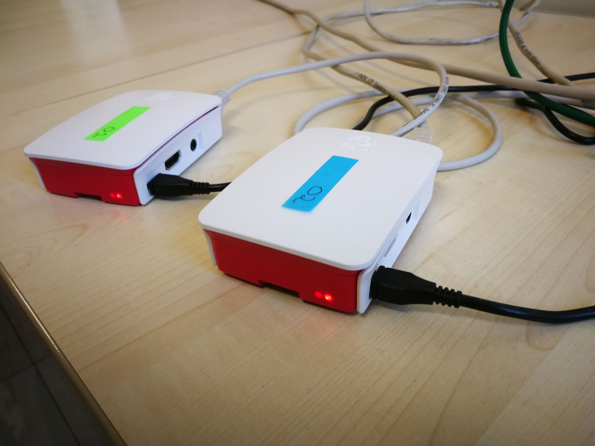
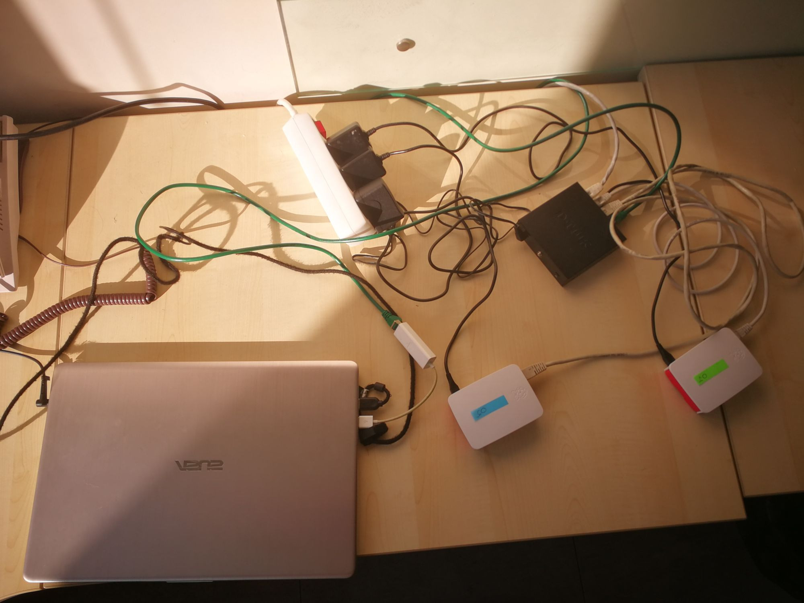
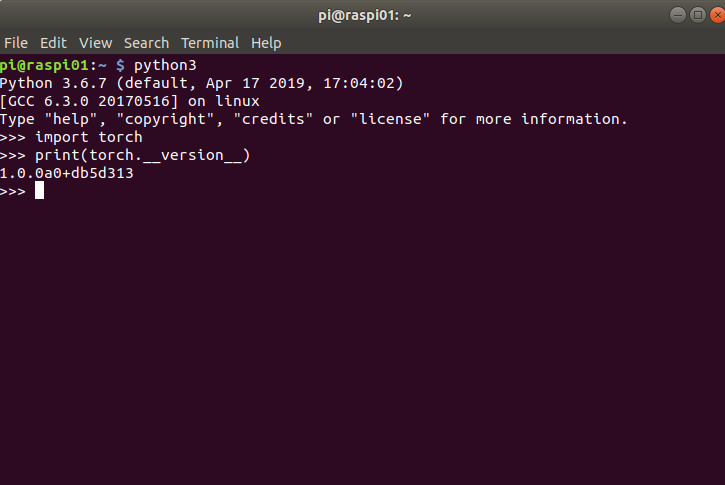
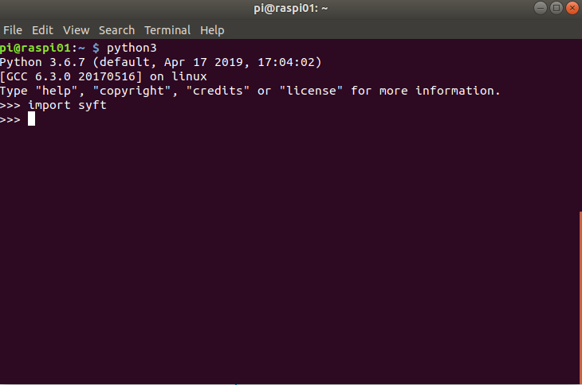

<!-- TODO(a11y): 4 localized body image(s) have empty alt text -->


<figure class="">



</figure>

**_Update as of November 18, 2021: The version of PySyft mentioned in this post has been deprecated. Any implementations using this older version of PySyft are unlikely to work. Stay tuned for the release of PySyft 0.6.0, a data centric library for use in production targeted for release in early December._**

In this tutorial, you are going to learn how to setup PySyft on a Raspberry PI and how to train a Recurrent Neural Network on a Raspberry PI via PySyft. This tutorial is organized into two different parts:

**Part 1 – How to setup PySyft on a Raspberry PI**. I will highlight the steps involved in setting up [PySyft](https://github.com/OpenMined/PySyft), a privacy-preserving framework for federated learning, on a Raspberry PI.

**Part 2 – How to train a Recurrent Neural Network on Raspberry PIs** for text classification via federated learning on Raspberry PIs. More precisely, we will be training our neural network to classify a person’s surname to its most likely language of origin.

**Federated learning**: with federated learning, a model is now moved to the device, such that it can be personalized and trained in place, without having to move the data to a centralized server.

## Experimental setup:

-   Two Raspberry PIs 3 B+ running Raspbian Stretch 4.14 connected to the internet via Ethernet, with each PI having its own static IP address for convenience of addressing.
-   A laptop running Ubuntu 18.04 LTS, connected to the same LAN of the raspberry PIs via a switch.
-   A D-Link 5-Port Fast Ethernet Desktop switch (DES-105)

<figure class="">



</figure>

Please don’t mind the mess with cables in my office. Let’s get started!

---

## Part 1 – How to set up PySyft on a Rasbperry PI

---

### Step 1 – Install PySyft’s dependencies

The first thing we need to do is installing PySyft’s package dependencies on the raspberry PI. I will assume you are logged in your raspberry PI via the desktop interface or are connected to it via SSH. All you will be needing is a terminal, anyway.

_Overall space requirements_ on the raspberry PI: approximately 4GBs

a. **Install Python 3.6.7**. The first thing we will need to do is installing Python 3.6.7, overriding the Python 3.5.X installation already present on the Raspberry PIs. Note that other 3.6.X versions of Python may still be compatible with PySyft, even if these were not tested by me personally. (If you have PySyft working with them, feel free to post a comment below). I personally experienced that Python 3.5.X versions were not compatible at all with PySyft and Pytorch 1.0 instead.

To begin with, install the following dependencies for Python 3.6:

```bash
sudo apt-get update

sudo apt-get install build-essential tk-dev libncurses5-dev libncursesw5-dev libreadline6-dev libdb5.3-dev libgdbm-dev libsqlite3-dev libssl-dev libbz2-dev libexpat1-dev liblzma-dev zlib1g-dev
```

Now actually install Python 3.6.7, compiling it from the source code. Note that the “make” compilation process may take quite some time (up to 30 minutes in my case).

```bash
cd
wget https://www.python.org/ftp/python/3.6.7/Python-3.6.7.tgz
tar xf Python-3.6.7.tar.xz
cd Python-3.6.7
./configure
make
sudo make altinstall
```

If everything went well, you may now start python3.6 by typing python3.6 in a terminal. If you’d prefer python3.6 to start up when typing python3, you may want to set it as your default python3 interpreter.

b. **Install PyTorch 1.0.0.** This was the most tricky part for me. I ran into quite a few issues when installing dependencies for Pytorch, as many packages could not be installed automatically via the “pip3” command for ARM architectures.

1.  **Create a SWAP file of 2 GBs** . This will be necessary during the upcoming installation process of PyTorch, is it is rather memory-hungry. If you do not create a SWAP, you are likely going to run out of memory during the installation process – as it happened to me. Ensure you have sufficient available secondary memory on your Rasbperry’s SD card with df -h before running the following commands:

```bash
sudo mkswap /swap1
sudo nano /etc/fstab
```

This will open up your fstab file. If you see something like,

```bash
/swap0 swap swap
```

That means you already had a swap,  so replace /swap0 swap swap with the following line:

```bash
/swap1 swap swap
```

If the line/swap0 swap swap is **not** present, then add the following line to your fstab file.

```bash
/swap1 swap swap
```

In order for your Raspberry PI to recognize the new SWAP space, reboot your Raspberry PI:

```bash
sudo reboot -h now
```

2\. **Install the Pytorch’s packages’ dependencies:** We will be needing a few more packages before actually installing Pytorch, so run the following commands to install Pytorch’s dependencies:

```bash
sudo apt install libopenblas-dev libblas-dev m4 cmake cython python3-dev python3-yaml python3-setuptools
```

3\. **Get Pytorch 1.0.0 from the official GIT repository** : At the time of writing, Pytorch was not available from the official Python “pip” package manager for ARM architectures, so we will need to compile it from source. Let’s get it the 1.0.0 version from the official GIT repository.

```bash
mkdir pytorch_install && cd pytorch_install
git clone --recursive https://github.com/pytorch/pytorch --branch=v1.0.0
cd pytorch
```

4\. **Set up environment variables for compiling Pytorch:** Let’s run these last few commands in a shell before starting the compilation process, or add the environment variables to the .bashrc file in your home directory. Bear in mind we will need these variables just for the Pytorch’s installation process. The NO\_CUDA flag will make sure that the compiler doesn’t look for cuda files, as the Raspberry PI is not equipped with a GPU by default.

```bash
export NO_CUDA=1
export NO_DISTRIBUTED=1
export NO_MKLDNN=1 
export NO_NNPACK=1
export NO_QNNPACK=1
```

**5\. Compile Pytorch:** Now start building and cross your fingers, hoping no errors arise. This process may be quite lengthy: in my case, I let it run overnight and manually installed a few missing packages that could not be automatically downloaded and compiled by the pytorch installer.

```bash
cd pytorch_install/pytorch
python3 setup.py build #make sure python3 = python3.6
```

_TROUBLESHOOTING:_ If you encounter the following error:

> Failed to run ‘bash tools/build\_pytorch\_libs.sh –use-cuda –use-nnpack –use mkldnn –use qnnpack caffe2’

Then that means you haven’t set the environment variables properly. Set the environment variables correctly, then retry.

If the compilation process stops halfway because of an error, your progresses is not lost! It will resume compiling at the point where it stopped.

**6\. Install Pytorch:** The installation should be much quicker than the compilation process (it took about 5 minutes on my Raspberry PI). To install Pytorch, just run:

```bash
sudo -E python3 setup.py install
```

If the installation completed successfully, let’s try importing Pytorch in python3. Do not run the following commands while you’re in Pytorch’s installation directory, as that’s likely to yield import errors. To test your installation:

```bash
cd 
python3
import torch
print(torch.__version__)
```

If everything went well and no errors arise during the compilation process, we will now be able to import Pytorch in Python successfully:

<figure class="">



</figure>

---

### Step 2 – Install PySyft

The easiest way to install PySyft would be via the following command:

```bash
# at the time of writing, this won't work
pip install syft
```

However, at the time of writing and during my experiments, PySyft could not be found in the official _pip repository_ tool for ARM architectures. So, we’ll have to compile it from source, analogously to what we did for Pytorch.

a. **Get the latest version of PySyft:** Let’s get PySyft from its Git repository:

```bash
cd
git clone https://github.com/OpenMined/PySyft.git
cd PySyft
```

b. **Install PySyft’s dependencies:** This time, most of PySyft’s dependencies will actually be recognized by _pip_ . You will need to have some patience while installing these packages though. The whole process took a few hours on my Raspberry PI.

```bash
pip3 install -r requirements.txt
```

c. **Compile PySyft:** Once you have installed all the dependencies for PySyft, we can compile PySyft.

```bash
python3 setup.py build #make sure python3=python3.6
```

d. **Install Pysft**: If the compilation process completed successfully, we can finally install PySyft – we are almost there!

```bash
sudo -E python3 setup.py install
```

If no error occurs during the installation process, let’s test our PySyft’s installation with the following commands:

```bash
cd
python3
import syft
```

Once again, if you do not get any errors when importing PySyft in Python3, that means you have successfully installed PySyft. Hoorah!

<figure class="">



</figure>

The whole process of installing the right Python version, Pytorch, PySyft, along with all the requires dependencies took me a couple of days. Once you have installed PySyft on one Raspberry PI, you may want to make a backup of your Raspbian ISO with the proper dependencies installed and burn the ISO to other Raspberry PIs. I found the following tool particularly handy for this purpose: [Win32 Disk Imager,](https://sourceforge.net/projects/win32diskimager/) for Windows only currently.

**References**:

-   How to install Pyhon3.6 on a Raspberry PI:

[http://www.knight-of-pi.org/installing-python3-6-on-a-raspberry-pi/](http://www.knight-of-pi.org/installing-python3-6-on-a-raspberry-pi/)

-   How to install Pytorch on a Raspberry PI:

[https://wormtooth.com/20180617-pytorch-on-raspberrypi/](https://wormtooth.com/20180617-pytorch-on-raspberrypi/)

[https://medium.com/hardware-interfacing/how-to-install-pytorch-v4-0-on-raspberry-pi-3b-odroids-and-other-arm-based-devices-91d62f2933c7](https://medium.com/hardware-interfacing/how-to-install-pytorch-v4-0-on-raspberry-pi-3b-odroids-and-other-arm-based-devices-91d62f2933c7)

---

## Part 2 – How to train a Recurrent Neural Network on Raspberry PIs in a federated way

---

In this part of the tutorial, we will be training a Recurrent Neural Network for classifying a person’s surname to its most likely language of origin in a federated way, making use of workers running on the two Raspberry PIs that are now equipped with python3.6, PySyft, and Pytorch. A **character-level RNN** treats words as a series of characters – outputting a prediction and “hidden state” per character, feeding its previous hidden state into each next step. We take the final prediction to be the output, i.e. which class the word belongs to. Hence the training process proceeds sequentially character-by-character through the different hidden layers.

_Requirement:_ You must have completed Part 1 of this tutorial successfully.

### 1\. Start the worker servers on the Raspberry PIs

We will need to start a remote worker on each raspberry PI. If you have one single Raspberry PI or you would like to detach from the workers while performing the computation, you may want to use “screen” as well.  Presently, we will be using just two Raspberry PIs.

On your **Raspberry 01**, run:

```bash
sudo apt-get install screen
screen
cd PySyft
python3 run_websocket_server --host <your_ip> --port 8777 --id alice
```

Detach from your current screen session by pressing CTRL + A + D

On your **Raspberry 02**, run:

```bash
sudo apt-get install screen
screen
cd 
cd PySyft
python3 run_websocket_server --host <your_ip> --port 8778 --id bob
```

Detach from your current screen session by pressing CTRL + A + D

If you just have one Raspberry PI, run both commands on the same Raspberry PI. If you don’t have any Raspberry PI, just run both commands on your laptop to simulate two remote workers.

### 2\. Set up the central coordinator

We will now use our laptop as a central coordinating entity, responsible for distributing the data and the models to the workers that are currently running on the Raspberry PIs.

On your **laptop**:

a. **Install and clone PySyft:** Install PySyft, clone the official PySyft repository and navigate to the directory where the Recurrent Neural Network example is located and start up the Jupyter Notebook that is located there.

```bash
pip3 install syft
cd
git clone https://github.com/OpenMined/PySyft.git
cd PySyft/examples/tutorials/advanced
jupyter notebook 'Federated Recurrent Neural Network.ipynb' 
```

NOTE: Make sure you have the same PySyft version on all the raspberry PIs and on your laptop, or you may bump into errors halfway through the federated training process, as I could experience in first person. We will go through now.

b. **Specify the remote workers’s location:** In your Jupyter Notebook running on the laptop, hit CTRL+F and search for “ip\_alice”. Comment out the lines referring to _virtual workers (If you don’t have any Raspberry PI, you may still run the following code locally.)_

```python
#hook = sy.TorchHook(torch)  # <-- NEW: hook PyTorch ie add extra
#alice = sy.VirtualWorker(hook, id="alice")  
#bob = sy.VirtualWorker(hook, id="bob")  
#charlie = sy.VirtualWorker(hook, id="charlie") 
#workers_virtual = [alice, bob]
```

And un-comment the lines referring to remote workers, specifying the Raspberry PIs’ IP:

```python
#If you have your workers operating remotely, like on Raspberry PIs
hook = sy.TorchHook(torch)  # <-- NEW: hook PyTorch ie add extra
kwargs_websocket_alice = {"host": "ip_alice", "hook": hook}
alice = WebsocketClientWorker(id="alice", port=8777, **kwargs_websocket_alice)
kwargs_websocket_bob = {"host": "ip_bob", "hook": hook}
bob = WebsocketClientWorker(id="bob", port=8778, **kwargs_websocket_bob)
workers_virtual = [alice, bob]
```

c. **Run the code!** Now you just need to run every single cell of the Jupyter Notebook! You may find an explanation of the Recurrent Neural Network training process on Raspberry PIs based on the Jupyter Notebook you cloned previously in this video:

<figure class=""><iframe width="480" height="270" src="https://www.youtube-nocookie.com/embed/knNgFk0uZHM?feature=oembed" frameborder="0" allow="accelerometer; autoplay; encrypted-media; gyroscope; picture-in-picture" allowfullscreen=""></iframe></figure>

Have fun with your newly trained Recurrent Neural Networks!
