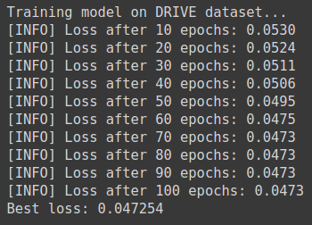
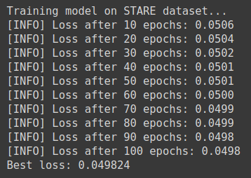
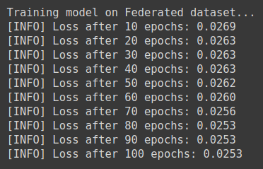
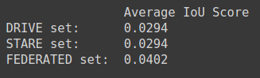

<!-- TODO(a11y): 4 localized body image(s) have empty alt text -->


<!-- TODO(content): shortcode(s) present (verify) -->

## Summary

Suppose you are a part of a medical organization, (for example **MO-A**) and you are working on a model to detect blood vessels in retina. Now, the problem arises when MO-A does not have sufficient data for your model to get the accuracy you were looking for. However, there happens to be another medical organization (for example **MO-B**) which own the additional data you need. Problem solved! Or is it?

In an ideal scenario, you would ask MO-B for the additional data, train your model on it as well, and viola! Your model achieved the accuracy score which you were aiming for. Alas! In real world scenarios, there are many factors – such as competitiveness between the organizations, various lawsuits, etc. – that stand as an obstacle for you to get the data. Is there any other way to get your work done without getting involving such complications?

This article introduces the **use of Federated Learning (FL) on medical datasets.** This will allow you to work on multiple datasets without accessing the data.

## How FL can solve the problem

To summarize the problem discussed earlier, we want to work on the additional data of another organization to improve our model’s accuracy. The key component here is the fact that we do not want to access the data altogether. We just want to perform a computation on the data and get back the results. This is where Federated Learning comes into the picture.

To summarize FL, **it is an algorithmic solution that enables the training of ML models by sending copies of a model to the place where data resides  and performing training at the edge**. Which means we can send our model to the place where data resides, perform computation on the data, and get back our trained model. In this way, we get to train our model on the data at MO-B without actually accessing the data.

## Code: Working

For this example, we use **DRIVE** and **STARE** dataset which contain 20 images each along with masks for the **blood vessels of the retina**. We use **UNet model** to perform the segmentation task. Our aim is to perform FL on both the datasets and compare our results with the models trained on individual datasets.

In total we have 40 images, 20 from each dataset. We allocate 16 images from each dataset for training and 4 images from each dataset to test our model’s accuracy. Our testing dataset will have 8 images.

### Step 1: Data Generator

To train our models we need to build the data generators. Our first step will be to build custom data loaders. We need to build 4 data loaders: train data loader for DRIVE dataset (16 images), train data loader for STARE dataset (16 images), train data loader for Federated dataset (16+16=32 images), and finally, test data loader (4+4=8 images).

We define a _DataGenerator_ class for all our data loaders. It takes the following inputs: list of images, list of masks, data transformer.

```python
# DataGenerator class
class DataGenerator(Dataset):

    def __init__(self, images, masks, transform=None):
        self.images = images
        self.masks = masks
        self.transform = transform

    def __len__(self):
        return len(self.images)

    def __getitem__(self, idx):
        image = self.images[idx]
        mask = self.masks[idx]
        if self.transform:
            image = self.transform(image)
            mask = self.transform(mask)

        return [image, mask]
```

Next, we loop through every image and mask and resize it to the desired shape. The populated images and masks lists are then fed to the _Datagenerator_ class as an input.

```python
images = list()
masks = list()

# resize the images and masks
for (imagePath, maskPath) in zip(imagePaths, maskPaths):
    image = cv2.resize(cv2.imread(imagePath), self.args.image_size)
    mask = cv2.resize(cv2.imread(maskPath), self.args.image_size)
    images.append(image)
    masks.append(mask)
```

Similarly, we form the Data Loaders for **DRIVE dataset, STARE dataset, Federated dataset, and Test dataset.**

In the case of generated Federated Data loader, we instantiate 3 workers (**alice**, **bob,** and **jon**). We distribute the data on 2 workers: ‘**alice’** and ‘**bob’**. We can consider them as **MO-A** and **MO-B** holding their respective data.  Worker ‘**jon’** acts as a secure worker, which allows us to perform secure aggregation of our model.

```python
hook = sy.TorchHook(torch)
bob = sy.VirtualWorker(hook, id="bob")
alice = sy.VirtualWorker(hook, id="alice")
jon = sy.VirtualWorker(hook, id="jon") # secore worker

workers = (bob, alice)

federated_set = DataGenerator(images, masks, transform = transform)
federatedDataLoader = sy.FederatedDataLoader(
	federated_set.federate(workers), 
	batch_size = self.args.fed_batch_size, 
	shuffle = True)
```

### Step 2: Training

Now, for training, we initialize 3 models: _model\_drive_, _model\_stare_, _model\_fl_. As for our loss function, we use **Dice Loss**, which will help us optimize the models.

```python
# Dice Loss
def dice_loss(pred, target, smooth = 1.):
	pred = pred.contiguous()
	target = target.contiguous()    

	intersection = (pred * target).sum(dim=2).sum(dim=2)

	loss = (1 - ((2. * intersection + smooth) / (pred.sum(dim=2).sum(dim=2) + target.sum(dim=2).sum(dim=2) + smooth)))

	return loss.mean()
```

We define a _train\_model()_ function to train the model on a dataset.

```python
# train model on DRIVE dataset
print("Training model on DRIVE dataset...")
model_drive = train_model(DriveDatasetLoader, model, optimizer, num_epochs=args.epochs)

# train model on STARE dataset
print("Training model on STARE dataset...")
model_stare = train_model(StareDatasetLoader, model, optimizer, num_epochs=args.epochs)
```

For training model\_fl, we define another _train()_ function which performs Federated Learning.

```python
# train the FL model
print("Training model on Federated dataset...")
for epoch in range(1, args.epochs+1):
    # get the models from the workers i.e. alice and bob
    modelA, modelB = train(args, model_fr, device, 												FederatedDatasetLoader, optimizer, epoch)
    # perform secure aggregation on the models
    model_fr = aggregate(model_fr, modelA, modelB, jon)
```

### Step 3: Testing

After training our models, its finally time to test them on the Test Data loader. To measure the accuracy for segmentation task, here we use **IoU (Intersection of Union)** metrics.

```python
# measure iou score
def calculate_iou(pred, target):
	intersection = np.logical_and(target, pred)
	union = np.logical_or(target, pred)
	iou_score = np.sum(intersection) / np.sum(union)

	return iou_score
```

Using this metric, we can calculate an average IoU score for the test dataset.

## Code: Results

### Training Loss

On training our models, we notice that the **models trained on individual DRIVE and STARE datasets have similar loss score**. Whereas, **the model trained on the federated dataset shows a significant difference in the loss score**. This is because the federated model gets to train on a larger amount of data as compared to other models.

<figure class="">



<figcaption>Training Loss for model on DRIVE dataset.</figcaption></figure>

<figure class="">



<figcaption>Training Loss for model on STARE dataset.</figcaption></figure>

<figure class="">



<figcaption>Training Loss for model on Federated dataset.</figcaption></figure>

### Test Scores

The test scores also map with the loss values of the models. The federated model scores a significantly higher accuracy as compared to other models. To keep this demo simple, we have used a combined dataset of 40 images. Hence, the low accuracy score. Similar differences in the scores will be seen if we were to increase our dataset.

<figure class="">



<figcaption>Average IoU Test Score.</figcaption></figure>

## Conclusion

Using Federated Learning, we could train our model on an additional data without actually accessing that data. Since data is considered as an invaluable resource for any organization, the privacy preserving algorithms like Federated Learning prove to be an important link towards the development of the deep learning models, and providing a layer of privacy.

---

## Sources

The complete code for this demo can be found [here](https://github.com/siddhesh1598/FederatedLearningVesselSegmentation).

Datasets: [DRIVE](https://drive.grand-challenge.org/), [STARE](https://cecas.clemson.edu/~ahoover/stare/)

Want to learn more about Privacy Preserving AI in Medical Imaging? Check out [this post](https://blog.openmined.org/federated-learning-differential-privacy-and-encrypted-computation-for-medical-imaging/) by [Emma](https://blog.openmined.org/author/emma/) which will give you an overview about the application of Privacy Preserving in Medical Imaging.
