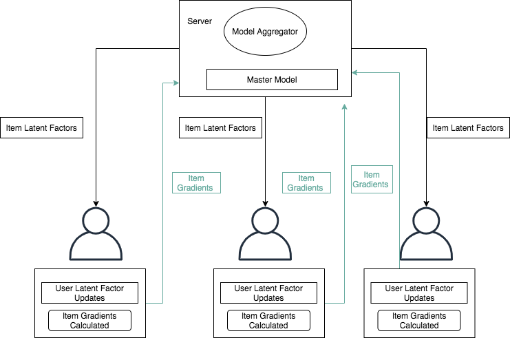

<!-- TODO(a11y): 4 localized body image(s) have empty alt text -->

**Summary:**

-   Recommendation systems are everywhere in our everyday life online — they can be incredibly useful, time-saving, and aid in our discovery of things relevant to our interests.
-   Today, recommendation systems are one of the most common machine learning algorithms in the consumer domain.
-   As public awareness around data and privacy laws increase, data privacy will be a considerable concern for recommendation systems.
-   Privacy-preserving recommendation systems will unlock new domains where such techniques can be applied, such as health, financial planning suggestions.
-   Privacy-preserving recommendation systems will be able to use better signals to build better models.
-   In part 1, we will give a brief introduction on recommendation systems, discuss the math and algorithm to implement the recommender in federated fashion.
-   In part 2, we will check how it can be implemented with code snippets.

<figure class="">

</figure>

**What are recommendation systems?**

We are currently living in exciting times, and access to the internet has never been easier. With the expansion of internet coverage, more and more users are coming online to consume content of various forms. This expansion has led to tremendous growth in the field of recommendations to simplify human decision making.

Traditionally recommendation algorithms are broadly divided into three categories: Collaborative Filtering , Content Filtering, and Hybrid.

1.  Content filtering: These algorithms focus on building on understanding user interests by making user’s portraits by dividing the user, item into certain information features.
2.  Collaborative filtering: These algorithms work on without prior information of either user or item and builds user interests only on interaction data of the users. In recent years, Collaborative filtering via Matrix factorization has become the default choice to build recommendation systems.
3.  Hybrid filtering: These algorithms are a combination of the above two algorithms. It encompasses methodologies to take pros from both the above techniques to build better recommendation systems.

Another suite of techniques that is interesting in the domain of ranking/recommendation/search are called Learning to Rank methods. In this, we try to build a loss function based on the propensity of a user interested in an article and then rank it accordingly. There is pair-wise learn to rank model, which optimizes the number of inversions between pairs. Also, there is list-wise learn to rank, which optimizes either directly the similarity between actual rank and predicted rank or the metrics directly, such as Mean average precision (MAP).

With the advent of GPU’s more and more companies have started experimenting with neural nets as it brings non-linearity in the methodologies, and the models can build more complex interactions. Neural Collaborative Filtering \[1\], Wide and Deep Networks \[2\] are famous examples of recommendation systems based on Neural Nets.

**Why is privacy needed in recommendations?**

However, in the fast-paced world where recommendation systems are omnipresent, users also understand the need for confidentiality in their own data. With the initiation of GDPR in Europe and similar laws coming up in the US, more and more countries will follow suit leading to data scarcity to build systems. As researchers, we understand the importance of data availability, so we need to know how we will create such systems in this new world.

There are also certain advantages to introducing privacy in recommendations/search. We can leverage better metadata, which the user doesn’t share, such as app information on the phone, location, etc. We can also unlock better adoptions of the machine learning models in newer domains such as healthcare, financial services, once the user is comfortable in using the system without the hesitances of the data being shared or looked at by other people.

**Privacy Preserving Recommendation System**

There are several ways we can build a recommendation system with privacy:

-   Learn to Rank Pointwise: We can build a neural network to predict user’s clicking behavior. Essential given:
    -   P(U,I) = 1 (if click) else 0
    -   We can rank items based on the probability score from the model.
-   Collaborative Filtering: We can build a matrix factorization model that can keep the user’s interactions on the device side.

In this post, we will give a primer on how we can build a federated collaborative filtering model via matrix factorization. Let’s start with regular matrix factorization and build on it.

Matrix Factorization:

Matrix Factorization (Low rank factorization methods) decomposes the matrix into the product of two lower dimensional rectangular matrices. Usually this can applied to an interaction matrix. Interaction matrix is essentially a matrix where the rows are your users and columns are the items and the cell is the interaction (in some cases ratings, clicks etc.) associated to the item by the user. The reason to apply matrix factorization is to reduce sparsity in the original interaction matrix (In most cases this is above 90% of the actual matrix). The resultant lower dimensional matrices are much richer thus we can obtain ratings for missing interactions (ratings) by simply taking the dot product of the row (specific user row ‘x\_u’ ) and column ( item row ‘y\_i’) of the lower dimensional matrix example and do a dot product.

<figure class="">

<figcaption>Predicted rating&nbsp;</figcaption></figure>

To obtain the resulting matrix, we can minimize the loss function of the actual ratings (r) and predicted ratings. In the following equation we have also added the regularization terms.

<figure class="">

<figcaption>Loss function with regularization</figcaption></figure>

The objective function is a non-convex in this formulation. Gradient descent can be used as an approximate approach here, but its slow and consists of lots of iterations.

However if we fix set of variables X and treat it as constants, then the objective is a convex function of Y and vice versa. Our approach will follow this route, we will fix Y and optimize X, then fix X and optimize Y, and repeat until convergence. This algorithm is called Alternating Least Square (ALS).

**Federated Collaborative Filtering (Federated ALS)**

To make the ALS algorithm trained in federated fashion and keeping user’s privacy in center. We can make specific tweaks in the way we train the model \[3\]:

1.  All the item factors vectors are updated on the central server and then distributed to each client (device/user).
2.  The user’s latent vectors are trained on device using user’s own data with item latent vectors.
3.  The gradient for each item vectors are calculated and propogated back to central server, where it’s aggregated and item vectors updated.

<figure class="">

</figure>

In simulated environment, as indicated by Ammad-ud-din, Ivannikova et al. \[3\] the percentage difference between Federated and non-federated algorithms on metrics such as MAP, F1, Precision, Recall was less than 0.5% (In multiple rounds they came statistically similar in performance).

There are still some aspects which we need to work towards to make recommendations in privacy preserved manner using collaborative filtering. There can be engineering challenges to send the entire item inventory to the device to get few updates. Thus optimization needs to happen on that regards.

In the next posts, we will provide a tutorial on how it can be implemented for an open source dataset and will also go about discussing ways to implement deep learning based recommendation systems while preserving privacy.

References:

1.  Neural Collaborative Filtering: [https://arxiv.org/abs/1708.05031](https://arxiv.org/abs/1708.05031)
2.  Wide and Deep network: [https://arxiv.org/pdf/1606.07792.pdf](https://arxiv.org/pdf/1606.07792.pdf)
3.  Federated Collaborative Filtering: [https://arxiv.org/pdf/1901.09888.pdf](https://arxiv.org/pdf/1901.09888.pdf)
