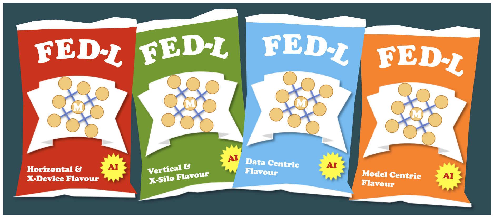
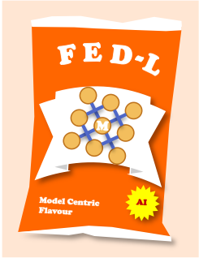
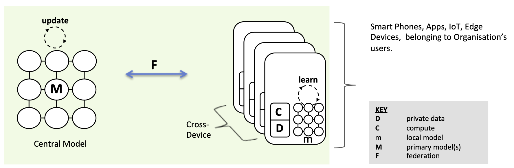
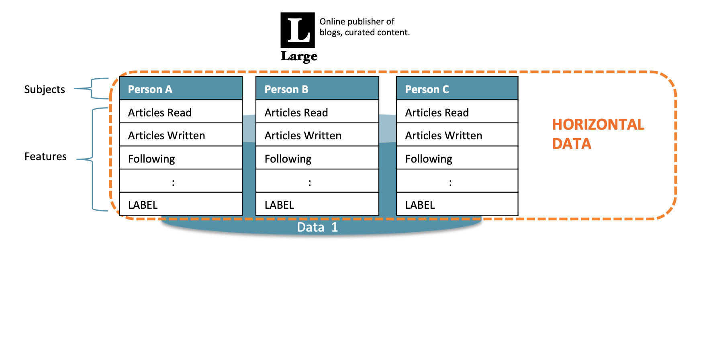
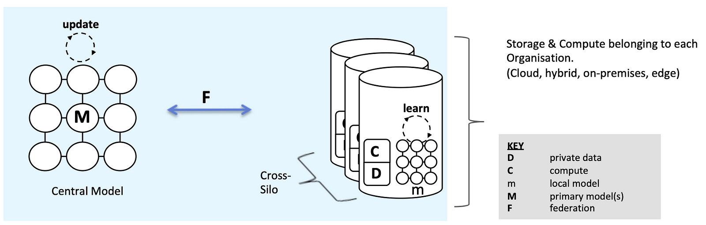
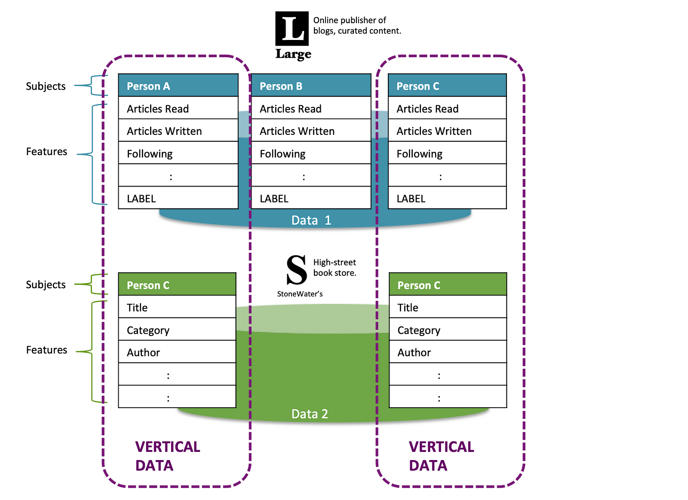
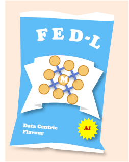
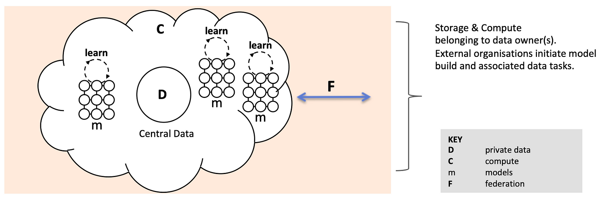

<!-- TODO(a11y): 8 localized body image(s) have empty alt text -->

### Introduction

In this article I’ll attempt to untangle and disambiguate some terms that have emerged to describe different Federated Learning scenarios and implementations. Federated Learning is very new and forms part of broader efforts to both improve privacy and open up access to new data that would otherwise be out of reach when building machine learning models.

<figure class="">

<figcaption>Image Source – Author (CC0)</figcaption></figure>

We’ll look at **Federated Learning**\[1\](of course), but then cover **Model-Centric** & **Data-Centric**\[2\] Federated Learning, newer terms perhaps reflecting where Federated Learning is heading.

The terms **Cross-Silo** & **Cross-Device**\[3\]**,** **Horizontal** & **Vertical**\[4\], **Federated Transfer Learning** \[9\] also occur, reflecting real world use cases and various solutions approaches.

But beware — those building the software that will deliver the benefits of this technology are not limited by, or overly influenced by these terms. To quote [OpenMined](https://www.openmined.org/)’s Patrick Cason, such terms ‘ matter very little in the art of engineering solutions.’

[OpenMined](https://www.openmined.org/)’s PyGrid & PySyft are very much at the forefront of Federated Learning and privacy preserving AI, extending Facebook’s popular PyTorch machine learning framework, so keep this caveat in mind as you read.

However, understanding these federating learning terms  may help you orientate and navigate the strange world of Federated Learning, where you can _build machine learning models using data you don’t own and can’t see._

### Federated Learning

There’s no doubt about the origin of this term — Google’s pioneering work to create shared models from their customers’ computing devices (clients) in order to improve the user experience on those devices.

> “We advocate an alternative that leaves the training data distributed on the mobile devices, and learns a shared model by aggregating locally-computed updates. We term this decentralized approach Federated Learning.” \[1\]

In the corresponding 2016 [paper](https://www.arxiv-vanity.com/papers/1602.05629/), the Google team describe:

-   A specific topology — a central server, with a federation of participating end user devices with local training sets.
-   This being Google, there’s also implicitly one organisation that both runs the server and has significant capability on the client side (via Android OS.)
-   Further, millions of clients are assumed and user interaction with their devices create labels automatically.

The team mitigate the effects of non independently and identically distributed (non-IID) data and find a means of carrying out optimisation, performing Stochastic Gradient Descent locally on the clients and providing averaging centrally — FederatedSGD.

Depending on your point of view, Federated Learning terms discussed below help qualify Google’s use case to a specific type of Federated Learning and extend Federated Learning scope.

Back to Google’s original Federated Learning proposal. This is real and deployed in a real-world product. If you’ve an Android phone, then your private data is being used to improve GBoard.

More detail [here](https://ai.googleblog.com/2017/04/federated-learning-collaborative.html) and [here](https://federated.withgoogle.com/).

### **Model-Centric Federated Learning**

Federated Machine Learning can be categorised in to two base types, **Model-Centric** & **Data-Centric**. Model-Centric is currently more common, so let’s look at that first.

<figure class="">

</figure>

In Google’s original Federated Learning use case, the data is distributed in the end user devices, with remote data being used to improve a central model via use of FederatedSGD and averaging.

In fact, for any Federated Learning solution that has a goal of delivering better centrally administered models, they can be considered ‘Model-Centric’.

> “Data is generated locally and remains de-centralised. Each client stores its own data and cannot read the data of other clients. Data is not independently or identically distributed.” \[4\]

It turns out that we can further qualify Model-Centric with the terms Cross-Device or Cross-Silo. There’s some alignment here also with the terms Horizontal and Vertical.

Taking a look at these in order, let’s position them within the Model-Centric world.

#### Cross-Device Federated Learning

It turns out that Google’s implementation can be considered as  model-centric _and_ cross-device. Learning takes place remotely, updating a central model through a suitable federation technique.

<figure class="">

<figcaption>Single Organisation, Model-Centric &amp; Cross-Device Federated Learning</figcaption></figure>

To restate some of the challenges, we are working at scale, potentially needing many millions of devices for federation to work. Devices may be offline, we need to be careful about when we consume compute and impact user experience. Again, with their control of the OS, Google are in a unique position verses app developers for example, and it may be more difficult to implement a solution if you’re a smaller scale, standard business with an app.

Typically, the data in this scenario is partitioned Horizontally. So let’s tackle that  next.

#### Horizontal Federated Learning

How you data is split matters in terms of how Federated Learning is implemented and the practical and technical challenges.

> “Horizontal federated learning, or sample-based federated learning, is introduced in the scenarios that data sets share the same feature space but different in sample.” \[4\]

This type of learning is also to referred to as **Homogenous Federated Learning** \[6\], relating to the use of the same features.

Unsurprisingly, **Horizontal Federated Learning** takes place on Horizontal data.

<figure class="">

<figcaption>Single Organisation, Horizontal Data (Data Split by Examples)</figcaption></figure>

With  horizontal data, rows of data are available with a consistent set of features. This is exactly the type of data you’d feed into a supervised machine learning task. Each row may be implicitly or explicitly associated with a context. In our example below, the subject is a specific person.

Hopefully, you can now see that Google are using **Horizontal Federated Learning**. The data might reside in the end user device, but it’s consistent in feature space and the user themselves (the subject) is implied.

In fact, I think we can now describe Google GBoard as utilising Model-Centric, Cross-Device, Horizontal Federated Learning!

#### Cross-Silo Federated Learning

<figure class="">

<figcaption>Multiple Organisations, Model Centric &amp; Cross-Silo Federated Learning</figcaption></figure>

This is where things get interesting. We’re now looking to unlock the value of data that is more widely distributed, for example between hospitals, banks, perhaps distributed aggregate data from consumer wearables in different fitness app businesses.

Whilst the goal is typically stated as the same for Cross-Silo — to update and improve a central,  and in this case shared, model, there are arguably greater challenges on the security side. At the same time, there’s scope to use more consistent, powerful & scalable compute within each organisation (Hadoop/Spark clusters etc.)

#### Vertical Federated Learning

> “Vertical federated learning or feature-based federated learning … is applicable to the cases that two data sets share the same sample ID space but differ in feature space.” \[4\]

Vertical Federated Learning is also referred to as **Heterogeneous Federated Learning**\[7\], on account of differing feature sets.

In the example below, fictitious high street book retailer _StoneWater’s_ have some of the same customers as online blogging curator _Large (also totally fictitious)_ and capture different features such as book ‘Title’, ‘Category’, ‘Author’ from each purchase.

In theory, as customers of both Large and StoneWaters, a broader set of features are available for Persons A & C.

<figure class="">

<figcaption>Multiple Organisations, Vertical Data (Data Split by Features)</figcaption></figure>

> “Cross-silo FL with data partitioned by features, employs a very different training architecture compared to the setting with data partitioned by example. It may or may not involve a central server as a neutral party, and based on specifics of the training algorithm, clients exchange specific intermediate results rather than model parameters, to assist other parties’ gradient calculations.” \[4\]

Despite the additional challenges, a real-world implementation of vertical federated learning exist.

In China, the banking sector, specifically WeBank, are driving an open-source platform, capable of supporting Cross-Silo Federated Learning.

The FedAI Technology Enabler (FATE) platform has case studies associated with examples of both [Horizontal](https://www.fedai.org/cases/utilization-of-fate-in-anti-money-laundering-through-multiple-banks/) and [Vertical](https://www.fedai.org/cases/utilization-of-fate-in-risk-management-of-credit-in-small-and-micro-enterprises/) implementations. A neutral 3rd party is utilised (‘a collaborator’) to orchestrate federation.

In one FedAI example, a Model-Centric, Cross-Silo, Horizontal Federated Learning approach is used to improve an anti money laundering model. In the other, a Model-Centric, Cross-Silo, Vertical Federated Learning approach is used to obtain a better risk management model.

What ever the implementation, for Vertical Federated Learning to work and in order to create models without leaking data, entity alignment — for example matching features for the same users needs to take place utilising techniques such as Private Set Intersection (PSI.)

[PyVertical](https://github.com/OpenMined/PyVertical) also utilise PSI to support linking of data points between sources and to only reveal the intersection of the data subjects.

#### Federated Transfer Learning

I’ve yet to find a concrete production implementation or case study on this, but it’s worth mentioning because transfer learning can already be used to transfer the benefits of learning to solve one supervised learning task to solving another, related task.

However, unlike the Convolutional Neural Network transfer techniques that I’m familiar with — essentially drop the last few layers from a network trained on big data, then re-tune the model to recognise your labels on a small data set, the descriptions given for **Federated Transfer Learning** are  more involved, comprising intermediate learning to [map to a common feature subspace.](https://arxiv.org/pdf/1812.03337.pdf)\[9\]

The description of a framework for FedHealth care \[10\] utilises **Federated Transfer Learning**, and although at first glance looks to be Model-Centric, Vertical, Cross-Device, data is aggregated at each wearable service provider making it Model-Centric, Vertical, Cross-Silo.

### **Data Centric Federated Learning**

This is a newer, emerging type of Federated Learning, and in some ways may be outgrowing the Federated term, having a more peer-to-peer feel.

<figure class="">

</figure>

An owner, or in future — owners, of private data can provide access for external organisations to build models on their data without sharing that data.

But the concept goes further than this because ultimately a cloud of cross-silo private data could be made available to multiple organisations enabling the building of machine learning models by diverse organisations to meet diverse use cases.

> The most likely scenario for data-centric .. is where a person or organisation has data they want to protect in PyGrid (instead of hosting the model, they host data). This would allow a data scientist who is not the data owner, to make requests for training or inference against that data. \[8\]

<figure class="">

<figcaption>Multiple Organisations, Data-Centric Federated Learning</figcaption></figure>

In the model centric world, certainly where horizontal data is concerned, there’s typically a pre-configured, pre-trained model ready to be improved. The earlier machine learning workflow steps, ETL, analysis, experimentation and model selection have occurred already.

But here, in the data-centric approach, in order to fully unlock the power of the data in the network, techniques and tools will be needed to allow sufficient data discovery, wrangling and preparation. At the same time, it will be necessary to meter, limit and control any data leakage.

Concepts and techniques that can help, such as differential privacy & PSI already exist but automating control such that it meets the needs of the different parties involved, ensuring data governance and regulation compliance is no small task.

**Other Federated Learning Types**

Given another key driver for Federated Learning, beyond privacy concerns, is the acquisition of sufficient data — the required number of examples, or better features to improve model accuracy –  then expect to see some of the emerging small data machine learning techniques and approaches being appended to Federated Learning.

I’ve already mentioned **Federated Transfer Learning**, but expect to see papers on **Self-Supervised**, **Few shot** learning. Outside of supervised learning, expect also **Reinforcement Federated Learning** to appear.

I’ve chosen not to focus on Google’s **Federated Learning of Cohorts** (FLoC), primarily because I can’t find any authoritative sources, other than to say it’s a kind of cookie replacement, and looks to be Model-Centric, Cross-Device, Horizontal, utilising the Chrome Browser. It’s also not clear what the status is verses competing ‘cookie’ replacement proposals.

#### References

This is a blog article, not a research paper, so I have used direct quotes from papers listed below. Also, please note where I referenced the following, it’s to show AI community usage of the term, not the origin, although in many cases the citation and origin are the same.

\[1\] [Communication-Efficient Learning of Deep Networks from Decentralised Data](https://www.arxiv-vanity.com/papers/1602.05629/) — paper (2016)  
\[2\] [Advances and Open Problems in Federated Learning](https://arxiv.org/pdf/1912.04977.pdf) — paper (2019)  
\[3\] [So, What is ‘Model-Centric’ Federated Learning?](https://blog.openmined.org/announcing-new-libraries-for-fl-on-web-and-mobile/) — blog  
\[4\] [Federated Machine Learning: Concept and Applications](https://www.arxiv-vanity.com/papers/1902.04885/) — paper (2019)  
\[5\] [Federated Learning For Credit Scoring](https://blog.openmined.org/federated-credit-scoring/) — blog  
\[6\] [Utilisation of FATE in Anti Money Laundering Through Multiple Banks](https://www.fedai.org/cases/utilization-of-fate-in-anti-money-laundering-through-multiple-banks/) — blog  
\[7\] [Utilisation of FATE in Risk Management of Credit in Small and Micro Enterprises](https://www.fedai.org/cases/utilization-of-fate-in-risk-management-of-credit-in-small-and-micro-enterprises/) — blog  
\[8\][Pygrid](https://github.com/OpenMined/PyGrid) — project  
\[9\] [A Secure Federated Transfer Learning Framework](https://arxiv.org/pdf/1812.03337.pdf) — paper (2020)  
\[10\] [FedHealth: A Federated Transfer Learning Framework for Wearable Healthcare](http://jd92.wang/assets/files/a15_ijcai19.pdf) — paper (2019?)

Follow me on [Medium](https://medium.com/@agooday) for more AI articles and content.
