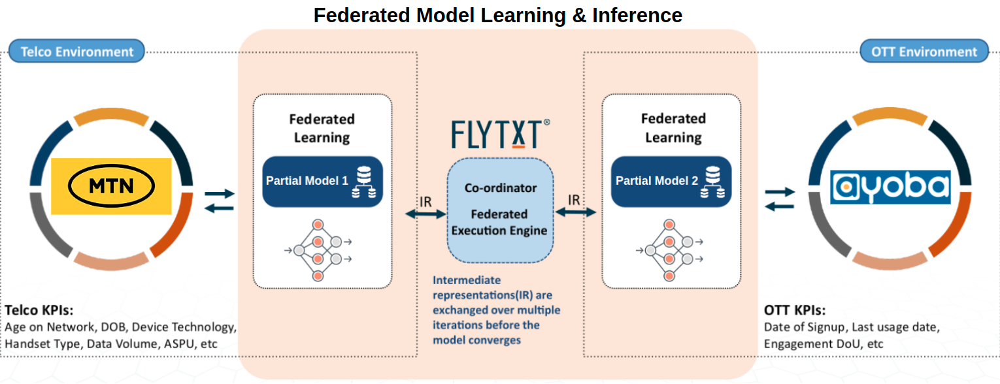
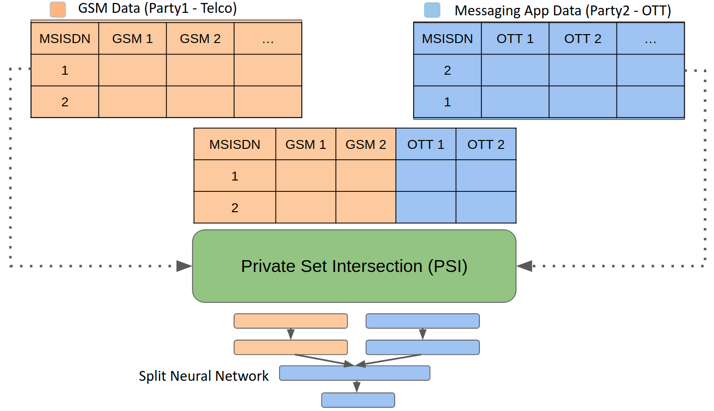
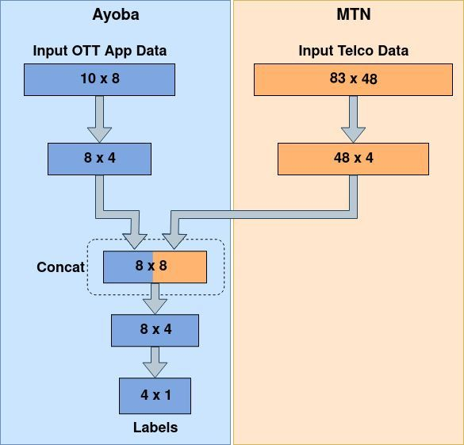
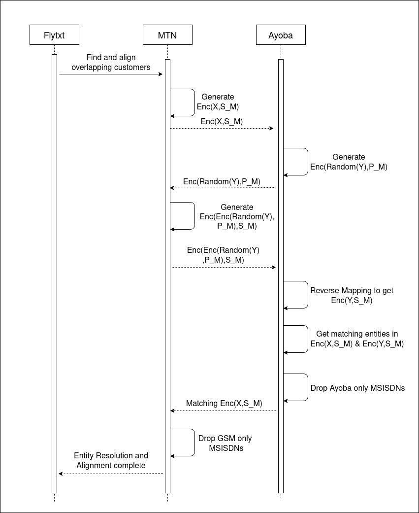
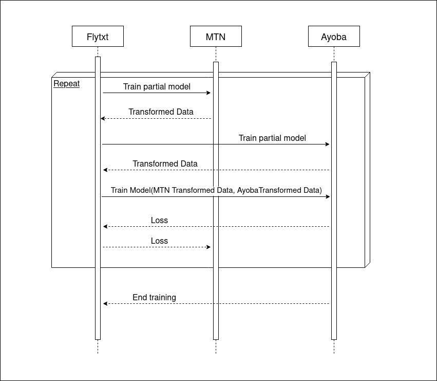
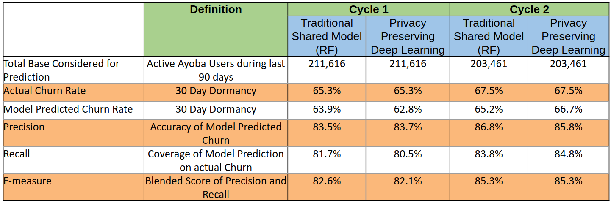
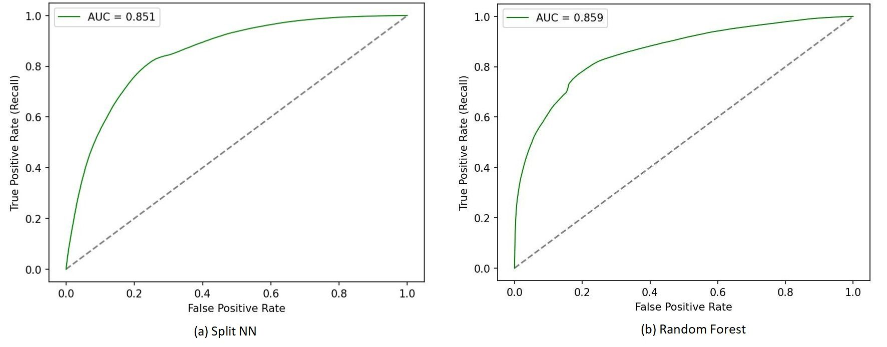

<!-- TODO(a11y): 6 localized body image(s) have empty alt text -->

## Motivation

While consumers expect better customer experience and personalization from businesses, they are increasingly sensitive to privacy and how businesses utilize and share customer data. As regulators step up consumer privacy requirements in response, leading businesses including Telcos that go beyond simple regulatory compliance can build customer trust and band appeal to create a business advantage [\[1\]](https://www.mckinsey.com/business-functions/risk-and-resilience/our-insights/the-consumer-data-opportunity-and-the-privacy-imperative). One approach to unlock the value of data for both consumers and businesses, while protecting privacy and maintaining regulatory compliance is through privacy preserving analytics. Against this backdrop, we present a federated privacy preserving model that enables a Telco and its OTT partner to jointly determine potential churn risk of common customers by securely combining their behavior spanning across both enterprises.

## Background & Business Challenge

MTN is a leading Telco in Africa serving more than 272 million subscribers. They have a strategic partnership with Ayoba, a free OTT messaging app with more than 5.5 million users in the region including MTN customers. Ayoba wanted to gain insights on their customer’s usage behaviour to accurately predict churn/inactivity so that appropriate actions can be taken to mitigate it, thereby improving customer engagement. GSM usage patterns of customers (available with MTN) along with their Ayoba usage behavior provide stronger indicators of Ayoba inactivity, compared to either of these sources in isolation. As MTN and Ayoba strive to  protect the privacy and security of their customer data, federated privacy preserving analytics is one viable solution.

## Ayoba Federated Churn Propensity Model

To validate the effectiveness of federated privacy preserving models in improving customer engagement, MTN partnered with Flytxt to conduct a pilot to predict Ayoba churn (30 days of continuous inactivity on the app) by securely combining behavior patterns (GSM and OTT) from their respective sources without sharing or moving any data in plain. Our success criteria was to attain comparable predictive performance for the federated privacy-preserving model as that of a baseline shared data model (where data is shared freely among parties).

Our privacy-preserving model predicted churn with a precision of 84.78 % and recall of 82.64% (average across two prediction cycles), which was comparable to the predictive performance of the baseline shared-data model based on Random Forest algorithm. Our results confirm that secure collaboration among Telcos and their OTT partners is feasible on real-world customer engagement use cases through federated privacy preserving analytics, without compromising data privacy and security.

## Solution Description

Ayoba churn propensity model is formulated as a binary classification problem, wherein we predict whether an Ayoba customer would churn or not by securely combining their historical GSM behavior and Ayoba app usage behavior for the past 30 days. The model predicts customers who are likely to be continuously inactive on the Ayoba app for the subsequent 30 days as churners.

Vertical federated learning using **split neural networks** ([SplitNN](https://arxiv.org/abs/2104.00489)) \[2\] is used to build the model on top of **[PySyft](https://github.com/OpenMined/PySyft)**, a privacy-preserving deep learning library \[3\]. Our solution allows training neural networks on vertically partitioned data features across multiple data owners, without requiring the movement of raw data from its owner’s server. Overlapping entities across different data owners are identified using private set intersection (PSI) based on encrypted IDs associated with the respective data points.

<figure class="">

<figcaption>Fig 1. Federated privacy preserving framework architecture</figcaption></figure>

Both MTN (Telco) and Ayoba (OTT) possess customer information which if securely combined can be used to accurately model customer inactivity. For instance, GSM features like voice and data usage, recharge behavior etc. are strong indicators of customer engagement on the Telco network. Together with features like handset type, such features can be indicative of a customer’s OTT messaging app usage behavior. On the other hand, customer’s Ayoba signup date, historical app usage behavior etc. would indicate their future engagement on the app. As GSM features are available with MTN whereas OTT features along with the true label (if a customer churned or not) are available with Ayoba, we choose a vertical federated learning architecture. The overall architecture of our federated privacy preserving analytics framework is depicted in Fig 1.

We use a dual-headed SplitNN [\[2\]](https://arxiv.org/abs/2104.00489) which is distributed among two data owners (Telco & OTT) holding different sets of features of data samples of the same data subjects. A coordinator (Flytxt) defines the neural network architecture and orchestrates distributed training and inference. Data is securely aligned for distributed model training and inference using PSI, with MSISDN as the unique customer identifier across parties. Each model segment (layers of SplitNN which belong to a party) acts as a “partial model” which transforms its local data into an intermediate representation (similar to the hidden layer output of a standard neural network). The subsequent model segment (held by a different party) consumes the intermediate representation (IR) from the “partial model” of the previous party along with its own local data to calculate the loss and gradients. The gradients are propagated across model segments (held by different parties) during backpropagation. Thus, each data owner participates in model training and inference, while the coordinator orchestrates the overall process. This approach enables information from multiple data owners to be securely combined for learning without the need to expose raw data. Fig 2 presents an overall logical view of our model. The specific architecture followed by our SplitNN is shown in Fig 3.

<figure class="">

<figcaption>Fig 2. Logical view of our federated learning model</figcaption></figure>

<figure class="">

<figcaption>Fig 3. Our SplitNN architecture for federated churn propensity model</figcaption></figure>

Our overall modelling pipeline consists of the following two steps:

1.  Identifying overlapping customers using PSI
2.  Federated model training and inference

### Identifying overlapping customers using PSI

Overlapping customers are obtained by using private set intersection (PSI), a multi-party computation cryptographic technique which enables two parties each with a set of elements to compute the overlap (intersection) of these elements, without exposing anything to each other except for the elements in the intersection. We use RSA-based PSI protocol described in [\[4\]](https://blog.openmined.org/private-set-intersection/), and only share encrypted customer ids. This prevents each party from learning about customers who are exclusive to the other party, while allowing secure identification of the overlapping customers.

Let us consider that MTN has a set of customer ids X and Ayoba has a set of customer ids Y. MTN generates a public key P\_M and a private key S\_M. The public key is shared with Ayoba. Using PSI, the overlapping customers are obtained and revealed to both parties. The detailed steps of our PSI protocol is presented in Fig 4.

<figure class="">

<figcaption>Fig 4. Sequence diagram for our PSI protocol</figcaption></figure>

### Federated Model Training and Inference

As we follow a vertically federated SplitNN architecture, neither the entire model nor the raw data is transferred among the parties. Each party retains the ownership of their local data and the corresponding “partial model”. Only the IRs are shared during model training and inference. During training, each party forward propagates their data through the partial model available with them. The IR from both models are combined and propagated to learn the final model. As the Ayoba party holds the labels and OTT features, the IRs from MTN are sent to Ayoba and the loss is obtained. The corresponding gradients are backpropagated through the respective partial models. The sequence diagram for our federated model training procedure is shown in Fig 5.  Inference procedure is straightforward and only involves generating churn scores by forward propagating the aligned customer records for which predictions are required.

<figure class="">

<figcaption>Fig 5: Sequence diagram for federated model training</figcaption></figure>

We use a shared data model based on Random Forest (RF) algorithm as a baseline to validate the efficacy of our privacy-preserving model. Both models are validated over multiple prediction cycles to ensure model consistency. Standard binary classification metrics like precision, recall and F-measure are used to evaluate the models.

## Results

We compare the predictive performance of our privacy-preserving federated model with that of a traditional RF model based on shared data and summarize our findings in Table 1. A comparison of the ROC curves for the models are shown in Fig 6. It is satisfying to observe that privacy preserving analytics while strictly honoring data privacy and ownership offers predictive performance similar to the shared data model where data is freely shared between enterprises. Moreover, this observation holds true across multiple prediction cycles, making it a viable solution for secure collaboration among Telco and OTT partners to jointly improve customer engagement.

<figure class="">

<figcaption>Table 1: Comparison of model performance across prediction cycles</figcaption></figure>

<figure class="">

<figcaption>Fig 6: Comparison of ROC curves of models for cycle 2</figcaption></figure>

## Conclusion

Ayoba churn propensity model pilot proves that federated models can be launched to predict various customer behavior without compromising on data privacy and ownership norms. Moreover, the federated machine learning approach does not compromise the effectiveness of predictive models, while eliminating the need to share the entire data to a centralized location. We observe that secure collaboration among Telcos and their OTT partners is feasible on real-world customer engagement use cases through federated privacy preserving analytics, opening up novel opportunities for Telcos & OTT players for external data monetization.

## References

1.  [The consumer-data opportunity and the privacy imperative](https://www.mckinsey.com/business-functions/risk-and-resilience/our-insights/the-consumer-data-opportunity-and-the-privacy-imperative)
2.  [Pyvertical: A vertical federated learning framework for multi-headed splitnn](https://arxiv.org/abs/2104.00489)
3.  [GitHub – OpenMined/PySyft: A library for answering questions using data you cannot see](https://blog.openmined.org/p/5ac5d95c-c493-43c8-ad06-b0c29aade543/GitHub%20-%20OpenMined/PySyft:%20A%20library%20for%20answering%20questions%20using%20data%20you%20cannot%20see)
4.  [Private set intersection for COVID-19 corona contact tracing apps](https://blog.openmined.org/private-set-intersection/)

## Contributors

1.  Jobin Wilson: [jobin.wilson@flytxt.com](mailto:jobin.wilson@flytxt.com)
2.  Bivin V B: [bivin.vinod@flytxt.com](mailto:bivin.vinod@flytxt.com)
3.  Prateek Kapadia: [prateek.kapadia@flytxt.com](mailto:prateek.kapadia@flytxt.com)

## Acknowledgements

Thanks to Abinav Ravi and Gatha Varma for the editing the post
