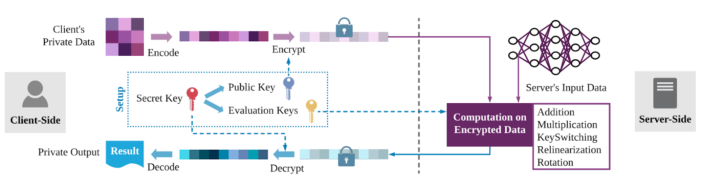
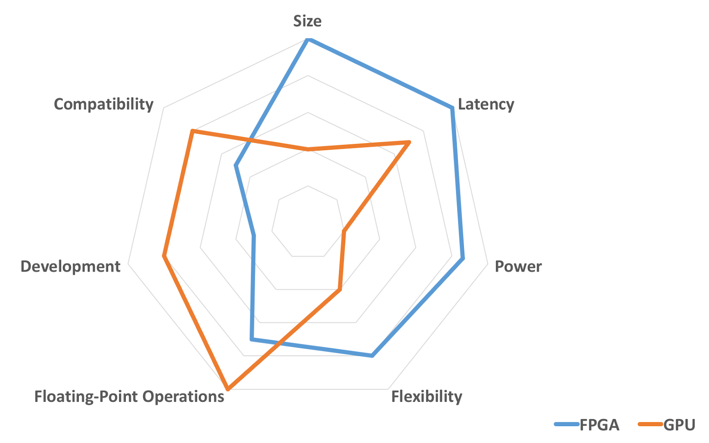
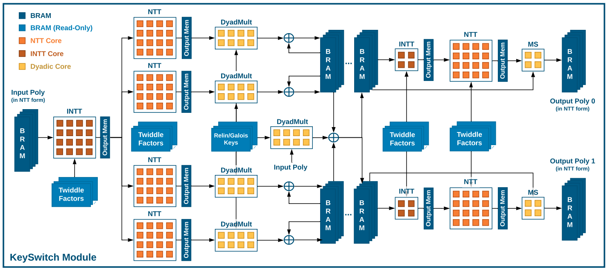
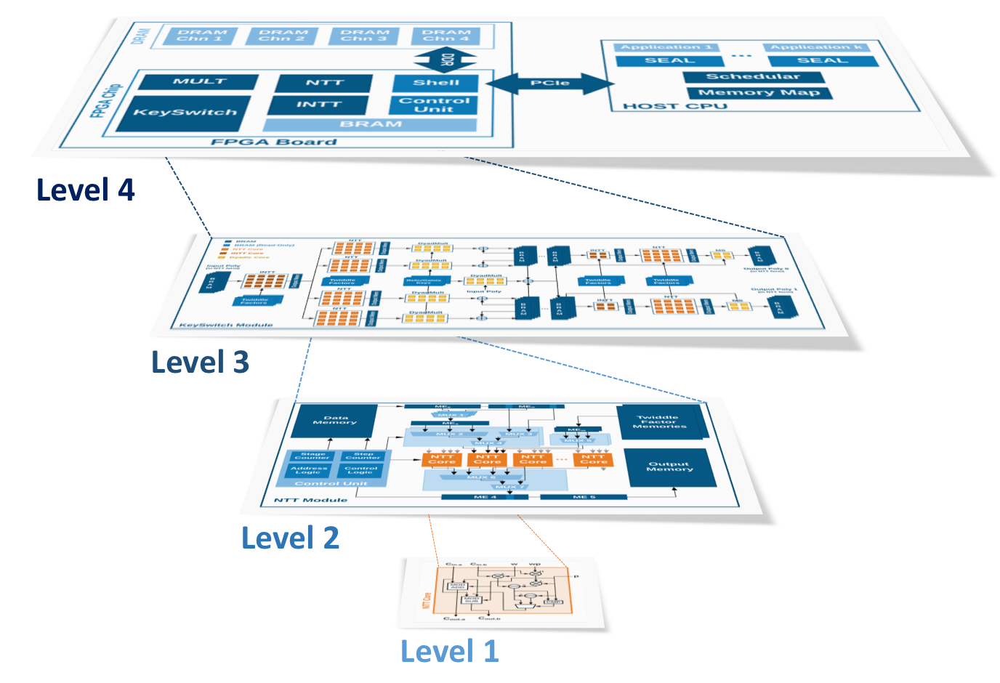

<!-- TODO(a11y): 4 localized body image(s) have empty alt text -->

In this blog, Sadegh Riazi explains Microsoft’s Project HEAX. One of the main obstacles in leveraging Fully Homomorphic Encryption at large-scale is the _enormous computational overhead_ compared to regular computation on cleartext data — **the overhead can be up to several orders of magnitude.** The HEAX project introduces a new hardware architecture that reduces the overhead of computing on encrypted data by **two orders of magnitude.**

---

## What is Fully Homomorphic Encryption (FHE)?

FHE is a technology that combines two seemingly contradictory properties. On the one hand, it is an encryption scheme that takes input data and makes it unintelligible. On the other hand, it allows any computation to be performed on the encrypted (unintelligible) version of the data. The result of the computation, once decrypted, matches that of computation on regular cleartext data.

It wasn’t until 2009 that the first solution for FHE was proposed. This breakthrough invention showed that it is, in fact, possible to construct FHE.

FHE can fundamentally change how we share and use data on the Internet. For example, hospitals can send the encrypted version of their patients’ data to a cloud service to benefit from automated diagnosis based on AI models. **One of the main obstacles in leveraging FHE at large-scale is the _enormous computational overhead_ compared to regular computation on cleartext data. The overhead can be up to several orders of magnitude.**

<figure class="">

<figcaption>Typical Computation Flow for FHE</figcaption></figure>

## Accelerating FHE

Are general-purpose CPUs the best computing platform for executing FHE operations?

Probably not.

CPUs are ubiquitous, and many people can use them for FHE. GPUs can be good candidates because they have a large number of small arithmetic cores that execute many operations simultaneously. However, unlike AI applications, not all of the FHE calculations are easily parallelizable to many cores.

Field Programmable Gate Arrays (FPGAs) are a class of reconfigurable hardware that can be re-programmed. The computational resources on FPGA chips, such as Digital Processing Units (DSPs), can be used in an arbitrary configuration. Compared to GPUs, FPGAs consume less power and provide more flexibility, making them an ideal candidate for cloud service applications. A major challenge in utilizing FPGAs is the limited on-chip memory (only a few MB of storage). Ciphertexts in FHE are very large, which prohibit the storage of all of the intermediate data on FPGA.

<figure class="">

<figcaption>FPGAs vs GPUs</figcaption></figure>

## Microsoft’s Project HEAX

HEAX (Homomorphic Encryption Acceleration) project focuses on designing a new computing architecture, specifically designed for FHE. The architecture can be realized using FPGAs or Application-Specific Integrated Circuit (ASIC). HEAX improves performance by _more than two orders of magnitude compared to modern CPUs_.

<figure class="">

<figcaption>The “KeySwitch” module within the HEAX architecture</figcaption></figure>

## What are the main enablers of the performance improvement?

-   _**Optimized bit-width:**_ in CPU and GPU chips, the bit-width of computation units is fixed, usually 32-bit or 64-bit. FPGAs provide the flexibility to choose arbitrary bit-width for any part of the computation. In FHE evaluation functions, the bit-width of numbers during computation is usually bounded by a prime number which has fewer than 64 bits. Therefore, the bit-width of all intermediate results can be optimized to minimize the resource consumption on the chip.
-   _**Access patterns:**_ another fundamental characteristic of FPGAs is the arbitrary configuration of computing units. FHE evaluation functions exhibit a complex and convoluted access pattern that is not suitable for CPUs and GPUs. The Single Instruction Multiple Data (SIMD) feature of CPUs and GPUs are efficient ways of performing a single calculation on many numbers. However, the irregular access pattern of FHE limits the benefit of SIMD operations.  
-   _**Compact data storage:**_ FPGAs have an on-chip memory that provides low-latency access to the data, but the size of on-chip memory is usually small. Leveraging off-chip memory can significantly reduce performance. Optimal utilization of on-chip memory is a non-trivial task since the on-chip memory unit has a fixed bit-width, which is usually smaller than the intermediate values. This fact requires the storage of FHE ciphertexts on multiple memory units. Moreover, each memory unit allows one read/write operation per each clock cycle. An efficient configuration of storage units enables most of the intermediate data to be stored on the chip, and as a result, yields a high-performance design.  
-   _**Fully-Pipelined Architecture (THE main enabler):**_ a pipelined design can process multiple inputs in consecutive clock cycles. The challenge is addressing the data dependency across different computing stages. A fully-pipelined architecture is substantially more complicated to design but enables full-utilization of all computation units at all times and increases the computation throughput.

<figure class="">

<figcaption>HEAX Architecture</figcaption></figure>

## In a nutshell

Fully Homomorphic Encryption is a powerful technology that provides a mechanism to process data without direct access. One can extract aggregated insights from a dataset without learning any information about the dataset entries. As a result, it is possible to monetize data while protecting the privacy of data owners. In this line, new computing platforms are needed for FHE that are significantly faster and more power-efficient.

HEAX project introduces a new hardware architecture that reduces the overhead of computing on encrypted data by two orders of magnitude. HEAX, in turn, opens new doors for large-scale deployment of FHE for various applications such as secure cloud computing and privacy-preserving machine learning.
