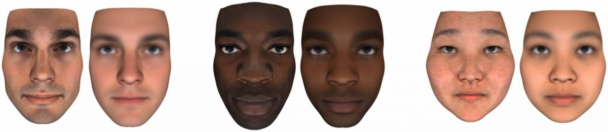
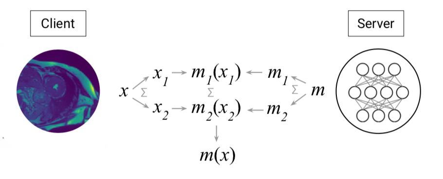

<!-- TODO(a11y): 2 localized body image(s) have empty alt text -->

#### _“You would see hundreds and hundreds of unsolved crimes solved overnight,” Detective Michael Fields of the Orlando Police Department, from_ [_NY Times “Your DNA Profile is Private? A Florida Judge Just Said Otherwise_](https://www.nytimes.com/2019/11/05/business/dna-database-search-warrant.html)  

Over 20 million people have uploaded their genetic profile to consumer DNA websites. The use of this data has helped us [solve ongoing criminal investigations](https://www.latimes.com/projects/man-in-the-window-joe-DeAngelo-golden-state-killer-serial/), and it is helping advance our understanding about disease and discover treatments. Using this data wisely could hold enormous benefits for society, but if it is sold, stolen, or mis-used, we can’t just “reset” our DNA as we can with a leaked password. **Privacy-enhancing technologies, such as new methods of encryption, may allow society to receive all the benefits without any of the harm.**

### Why the hype with genetic testing?

Recent technological advances have made genomic testing affordable and accessible, granting researchers the tools to sequence the whole of our genome in the [Human Genome Project](https://www.genome.gov/human-genome-project). Knowing the information held in our genetic code can provide access to better understanding disease, evolution, efficacy of treatments, and forensics. In recent years, this has also opened a market for businesses: direct-to-consumer genetic testing. The hype is understandable — people want to know their ancestry, their risk to certain diseases and how to prevent them.

In addition, these direct-to-consumer databases have been used by law enforcement to solve [ongoing criminal investigations](https://www.nytimes.com/2018/06/27/science/dna-family-trees-cold-cases.html), including the [Golden State Killer](https://www.latimes.com/projects/man-in-the-window-joe-DeAngelo-golden-state-killer-serial/). An example of how this information has been used several times to [solve dormant cases](https://www.nytimes.com/2018/06/27/science/dna-family-trees-cold-cases.html) is the [GEDmatch](https://www.washingtonpost.com/news/true-crime/wp/2018/04/27/golden-state-killer-dna-website-gedmatch-was-used-to-identify-joseph-deangelo-as-suspect-police-say/) open access genealogy platform — this platform exemplifies the necessity for consent and sharing regulations. It should not be implicit that someone’s freedom to share their genomic data [transgresses their relatives rights of anonymity and privacy.](https://www.ncbi.nlm.nih.gov/pmc/articles/PMC6006763/) That being said, without it many DNA samples stored away in police departments would have not found any use. In this case, genetic databases are central, and using them securely can not only solve old cases, but bring some peace of mind to all the families suffering behind such tragedies. **It’s clear to see the immense benefit to society these rich databases can hold.**

### We don’t yet know how it can be used to harm us

Once your genetic information is profiled and shared, you can’t take it back. **You can’t later change your genetic profile, like you can change a password. You can’t cancel it and open a new genetic profile, like you can with your compromised credit card.** Once shared, this unique identifier can forever be trivially copyable and shared to other parties. We currently don’t know the full extent to which our DNA profile can be exploited, but **we’re beginning to see the beginnings of nefarious ways it can be used.**

**One possible invasion of privacy comes with techniques such as ‘DNA phenotyping’, where [your height, weight, body mass index, voice, age, sex and ancestry](https://www.pnas.org/content/114/38/10166) can be inferred from your genetic profile.** If this wasn’t invasive enough already, [reconstructions of people’s appearances based on their genomic data](https://www.pnas.org/content/114/38/10166) have been deployed by Professor Christoph Lippert and his team, shaking our conceptions of anonymity in the -omics era which questions their ethical and moral implications.

<figure class="">

<figcaption>Figure 1: Examples of real images on the <em>left </em>and their predicted DNA phenotyping reconstruction on the <em>right </em>(Lippert <em>et al., </em>2017).</figcaption></figure>

This isn’t technology of the future: DNA phenotyping has already been marketed by companies such as [Parabon Nanolabs](https://snapshot.parabon-nanolabs.com/phenotyping) or implemented by [German’s police workforce](https://science.sciencemag.org/content/360/6391/841). Such approaches would be the equivalent of a DNA fingerprint mugshot, which unavoidably raises concerns about the ethical compass of such procedures.

Although these details are useful to solve crime, this highly specific nature of our DNA can be used to our disadvantage by financially driven organizations and individuals. One common concern raised is whether insurance companies [can leverage genomic data information](https://www.tandfonline.com/doi/abs/10.1080/13698571003710365?scroll=top&needAccess=true&journalCode=chrs20) to [accordingly adjust their charges](https://www.ncbi.nlm.nih.gov/pmc/articles/PMC4259574/). **The US law statutes of genetic information nondiscrimination only apply to health insurance policies, thus not covering [life and disability insurances](https://www.eeoc.gov/laws/statutes/gina.cfm)**[.](https://www.eeoc.gov/laws/statutes/gina.cfm) An unintended consequence of this risk could be a **lack of trust in medical care** — people may become apprehensive to allow themselves to be tested in fears that their genetic data will be shared [unwillingly or unethically.](http://www.bu.edu/law/journals-archive/bulr/documents/joh.pdf)

One thing is certain, the more we understand our genetic code, the more we grasp how much it can inform us about an individual and how negatively it could affect their lives if mishandled. What if sensitive data about our health ended up in the hands of **insurance companies that could misuse it**? What if our DNA data gave away future sensitive tendencies that would limit our access to the job market or to certain professions, only due to possible predispositions? What if instead of helping us fight criminals and cure disease it **propels discrimination and segregation**?

### Can policy protect us?

As phenotyping techniques will rapidly advance in sophistication, our society requires updated, adequate legislation that ensures that these tools are not employed in ways that breach our rights to privacy — including driving discrimination and bias.

The direct-to-consumer genetic testing company Ancestry.com has recently published a [transparency report](https://www.ancestry.com/cs/transparency) and a guide for [law enforcement](https://www.ancestry.com/cs/legal/lawenforcement) that aim to clarify their position in regards to their customers’ privacy. The report may be viewed as encouraging; it manifests the minimal disclosure of customers data to law enforcement agencies so far. **However, this shouldn’t be a call for complacency — policies are a necessary component of secure genetics testing as [California’s senator has manifested by urging tighter legislations](https://techcrunch.com/2020/02/11/california-senator-proposes-tighter-regulations-on-direct-to-consumer-genetics-testing-companies/) — but instead a plea to find the adequate privacy techniques that will protect our data.**

This valuable **data could become a mining target for companies (insurance, pharmaceutical, and more)** wanting to access it. We should not become the targets of [unwarranted personalised products and services based on our genetic data](https://www.ancestry.com/cs/legal/dnaterms_2017_05_22_us). Direct-to-consumer genetic testing companies have a past of leaving much to be desired in regards to privacy concerns. Back in 2018,  Dr. James Hazel and lawyer Mr. Christopher Slobogin investigated the [privacy policies of several genetic testing companies](https://papers.ssrn.com/sol3/papers.cfm?abstract_id=3165765). Their thorough analysis concluded that out of 90 companies examined, **a large amount had very weak policies in place, suggesting that clients are not properly informed and protected.** Ensuring that our data are not sold to the higher bidder and that are suitably stored away is central to a fair and ethical skeleton to use these tools and should be legally established. Nonetheless, customers need to be aware of the current  shortcomings and keep up with privacy policies changes.

### Can privacy technology protect us?

**It shouldn’t have to be risky** for society to enjoy the advantages of modern genetic testing — **genetic testing should be done with the peace of mind that [secure infrastructures to preserve our identity integrity](https://bmcmedicine.biomedcentral.com/articles/10.1186/s12916-019-1296-7#Abs1) are in place**. A [framework where our data in the cloud are not accessed freely nor our privacy is compromised](https://www.biorxiv.org/content/10.1101/799999v1.full.pdf) is needed. To meet these objectives, several privacy preserving techniques are being developed.

Companies such as [Nebula](https://nebula.org/) and [LunaDNA](https://www.lunadna.com/how-it-works/) are driving some of this change: they **give clients sole ownership of their genetic data** and provide them with the platform to anonymously sell it at their choosing [via cryptographic techniques](https://www.biorxiv.org/content/10.1101/799999v1) that preserve the client’s consent and privacy. **This is accelerating the research on [decentralised encryption procedures](https://blockchainhealthcaretoday.com/index.php/journal/article/view/34/101) to give customers the control of their genomic data and the ability to verify that they are used securely.**

**The vision behind the main privacy preserving techniques relies on cryptographic machine learning models** that can perform the 3 main operations of multiplication, addition, and comparison effectively. Cryptographic techniques are used on the premise that two or more parties need to communicate or exchange information. It may be that some of the information must remain private thus cannot be directly transferred between these parties. These techniques are mainly categorised according to two theoretical protocols:

#### [i. Computational Complexity Theory Techniques](https://www.cs.princeton.edu/courses/archive/fall07/cos433/lec3.pdf)  

One way to preserve the privacy of genetic data is using [homomorphic encryption.](https://www.sciencedirect.com/science/article/pii/B9780128053959000101) This technique leverages on encrypting data and not having to decrypt it to compute on it, therefore preserving anonymity and privacy since intermediate results are encrypted and no longer accessible. It allows carrying mathematical operations on encrypted data (i.e. input data such as DNA sequences) to obtain some relevant outcome after decryption (like the possible predisposition to a disease).

In its simplest form it would follow a workflow such as:

Input data _**m**_  → encrypted – **enc(**_**m**_**)** –  → perform _function f_ on data  → decrypt – **enc(f(**_**m**_**))** – → **f(**_**m**_**)**

Homomorphic encryption can be divided into two main subtypes: partial and full. Partial (or somewhat) homomorphic encryption are systems that are only capable of performing certain mathematical operations or only a limited number of operations (like a limited number of successive multiplications), whereas fully homomorphic encryption – proposed by [Gentry in 2009](https://crypto.stanford.edu/craig/craig-thesis.pdf) – can perform any mathematical function.

The current drawback is that to perform all 3 main operations on encrypted data takes long computing time which reduces its current applications. Fortunately, homomorphic encryption is an active area of research, and many researchers are developing ways of attaining more  feasible query times. **Some companies are even offering packages of homomorphic encryption to be used in machine learning models such as [Intel’s](https://www.intel.ai/he-transformer-for-ngraph-enabling-deep-learning-on-encrypted-data/) HE-Transformer or our own open source community [OpenMined](https://www.openmined.org/).**

OpenMined has started to work on [TenSEAL](https://github.com/OpenMined/TenSEAL), a library for doing homomorphic encryption operations on tensors. TenSEAL is a result of contributors efforts at extending the [SEAL](https://github.com/Microsoft/SEAL) Microsoft library to tensor operations, and wrap this all together to add more HE capabilities to PySyft. From the side of PySyft, you will only see torch tensors that you are already familiar with, but which implements either the CKKS or BFV schemes. **This week, OpenMined contributor Ayoub Benaissa produced [a demonstration of homomorphic encryption in PySyft with SEAL and PyTorch.](https://blog.openmined.org/ckks-homomorphic-encryption-pytorch-pysyft-seal/)**

This security model is potentially applicable across healthcare systems such as hospitals or research institutions that handle countless of sensitive patients’ data. Similarly, financial enterprises or any party dealing with someone’s data would benefit from more secure handling and preventing third parties from misusing data.

#### [ii. Information Theory Techniques](https://www.scientificamerican.com/article/claude-e-shannon-founder/)  

These protocols rely on sequence sharing across several parties: n parties hold shares of the data, each of which can’t reveal anything about the original sequence, and _k_ out of _n_ parties are needed to decrypt data. This means that governance is shared between parties, which is a key difference from homomorphic encryption.

**These techniques are known as secure multi-party computation (MPC) and allow several parties to simultaneously work on private shared data — it’s like having access to the safe, but not to the contents within.** Each party can work on the data and share their anonymous input from which to produce an output of interest. This preserves the privacy of the data within the computation.

One main example of MPC is the [SPDZ “Speedz” protocol](https://eprint.iacr.org/2012/642.pdf) which relies on additive sharing, meaning all parties have some share of the secret which has been implemented across many practical applications and appears [to provide promising secure results](https://arxiv.org/abs/1901.00329). **This protocol works in the semi-honest setting (i.e. when parties follow the crypto protocol and don’t learn anything unintended about the data) and in the malicious setting (even if parties try maliciously to deviate from the protocol, they can’t gain any advantage to uncover private data)**. However, the nature of additive sharing has an important limitation;  if a party stops cooperating in the project all work is lost.

<figure class="">

<figcaption>Figure 2: Representation of a secure two-party computation in machine learning.&nbsp;</figcaption></figure>

An example could be sharing medical data between a genetic testing company and a hospital in which each party shares certain bits of information that make up the final model. This ensures that the final outcome can only be delivered if all parties agree, and that nothing else but the final outcome is disclosed, thus ensuring privacy throughout the process.

[Alibaba Gemini,](https://arxiv.org/pdf/2002.04344.pdf) with the contribution of OpenMined members [Jason Mancuso and Morten Dahl](https://arxiv.org/pdf/2002.04344.pdf), have developed an optimised logistic regression in MPC using TensorFlow TF encrypted (TFE) on an existing ABY3 protocol for the [iDash](https://slack-redir.net/link?url=http%3A%2F%2Fwww.humangenomeprivacy.org%2F2019%2F) competition. Given the high performance of their model they secured winning first place in Track IV of the iDASH2019. Their work is facilitating secure decentralised analyses that promise a more cohesive and collaborative research environment in the genomics field.

### How this could look in an application – looking ahead  

As data continue to be exchanged and examined, our society is improving awareness of internet privacy and responsible data use. The public is becoming more conscious and informed about the perils of weakly protected personal data. This collective awakening has incentivized innovative computational research to deploy accessible applications that grant us protected access to our personal data and gives us the control over it. The more informed, the more protected.

Will this collective awareness motivate a shift in cloud dynamics, leaving behind free of use servers that lack the privacy and security expected, and [adopting more secure methods](https://blog.openmined.org/pysyft-pytorch-intel-sgx/)? It’s in our hands which path to follow.

At OpenMined, we’re collaboratively and actively focusing our efforts on developing and deploying the privacy preserving tools that can ensure a privacy centered world. **It is no longer unreasonable to envision secure platforms and applications from which we can gain insights from sensitive data without compromising our privacy and anonymity.** Computational and information based security are paving the way towards such not so unrealistic technological utopia. Privacy preserving techniques are here to stay.

There is a fine line between using data insights for the common good and preserving our individual rights. **We are building the foundations of the future — as we try to solve problems with genetic data, let’s ensure we don’t create new ones.**
