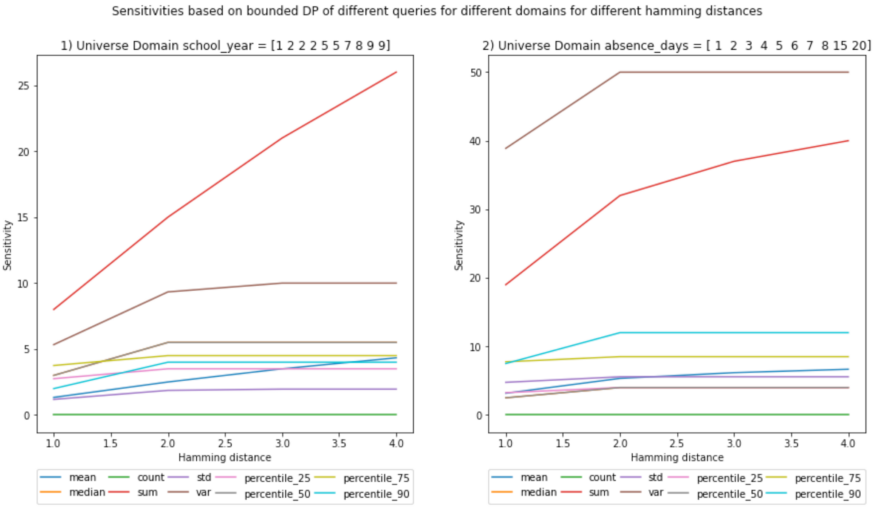
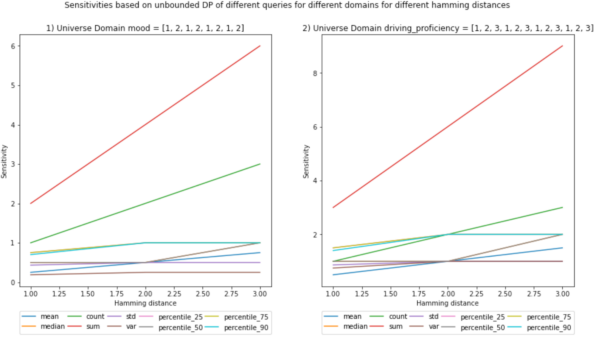
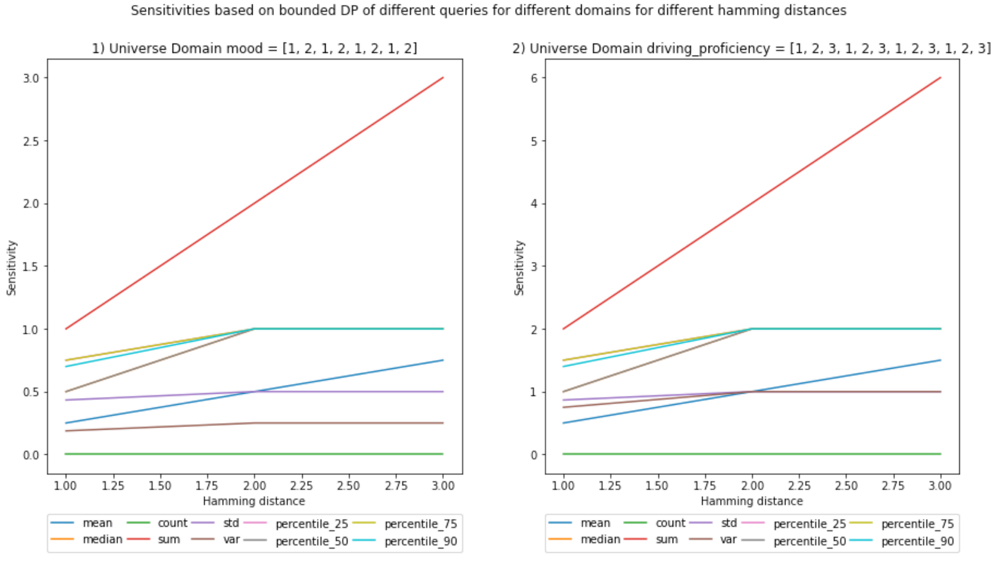
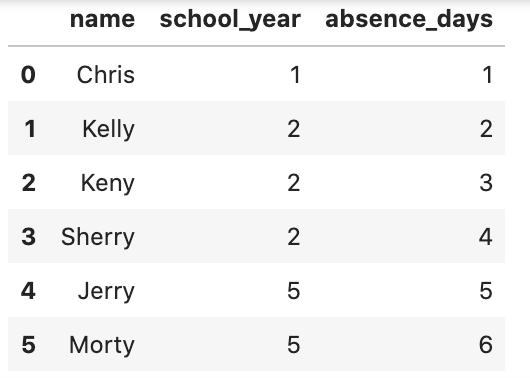
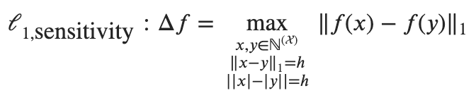
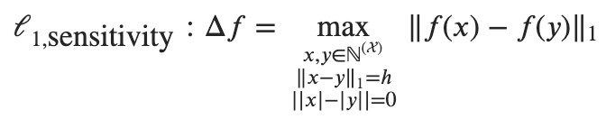
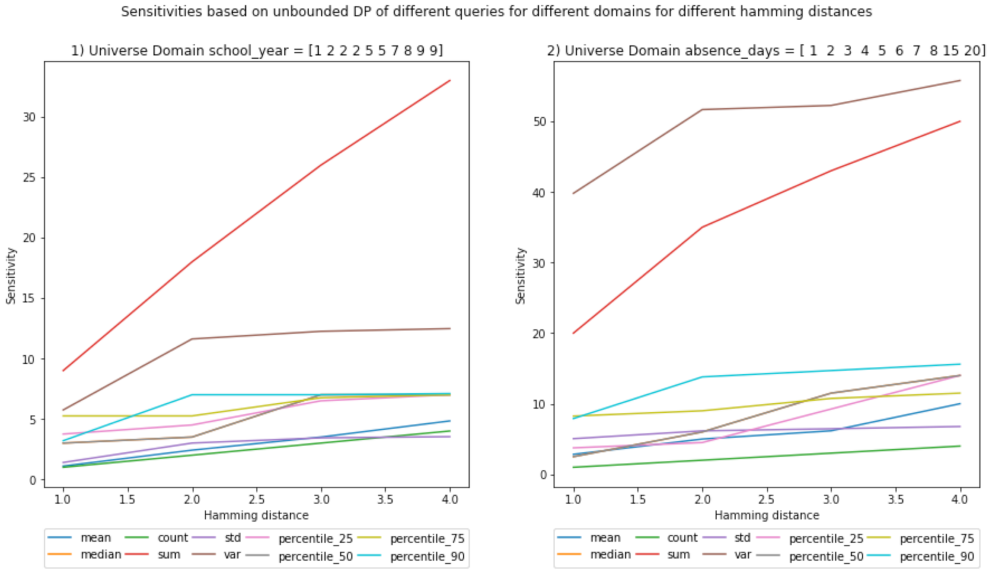

<!-- TODO(a11y): 8 localized body image(s) have empty alt text -->


<!-- TODO(content): shortcode(s) present (verify) -->

## Global Sensitivity From Scratch

## Goal

This [notebook](https://github.com/gonzalo-munillag/Blog/blob/main/My_implementations/Global_sensitivity/Global_Sensitivity.ipynb) aims to showcase two functions, one that implements sensitivity based on the unbounded differential privacy (DP) definition, and another that implements sensitivity based on a bounded definition.  
I am not aiming for efficiency but for a deeper understanding of how to implement sensitivity empirically from scratch.

## Background

Before continuing there needs to be some clarifications:  
In bounded DP, the neighboring dataset is built by changing the records of the dataset (not adding or removing records). E.g. x = {1, 2, 3} (|x|=3) with universe X = {1, 2, 3, 4}, a neighboring dataset with bounded DP would be: x’ = {1, 2, 4} (|x’| = 3). They have the same cardinality.  
In unbounded DP definition, the neighboring dataset is built by adding or removing records. E.g. x = {1, 2, 3} (|x| = 3) with universe X = {1, 2, 3, 4}, a neighboring dataset in this case could be: x’ = {1, 2} or {1, 3} or {1, 2, 3, 4} (|x|=2 or |x|=2 or |x|=4, but not |x|=3). Their cardinality differs by 1 (the so called Hamming distance).  
In this [book](https://www.amazon.com/Differential-Privacy-Practice-Synthesis-Information/dp/1627054936) they authors explain why we should stick to unbounded sensitivity.

**More specificaly, the datasets are multisets, and their cardinality is the sum of the multiplicities of each value they contain.**  
The neighboring datasets are also multisets and are considered neighbors if the Hamming distance concerning the original dataset is of value k. The data scientist sets this parameter, but the original definition of DP has a value of k=1 (As discussed above, one considers a dataset a neighbor for a difference in cardinality of 1).

The Hamming distance can be seen as the cardinality of the symmetric difference between 2 datasets. With this in mind, the definition of DP can be written as:

P(M(x) = O) <= P(M(x’) = O) \* exp(ε \* |x ⊖ x’|)

Where M is a randomized computation, x a dataset, x’ its neighbor at Hamming distance k = |x ⊖ x’|, and O is the output of M given x and x’.

K was first defined to be equal to 1 because one aims to protect an individual in the dataset, and by definition, any individual within the dataset would also be protected. By making the probabilities of obtaining an output _o_ similar between two datasets that differ only by 1 record, one is successfully cloaking the actual value of _o_ and therefore not fully updating the knowledge of the adversary.

Looking at the definition of DP, the higher the k, the more exp(·) would increase, which means that the difference between the probabilities to obtain those outputs will be larger, which is not good from a privacy perspective. Nonetheless, because ε is defined by the data curator, one may just compensate the impact of a larger Hamming distance with a lower value of ε.

The intuition behind a larger Hamming distance is group privacy. This is useful when sets of individuals in a dataset have similar qualities, e.g., a family. The individuals of these groups should be indistinguishable from other sets of individuals of the same size. For example, having a Hamming distance of k=2 would aim to protect pairs of records (pairs of individuals), i.e., it accounts for the fact that there are dependencies between records in the dataset that need to be considered, lest an output reveals exceeding information. It could make sense if there are some binary relationships between records, e.g., pairs of siblings, or n-ary relationships for k=n, e.g., in a social network.

## Contributions of the notebook

1.  I programmed functions that calculate empirically the bounded and unbounded sensitivity of a dataset formed by numeric columns. Additionally, it allows you to vary the Hamming distance. Its empirical nature will not allow it to scale well, i.e., the function creates all possible neighboring datasets, with k less or more records (for unbounded DP) and the same amount of records but changing k values (bounded DP), where k is the Hamming distance. The function calculates the query result for each possible neighboring dataset, calculates all possible L1 norms, and then chooses the maximum. That will be the sensitivity defined in DP (Global sensitivity).
2.  The sensitivity can be calculated for most of the basic queries: mean, median, percentile, sum, var, std, count.

I tried for different domains, bounded and unbounded sensitivities, different Hamming distances. If you are impatient, you can go directly to the [results](#results).

## Conclusions

1.  Increasing the Hamming distance will increase the sensitivities; it makes sense because the larger the number of elements you can include, the more outliers can be present in the neighboring datasets, increasing the L1 norm.
2.  This increase in sensitivity, in turn, will increase the noise added, as the Hamming distance multiplies the chosen epsilon in the definition of DP. However, as described above, one may choose a lower ε to compensate.
3.  Bounded sensitivities seem smaller than unbounded ones. But that is not always the case; you can check the example given in the next [blog post](https://github.com/gonzalo-munillag/Blog/tree/main/My_implementations/Local_sensitivity), where I give a visual example of how sensitivities are calculated.
4.  Bounded sensitivities are more taxing to compute than unbounded, but that might be because I have not optimized both functions equally.
5.  Sensitivities, in general, seem to either plateau, have a logarithmic behavior, or be linear. However, this cannot be generalized as the number of samples is small.

**Note 1: Unbounded sensitivity can be achieved in 2 ways, either by adding or subtracting records. In this notebook, I computed both simultaneously and chose the one that yielded the highest sensitivity. However, I would say that in a real scenario, you could choose any and calculate the sensitivity, as both equally protect the privacy of the individuals in the records by defintion. However, it is true that for the same privacy guarantees, one might use less noise than the other. This is an object for discussion.**

Note 2: Some of these conclusions have been drawn from a set of experiments, it sets the ground for hypothesis, but to assert the conclusions, we would need to prove them theoretically.

## Use case and considerations

I have differentiated between 2 cases. (Their explanation have a larger impact on the understanding of DP rather than on the hereby presented notebook.)

(a) The universe of possible values is based on a dataset, which the adversary knows. Furthermore, there is a released dataset, which is a subset of the universe. The adversary only knows the size of the released dataset and that the members hold a common characteristic. In the worst case scenario, aligned with differential privacy, the cardinality of the release dataset is one less than the universe, and, therefore, the adversary knows the size of the released dataset. This scenario could be, e.g., releasing a study based on some students out of all the students at a school. (Note: The dataset to be released cannot be larger than the dataset used for the universe, only equal or smaller).

(b) This case is similar to the previous one, but the universe of possible values is a range of values instead of a dataset. Furthermore, the adversary knows this range of possible values and the size of the released dataset. We define this second case because sometimes the exact values that could potentially be released by a data owner are not known in advance; we might only know a range where those values could fall. This scenario could be, e.g., releasing real-time DP results from an IoT device. We assume that the size of the released dataset is known, i.e., we know the adversary queries n amount of records or a synopsis (statistical summary) of these n records is released. This last statement about the knowledge of the adversary is realistic because the number of users or IoT devices in an application can be designed to be known.  
For simplicity, from now on, I will call the datasets D\_universe\_a, D\_universe\_b, D\_release\_a, D\_release\_b, and D\_neighbor for (a) and (b).

Note that this is somewhat different from the **online (on)** or interactive, and the **offline (off)** or non-interactive definition that [C. Dwork](https://www.cis.upenn.edu/~aaroth/Papers/privacybook.pdf) introduces in her work. Her definitions deal with not knowing or knowing the queries beforehand, respectively. However, we could have the case (a) and case (b) in both (on) or (off):

1.  Scenario (a) + (on): An API allows external entities to query in a DP manner a subset of the school dataset you host internally (Or its entirety).
2.  Scenario (a) + (off): Release externally a DP synopsis (statistical summary) of a subset of the school dataset you host internally (Or its entirety).
3.  Scenario (b) + (on): An API allows external entities to query in a DP manner a dataset updated in real-time by IoT devices hosted internally.
4.  Scenario (b) + (off): Release externally a DP synopsis of a dataset. The dataset is constantly updated in real-time by IoT devices; therefore, the synopsis must also be updated. (Not a good idea, I think)

For this notebook, I will consider Scenario (a) + (off) and (b) + (off). But for the latter I will not include dataset updates, it is out of the scope of this post.

Also, note that (a) and (b) do not necessarily need to be categorized as **local DP (LDP)**. LDP is applied at the device level on individual data points before any third party aggregates all data points from all devices; usually, a randomized response is the DP mechanism of choice. However, one can adapt the setting so that (a) and (b) are cases of LDP. Nonetheless, in this notebook, we implement (a) and (b) as **global DP (GDP)** instances. GDP is applied when a trusted third party gathers all the data and applies a DP mechanism on the aggregate and not at a record level. GDP is not as restrictive as LDP in terms of allowed DP mechanisms, and the amount of noise in GDP can be lower than in LDP. This notebook focuses on GDP.

In summary, we have (a) + (off) + (GDP) and (b) + (off) + (GDP).

## Tricky questions for clarification:

-   How could (b) and (GDP) go together?  
    The third-party can host a server to process real-time data in aggregate.  
    Caveat: Because the dataset is ever-growing, one might need to compute sensitivities every time the dataset would change so that the executed queries or the synopsis have the appropriate amount of noise.  
    However, if you know the range of possible values or you are confident of your estimate, then you could calculate the sensitivity analytically just once.
-   Mmm, and what if you do not know the full domain of your universe?  
    That is indeed a good question. Well, then you will have to do some clipping not to get any surprises. E.g., if you defined your universe like D\_universe\_b = {‘Age’: \[1, 2, …, 99, 100\]}, but you get a value in real-time like [122](https://en.wikipedia.org/wiki/List_of_the_verified_oldest_people), then you should do top-coding, 122->100, and then include its value. Outliers and DP do not go well. You can protect them, but the cost would be too high (Higher noise), and why would you do that? The mean or the sum would not be representative of the population if there are outliers in it. DP is used to learn from a population, not from outliers; if you would like to learn about outliers, DP is not for you. HOWEVER, this clipping might not be a trivial fix, I have to do more research to know whether that is okay to do.

### Further clarification <- Important

However, in this notebook, the main difference between scenarios (a) and (b) is programmatic. While the functions I created (For the sensitivities in unbounded and bounded DP) serve both scenarios (a) and (b), to calculate the sensitivity in scenario (b), you have to make as many replicates of each value of the universe as the size of the released dataset. Why? Because if you define your range like D\_universe\_b = {‘Age’: \[1, 2, …, 99, 100\]} and with a |D\_release| = 4, you could get on real-time a D\_release\_b={‘Age’:\[100,100,100,100\]} or another like D\_release\_b={‘Age’:\[35, 35, 35, 35\]}.

Something to note is that the functions that calculate the sensitivities only need a universe and the size of the released dataset (Together with the Hamming distance). They do not need the actual released dataset, that would be needed for calculating local sensitivities (future blogpost).

## Adversary model

While the adversary model is not essential for the notebook, it is good practice to set up the context so that we do not lose track of why we are doing this.  
The adversary model adopted is the worst-case scenario, and it will be the one I adopt for this notebook: An attacker has infinite computation power, and because DP provides privacy given adversaries with arbitrary background knowledge, it is fitting to assume that the adversary has full access to all the records (The adversary knows all the universe, i.e., D\_universe). However, there is a dataset made from the universe without an individual (D\_release), and the adversary does not know who is and who is not in it (This is the only thing the adversary does not know about the universe), but the adversary knows D\_release contains people with a certain quality (E.g., the students who have not been in probation). With D\_universe, the attacker will reconstruct the relased dataset (D\_release) by employing queries on D\_release without having access to the data.

### Limitations:

1.  The functions to calculate sensitivity do not scale well in terms of the size of your universe because they calculate sensitivities empirically.
2.  \*\*The count query sensitivity should be 1 for unbounded and 2 for bounded DP in case of multi-dimensional queries. The former is straightforward because you add or remove one record, increasing or decreasing the total count of the record by one. However, if you have bounded sensitivity, the change of one record might lead to the decrease of the count of one attribute and the increase of the count of another, yielding a total difference of 2. These 2 cases are not accounted for in this notebook, as we are doing only one-dimensional queries and not higher dimensional queries or releasing histograms. We solely count the number of elements in the array, which leads to a sensitivity of 1 in unbounded and also of 1 in bounded. \*\*

_If the number of users/IoT devices itself is desired to be protected, then one can take a large sample of records, but not all the records, and the cardinality considered would be the number of the sampled records._

## Results

**(Ignore the decimals on the x-axis, Hamming distances are integers)**








### Notebook

In this post we will show only the highlights of the underlying [notebook](https://github.com/gonzalo-munillag/Blog/blob/main/My_implementations/Global_sensitivity/Global_Sensitivity.ipynb). I invite you to check it out for more details.

In the notebook, I used two datasets for each scenario (a) and (b), one that is large and one that is small. In this post, I will only target the larger datasets to allow for larger than one Hamming distance. The smaller dataset is the same as one included in a paper from Jaewoo Lee et al. I implemented that paper in a previous [post](https://blog.openmined.org/choosing-epsilon/).  I used it as a sanity check.

**Scenario (a)**

The larger dataset as the universe is used in the notebook to test the functions with a Hamming distance >1. Furthermore, note that the universe has duplicated values both in the universe and the release, which does not mean they are the same records. This complicates the implementation.

```python
# We define the actual dataset (conforming the universe)
D_a_large_universe_dict = {'name': ['Chris', 'Kelly', 'Keny', 'Sherry', 'Jerry', 'Morty', "Beth", "Summer", "Squanchy", "Rick"], 
                     'school_year': [1, 2, 2, 2, 5, 5, 7, 8, 9, 9], 'absence_days': [1, 2, 3, 4, 5, 6, 7, 8, 15, 20]}
                     
D_a_large_universe = pd.DataFrame(D_a_large_universe_dict)
D_a_large_universe
```

<figure class="">


</figure>

And also we create the dataset that will be queried by the adversary:

```python
# We define the the dataset that we will release
D_a_large_release = D_a_large_universe.iloc[:6,:]
D_a_large_release
```

<figure class="">



</figure>

**Scenario (b)**

There will be only one dataset for scnario b, designed to test the functions with a Hammig distance > 1. Notice that I only define the cardinality (Number of records in this case) of the release dataset and not of the universe. This is because we do not know all the values that conform the universe, we only know the unique values the data points may take from the universe.

The use case will be a vehicle sending the mood of the driver (1 – sad to 2 – happy) and how well he/she drives (0 – terrible to 3 – awesome). The sizes of the datasets are chosen so that they are not too large to compute their sensitivities. It is a computationally taxing operation because it is an empirical way of calculating sensitivity.

```python
# We define the actual dataset (conforming the universe)
D_b_release_length = 4
D_b_universe = {'mood': [1, 2], 'driving_proficiency': [1, 2, 3]}

# Because we know the cardinality of the release datase, then:
for key, values in D_b_universe.items():
        
        D_b_universe[key] = values * D_b_release_length

D_b_universe
```

\>>> {‘mood’: \[1, 2, 1, 2, 1, 2, 1, 2\], ‘driving\_proficiency’: \[1, 2, 3, 1, 2, 3, 1, 2, 3, 1, 2, 3\]}

**Main functions**

Now we show the core of the notebook, the functions that calculate the sensitivities of the queries. Here is for the unbounded sensitivity:

<figure class="">



</figure>

```python
def unbounded_empirical_global_L1_sensitivity(universe, universe_subset_cardinality, columns, query_type, hamming_distance, percentile=50):
    """
    INPUT:
        universe - (df) contains all possible values of the dataset
        universe_subset_cardinality - (int) contains the length of the subset chosen for the release dataset
        columns - (array) contains the names of the columns we would like to obtain the sensitivity from
        query_type - (str) contain the category declaring the type of query to be later on executed
        hamming_distance - (int) hamming distance between neighboring datasets
        percentile - (int) percentile value for the percentile query
        
    OUTPUT:
        unbounded_global_sensitivity - (float) the unbounded global sensitivity of the input universe
        
    Description:
    It claculates the global sensitivity of an array based on the knowledge of the entire universe of 
    the dataset and query_type.
    """
    
    # We initialie the type of query for which we would like calculate the sensitivity
    query = Query_class(query_type)
    
    # We will store the sensitivity of each column of the dataset containing universe in a dictionary
    unbounded_global_sensitivity_per_colum = {}
    
    for column in columns:
        
        # Check if the values for the hamming distance and universe sizes comply with the basic constraints
        verify_sensitivity_inputs(len(universe[column]), universe_subset_cardinality, hamming_distance)
        
        # 1) RELEASE DATASET
        # We calculate all the possible release datasets formed by the combination of values sampled from the universe 
        release_datasets = itertools.combinations(universe[column], universe_subset_cardinality)
        release_datasets = list(release_datasets)

        # 2) |NEIGHBORING DATASET| < |RELEASE DATASET| //// cardinalities
        # The neighboring datasets are subsets of a smaller dimension of the possible release datasets (smaller by the hamming_distance)
        # The neighboring release datasets are used to calculate the max sensitivity, stemming from the DP definition
        neighbor_with_less_records_datasets = []
        for release_dataset in release_datasets:
            
            # These yields the smaller possible neighboring datasets
            neighbor_with_less_records_dataset = itertools.combinations(release_dataset, 
                universe_subset_cardinality - hamming_distance)
            neighbor_with_less_records_dataset = list(neighbor_with_less_records_dataset)
            neighbor_with_less_records_datasets.append(neighbor_with_less_records_dataset)
               
        # 3) |NEIGHBORING DATASET| > |RELEASE DATASET| //// cardinalities
        # similar process but adding  records
        neighbor_with_more_records_datasets = []
        for release_dataset in release_datasets:
            
            # We obtain combinations of values from the univsere and these will be appended to the release datasets. 
            # The size of each combination is equal to the hamming distance, as the neighboring dataset will be that much larger
            # However, in case your universe is a dataset and not just a range of values, then the  neighboring
            # dataset could contain the same record twice, which is NOT desirable (1 person appearing twice)
            # Therefore, the values must be sampled from the symmetric difference between the release dataset and the universe dataset
            # REF: https://www.geeksforgeeks.org/python-difference-of-two-lists-including-duplicates/
            symmetric_difference = list((Counter(universe[column]) - Counter(release_dataset)).elements())
            neighbor_possible_value_combinations = itertools.combinations(symmetric_difference, hamming_distance)
            neighbor_possible_value_combinations = list(neighbor_possible_value_combinations)

            temp_neighbor_with_more_records_datasets = []
            for neighbor_possible_value_combination in neighbor_possible_value_combinations:
                
                # We create neighboring datasets by concatenating the neighbor_possible_value_combination with the release dataset
                neighbor_with_more_records_dataset = list(release_dataset + neighbor_possible_value_combination)
                temp_neighbor_with_more_records_datasets.append(neighbor_with_more_records_dataset)
            
            # We append in this manner to cluster the neighboring datasets with their respective release dataset
            neighbor_with_more_records_datasets.append(temp_neighbor_with_more_records_datasets)       

        # 4) For each possible release datase, there is a set of neighboring datasets 
        # We will iterate through each possible release dataset and calculate the L1 norm with 
        # each of its repspective neighboring datasets
        L1_norms = []

        for i, release_dataset in enumerate(release_datasets):
            
            release_dataset_query_value = query.run_query(release_dataset, percentile)

            L1_norm =  L1_norm_max(release_dataset_query_value, neighbor_with_less_records_datasets[i], query, percentile)
            L1_norms.append(L1_norm)
            L1_norm =  L1_norm_max(release_dataset_query_value, neighbor_with_more_records_datasets[i], query, percentile)
            L1_norms.append(L1_norm)     
        
        # We pick the maximum out of all the maximum L1_norms calculated from each possible release dataset
        unbounded_global_sensitivity_per_colum[column] = max(L1_norms)
        
    return unbounded_global_sensitivity_per_colum
```

Here is for the bounded sensitivity:

<figure class="">



</figure>

```python
def bounded_empirical_global_L1_sensitivity(universe, universe_subset_cardinality, columns, query_type, hamming_distance, percentile=50):
    """
    INPUT:
        universe - (df) contains all possible values of the dataset
        universe_subset_cardinality - (int) contains the length of the subset chosen for the release dataset
        columns - (array) contains the names of the columns we would like to obtain the sensitivity from
        query_type - (str) contain the category declaring the type of query to be later on executed
        hamming_distance - (int) hamming distance between neighboring datasets
        percentile - (int) percentile value for the percentile query

    OUTPUT:
        bounded_global_sensitivity - (float) the bounded global sensitivity of the input universe
        
    Description:
    It claculates the global sensitivity of an array based on the knowledge of the entire universe of 
    the dataset and query_type.
    """
    
    # We initialie the type of query for which we would like calculate the sensitivity
    query = Query_class(query_type)
    
    # We will store the sensitivity of each column of the dataset containing universe in a dictionary
    bounded_global_sensitivity_per_column = {}
    
    for column in columns:
        
        # Check if the values for the hamming distance and universe sizes comply with the basic constraints
        verify_sensitivity_inputs(len(universe[column]), universe_subset_cardinality, hamming_distance)
        
        # We calculate all the possible release datasets
        # First we obtain the combinations within the release dataset. The size of this combinations is not the original size
        # but the original size minus the hamming_distance
        release_i_datasets = itertools.combinations(universe[column], universe_subset_cardinality - hamming_distance)
        release_i_datasets = list(release_i_datasets)
        
        # it will contain sets of neighboring datasets. The L1 norm will be calculated between these sets. The maximum will be chosen
        # The datasets from different groups do not necesarilly need to be neighbors, thus we separate them in groups
        neighbor_datasets = []
        for release_i_dataset in release_i_datasets:

            # second we calculate the combinations of the items in the universe that are not in the release dataset
            # the size of a combination is equal to the hamming distance
            symmetric_difference = list((Counter(universe[column]) - Counter(release_i_dataset)).elements())
            release_ii_datasets = itertools.combinations(symmetric_difference, hamming_distance)
            release_ii_datasets = list(release_ii_datasets)
            
            # We create neighboring datasets by concatenating i with ii
            temp_neighbors = []
            for release_ii_dataset in release_ii_datasets:

                temp_neighbor = list(release_i_dataset + release_ii_dataset)
                temp_neighbors.append(temp_neighbor)                

            neighbor_datasets.append(temp_neighbors)
            

        # We calculate the L1_norm for the different combinations with the aim to find the max
        # We can loop in this manner because we are obtaining the absolute values
        L1_norms = []
        for m in range(0, len(neighbor_datasets)):

            for i in range(0,  len(neighbor_datasets[m])-1):
                
                for j in range(i+1, len(neighbor_datasets[m])):
                
                    L1_norm = np.abs(query.run_query(neighbor_datasets[m][i], percentile) - query.run_query(neighbor_datasets[m][j], percentile))
                    L1_norms.append(L1_norm)

        bounded_global_sensitivity_per_column[column] = max(L1_norms)

    return bounded_global_sensitivity_per_column
```

Now we can visualize how the sensitivity varies with the Hamming distance. I will show the code only for the first set of plots.

```python
plt.figure(figsize=(15, 7))
 
query_types = ['mean', 'median', 'count', 'sum', 'std', 'var', 'percentile_25', 'percentile_50', 'percentile_75', 'percentile_90']

x_values = []
for key in unbounded_sensitivities.keys():
    
    x_values.append(key)
    
for inedx_column, column in enumerate(columns):
    
    # Start the plot
    plot_index = int(str(1) + str(len(columns)) + str(inedx_column+1))
    plt.subplot(plot_index)
    
    query_type_legend_handles = []
    for query_type in query_types:
        
        y_values = []
        for hamming_distance in unbounded_sensitivities.keys():
                           
            y_values.append(unbounded_sensitivities[hamming_distance][query_type][column])   
            
        # plot the sensitivities
        legend_handle, = plt.plot(x_values, y_values, label=query_type)
        query_type_legend_handles.append(legend_handle)
        
    # Legends
    legend = plt.legend(handles=query_type_legend_handles, bbox_to_anchor=(0., -0.2, 1., .102), 
                        ncol=5, mode="expand", borderaxespad=0.)
    ax = plt.gca().add_artist(legend)
    
    # axis labels and titles
    plt.xlabel('Hamming distance')
    plt.ylabel('Sensitivity')
    plt.title('{}) Universe Domain {} = {}'.format(inedx_column+1, column, D_a_large_universe[column].values))

plt.suptitle('Sensitivities based on unbounded DP of different queries for different domains for different hamming distances')
plt.show()
;
```

**(Ignore the decimals on the x-axis, hamming distances are integers)**

<figure class="">



</figure>

And here are the rest of plots:

<figure class="">


</figure>

And for scenario (b):

<figure class="">


</figure>

<figure class="">


</figure>

I hope you enjoyed the tutorial, I invite you to check the [notebook](https://github.com/gonzalo-munillag/Blog/blob/main/My_implementations/Global_sensitivity/Global_Sensitivity.ipynb).

**THE END**
