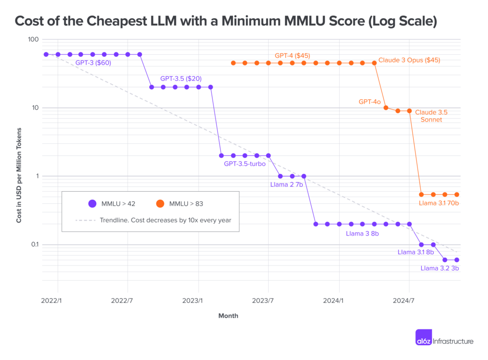
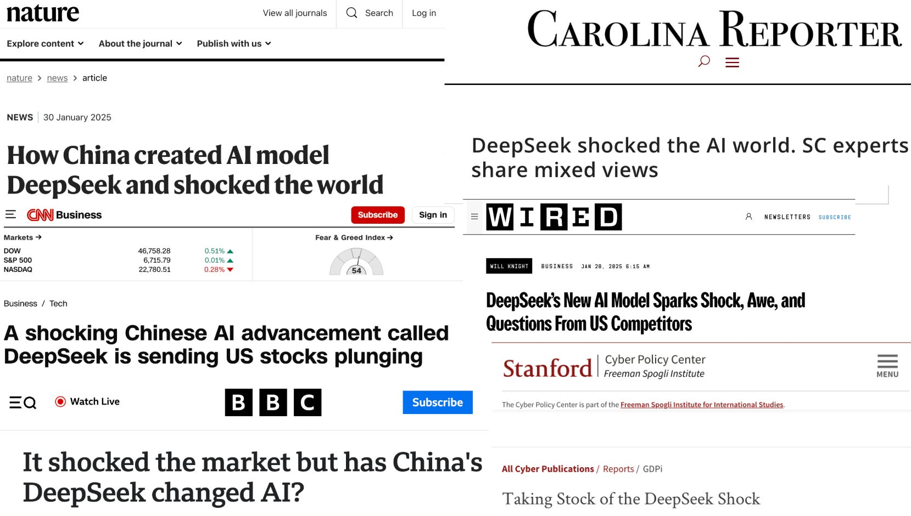
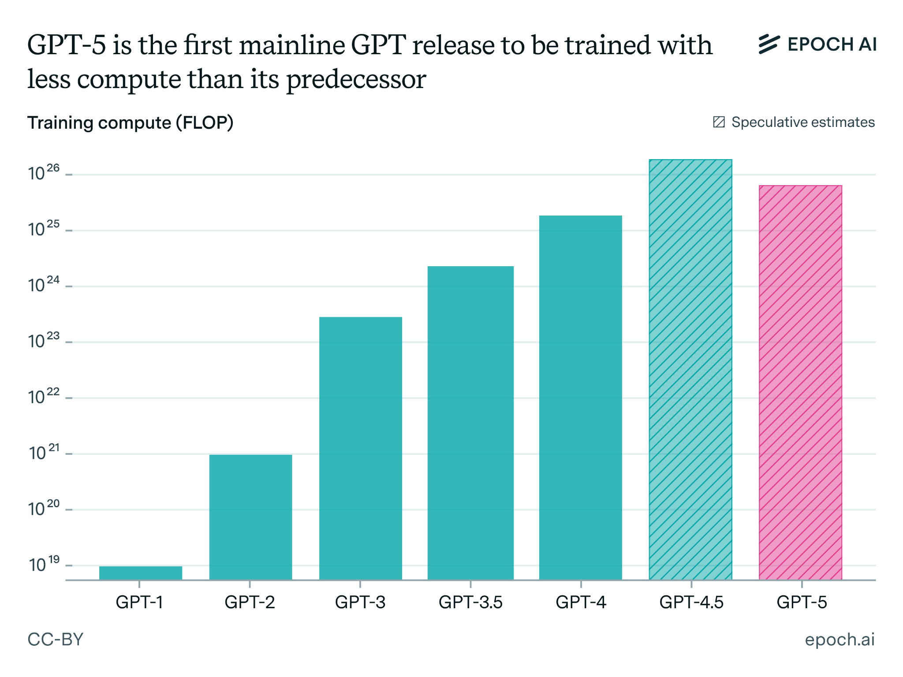
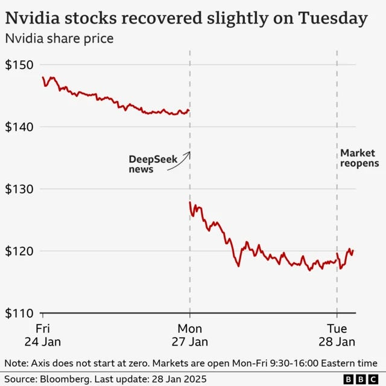
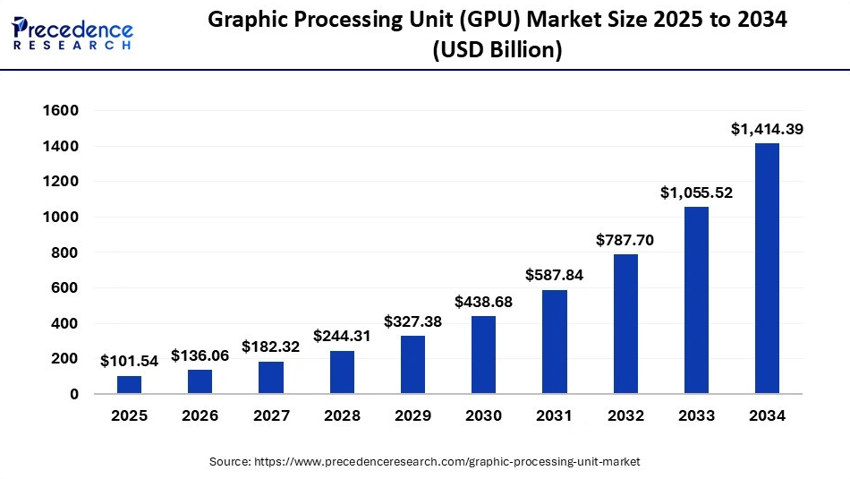
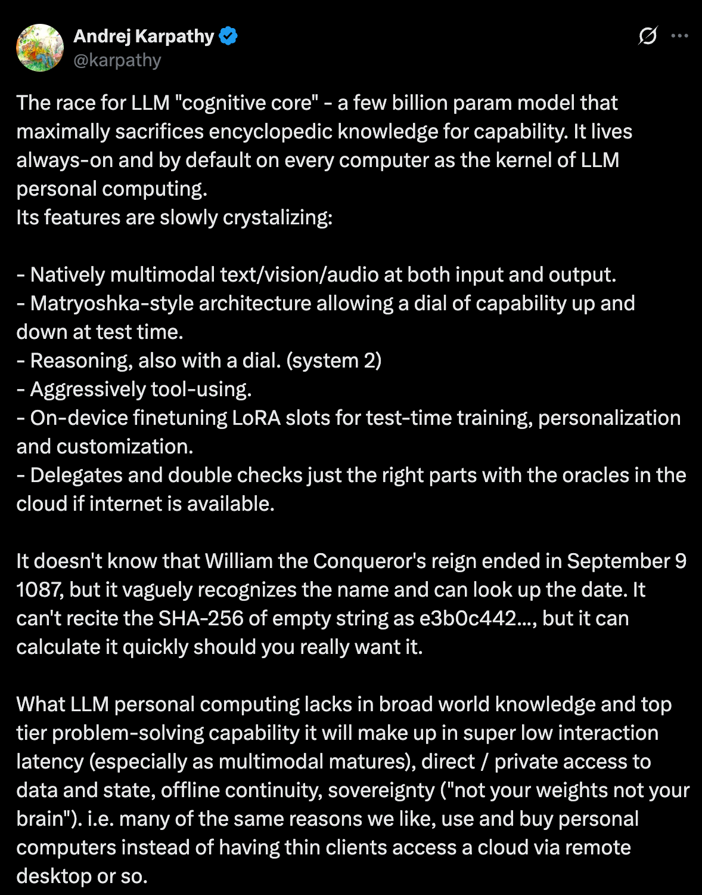
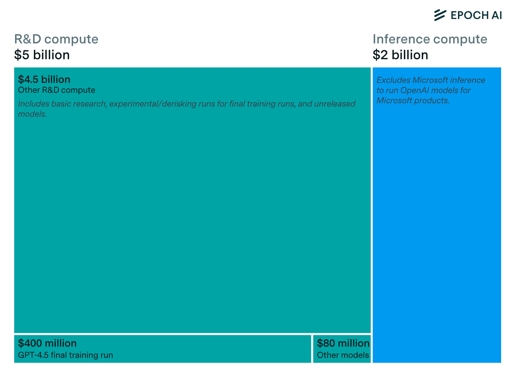
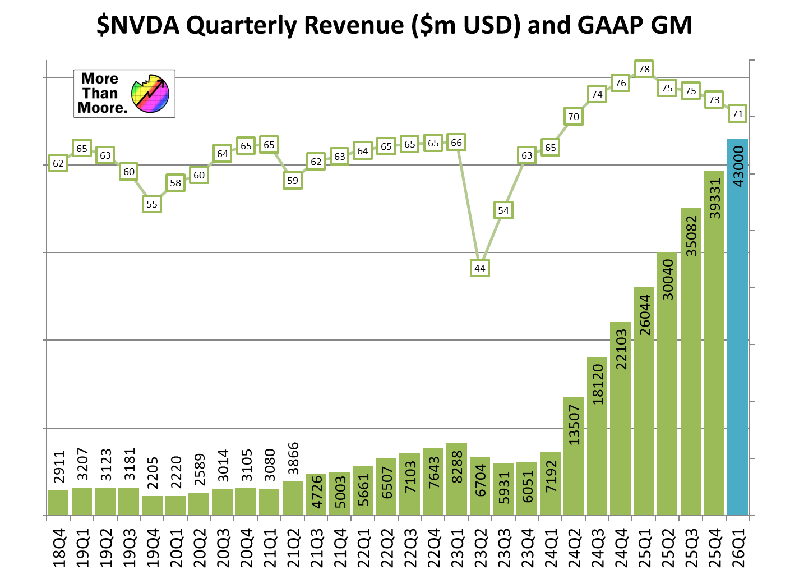
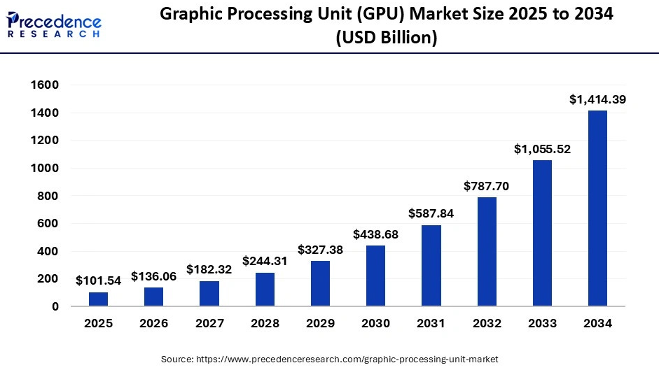

<!-- TODO(a11y): 18 localized body image(s) have empty alt text -->

_Originally published on [Andrew’s SubStack.](https://andrewtrask.substack.com/p/gpu-demand-is-1mx-distorted-by-efficiency)_

---

_GPU demand forecasts don’t distinguish waste from fundamental compute requirements._

Mid-2024, Andrej Karpathy [trained GPT-2 for $20.](https://github.com/karpathy/llm.c/discussions/481) Six months later, Andreessen Horowitz reported [LLM costs falling 10x annually](https://a16z.com/llmflation-llm-inference-cost/). Two months after that, DeepSeek shocked markets with [radical reductions in training and inference requirements](https://www.economist.com/business/2025/01/27/deepseek-sends-a-shockwave-through-markets).

<figure class="wp-block-image size-full has-custom-border is-style-wide-style">

</figure>

For AI researchers, this is all good news. For executives, policymakers, and investors forecasting GPU demand… less so. Many were caught off guard.

<figure class="wp-block-image size-large has-custom-border is-style-wide-style">

<figcaption class="wp-element-caption">This is a picture of many people being caught off guard</figcaption></figure>

The problem isn’t that executives/policymakers/investors lacked access to information per se… it’s that the technical/non-technical divide prevents them from seeing the difference between waste-based GPU demand and fundamental GPU demand.

Meanwhile, tech experts like Karpathy, a16z, and DeepSeek understand fundamental principles which are easy to overlook if you’re not implementing the algorithms yourself. But in presenting their results as merely “AI progress”, they buried the lede…

**The Lede:** If version X of an algorithm achieves the same result as version X-1 at 1/10th the compute cost, what exactly were we paying for in version X-1?

The answer has profound implications for anyone forecasting future GPU demand: **version X-1 was roughly 90% waste**. And a16z’s report, Karpathy’s achievement, and DeepSeek’s breakthrough indicate this isn’t a single 12-month event… it’s a multi-year pattern. Version X-1 was 90% waste. Version X-2 was 99% waste. Version X-3…

## Wait… Leading AI labs allow waste?

The obvious question: if this waste exists at such scale, wouldn’t the labs building these systems have eliminated it already?

They _are_ eliminating it. That’s what the 10x annual cost reduction represents. While [hardware cost reduction](https://epoch.ai/data-insights/price-performance-hardware#:~:text=Performance%20per%20dollar%20has%20improved,more%20powerful%20and%20expensive%20hardware.) accounts for some of the annual efficiency gain, software updates from AI labs constitute the vast majority… an ~86% efficiency gain annually. The puzzle isn’t whether labs are optimising… clearly they are. The puzzle is why so much waste existed to eliminate in the first place, and how much remains.

Consider the position of an AI lab in 2020-2023. You’re in a race for capability. You have access to substantial capital. GPUs are available, if expensive.

In this environment, the optimal strategy isn’t to minimise waste… it’s to achieve capability milestones before competitors. If you can spend $100M to train a model in 3 months versus $10M to train it in 8 months, you spend $100M. The $90M of waste can be economically rational to ignore.

It can be rational to ignore the $90M in waste because there are massive first-mover advantages in the AI race. Top AI talent wants to work at the AI lab which is training the top AI models… investors want to be seen to invest in the AI lab which building the most capable and popular AI products… early-adopting users look at leaderboards to decide which AI model is the most capable (i.e. in 1st place).

And the switching cost between AI models is so small that products (e.g. [OpenRouter](https://openrouter.ai/)) can make it happen nearly invisibly… which means falling into second place (from a capability perspective) potentially puts serious dollars on the line. Consequently, for many leading labs $90M in waste can be rational to ignore if it gets you to the top of the leaderboard faster.

This is how waste accumulates in AI systems. Not through incompetence, but through rational prioritisation under specific constraints. And to their credit, AI labs are _rapidly_ paying waste down (10x/yr) even under these circumstances… just not as aggressively as they’re racing for capability.

## But AI labs are becoming compute constrained… surely efficiency matters more than scale!

<figure class="wp-block-image size-large has-custom-border is-style-wide-style">

<figcaption class="wp-element-caption">This is a picture of labs self-describing as compute constrained</figcaption></figure>

It does… but in the “actions speak louder than words” way of filtering the world… compute constraints only recently started to _really_ matter. We’re finally seeing it show up in training compute costs. OpenAI’s GPT-5 uses less compute than GPT-4.5 despite offering more capability. This signals a fundamental shift in priorities: from ‘scale AI as fast as possible’ to ‘use compute as effectively as possible.’

It signals a change in priority to care about efficiency more than absolute scale.

It signals that OpenAI is hunting down waste and eliminating it.  
  
How far can they go?

<figure class="wp-block-image size-large has-custom-border">

</figure>

Yet the question isn’t just “how far can they go?” but also, “how fast can things change?” And this is where it gets interesting.

Because LLM waste lives in software (in training procedures, attention mechanisms, optimization schedules, etc.) an efficiency gain can hit markets without delay. Unlike a next generation GPU (which might take months to ultimately affect AI training… as cloud providers need to buy, install, and setup new GPUs), a software update can be installed the day after it’s invented. When those software updates are internal to a company, they mostly impact _that company’s bottom line_ (e.g. OpenAI’s)… but when they are published/released openly… they can decimate global GPU demand… ~instantly.

<figure class="wp-block-image size-full has-custom-border">

<figcaption class="wp-element-caption">This is a picture of global GPU demand being decimated ~instantly.</figcaption></figure>

This creates an unusual forecasting environment. Traditional infrastructure buildout assumes demand is relatively inelastic… if you need X compute today, you’ll need roughly X+growth\_rate compute tomorrow, growing predictably with usage.

<figure class="wp-block-image size-full has-custom-border is-style-wide-style">

<figcaption class="wp-element-caption">This is a picture of traditional forecasters forecasting traditional growth</figcaption></figure>

But if current consumption is 10x… 100x… 1,000,000x… 10,000,000,000x….? higher than necessary due to historical incentive structures, and those incentives are shifting, demand can collapse faster than infrastructure planning typically models. This creates opportunities for a far more choppy demand curve.

Consequently, GPU demand forecasters shouldn’t be assuming a smooth increase in GPU demand forever. They should be seriously calculating the risk of sudden shocks to the system, driven by sudden software updates to AI. That’s because the AI industry is keenly aware of how much money and electricity they’re using. And their fix to rising compute costs need not be gradual.

By analogy, if you discover your heating bill is high… and your house is still cold… the fix might initially be “buy a 2x bigger furnace every year”. But if you suddenly discover a different cause… that the heating system has been running with every window open. The fix is “close the windows”. And that happens discontinuously.

## The big question: how distorted is GPU demand?

This article won’t be exhaustive, but it will survey four sources of waste which compound to describe a ~1e6 distortion. As a starting reference, the class of transformer algorithms circa GPT-2/GPT-3 provides a nice-enough baseline for measurement because it represents a sortof… plateau of algorithmic waste. While the closed nature of labs obfuscates this somewhat… GPT 2/3 can be vaguely considered the last generations before labs leaned into more aggressive sparsity / caching optimisations. So let’s use this point as a baseline model and start walking forward… we’ll call it “GPT<4”.

Disclaimer for technical folks: If you’re in AI research, you probably already know everything this post has to say (but you might find analogies helpful for your own AI explanations). Far from being a formal literature review, this post is for a non-technical audience. It’s a survey of the long-term research aims of sparsity, caching, transfer learning, and generalization. It makes the case that these research areas are unfinished, opaque to the market, and not priced into GPU demand forecasts. Thus, this paper won’t cover every breakthrough, sufficiently recent papers, or technical depth. Plenty of other articles / papers serve that purpose. If you’re in fundamental AI research, this post is to help investors / policymakers / executives understand why your work is so important to the world.

### Problem #1: Dense Inference (i.e. unsolved sparsity problems)

Simply stated… GPT-3 considers its full memory of the internet every time it generates a token. This is very wasteful because most LLM prompts are highly context-specific.

Librarian Approach (Sparse Inference): To put this in context, imagine you ask a librarian “What are the rules of chess?”. A librarian would lookup “Games” in the Dewey Decimal system, walk to the “Games” bookshelf, scan titles looking for “Chess”, pick an intro chess book, scan the table of contents looking for “Rules”, insert a bookmark at that section, and hand you the book.

GPT-3’s Approach (Dense Inference): If GPT-3 were a librarian… and its weights were the “books” storing a compressed version of all human knowledge… and you asked it “What are the rules of chess?”… it would proceed to the first shelf… open the first book… read the first page… then the second…. third.. until it had read _every page of every book in the entire library_. And then GPT-3 would come back to you… and give you a single token! It would repeat this process until it finished generating your response.

This is insanely inefficient. And its this inefficiency that opened the door to DeepSeek.

DeepSeek was the first major step in sparsity after GPT-3… popularizing what’s called Mixture of Experts (MoE). At a high level, MoE is a simple idea. Instead of using the _entire neural network to generate EVERY TOKEN_… it divides the neural network into sections (perhaps 8-100), and for each token you pick a single section.

Yes… DeepSeek/MoE is progress… but to use the librarian analogy again… this is still like reading _every page of every book…. in a section._ Better! But there’s \*clearly\* an insane amount of efficiency still to be gained.

The market reaction to DeepSeek reveals how unexpected even partial sparsity was to infrastructure forecasters:

<figure class="wp-block-image size-full has-custom-border">

</figure>

So if DeepSeek divided the whole world’s proverbial library into 50 sections, how many books would be in each section? Well… the average US library contains 116,481 items, and there are about 130 million unique books in the world… so that’s perhaps some kind of bound… somewhere between 1,933 and 2.6M books per section. So in terms of AI sparsity… potential next steps follow naturally:

-   Mixture of Experts w/ Sub-experts: Sections → Books (1,933x – 2,600,000x efficiency)
-   Mixture of Experts w/ Sub-experts w/ Sub-experts : Books → Pages (100-300x)

I admit… these estimates are crude. On the one hand, must LLMs include all the world’s books? But on the other hand… don’t they include _vastly more information than is currently contained within books?_

But this is the hard part… how efficient/compressed AI can become is fundamentally a statement _about the world_… not about AI. If the world’s information is (in general) highly decoupled, then AI can become way more efficient (and vice versa). This is my vague intuition based on a vague notion of how big libraries are…. Sections → Books (additional (1,933x – 2,600,000x efficiency)…. Books → Pages (100-300x).

So in my opinion, there’s a plausible path to 4,000x – 39,000,000x additional reduction beyond DeepSeek’s 25-50x. This potential exists because human knowledge is genuinely partitioned…you don’t need “ancient greek” to answer questions about cutting avocados. Libraries provide intuitive evidence for this structure: the division of information into subjects reflects how knowledge actually organises, not just how we happen to store it.

So if DeepSeek divided the world’s proverbial library into 50 sections, how many books do you think can be in each section? (additional 100-10,000x) And how many pages do you think can be in each book? (100-300?). This intuitively drives my estimate. Let’s consider how much _you_ think AI can still become more efficient!

> **What % of all human knowledge do YOU THINK is required to answer “What are the rules of chess?”**
> 
> 1.  0.1%
> 2.  0.01%
> 3.  0.001%
> 4.  0.0001%
> 5.  <0.00001%
> 
> [View live poll on Substack →](https://andrewtrask.substack.com/p/gpu-demand-is-1mx-distorted-by-efficiency#:~:text=HOUR%20REMAINING%20%C2%B7-,SHOW%20RESULTS,-Now%20take%20however)

Now take however you answered this question… and assume DeepSeek has given us the first 25-50x cut of that efficiency… and you’re in the ballpark of how much efficiency you think is yet to be exploited through LLM sparsity beyond MoE.

### Problem #2: Reinventing Organization (overparameterization and catastrophic forgetting)

Simply stated… GPT-3 didn’t just learn from training data… it used training data to re-learn how to organize information (and this required a much larger model than necessary). This is very wasteful… let’s look at why.

When a librarian stocks a shelf, they already have a sense of semantics and capacity:

-   **Semantics:** How information in the world is organized (the Dewey Decimal system…. topics, subjects, clusters of knowledge)
-   **Capacity:** How many books they have on each topic (shelf-space needed by topic)

However, when an LLM is trained from scratch, it doesn’t begin that way. It must not only learn the information…it must re-learn how to _organize information_. It must rediscover semantics and capacity.

#### How to build a library when you can’t read (the GPT-3 way!):

Imagine building a new library when you can’t read. You construct the building, add empty shelves, then receive 30 trillion words worth of books… all in an alien language you don’t know. What do you do?

1.  Pick up a book, put it on a shelf
2.  Pick up a second book and ask: “Is this similar to the first?”
    -   Similar shapes/characters? … same shelf or nearby shelf
    -   Different?… Random other shelf
3.  Repeat 30 trillion times  
    (In LLM research this is called _[representation learning](https://en.wikipedia.org/wiki/Feature_learning)_.)

Eventually you find a book and think: “This relates to book X!” But the shelf with book X is already full. What do you do? If you’re like GPT-3, you’ll force the new book onto the shelf anyway, knocking other books onto the floor. Then throw those floor books back into the pile to be processed again. (In LLM research this is called _[catastrophic forgetting](https://en.wikipedia.org/wiki/Catastrophic_interference)_).

But eventually… you’ll reach these steady points where the shelves are almost full… and every book you push into the shelf is knocking off books (because the odds of picking a shelf that still has space has gotten too low). Consequently… you’re having a hard time finishing the project!

So what do you do?…. If you’re like GPT-3… you buy 10x more shelves than you need to store your books. You aren’t doing this because the library actually \*needs\* that much storage capacity… but because having all that extra space helps with the clustering exercise of figuring out which books are similar to which other books (in LLM research this is called [overparameterization](https://www.oxfordreference.com/display/10.1093/oi/authority.20110803100258143)). Overparameterization is one of the core reasons [why making LLM models bigger increases performance](https://www.sabrepc.com/blog/deep-learning-and-ai/overparameterization-in-ai-models). [Overparameterization decreases catastrophic forgetting](https://arxiv.org/abs/2502.10442).

#### How to build a library when you CAN read:

However, a normal librarian building a new library would first start by looking at all the books they want to store, counting the number needed for each section (and the general width of the books). Then they can buy the right number of shelves, label the shelves accordingly, and load in the books in a single pass.

#### Progress exists—but its hard to recognize:

AI research has made some progress on this problem, primarily in the form of techniques for [distillation](https://en.wikipedia.org/wiki/Knowledge_distillation), “[synthetic data](https://arxiv.org/html/2401.01629v1)”, [lottery tickets](https://en.wikipedia.org/wiki/Lottery_ticket_hypothesis), and [pruning](https://en.wikipedia.org/wiki/Pruning_\(artificial_neural_network\)). Distillation and synthetic data techniques enable a large AI model to learn how to organize information… and then create a training dataset with extra metadata/structure which signals that form of organization to a new model (which can then be vastly smaller.). The lottery ticket hypothesis implies that small neural networks exist within large language models which are… in effect… “complete-enough libraries”… and that the remainder can be pruned away.

Altogether, these areas have identified opportunities for something like 10-40x increase efficiency in AI training. However, it’s unclear how much efficiency gains remain during the training process because of an unsolved challenge… how much compute power is required to cluster all the world’s information (as opposed to simply store it). The library analogy is a good one… what’s the difference between simply moving books into the correct shelf… relative to the process of randomly putting books into shelves over and over until they seem to cluster. Or put another way… how difficult is it to rediscover the dewey decimal system when books are written in a language one cannot read?

My guess… it’s quite a lot.. but I wouldn’t hedge a guess. (Note: K-means clustering is NP-hard). Relatedly, how efficient it is to cluster is an empirical question about how naturally structured the data is.

And one final point… remember that Dense LLMs (e.g. GPT-3) forward propagate through all their parameters. This means that… every time we consider where to put the book in the library… we \*read all the books already in the library\*. That is to say, this problem is **multiplicative** with the previous two problems. If rediscovering the Dewey Decimal System adds 1000x overhead… that’s on top of the 4,000x – 39,000,000x waste of Problem 1 (but of course we don’t know for sure).

> **How much longer would it take you to organize a library into meaningful sections/shelves if you couldn’t read?**
> 
> 1.  1x
> 2.  10x
> 3.  100x
> 4.  1000x
> 5.  10,000x

[View live poll on Substack →](https://andrewtrask.substack.com/p/gpu-demand-is-1mx-distorted-by-efficiency#:~:text=VOTES%20%C2%B7%20%C2%B7%20SHOW-,RESULTS,-Problem%20%233%3A%20Retraining)

### Problem #3: Retraining

Above-and-beyond problem #2, consider what is perhaps the most wasteful aspect of LLM compute spend: retraining. When we want to extend our best AI model with new capabilities… we re-train it from scratch.

By analogy, if we wanted to add a shelf to a library… instead of adding a room to the building… we burn down the whole building… order new bricks… order new books… and begin the process of re-discovering the dewey decimal system all over again.

Naturally, this is quite wasteful. If LLMs were **extensible**… if they could have intelligence dynamically added… re-training costs would no longer be necessary.

There are several lines of research on making LLMs more extensible:

-   **Retrieval:** systems like RAG and tool use are fundamentally about storing knowledge outside of the neural network, enabling their knowledge to be extended without re-training.
-   **Merging:** systems like [git-rebasin](https://arxiv.org/abs/2209.04836) demonstrate how multiple dense models can be losslessly (and quite efficiently!) merged at runtime.
-   **Cognitive Core:** the idea that a neural network should instead focus on information that doesn’t change (e.g. logic, reasoning, grammar, syntax, etc.) and that we’d use RAG/tools to augment that core intelligence engine on the fly.

<figure class="wp-block-image size-large">

<figcaption class="wp-element-caption"><a href="https://x.com/karpathy/status/1938626382248149433" target="_blank" rel="noreferrer noopener">https://x.com/karpathy/status/1938626382248149433</a></figcaption></figure>

If we do finally train a cognitive core… and tool use becomes good enough to augment that core with facts about the world… the need to retrain LLMs at all could fade dramatically. But just like several previous problems, the potential for a cognitive core isn’t a statement about AI or LLMs… it’s a statement about the world.

How often does the meaning of words change? How often does the core essence of logic, reasoning, grammar, or syntax change? In truth… it does change.. but not very quickly. And it just so happens that \*this\* is the part of an AI’s intelligence that is/should be used _all the time_. This is the part that every AI inference likely needs.

But the rest of its intelligence… semantic information about the world… the huge memorised, encyclopaedic list of facts about everything… should only be used when that particular information is relevant.

How much would this save?

<figure class="wp-block-image size-large has-custom-border is-style-wide-style">

</figure>

If we re-trained the cognitive core once per year… (and if that cognitive core was VASTLY smaller because it didn’t try to store all of human knowledge… just logic and reasoning), the pre-training needs would mostly disappear. If OpenAI is a good measure, this would constitute about 70% of global GPU spend.

Note that this overwhelms Problem #2… which was merely a significant increase in training efficiency. If this cognitive core is indeed established, training costs become largely irrelevant (except when vocabulary, logic, grammar, syntax, etc. change enough to justify re-training a new cognitive core). Because it’s not just that OpenAI could create their own cognitive core… it’s that the industry could create it’s own (likely open source) cognitive core… and it wouldn’t be worth others retraining for… years?

> **How fast does logic/reasoning/grammar/syntax change?**
> 
> 1.  1 year
> 2.  10 years
> 3.  100 years
> 4.  1000 years
> 5.  … basically never …
> 
> [View live poll on Substack →](https://andrewtrask.substack.com/p/gpu-demand-is-1mx-distorted-by-efficiency#:~:text=VOTES%20%C2%B7%20%C2%B7%20SHOW-,RESULTS,-POLL)

> **By reading someone’s writing, how accurately do you think you can guess their age?**
> 
> 1.  Within 1 year?
> 2.  Within 5 years?
> 3.  Within 10 years?
> 4.  Within 20 years?
> 5.  Within 40 years?
> 
> [View live poll on Substack →](https://andrewtrask.substack.com/p/gpu-demand-is-1mx-distorted-by-efficiency#:~:text=3%20VOTES%20%C2%B7%20%C2%B7-,SHOW%20RESULTS,-Some%20combination%20of)

Some combination of these two intuitions seems like it implies how fast you believe a cognitive core would need to be retrained. But of course… it’s an active research question.

## The Answer: how distorted is GPU demand?

Naturally, we can’t know exactly, but consider how GPT-3 would run a library.

#### Before the library opens (Training):

Install 10-40x more shelves than you’ll ultimately need—you don’t know which books cluster together until you’ve tried all arrangements, and the extra space prevents books from constantly knocking each other off overcrowded shelves.

Fill every shelf with books containing random letters _(sidenote: I didn’t cover this nuance before…but neural networks don’t start empty they start with a bunch of random data in them… literal random numbers)_. Then, for each real book:

-   Read every random book in the entire library
-   Decide which random book to replace
-   Throw that book on the floor
-   If it was a real book (not random), throw it back in the pile to process again

Repeat trillions of times until real books replace random ones and cluster appropriately.

#### When the library opens (Inference):

Someone asks: “What are the rules of chess?”

The librarian:

1.  Walks to the first shelf
2.  Reads every page of every book in the entire library (including books on French poetry, Ottoman history, organic chemistry)
3.  Returns with one word: “The”
4.  Reads every book in the entire library again (plus the word “The”)
5.  Returns with the next word: “rules”
6.  Reads every book in the entire library again (plus the words “The rules”)
7.  Returns: “of”
8.  Continues reading the entire library (plus previously generated words) for every word of the response

If the question references an uploaded 500-page document, the librarian also re-reads all 500 pages for every word they speak. For a 100-word answer: 500 pages × 100 words = 50,000 redundant page-reads.

#### When the library needs updates (Retraining):

New medical research arrives requiring updates to the medical section.

The librarian:

1.  Tears down the entire library building
2.  Burns all books
3.  Orders new bricks, paper, and ink
4.  Rebuilds everything from scratch
5.  Repeats the entire process above

Then laments insufficient bricks, paper, and ink.

<figure class="wp-block-image size-large has-custom-border is-style-wide-style">

<figcaption class="wp-element-caption">This is a picture of leading AI labs lamenting insufficient bricks, paper, and ink</figcaption></figure>

#### The Alternative:

A normal library would:

1.  Count books to buy the right number of shelves (avoid 10x overbuilding)
2.  Organize using Dewey Decimal (inherit pre-existing structure)
3.  Stock shelves in a single pass (no random books, no floor-throwing)
4.  When answering about chess: walk to games section, pull one book, read relevant pages _once…_ then use the librarian’s mental “cognitive core” to synthesise facts
5.  When someone uploads a document: read it _once_, answer all questions from that reading
6.  When updates arrive: add new books, remove outdated ones, update the catalog

#### Some Napkin Math of AI Research Opportunity:

-   **Sparsity:** something like 4,000x – 39,000,000x reduction in training/inference spend
-   **Overparameterization:** something like 10-40x reduction in model size…thus training and inference spend… by eliminating redundant copies and empty space
-   **Cognitive Core / Merging:** perhaps a more-or-less elimination of training altogether, shifting compute burden almost exclusively to inference. This is worth a ~100% reduction in training, but if OpenAI is a good indicator, training is only 5/7ths of compute spend at leading labs.
-   **Final Estimate:**
    -   **Min Est:** 1 / ((2/7) \* (1/4,000) \* (1/10)) = 140,000
    -   **Max Est:** 1 / ((2/7) \* (1/39000000) \* (1/40)) = 5,460,000,000

**The Consequence: A** 1e5-e7 reduction computational overhead for AI seems very plausible… and a plethora of related consequences in markets, politics, and society.

<figure class="wp-block-image size-large has-custom-border">

</figure>

<figure class="wp-block-image size-large has-custom-border">

</figure>

<figure class="wp-block-image size-large has-custom-border">

</figure>

<figure class="wp-block-image size-large">

</figure>

And current expectations are for GPU demand to grow exponentially

<figure class="wp-block-image size-full has-custom-border">

</figure>

But keep in mind… all of this can change as fast as a software update.

<figure class="wp-block-image size-full has-custom-border">

</figure>

DeepSeek’s market shock came from just 25-50x efficiency gains. The remaining 100,000x – 1,000,000,000x could disappear in one or more software updates at any time… and it appears we’ve rounded a corner…  
  
At least one US AI lab is focusing on _exactly that kind of software update…_

<figure class="wp-block-image size-large has-custom-border">

</figure>

And of course this post from last Friday…

<figure class="wp-block-image size-large has-custom-border">

<figcaption class="wp-element-caption"><a href="https://www.scmp.com/business/article/3329450/alibaba-cloud-claims-slash-nvidia-gpu-use-82-new-pooling-system" target="_blank" rel="noreferrer noopener">https://www.scmp.com/business/article/3329450/alibaba-cloud-claims-slash-nvidia-gpu-use-82-new-pooling-system</a></figcaption></figure>

For me… a few conclusions I take away from this data:

-   **The biggest AI breakthroughs are still to come:** from a scaling laws or societal impact perspective, a ~1Mx drop in compute costs would have far reaching consequences… likely bigger than the switch from LSTMs to Transformers. AI researchers have big stuff cooking.
-   **We’ve rounded a corner:** GPT-5 using less compute is a canary in the coal mine for GPU demand. Perhaps efficiency is becoming more important than raw scale.
-   **Fundamental AI Research > Building Datacenters:** For both nations and corporations, $10 billion spent on fundamental AI research might be a better investment than the same on data centers or electrical grid expansion. The former could solve the problem for everyone… the latter would barely make a dent.
-   **The AI Bubble Could be a Compute Bubble:** It’s not clear when the AI bubble will pop… but I think one thing is clear. There’s an insane amount of compute overhang, and it could come to an end as fast as a single software release. Sounds like a pop to me.
-   **Analog computing is a paradigm killer:** GPUs reward a lack of sparsity… but an entirely different computing paradigm/platform… analog computing… seems poised to undermine the GPU-powered house of cards with a combination of insane model sparsity + insane parallelism (more on this [here](https://x.com/iamtrask/status/1966336875766956495)).
-   **In the end… today’s AI capability will be** _**insanely cheap**_**:** Even at the current rate of efficiency gains, AI is getting cheaper 10x per year. What costs $1,000,000 today will cost $1 in 6 years.
-   **Scaling Laws Have Huge Headroom:** another way of viewing efficiency gains is as an increase in scaling laws… a 10x increase in efficiency means a 10x increase in compute productivity. This is a boon for AI capability.
-   **Huge change could happen overnight:** While 10x/year seems fast… the bigger efficiency breakthroughs could hit Github at any time. Keep your eyes open.
-   **Become an AI researcher:** Yes, most of the AI labs have leaned into scaling product development organisations… but now’s an incredibly exciting time to be in AI research… especially if you don’t have a lot of compute (and can figure out how to make it work anyways).

Thanks for reading Andrew’s Substack! Subscribe for free to receive new posts and support my work.

## Doubts and Hedges

-   **It’s a wide range:** yes, mostly because its a statement about the world for a topic we have limited ability to model (i.e. how much can you compress the world’s information).
-   **It’s based on intuition:** true, but again the long-term success of optimizations in AI research isn’t a math problem, it’s an empirical one. In my opinion, the size and sparsity of libraries is a reasonable place to get an order-of-magnitude level estimate… but not an accurate one.
-   **What about X paper:** indeed, lots of research is coming out all the time.
-   **GPT-3 already had Y optimization:** it’s closed source, so I’m working with what we think we know (e.g. GPT-3 leveraged KV caching but no MoE, etc.)

## Epilogue: How did we get here?

This is a strange place to be in, but IMO a confluence of factors contributed:

-   **The Natural Arc of Information Technology:** most technologies are built before they’re built well… made to work before they’re made efficient. This is normal.
-   **Irrational Zeal for Generalization:** A(G)I researchers pursued generalization at all costs… partially out of an overly anthropomorphic heuristic. But many forgot that most of the world’s information is unrelated to most of the world’s information. How to cook a chicken is unrelated to the number of rocks on the moon which is unrelated to… you get my point. AI researchers forgot this and just started connecting every neuron to every other neuron (known as ‘end-to-end training’). This was a mistake, and a new crop of researchers are unwinding it.
-   **Initially, GPUs were repurposed for AI… but then AI became repurposed for GPUs:** In 2013… GPUs were for gaming. And the AI community discovered a vast amount of R&D they didn’t have to pay for to get vastly faster compute power. But once that train got rolling… AI researchers then innovated in the reverse direction… making AI algorithms _worse_ (from a sample complexity perspective) because GPUs were available (here’s [a talk I gave on this at Cohere](https://www.youtube.com/watch?v=am7bJc5xC8s)). We’ve given up significant ground on ML efficiency but gaining capability because that lost efficiency made them more amenable to this huge compute resource. But AI is now legitimate enough to demand it’s own chips, and GPUs themselves are getting better at supporting sparsity… incentives are reversing and we’ve got a long way to fall.

These historical factors explain why the waste accumulated. But they don’t justify assuming it will persist. The technical/non-technical wall that obscured this waste from GPU demand forecasters is crumbling—and the 1 million X distortion is coming into focus.

<iframe src="https://andrewtrask.substack.com/embed" width="100%" height="320" style="border:1px solid #EEE; background:white;" frameborder="0" scrolling="no"></iframe>

## P.S.

When we get full sparsity (solve Problem #1), AI models will likley reveal which datasources they’re using for which predictions… [and that will have far-reaching consequences](https://ifp.org/unlocking-a-million-times-more-data-for-ai/)

**TLDR for this post:** Sparsity and “cognitive core” in AI models will change the world… demand for GPU chips in particular. And it could happen as fast as an open source software update.

## Acknowledgements

Thank you to Seb Krier, Jimmy Whitaker, and Kris Cao for early reads and feedback.
