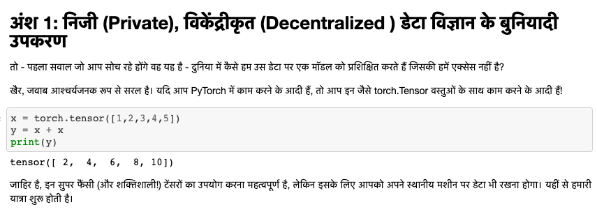

<!-- TODO(a11y): 1 localized body image(s) have empty alt text -->

<figure class="">

</figure>

नमस्ते everyone! Our efforts towards wider community outreach have reached another endpoint as the [hindi translations for PySyft tutorials are up](https://github.com/OpenMined/PySyft/tree/master/examples/tutorials/translations/hindi) under the [PySyft](https://github.com/OpenMined/PySyft) repo! As our community continues to grow, we would like to thank each and every one of you for your contributions. Do watch out this space for interesting blog posts coming up! We would love to hear from you or get your feedback, and if you wish to contribute towards translations or write for us, please fill out this form [here](https://docs.google.com/forms/d/e/1FAIpQLSdWSdhmXjLypvenrajYlaFDzipNZFhK9K-MtvXw8MeXqj6a5g/viewform)!  
Hindi translations contributed by [Yugandhar Tripathi](https://github.com/Yugandhartripathi), [Arkadip Bhattacharya](https://github.com/darkmatter18), [Urvashi Raheja B](https://github.com/raheja) and [Kaustubh Patil](https://github.com/kaustubh-seachange). You can also find the original list of English tutorials [here](https://github.com/OpenMined/PySyft/tree/master/examples/tutorials).

### Here is the full list of all tutorials in Hindi

-   [Part 01 – The Basic Tools of Private Deep Learning](https://github.com/OpenMined/PySyft/blob/master/examples/tutorials/translations/hindi/Part%2001%20-%20The%20Basic%20Tools%20of%20Private%20Deep%20Learning.ipynb)
-   [Part 02 – Intro to Federated Learning](https://github.com/OpenMined/PySyft/blob/master/examples/tutorials/translations/hindi/Part%2002%20-%20Intro%20to%20Federated%20Learning.ipynb)
-   [Part 03 – Advanced Remote Execution Tools](https://github.com/OpenMined/PySyft/blob/master/examples/tutorials/translations/hindi/Part%2003%20-%20Advanced%20Remote%20Execution%20Tools.ipynb)
-   [Part 04 – Federated Learning via Trusted Aggregator](https://github.com/OpenMined/PySyft/blob/master/examples/tutorials/translations/hindi/Part%2004%20-%20Federated%20Learning%20via%20Trusted%20Aggregator.ipynb)
-   [Part 05 – Welcome to the Sandbox](https://github.com/OpenMined/PySyft/blob/master/examples/tutorials/translations/hindi/Part%2005%20-%20Welcome%20to%20the%20Sandbox.ipynb)
-   [Part 06 – Federated Learning on MNIST using a CNN](https://github.com/OpenMined/PySyft/blob/master/examples/tutorials/translations/hindi/Part%2006%20-%20Federated%20Learning%20on%20MNIST%20using%20a%20CNN.ipynb)
-   [Part 07 – Federated Learning with Federated Dataset](https://github.com/OpenMined/PySyft/blob/master/examples/tutorials/translations/hindi/Part%2007%20-%20Federated%20Learning%20with%20Federated%20Dataset.ipynb)
-   [Part 08 – Introduction to Plans](https://github.com/OpenMined/PySyft/blob/master/examples/tutorials/translations/hindi/Part%2008%20-%20Introduction%20to%20Plans.ipynb)
-   [Part 08 bis – Introduction to Protocols](https://github.com/OpenMined/PySyft/blob/master/examples/tutorials/translations/hindi/Part%2008%20bis%20-%20Introduction%20to%20Protocols.ipynb)
-   [Part 09 – Intro to Encrypted Programs](https://github.com/OpenMined/PySyft/blob/master/examples/tutorials/translations/hindi/Part%2009%20-%20Intro%20to%20Encrypted%20Programs.ipynb)
-   [Part 10 – Federated Learning with Secure Aggregation](https://github.com/OpenMined/PySyft/blob/master/examples/tutorials/translations/hindi/Part%2010%20-%20Federated%20Learning%20with%20Secure%20Aggregation.ipynb)
-   [Part 11 – Secure Deep Learning Classification](https://github.com/OpenMined/PySyft/blob/master/examples/tutorials/translations/hindi/Part%2011%20-%20Secure%20Deep%20Learning%20Classification.ipynb)
-   [Part 12 – Train an Encrypted Neural Network on Encrypted Data](https://github.com/OpenMined/PySyft/blob/master/examples/tutorials/translations/hindi/Part%2012%20-%20Train%20an%20Encrypted%20Neural%20Network%20on%20Encrypted%20Data.ipynb)
-   [Part 13a – Secure Classification with Syft Keras and TFE – Public Training](https://github.com/OpenMined/PySyft/blob/master/examples/tutorials/translations/hindi/Part%2013a%20-%20Secure%20Classification%20with%20Syft%20Keras%20and%20TFE%20-%20Public%20Training.ipynb)
-   [Part 13b – Secure Classification with Syft Keras and TFE – Secure Model Serving](https://github.com/OpenMined/PySyft/blob/master/examples/tutorials/translations/hindi/Part%2013b%20-%20Secure%20Classification%20with%20Syft%20Keras%20and%20TFE%20-%20Secure%20Model%20Serving.ipynb)
-   [Part 13c – Secure Classification with Syft Keras and TFE – Private Prediction Client](https://github.com/OpenMined/PySyft/blob/master/examples/tutorials/translations/hindi/Part%2013c%20-%20Secure%20Classification%20with%20Syft%20Keras%20and%20TFE%20-%20Private%20Prediction%20Client.ipynb)

---

सभी को नमस्कार! व्यापक समुदाय के आउटरीच के प्रति हमारे प्रयास एक और बिंदु पर पहुंच गए हैं क्योंकि PySyft ट्यूटोरियल्स के लिए [हिंदी](https://github.com/OpenMined/PySyft/tree/master/examples/tutorials/translations/hindi) अनुवाद [PySyft](https://github.com/OpenMined/PySyft) के अंतर्गत हैं! जैसे-जैसे हमारा समुदाय बढ़ता जा रहा है, हम आपके हर एक योगदान के लिए धन्यवाद देना चाहेंगे। दिलचस्प ब्लॉग पोस्ट के लिए इस स्थान को देखें! हम आपसे सुनना या आपकी प्रतिक्रिया प्राप्त करना पसंद करेंगे, और यदि आप अनुवादों के लिए योगदान करना चाहते हैं या हमारे लिए लिखना चाहते हैं, तो कृपया इस [फ़ॉर्म](https://docs.google.com/forms/d/e/1FAIpQLSdWSdhmXjLypvenrajYlaFDzipNZFhK9K-MtvXw8MeXqj6a5g/viewform) को यहाँ भरें!  
हिंदी अनुवादों में [युगधर त्रिपाठी](https://github.com/Yugandhartripathi), [अर्कदीप भट्टाचार्य](https://github.com/darkmatter18), [उर्वशी रहेजा बी](https://github.com/raheja) और [कौस्तुभ पाटिल](https://github.com/kaustubh-seachange) का योगदान है। आप यहां [अंग्रेज़ी](https://github.com/OpenMined/PySyft/tree/master/examples/tutorials) ट्यूटोरियल की मूल सूची भी देख सकते हैं।

### यहाँ सभी हिंदी ट्यूटोरियल की पूरी सूची दी गई है

-   [Part 01 – The Basic Tools of Private Deep Learning](https://github.com/OpenMined/PySyft/blob/master/examples/tutorials/translations/hindi/Part%2001%20-%20The%20Basic%20Tools%20of%20Private%20Deep%20Learning.ipynb)
-   [Part 02 – Intro to Federated Learning](https://github.com/OpenMined/PySyft/blob/master/examples/tutorials/translations/hindi/Part%2002%20-%20Intro%20to%20Federated%20Learning.ipynb)
-   [Part 03 – Advanced Remote Execution Tools](https://github.com/OpenMined/PySyft/blob/master/examples/tutorials/translations/hindi/Part%2003%20-%20Advanced%20Remote%20Execution%20Tools.ipynb)
-   [Part 04 – Federated Learning via Trusted Aggregator](https://github.com/OpenMined/PySyft/blob/master/examples/tutorials/translations/hindi/Part%2004%20-%20Federated%20Learning%20via%20Trusted%20Aggregator.ipynb)
-   [Part 05 – Welcome to the Sandbox](https://github.com/OpenMined/PySyft/blob/master/examples/tutorials/translations/hindi/Part%2005%20-%20Welcome%20to%20the%20Sandbox.ipynb)
-   [Part 06 – Federated Learning on MNIST using a CNN](https://github.com/OpenMined/PySyft/blob/master/examples/tutorials/translations/hindi/Part%2006%20-%20Federated%20Learning%20on%20MNIST%20using%20a%20CNN.ipynb)
-   [Part 07 – Federated Learning with Federated Dataset](https://github.com/OpenMined/PySyft/blob/master/examples/tutorials/translations/hindi/Part%2007%20-%20Federated%20Learning%20with%20Federated%20Dataset.ipynb)
-   [Part 08 – Introduction to Plans](https://github.com/OpenMined/PySyft/blob/master/examples/tutorials/translations/hindi/Part%2008%20-%20Introduction%20to%20Plans.ipynb)
-   [Part 08 bis – Introduction to Protocols](https://github.com/OpenMined/PySyft/blob/master/examples/tutorials/translations/hindi/Part%2008%20bis%20-%20Introduction%20to%20Protocols.ipynb)
-   [Part 09 – Intro to Encrypted Programs](https://github.com/OpenMined/PySyft/blob/master/examples/tutorials/translations/hindi/Part%2009%20-%20Intro%20to%20Encrypted%20Programs.ipynb)
-   [Part 10 – Federated Learning with Secure Aggregation](https://github.com/OpenMined/PySyft/blob/master/examples/tutorials/translations/hindi/Part%2010%20-%20Federated%20Learning%20with%20Secure%20Aggregation.ipynb)
-   [Part 11 – Secure Deep Learning Classification](https://github.com/OpenMined/PySyft/blob/master/examples/tutorials/translations/hindi/Part%2011%20-%20Secure%20Deep%20Learning%20Classification.ipynb)
-   [Part 12 – Train an Encrypted Neural Network on Encrypted Data](https://github.com/OpenMined/PySyft/blob/master/examples/tutorials/translations/hindi/Part%2012%20-%20Train%20an%20Encrypted%20Neural%20Network%20on%20Encrypted%20Data.ipynb)
-   [Part 13a – Secure Classification with Syft Keras and TFE – Public Training](https://github.com/OpenMined/PySyft/blob/master/examples/tutorials/translations/hindi/Part%2013a%20-%20Secure%20Classification%20with%20Syft%20Keras%20and%20TFE%20-%20Public%20Training.ipynb)
-   [Part 13b – Secure Classification with Syft Keras and TFE – Secure Model Serving](https://github.com/OpenMined/PySyft/blob/master/examples/tutorials/translations/hindi/Part%2013b%20-%20Secure%20Classification%20with%20Syft%20Keras%20and%20TFE%20-%20Secure%20Model%20Serving.ipynb)
-   [Part 13c – Secure Classification with Syft Keras and TFE – Private Prediction Client](https://github.com/OpenMined/PySyft/blob/master/examples/tutorials/translations/hindi/Part%2013c%20-%20Secure%20Classification%20with%20Syft%20Keras%20and%20TFE%20-%20Private%20Prediction%20Client.ipynb)
