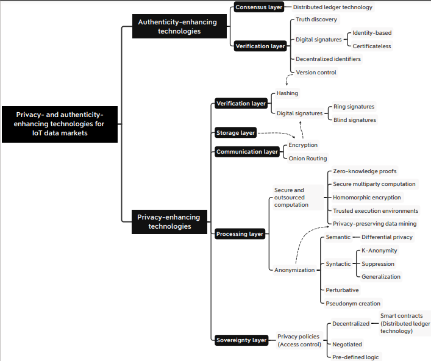
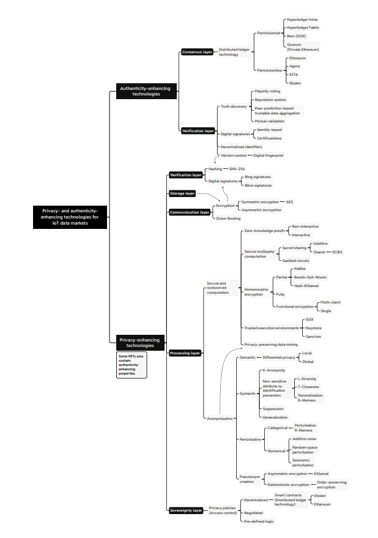
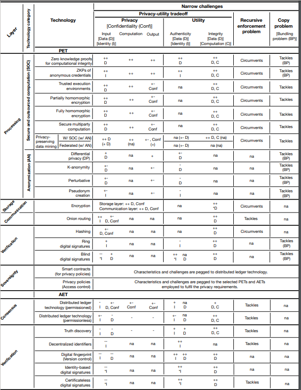

<!-- TODO(a11y): 3 localized body image(s) have empty alt text -->

With so many options for privacy enhancing technologies (PETs), it is hard to choose which is correct for your project.  Questions abound about which technologies protect which parts of the process and what would still be vulnerable under a certain option.  A group from Germany [(Garrido et al., 2022)](https://arxiv.org/abs/2107.11905) has taken on this challenge and performed a systematic literature review of PETs in the context of data markets for the IoT.  In doing so, they classified various PETs and technologies often confused with PETs.  In this article, I would like to summarize their classification system for quick reference.

<figure class="">

</figure>

The first breakdown made is differentiating PETs from authenticity-enhancing technologies (AETs).  AETs are concerned with authenticity and can include technologies such as version control and distributed ledger technologies.  There are instances of overlap between the two groups of technologies but it is important to stress that not all AETs are PETs.

The next classification is based on the layer where the PET is active.  The layers include storage, processing, communication, verification, sovereignty, and consensus.

<figure class="">

</figure>

### _Processing_

PETs contained in the processing layer enhance privacy of data inputs, outputs, computations or a combination of the above. These options also aim to keep utility high.

**Processing Part 1: Secure and outsourced computation**

This group of technologies work within the processing layer to enhance privacy through confidentiality by enhancing or assuring data and computation integrity.  These technologies are very useful, but alone are insufficient to protect against reverse engineering and re-identification attacks.  Options within this category tend to rely on cryptography and trusted hardware.

_Zero Knowledge Proofs (ZKP)_

Zero-knowledge proofs allow one party to verify the data and computation conducted by another party without revealing the actual data or computation.  A ZKP satisfies three properties: 1. Completeness: if a statement is true, an honest verifier will be convinced by an honest prover. 2. Soundness: if a statement is false, an honest verifier will not be able to be convinced of its truth by a dishonest prover.  3.  Zero-knowledge-ness: if the statement is true, the verifier still does not know any more than the statement despite the prover knowing the secret.

The downsides to ZPKs are that there can be computational overhead and complexity for the prover.  Additionally, many software engineers are not as knowledgeable in cryptography as would be convenient to adopt this technology, however, libraries are developing to aid in this.

The ability of non-interactive ZKPs to convince multiple parties with a single message makes it quite useful for blockchains while anonymous credentials make them useful for identity management for the end users of digital wallets.  Another upcoming use case is to ensure that a machine learning model was trained correctly on specific data.

_Secure Multiparty Computation (MPCs)_

MPCs allow computation of functions without exposing data to other parties and also protects inputs from brute force attacks.  This cryptographic option specifically protects all parties’ privacy from each other.

MPCs are sensitive to network latency and have high processing and communication costs.  The largest drawback is that there are no guards against false inputs, however pairing MPCs with zero-knowledge proofs can mitigate the issue.

One use of this technology is for managing keys for cryptographic systems because if some shares of a private key are lost, the key can still be reconstructed.  This uses a specific subtype of MPC, however.

_Homomorphic Encryption (HE)_

Homomorphic encryption is a process that allows computations to be performed on encrypted data known as ciphertext.  The outputs can be decrypted so long as the party has the secret key.

The major drawbacks to HE are large storage requirements for encrypted data and high computational complexity. This is especially problematic in IoT devices that often have very limited hardware resources.  One way to mitigate this is to use partially homomorphic encryption instead of fully homomorphic encryption.  PHE is still more resource intensive than many other PETs, but may be more possible than FHE in some circumstances.

Use cases include performing light computation on non-local data.  If the data is owned by multiple parties, secure multiparty computation would be a preferred option, but some choose to combine the two methods.

_Trusted Execution Environments (TEE)_

A trusted execution environment is a specialized, secure area of a processor.  Confidentiality and integrity are both protected within this environment.  Neither data nor code can be altered, modified, or replaced by unauthorized parties.  Even the legitimate owner of the computer could classify as an unauthorized entity in some digital rights management (DRM) schemes.  Unique encryption keys certify the results of the computation within the environment.  The only way to hack this system is to manipulate the hardware in a way that forces the hardware to provide false certifications.

The trusted third party in TEEs constitutes a single point of failure.  Intel’s SGX was deprecated, which impacted many research and product designs.  Additionally, TEEs often have a very limited amount of memory at any one time.  Even though TEEs promise to have a secured enclave to secure data, there are still vulnerability flaws.  For example, in August 2022, there was a discussion of [seven severe vulnerabilities](https://arstechnica.com/information-technology/2022/08/architectural-bug-in-some-intel-cpus-is-more-bad-news-for-sgx-users/) found in Intel SGX.

One possible use case is confidential training of machine learning models.  Another is for block chain architectures that perform “Proof of Useful Work”, which is not like computing hashes for Bitcoin.

_Privacy-preserving data mining (PPDM)_

Privacy-preserving data mining is a collection of many techniques that aims to extract useful information when data mining but still enhancing privacy.  Privacy can be improved by doing computations where the data lives or by using cryptography or data perturbation to protect the data.

Options that involve the technique that trains the data where it lives include technologies such as federated learning, split learning, and gossip learning.  Federated learning is a technique for machine learning that trains an algorithm across multiple devices on the data local to that device.  The weights are then combined to formulate a unique model, which can be made even more secure by using secure aggregation methods.  Split learning breaks the neural networks down into layers so that the data and labels do not need to be on the same machine.

One of the main PPDM options that enhances privacy by perturbing the data is differential privacy (DP).  This method can be performed by making alterations or substitutions to individuals in the dataset or by only publishing aggregate data about the dataset.  This prevents a party from recreating the inputs based on the outputs.

These technologies can offer a higher degree of privacy than options that require trusting a third party.

**Processing Part 2: Anonymization**

These technologies enhance privacy within the processing layer as well, but do so by protecting non-explicit identifiers and other sensitive attributes.  This tries to mitigate the issues of reverse engineering and re-identification attacks, but results in reduced authenticity and utility.  These technologies tend to rely on statistics, probability theory, and heuristics.

_Syntactic Technologies_

Syntactic technologies perturb the data in a way that allows a numerical degree of anonymity such as in  _k_\-anonymity where an individual’s data can not be distinguished from at least _k_\-1 other individuals in the study.  This can be done by suppressing values or making a generalization of values, such as offering a range rather than a number.

Finding an optimal number for _k_ is NP-hard so in reality other heuristics are implemented.  Syntactic technologies require relying on a trusted third party to aggregate the data.

Syntactic technologies, specifically _k_\-anonymization are often employed prior to sharing data in an IoT data market, specifically for details such as location data.  

_Semantic Technologies_

Differential Privacy (DP) offers a guarantee of privacy accomplished by adding noise from a probability distribution to the original data in a way that leaves the distribution of the data ‘essentially’ identical, but does not allow a way to reverse engineer or re-identify individuals.  The protection against these attacks is a  benefit over MPC or HE.

Despite being so beneficial against re-identification, there still needs to be improvements to balance privacy and accuracy and DP can not be used when highly accurate data is needed.

_Perturbative Anonymization_

Perturbative anonymization works like DP in that it is also a method that adds noise to the data, but it does not provide any guarantees of privacy.

_Pseudonym Creation_

Pseudonym creation is a method that obfuscates direct identifiers by hashing or encrypting the identifier.  This does not protect against attacks such as profiling, task tracing, or re-identification.

### _Communication_

PETs in the communication layer aim to enhance the privacy of data in transit and possibly the sender’s identity by relying on cryptographic strategies.

_Encryption_

Encryption is a fundamental privacy preserving technology as encrypted data can only be deciphered by key holders.

Encryption does not necessarily guarantee privacy as nothing stops one party from publishing their key.

Encryption is vital for digital signatures and is

_Onion Routing_

Onion routing is a communication technique in which a message is wrapped in layers of encryption and the message is passed to various nodes.  Each node decrypts its layer and therefore only knows its immediate predecessor node and its destination node, but can not know the origin, final destination or message making the messages unreadable and untraceable.

Onion routing is very high latency and takes a lot of bandwidth.  Other problems are governments and IT departments that ban it as well as VPNs that encroach on anonymity guarantees.  Onion routing also does not prevent a user from giving out intrinsically sensitive information.

_**Storage**_

Making data private during rest is mostly done with encryption.  Data in storage should be encrypted after it has been anonymized with syntactic and/or semantic technologies.  Blockchain can have storage capacity restrictions and to mitigate this InterPlanetary File Systems, a peer to peer protocol for distributed data storage, could be utilized.

_**Verification**_

Technologies that verify the authenticity of data or identities utilize tools from digital signatures as well as encryption.

_Privacy-enhancing Digital Signatures (DSs)_

DSs ensure that data and identities are authentic if they come with a digital certificate that is created by the sender encrypting data with a private key and the verifier utilizing the public key to check it.  On their own, DSs are only authenticity-enhancing technologies, but when used in combination with options like asymmetric encryption can be privacy enhancing.  Options for this would include ring signatures in which any party in a select group could sign the message and no one would know which was the signer or blind signatures where the signer does not have access to the data being signed due to utilizing zero-knowledge proofs.

A digital signature has the added benefit of providing non-repudiation; actions that have been signed can not be denied later.

On their own privacy-enhancing signatures are so fundamental that just using HTTPS is an example, but in order for the technology to be privacy-enhancing, it must be combined with other tools.  When combined, however, they are being used in privacy enhancing payments.

_Hashing_

Hashing involves mapping data to another value of fixed length.  This can be used to verify the integrity of data by hashing the data and publishing the hash prior to sending and the receiver will check the hash of the data they have received.

One of the common uses of hashing in PETs is within distributed ledger technologies with hashing enhancing confidentiality of the sender’s data without the parties ensuring the ledger’s integrity not being able to reveal the data.

_**Sovereignty**_

This layer handles information control which is ‘the perceived ability to govern what is exposed from one’s data.’  This mostly deals with privacy policies.

_Privacy Policies and Privacy by Design_

A. F. Westin stated that privacy requirements are determined by the recipient of the information.  A person would share different information with their best friend than they would the government and this needs to be reflected in privacy policies with data owners being able to voice what data types to share and with whom to share it, but also for what purpose and benefit it should be shared.  This can be done in various ways with a data owner choosing from a set of privacy options, a negotiation between a user and a third party, legal definitions and requirements or so many other options.

There are major challenges to privacy policies: there may be colliding policies, there is no global standard, enforcement and compliance checks cause overhead and slow down production and iterations times, and users should be able to voice their opinions with little effort.  While privacy policies are vital, they are not enough to keep data safe.

_Smart Contracts (SCs)_

Smart contracts are mainly like regular scripts, but are run in distributed-ledger-technology-based architectures in which they specify and enforce privacy policies when no trusted third party is available.  SCs are deployed on every node and once placed in the network can not be changed or halted, even by the creators.

Smart contracts rely on other PETs to enforce privacy policies.

Blockchains rely on smart contracts to declare privacy policies.  They are also used in fair auctions and payments.

_**Authenticity-enhancing technologies**_

_**Consensus Layer**_

_Distributed Ledger Technology (DLT)_

Distributed Ledger Technology is a distributed database that is reliably replicated via a peer to peer network with the aid of consensus algorithms.  This is used for blockchain technologies to verify anything written on the ledger because once it is on the ledger it is nearly impossible to mutate or delete.

In DLTs there is no third party, which eliminates the single point of failure as well as reduces the possibility of censorship.  There are also higher degrees of integrity guarantees.  The architecture is embedded with its own enforced privacy policies.

Blockchains also ‘exhibit low transaction throughput, high latency, limited storage and scalability, computational overhead, high energy consumption, and, most importantly, excessive information exposure that can entail a privacy violation.’

DLTs are used to enable payments via cryptocurrencies with the use of smart contracts, but are not great options for large amounts of data, such as that generated from IoT devices.  A very large concern is that whatever is written on the ledger is nearly impossible to erase, which may be a violation of GDPR’s requirement of the right to be forgotten.  It could also be a violation of antitrust regulation due sensitive business data that could be seen by other parties in the network.

_**Verification Layer**_

_Truth Discovery (TD)_

Truth Discovery technologies are the algorithms that try to determine an authentic value when conflicting data exists amongst different data sources.  The consequence of this is higher integrity in the data and computation and can also increase identity authenticity.  There are various tools within this category such as mutual validation or majority voting.  TD can be used in conjunction with PETs to also enhance privacy.

_Digital Signatures (DSs)_

Identity based public key cryptography (PKC) as well as its subtype of certificateless PKC offer advantages over traditional PKC options.  Identity based uses a key generation center (KGC) to generate a secret key in a way that allows the public key to be a publicly accessible string and the identity authenticity is guaranteed by the KGC certifying the key.  Certificateless generates the private key using both the individual and the KGC so the KGC does not know the private key but the individual can prove the KGC was involved in the creation of the private key.  This solves the issue of the single point of failure of the KGC.

_Decentralized Identifiers (DIDs)_

Decentralized identifiers are globally unique identifiers that identify an entity, which may be published on a distributed ledger technology, but does not resolve to a centralized registry.  A DID is linked to a URL of a file that contains public keys and metadata on policies on interacting with the identity.

_Digital Fingerprints (DF)_

A digital fingerprint is a physical identifier that is either attached to an item or is inherently part of it and can act as a form of version control.

Using a digital fingerprint can be difficult unless there is a unique property to track it such as ‘unique metal patterns in the soldering of a chip.’  The other problem with DFs is that one must also trust the device that reads the fingerprints.

**Conclusion**

This was a long list of PETs and AETs, but hopefully this helps to make clear the pros and cons of each and when using one would be helpful.  To determine a combination that is right for your project Garrido et al. have created a table that can be used to make decision trees to aid in your choice.

<figure class="">

</figure>
