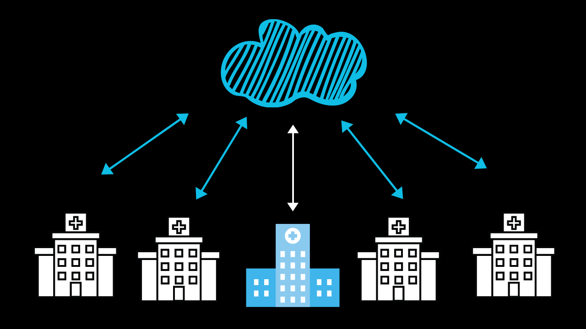
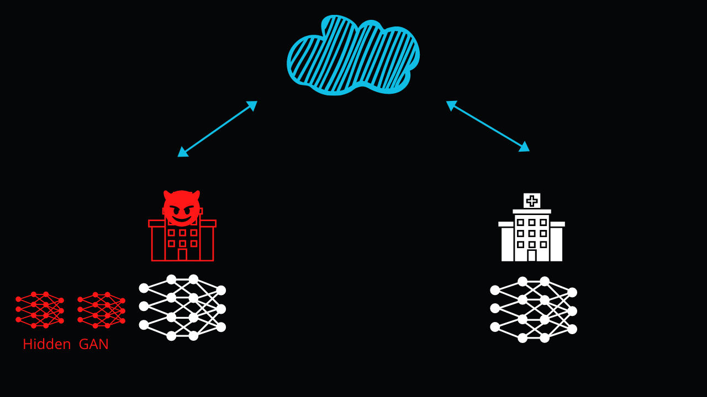

<!-- TODO(a11y): 2 localized body image(s) have empty alt text -->

_[Research](https://arxiv.org/pdf/1702.07464.pdf) has shown that it is possible to launch an attack where a malicious user uses Generative adversarial network (GANs)_ _to recreate samples of another participant’s private datasets. Read on for more:_

<figure class="">

</figure>

## Why should we care about privacy?

Data is one of the key factors accelerating the growth in deep learning. This is because in deep learning, model accuracy scales with the size of the dataset the model is trained on. It gets tricky when working with personal and sensitive data that needs to be pooled together. Dealing with private data sourced from individuals comes with the baggage of some very real questions about data privacy.

__****Privacy related questions****: Who owns the acquired data and the trained model? What is the model used for and who can access it? Could the pooled data be an easier target for security breaches?__

Unfortunately, areas where deep learning can be most effective often overlap with areas where privacy is a concern. For example, Deep learning models that perform pneumonia diagnosis based on x-ray images could reduce the workload for doctors. However, training data to run the diagnostics on a chest X-ray can be hard to come by due to legal privacy constraints such as [HIPAA](https://www.hhs.gov/hipaa/index.html). For this very reason, a few hospitals were forced to train their model on small and local datasets since large datasets couldn’t be pooled together due to privacy concerns. [These models were successful in classifying records from patients that were treated in the hospital, but their accuracy suffered when tested externally due to overfitting](https://pubmed.ncbi.nlm.nih.gov/30399157/). Shockingly, the model was making predictions based on the machine used to X-ray rather than the contents of X-ray itself!

## Can Federated Learning Solve the Privacy issue?

A lot of researchers are trying to bridge the gap between model accuracy and training data privacy. Federated deep learning is one such approach. Federated Learning enables the users to train a local models on their own private dataset. Instead of sharing private training data directly, the user shares a part of the trained model. The shared parts from various users then collaboratively yields a single, robust and well fitted model.  
**This results in an overall better performing model while keeping the sensitive training data absolutely private and local to the user.**

## What are GANs?

Generative adversarial network (GAN) is a fascinating framework made up of two neural networks pitted against each other in a tug of war. This tug of war enables the GAN to create new data with the same statistics as the training dataset. What this means is that given any training data, GANs can generate new data that has similar characteristics as the original training data. This makes for an incredibly powerful and versatile tool.

__Besides [generating realistic human faces that do not exist](https://thispersondoesnotexist.com/), [GANs can be used to launch attacks](https://arxiv.org/pdf/1702.07464.pdf), and even [create art](https://artbreeder.com/) \[warning: this website is a time sink\].__

## Are GANs a threat to federated learning?

<figure class="">

</figure>

Federated learning leans on the fact that shared parts of the model do not reveal information about the data that the model was trained on. **However, this architecture is vulnerable to a threat that can cause privacy leakage.** [Research](https://arxiv.org/pdf/1702.07464.pdf) has shown that it is possible to launch an attack where a **malicious user uses GANs to recreate samples of another participant’s private datasets**.

## How does the GAN based attack work?

A malicious user in the federated learning system can successfully recreate samples from an unsuspecting participant’s dataset. In this process the malicious user perverts federated learning system to extract information from the victim. The attacks works as follows:

-   The victim will share a part of its model with a central server.
-   The malicious user will download that shared part from the server.
-   He will then train his own private GAN to recreate fake images that are similar to the original images in the victim’s dataset.
-   The malicious user uses these fake images to passively influence and corrupt the victim’s model.
-   The influenced model will then leak more information about the private dataset, exacerbating the privacy breach.
-   This leak will let the malicious GAN generate more accurate fakes.

As long as the victim’s model is learning, the steps above can repeat continuously.

__The attack cleverly uses the properties of federated learning to cast a shadow on the concept of collaborative learning itself.__

**While the attack doesn’t nullify obfuscation techniques (like differential privacy ) it is still effective even when they are used.** The most striking features of this attack is that a malicious participant can not only witness the evolution of a user’s model, but it can also influence it.

Researchers at National University of Singapore recently [proposed an anti-GAN network to overcome this attack.](https://arxiv.org/abs/2004.12571) Others researchers, including myself, are exploring asymmetrical privacy in federated learning that mitigates this threat posed by GANs to Federated learning.
