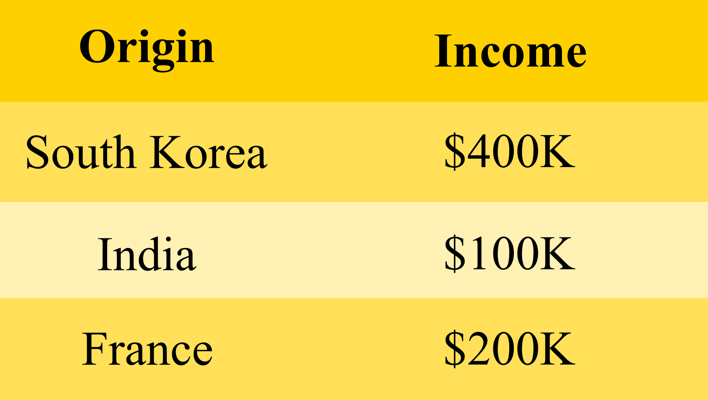
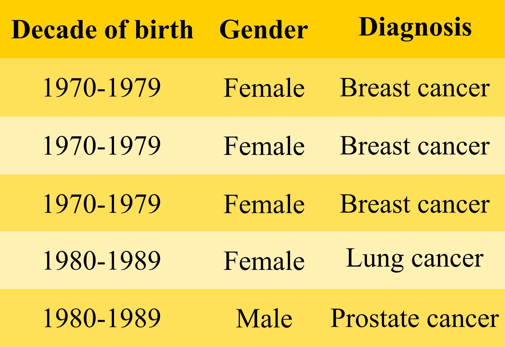
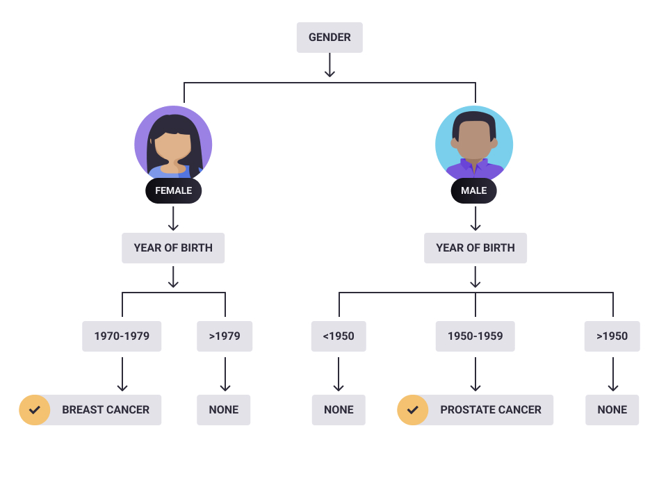
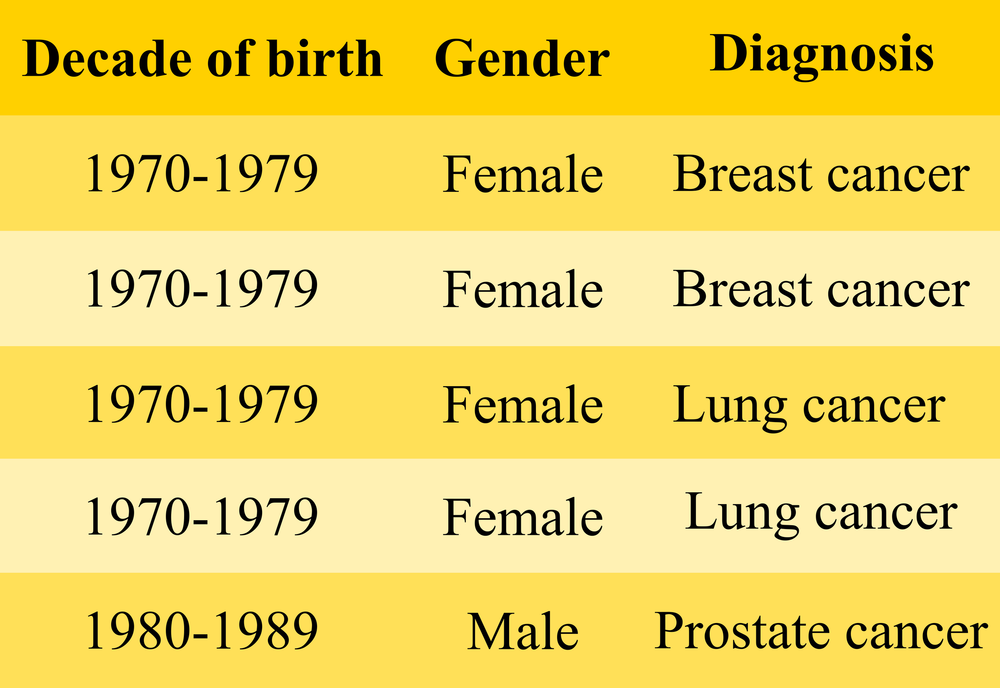
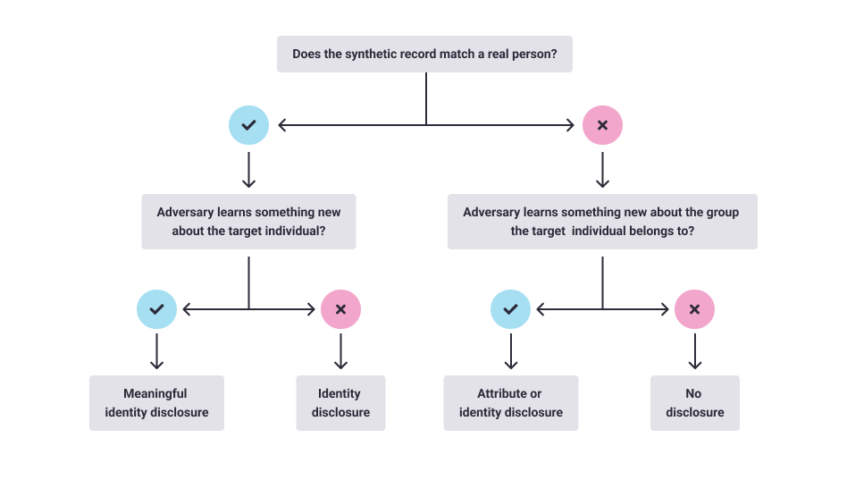

<!-- TODO(a11y): 6 localized body image(s) have empty alt text -->

Part 1: Laws protect user information and regulate PET including synthetic datasets. But what exact disclosures plague synthetic data?

The use of synthetic is evoking excitement because it promises privacy and vast application potential. With the use of AI, it is possible to generate just any kind of synthetic dataset, be it images, audio, or time series. The use of synthetic data promises to save on the cost and efforts involved in data acquisition and the required privacy actions. Imagine having to de-identify a real record and yet not be fully confident of the privacy guarantees because the capabilities of the hypothetical adversary are limitless. But is synthetic data the silver bullet that kills all the privacy woes? Is it immune to disclosures? The answer is no. Let us see how disclosures may happen with synthetic data as well.

---

## What is a disclosure anyways?

First of all, it needs to be understood that disclosures plague data that is associated with individuals. If the subjects of the record are cars or food items then privacy concerns do not make sense. But as soon as the information gets associated with a person, for instance, the car seller or buyer, or food manufacturer or consumer, the need for privacy arises. Data synthesis is being used to generate data about individuals and provide privacy provisions for them.

There are some assumptions about the synthesis of datasets:

-   There is no unique relationship between the synthesized and the real data
-   It is virtually impossible to identify an individual or their sensitive information from synthetic data
-   There is no meaningful way to assume disclosure risks of synthetic data

<figure class="">

<video src="/blog/how-synthetic-data-can-leak-your-information/wrong.mp4" autoplay loop muted playsinline></video>

</figure>

The most common method to generate synthetic data is to synthesize the essence of a real dataset. A synthesis model like GAN may likely overfit real data, thus creating data too similar to the real sample. This creates a possible privacy problem whereby an adversary can map the records in the synthetic data to individuals in the real world.

Now that we have talked a lot about disclosure, let us understand the various forms it takes.

---

## Types of disclosure

## Identity disclosure

Assuming an original dataset that contains the nationality and income of some persons, an adversary could view these three individual entries after querying certain income brackets.

<figure class="">

<figcaption>A sample dataset to illustrate identity disclosure. Source: The author</figcaption></figure>

An adversary is interested in knowing the income of a Korean named Yo-won. He knows that Yo-won is rich and her nationality, and can therefore identify the row belonging to Yo-won. The adversary knew that the subject was rich, but now they know how much she earns. This is new information gained by them.

Here we are only concerned about whether an adversary could assign an identity to a record. For a synthetic or de-identified dataset, had the adversary not been able to discern Yo-won, or assigned second or third row to her, then disclosure would not have occurred.

## Attribute disclosure

An attribute disclosure happens when the adversary gains new knowledge about a group of individuals without assigning an identity to any record. Assume that they received the following table after querying the database.

<figure class="">

<figcaption>A sample dataset to illustrate attribute disclosure. Source: The author</figcaption></figure>

In this case, the adversary knew that Yo-won was in the dataset, identified as a woman, and was born in the year 1975. Having hidden the year of birth in the records, we successfully confused the adversary between the first three entries. But they got to know with 100% certainty that Yo-won had been diagnosed with breast cancer. The disclosure could be carried out by a simple decision tree:

<figure class="">

<figcaption>A decision tree that was built from an oncology dataset. Source: Kyoko Eng</figcaption></figure>

Now think of an adversary who has the computational capacity and more malicious intent for highly sensitive information.

> _The essence of data analysis is to build models that conclude groups of individuals with certain characteristics_.

An adversary will use this essence to execute a disclosure.

The other aspect of attribute disclosure is that the adversary could draw conclusions about persons who were not in the data. If the above table was representative of a population, for instance, the employees who had drawn health benefits more than the average, then the adversary can conclude other women who qualified the representation. If Hye-jin is a woman born in the year 1974 and belongs to the representative group, then it can be concluded that she too is seeking treatment for breast cancer. Here, the adversary is learning something new about individuals who are not even in the data, and with a high certainty. Again, this is the essence of statistics.

## Inferential disclosure

Not all query results need to be vulnerable to disclosure to this extent. Of course, the query results may include more diverse information such as this:

<figure class="">

<figcaption>A sample dataset to illustrate inferential disclosure. Source: The author</figcaption></figure>

For an adversary who has the same background knowledge as before, i.e., he knows that Yo-won is present in the data; she is a woman and was born in 1975. The adversary can conclude that Yo-won has breast cancer with only 50% certainty. Similarly, for Hye-jin, he can only be 50% sure that she suffers from breast cancer even though she is not present in the retrieved data.

The essence of statistics/data analysis still holds but in this case, the level of certainty is lower. In the previous case, a more accurate model had been built. But the record belonging to Yo-won still cannot be identified, and the only reason we can learn something new about her is that she was a member of a group that had been modeled.

---

## What qualifies as a meaningful disclosure?

To say that data synthesis will offer privacy protection, we need to specify _what_ it will protect against. We saw that identity and attribute disclosures are both forms of statistical analysis, and we want synthetic data to be suitable for analysis. We want models to be built for synthetic data, to derive inferences from it. To expect synthesis to protect against identity disclosure is a necessary but insufficient condition. A meaningful disclosure is governed by information gain.

**So what is an information gain?**

> _The notion of information gain needs to evaluate how unusual the information is._

Let us assume that in a dataset comprising of Asian Americans, only 10% of women of ages 40-44 are likely to have four or more children. If we have two women Aiko who has four children and Keiko who has two children, then Aiko will be present in the smaller percentage. Therefore, learning about Aiko’s number of children is more informative than Keiko’s number of children.

The important aspect when deciding if an identity disclosure is meaningful depends on how uncommon particular individual information is. Of course, we had assumed that the synthesized data had correct values of the number of children. Practically, these values will be synthesized as well. **Therefore if the numbers generated in the synthetic record are not the same as or close to the true values of the real person, then there will be no or limited information gain.**

We can summarize the risk of a meaningful identity disclosure like this:

<figure class="">

<figcaption>Decision tree to determine whether there is a risk of meaningful identity disclosure. Source: Kyoko Eng</figcaption></figure>

---

## Conclusion

Synthetic data that retains high utility will allow models to be built that represent the original relationships in the data. Therefore, if models from real data can be used in inappropriate ways, so can models from synthetic data. It is the cultural norms and public expectations that govern whether particular information is harmful or whether the model derived from the data is potentially discriminatory. And such factors change over time.

---

Source:

-   [Practical synthetic data generation](https://www.oreilly.com/library/view/practical-synthetic-data/9781492072737/)
