<!-- TODO(a11y): 12 localized body image(s) have empty alt text -->


In this tutorial, you are going to learn how to setup PySyft, a privacy-preserving machine learning framework, on Windows 10. Presently, we are going to work with the version 0.2.9, which is the latest version as by the time of writing.

## Requirements:

-   A computer equipped with Windows 10
-   An internet connection

This tutorial is organized into 4 different steps:

**Step 1 – Enable the Linux Subsystem**

**Step 2 – Install an Ubuntu Distribution**

**Step 3 – Install Conda**

**Step 4 – Install PySyft**

---

## Tutorial

As of the time of writing,  PyTorch v1.4.0 is not available for download on Windows 10. Therefore, we will need to install a Linux Submachine and then install PySyft there.

### Step 1 – Enable the Linux Subsystem

Creating a Linux submachine in Windows is super easy and convenient for installing Unix-friendly frameworks like PyTorch and PySyft in Windows. The first thing we need to do is enabling a Linux subsystem in Windows by turning on **_Windows Features_**

In the _Windows Search bar_, search for “_Turn windows features on or off_“, then click on the corresponding option that comes up from the control panel.

<figure class="">

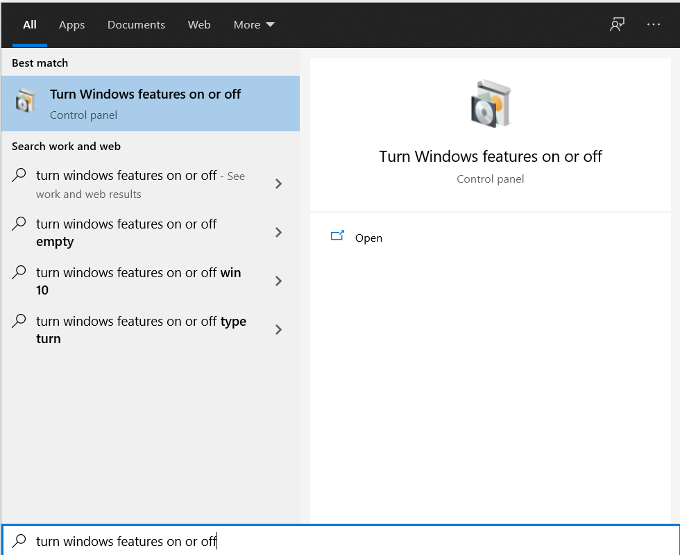

</figure>

In the window popping up, add a tick to the checkbox _“Windows Subsystem for Linux”,_ then click on “OK”.

<figure class="">

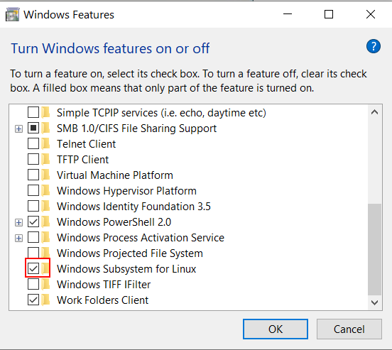

</figure>

### Step 2 – Install an Ubuntu Distribution

Now we need to head over to the Microsoft Store. In the search bar on the top-right corner, enter “Linux” and perform a Search. Several different Linux distributions will be displayed, among which you can choose one:

<figure class="">


</figure>

Personally, I picked the first one from the Canonical Group, but any Ubuntu version >= 18.04 LTS should do.  Now grab an Ubuntu distribution and install it by hitting the big blue button “Install”

<figure class="">

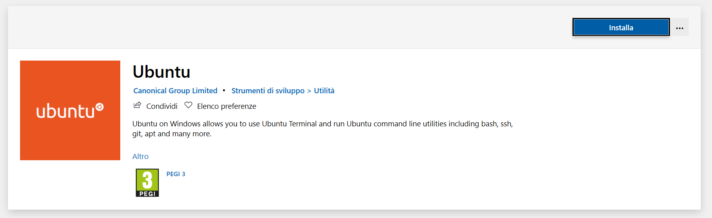

</figure>

Once the installation process finishes, just click on “Start” from the Microsoft Store of the Ubuntu app, or look for the installed Ubuntu app in the Windows search bar.

The first time you boot the Linux subsystem, you may need to wait a little while for it to finish installing. Then, you will be prompted to enter a _username_ and sudo _password_.

<figure class="">

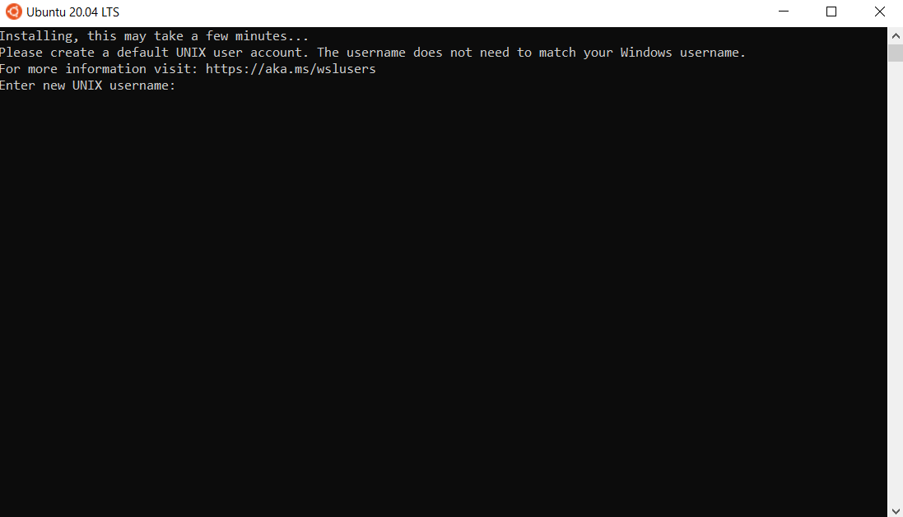

</figure>

After entering your username and password, you will be welcomed to your newly installed Linux subsystem. Congratulations!! Let’s now proced to Step 3.

<figure class="">

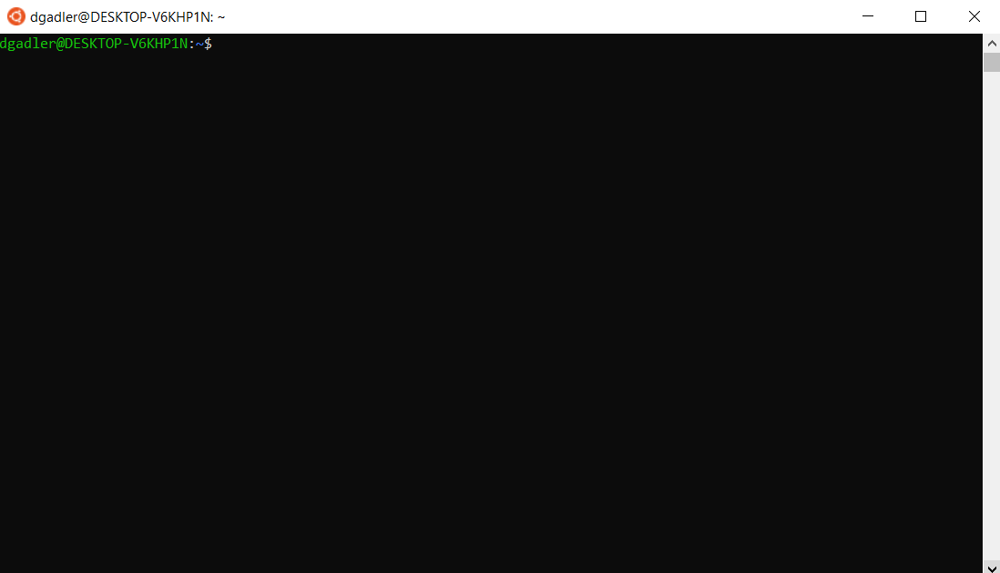

<figcaption>If you’ve made it to this step, that means you have successfully installed a Linux distribution!</figcaption></figure>

### Step 3 – Install Conda

The easiest way to manage Python and package dependences in Linux systems is via using conda. So, now we are going to download Conda and use it to create an environment with running Python 3.7, where we will be installing all the PySyft-related dependencies.

To do that, I followed this tutorial:

> [https://www.digitalocean.com/community/tutorials/how-to-install-anaconda-on-ubuntu-18-04-quickstart](https://www.digitalocean.com/community/tutorials/how-to-install-anaconda-on-ubuntu-18-04-quickstart)

**Step 3.1 – Download the latest version of Anaconda**

Head over to the bottom of the Anaconda distribution page, select the Linux 64-bit (x86) installer, and download it on the Linux subsystem. To download the installer, I had to enter the following commands from the Linux subsystem. A version based on Python3.8 is fine, since we will install a new Python version with Conda anyway.

```bash
cd $HOME
wget https://repo.anaconda.com/archive/Anaconda3-2020.07-Linux-x86_64.sh 
```

**Step 3.2 – Install Anaconda**

Once the download completes, we just need run the installer, and follow the installation instructions. To start up the installer, let’s run:

```bash
chmod +x Anaconda3-2020.07-Linux-x86_64.sh
./Anaconda3-2020.07-Linux-x86_64.sh 
```

Press ENTER to continue the installation:

<figure class="">

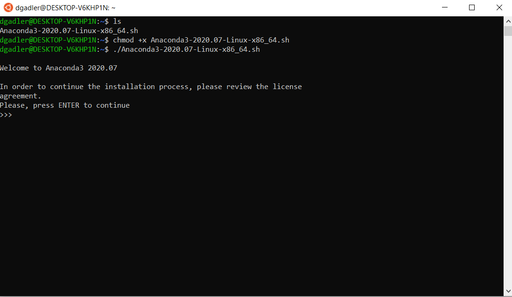

</figure>

Type “YES” to accept the license:

<figure class="">

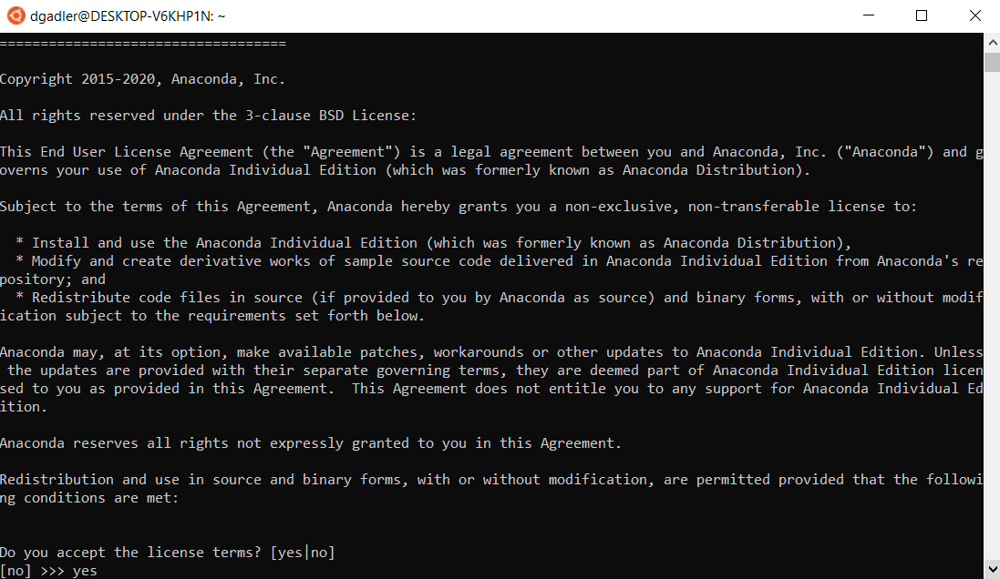

</figure>

Press ENTER if the default installation directory is fine for you, or set a custom one:

<figure class="">

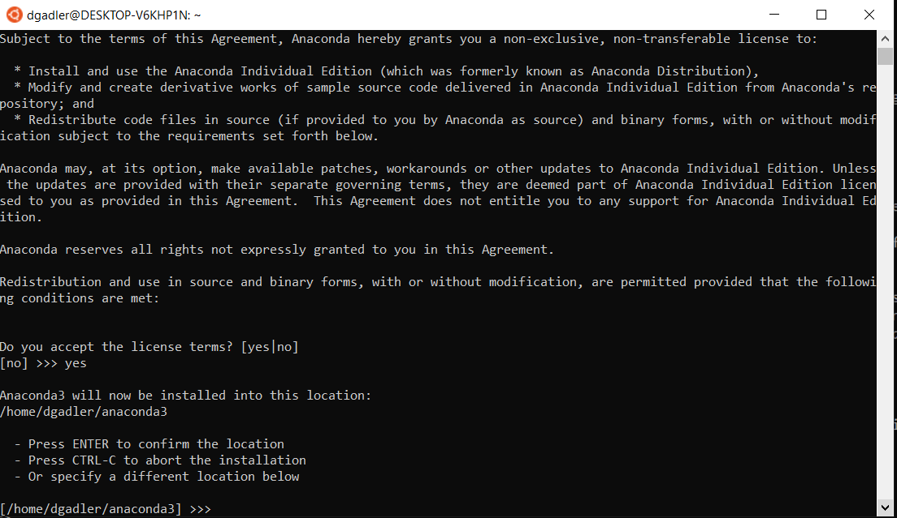

</figure>

Once the installation procedure completes, we just need to close the Ubuntu subsystem and re-open it, or run the following command to activate **conda**:

```bash
source ~/.bashrc
```

Finally, to test the installation, we can run the following command to view the available environments. By default, just the base environment is available:

```bash
conda info --envs
```

### Step 4 – Install PySyft

First of all, we need to create a new environment in Conda running Python 3.7, that will be hosting all the PySyft dependencies. To do that, let’s run this command to create an environment named _**syft\_python**_:

```bash
conda create --name syft_python python=3.7
```

Let’s now activate this environment, so that when using pip commands to install packages, we will be installing those packages in this newly created environment:

```bash
conda activate syft_python
```

Let’s clone the PySyft repository and navigate into the cloned PySyft folder:

```bash
git clone https://github.com/OpenMined/PySyft.git
```

Let’s install some basic dependencies from the command line to be able to install PySyft’s dependencies:

```bash
sudo apt-get update
sudo apt-get upgrade
sudo apt-get install gcc g++
```

Let’s install PySyft’s dependencies contained in the requirements.txt file of the pip-dep folder :

```bash
cd $HOME/PySyft/pip-dep    
pip install -r requirements.txt
```

<figure class="">

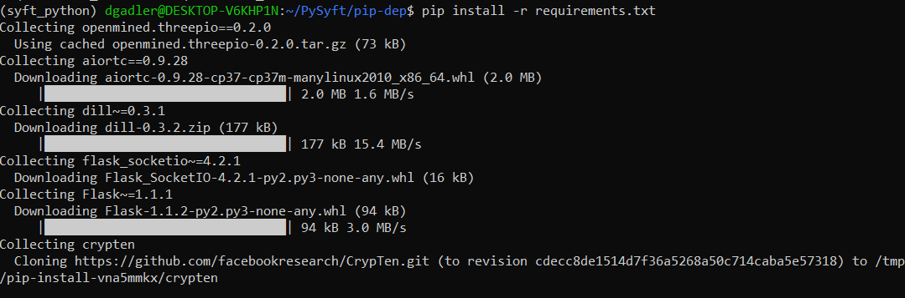

</figure>

Finally, once the dependencies’ installation process has finished, let’s install PySyft:

```bash
cd $HOME/PySyft
python setup.py install --user
```

If everything went well, and PySyft has been setup correctly, you should see a screen like the following one, meaning all the dependencies have been resolved correctly:

<figure class="">

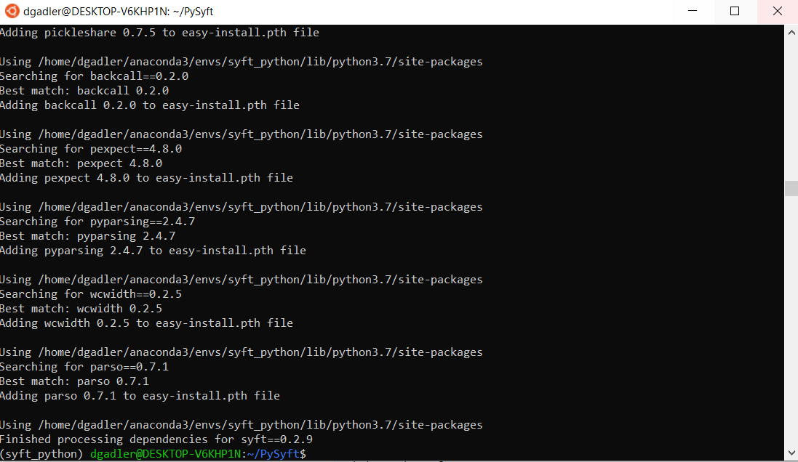

</figure>

Now, let’s test PySyft by importing it as a package in Python and check if it has been configured correctly:

```bash
cd $HOME
python
```

```bash
import syft
```

<figure class="">

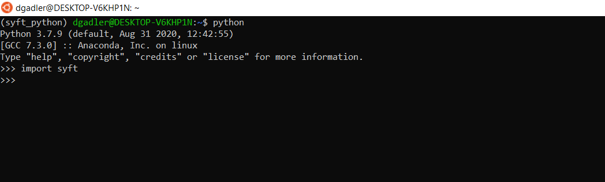

</figure>

If no error appears, that means you have successfully installed PySyft on your Linux sub-system in Windows! Congratulations!!
