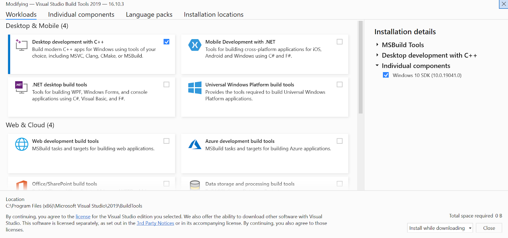

<!-- TODO(a11y): 1 localized body image(s) have empty alt text -->

PySyft is a Python library for secure and private Deep Learning. It uses Federated Learning, Differential Privacy, and Encrypyted Computation to decouple private and sensitive data. It can be used within the major Deep Learning Frameworks such as TensorFlow and PyTorch.

This guide will show you how to install PySyft using Conda. Conda lets you set up virtual environments and is included with Anaconda, a toolkit for data science.

**Installing Anaconda**

If you don’t already have Anaconda you can download it here: [https://www.anaconda.com/products/individual](https://www.anaconda.com/products/individual).

To install it just follow the installer’s on screen instructions.

Note: you might prefer to just install conda using pip:

$ pip install conda

Or install [Miniconda](https://docs.conda.io/en/latest/miniconda.html), if you want to minimise the space required by only downloading relevant packages when you need them. If you are new to Conda and/or Python, I would recommend using Anaconda. Even though Miniconda works on Windows, use Anaconda as it includes the Anaconda prompt, which will allow you to work from the command line.  

**Installing PySyft**

There is an extra step required if you are installing on Windows. After this the steps are the same for Windows, Linux and Mac.

**1\. ****Install Microsoft Build Tools (only required for Windows users)******

Go to [https://visualstudio.microsoft.com/downloads/](https://visualstudio.microsoft.com/downloads/) and download Build Tools for Visual Studio 2019. You can find this at the bottom of the page under All Downloads -> Tools for Visual Studio 2019.

Open the installer and follow the instructions. When you see the following screen ensure you select Desktop development with C++. This is required to be able to install PySyft.

<figure class="">

</figure>

**2\. ****Setup virtual environment******

If you’re on Windows, open Anaconda Prompt. If you’re on Linux or Mac, open the terminal.

Type the following commands:

$ conda create -n pysyft python=3.9

$ conda activate pysyft

$ conda install jupyter notebook

Note: each time you need to use PySyft, remember to make sure you are in this virtual environment. The following command activates the environment: conda activate pysyft.

**3\. ****Install******

The final step is to install PySyft. To do this run the following command:

$ pip install syft

This will auto-install all dependencies required to run the tutorials and examples on the [OpenMined website](https://www.openmined.org/) and [PySyft GitHub page](https://github.com/OpenMined/PySyft).

**4\. ****Test Installation******

To test if the installation has worked correctly, open the Python interpreter and import  PySyft:

$ python

\>>> import syft

If you don’t see any errors the installation has worked correctly.

**Examples**

You can find a list of examples using PySyft [here](https://github.com/OpenMined/PySyft/tree/main/packages/syft/examples). These tutorials cover the major data science, machine and deep learning Python libraries. You can run these examples by launching them within Jupyter Notebook.
