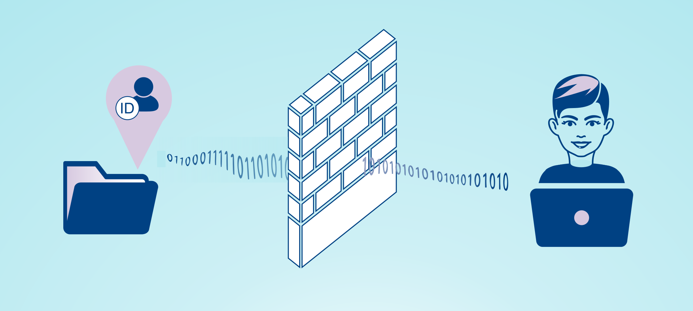
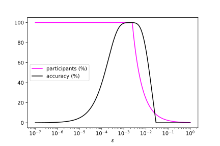
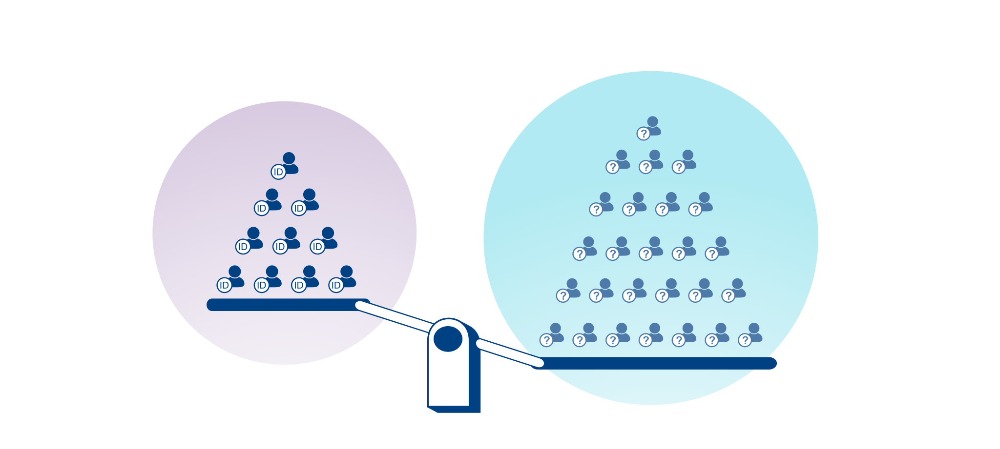

When we advocate for privacy, we tend to concentrate on the **negative consequences** of privacy violations \[[56](https://shoshanazuboff.com/book/about/); [32](https://www.thesocialdilemma.com/); [19](https://www.codedbias.com/); [50](https://www.carissaveliz.com/books)\]. These portrayals are extremely important, but they paint only one half of the picture. Privacy also brings about **net-positive advantages** for individuals and organizations. These advantages can act as powerful **internal incentives**, driving privacy adoption. A key addition to external incentives like regulation and public pressure.

## Privacy is not secrecy but appropriate information flows

We often think of privacy as secrecy. Keeping secret, sensitive personal information from being leaked. But the dichotomy between sensitive and non-sensitive information is unrealistic. The question of privacy is much more complex.

Sometimes even certain uses of seemingly “public” data are perceived as privacy violations. When you sunbathe in your yard, or go into a bar, anyone walking nearby could see you. In both situations, being captured in a Google Street View’s picture does not reveal secret information about you. But instinctively we understand that there is a big difference between seeing someone on the street and publishing a picture of them online \[[29, 5:28–7:18](https://youtu.be/Bc2XQCFCeE8?t=328)\].

Moved by similar considerations, Helen Nissenbaum developed the theory of _contextual integrity_ \[[25](https://nyuscholars.nyu.edu/en/publications/privacy-as-contextual-integrity); [26](https://www.sup.org/books/title/?id=8862)\]. Instead of conjuring up an artificial definition of privacy, she started by examining people’s perceptions. Different **social domains have their own norms, often implicit**, regulating how information is transmitted and stored. Breaking these norms is perceived as a privacy violation.

Privacy is not secrecy. To enjoy the benefits of living in a society, we need to share information with one another. But there is no need to share all information with everyone. Information meant for one context should not be used arbitrarily in another context. “Privacy is not about information itself. It is about the manner in which it flows” \[[49](https://twitter.com/openminedorg/status/1399028939511717893)\]. Privacy is about appropriate _information flows_ \[[46](https://blog.openmined.org/society-runs-on-information-flows/)\].

In the image we see a graphical representation of this concept. On the left we have information about someone; on the right there is a person, perhaps a data scientist. If we kept all the information hidden behind a wall, we would avoid some harms, but also miss out on potential benefits. **Privacy is like plumbing**, allowing a specific piece of information to only flow from a specific sender to a specific receiver.

Centuries ago, wastewater was poured out on the streets; people just walked through it, wondering why they got sick. The way we currently handle data is very similar. We spew data everywhere we go, and sometimes it comes back to hurt us in unexpected ways \[[36, 41:25–45:21](https://youtu.be/4zrU54VIK6k?t=2485)\].

Maybe you expected that your car insurance premium would be determined by your driving record. Instead it was determined by something arguably irrelevant, like your credit score \[[27](https://weaponsofmathdestructionbook.com/), ch. 9\]. Maybe you expected that your job application would be evaluated on the basis of your skills and experience. Instead the decisive factor turned out to be your shopping data, where the sudden change in your grocery habits betrayed your diabetes diagnosis. Or maybe the decisive factor was your social network data, and the hiring decision was determined by who your friends are.

The more indiscriminately we pour information across contexts, the more we shift towards a dull single ranking: a _social scoring system_, like [in China](https://en.wikipedia.org/wiki/Social_Credit_System). Social scoring systems are the opposite of contextual integrity, and they are going to be banned in the EU \[[11](https://www.politico.eu/article/europe-strict-rules-artificial-intelligence/); [52](https://www.theverge.com/2021/4/21/22393785/eu-ai-regulation-proposal-social-credit-ban-biometric-surveillance-exceptions); [51](https://ai-governance.eu/eu-published-an-ai-regulation-proposal/); [38](https://digital-strategy.ec.europa.eu/en/library/proposal-regulation-laying-down-harmonised-rules-artificial-intelligence)\]. Going back to the sewage analogy, we need to build plumbing to accurately channel our information flows. Then we can process them, extracting value while minimizing harm.

So, how can we build appropriate information flows? We have a **theoretical framework**: _structured transparency_ \[[48](https://arxiv.org/abs/2012.08347); [47](https://blog.openmined.org/structured-transparency-input-output-privacy/)\], developed by Andrew Trask, Emma Bluemke and others in the OpenMined community \[[30](https://www.openmined.org/)\], inspired by contextual integrity. We have the **technology**: with _privacy-preserving AI_ we can “answer questions using data we cannot see” \[[35](https://youtu.be/NJBBE_SN90A); [36](https://youtu.be/4zrU54VIK6k)\]. Now we only need **incentives** to drive adoption.

> **Privacy-preserving AI** \[[54](https://blog.openmined.org/privacy-preserving-ai-a-birds-eye-view/); [4](https://blog.openmined.org/private-machine-learning-explained/)\]. Combining federated learning \[[3](https://federated.withgoogle.com/); [15](https://arxiv.org/abs/1912.04977)\], differential privacy \[[40](https://youtu.be/pT19VwBAqKA); [9](https://www.cis.upenn.edu/~aaroth/Papers/privacybook.pdf)\], secure multi-party computation \[[21](https://cacm.acm.org/magazines/2021/1/249459-secure-multiparty-computation/fulltext); [6](https://www.cambridge.org/de/academic/subjects/computer-science/cryptography-cryptology-and-coding/secure-multiparty-computation-and-secret-sharing)\], homomorphic encryption \[[13](https://youtu.be/2u2kTc9KgGs); [12](https://www.microsoft.com/en-us/research/project/homomorphic-encryption/)\] and other privacy-preserving technologies we can build appropriate information flows. Implementation is made easier by dedicated open-source libraries, like OpenMined’s PySyft \[[8](https://youtu.be/9qYDtt2XM2o); [42](https://github.com/OpenMined/PySyft)\] and PyGrid \[[31](https://youtu.be/IW4Tt4qBpHo); [41](https://github.com/OpenMined/PyGrid)\].

## Privacy’s dual role protecting individuals and social domains

The norms regulating information flows in a social domain have a **dual role**: they protect individuals, but they also ensure that the social domain itself functions at its best.

In **healthcare**, the [Hippocratic Oath](https://en.wikipedia.org/wiki/Hippocratic_Oath) protects patients’ confidentiality. As a result, patients feel comfortable sharing private aspects of their health condition, allowing physicians to do their job more effectively \[[29, 7:18–8:17](https://youtu.be/Bc2XQCFCeE8?t=438)\]. This dual role of patient confidentiality has come up recently, as England’s general practitioners warned that [NHS Digital](https://en.wikipedia.org/wiki/NHS_Digital)’s plan to share patient data with third parties “could erode the relationship between them and their patients” \[[22](https://www.theguardian.com/society/2021/may/30/gps-warn-plans-share-patient-data-third-parties-england)\].

Another example of the dual role of privacy is the **postal service**. Reading another person’s mail is a criminal offense in many countries. This protects the sender and the receiver, but also the postal service itself: if people did not trust that their mail be kept private, they might just not send mail at all \[[29, 8:54–9:57](https://youtu.be/Bc2XQCFCeE8?t=534)\].

The dual role of privacy is mirrored by the two types of portrayals and incentives we mentioned in the beginning:

-   the focus on negative consequences of privacy violations, and external incentives;
-   the focus on net-positive advantages of privacy adoption, and internal incentives.

## A deeper look at the trade-off between privacy and accuracy: better privacy can yield higher accuracy

_Differential privacy_ \[[40](https://youtu.be/pT19VwBAqKA); [9](https://www.cis.upenn.edu/~aaroth/Papers/privacybook.pdf)\] is the gold standard for privacy. In differential privacy there is a precisely defined trade-off between privacy and accuracy. Privacy is measured by a parameter called _epsilon_, the Greek letter _ε_. The smaller the epsilon, the stronger the privacy guarantee. **Privacy is obtained by introducing random noise**. Stronger guarantees require more noise. Therefore the trade-off is unavoidable: all else being equal, **stronger privacy implies lower accuracy**.

At this point, one might jump to the conclusion that employing privacy-preserving technologies always requires sacrificing accuracy. But this conclusion is false. Sure, _all else being equal_, stronger privacy implies lower accuracy. But in the real world it might be impossible to change privacy guarantees “in a vacuum”, without changing anything else. Changing privacy guarantees **might affect other factors**, which in turn affect accuracy.

### Privacy can improve data quality

_Data quality_ affects accuracy; better data yields higher accuracy. A technique called _randomized response_, based on the same intuition as differential privacy \[[20](https://global.oup.com/academic/product/the-ethical-algorithm-9780190948207), ch. 1\], can help us understand how privacy can improve data quality.

Imagine a social scientist doing a survey to find out how many people in a monogamous relationship cheat on their partner, on average. If someone was cheating, they might not want their partner to find out through a survey. Even if the scientist reassures the participants that all she will ever publish is the average, they cannot be completely sure that their individual answers will be kept secret. What if the research data is stolen and leaked? Can they even trust the scientist in the first place? Maybe someone will lie, just to be sure. Someone else might choose not to participate. In any case, the data will be skewed and unrepresentative, and so will the results.

Now imagine carrying out that survey using the following method. You ask each participant to flip a coin. If it lands heads, they answer honestly. If it lands tails, they flip it a second time, answering “yes” if it comes up heads, and “no” otherwise. This way every participant has _plausible deniability_: even if they answered “yes”, that does not mean they cheat on their partner. Their answer could be the result of two random coin flips. **With plausible deniability, more people will feel confident enough to participate in the survey and answer honestly**. Note the similarities with our earlier example about healthcare, where patients reveal more information to doctors when they know that it will be kept confidential. This is the dual role of privacy all over again.

With randomized response and differential privacy we introduce some random noise into the data. But we know the statistical properties of this noise. By [_law of large numbers_](https://en.wikipedia.org/wiki/Law_of_large_numbers), if you flip a fair coin many times, it will come up heads roughly 50% of the time. So we can partially correct for this noise. Without privacy we would still have some noise in the data, because people would answer less honestly. But we would not know the statistical properties of that noise, therefore we could not correct for it. In certain cases, introducing **privacy as controlled noise** can lead to more accurate results.

### Privacy can increase data quantity

_Data quantity_ is another factor affecting accuracy; usually more data leads to higher accuracy. Are there situations where improving privacy can get us more data? For sure. Users might be incentivized to use a service, or provide their data for statistical analyses, if they were offered good privacy guarantees. Once again, this goes back to the dual role of privacy. Remember the example about mail? Less people would use the postal service, if they did not have the guarantee of secrecy. The same is true in many other contexts.

As explained by differential privacy expert Aaron Roth \[[5, 13:09–15:12](https://youtu.be/Tio71BoU0NU?t=789)\], we can build **economic models to examine the relationship between privacy and accuracy**. Using these models we can plot accuracy as a function of epsilon, the parameter indicating the strength of privacy guarantees. Here we have an example of such plots.

We obtained this plot using an economic model by Hsu et al. \[[14](https://ieeexplore.ieee.org/abstract/document/6957125/)\]; for a detailed explanation see \[[24](https://github.com/nigoshh/privacy-accuracy/blob/main/privacy-accuracy.ipynb)\]. We assume we are doing a statistical study, but the same intuition applies to any other context where the amount of data we have depends on the privacy guarantees we offer. Another example could be a company building a machine learning model trained with data from its users.

Let us analyze what happens in the plot, going from left to right. At the leftmost end of the plot, _ε_ is very small, which means we are offering very strong privacy guarantees. We are introducing a lot of noise, therefore accuracy is very low. Going toward the center of the plot, _ε_ grows larger; we add less noise, obtaining higher accuracy.

And now the most interesting part. Going toward the right, **as privacy guarantees become weaker and weaker, the number of participants declines** (the magenta line in the plot). People value privacy; by taking it away, we get less people. With less and less data, accuracy also declines.

If stronger privacy always implied lower accuracy, the highest values for accuracy would be in the right part of the plot. Instead, they are in the middle. Even if you only care about accuracy, **employing strong privacy guarantees might be in your best interest**.

In the image we have a scale measuring the informational value of two scenarios. On the left we have the non-private scenario: a small quantity of data without noise. On the right, the private scenario: a larger quantity of data with some privacy noise. In many cases we can get more information in the private scenario.

## Privacy can boost scientific progress: data is food for AI

Andrew Ng says that “data is food for AI”. The largest part of a chef’s job is sourcing and preparing high-quality ingredients. Similarly, the largest part of a data scientist’s job is sourcing and preparing high-quality data. Taking data as fixed, working only on improving the model, is like asking a chef to prepare a meal using whatever happens to be in the fridge \[[1, 6:51–8:15](https://youtu.be/06-AZXmwHjo?t=411)\]. We should use more resources to improve the quality and quantity of data.

The biggest jumps in progress have happened with **new datasets, not new models** \[[36, 46:49–47:08](https://youtu.be/4zrU54VIK6k?t=2809)\]. For example, one of the biggest breakthroughs for neural networks happened with [ImageNet](https://en.wikipedia.org/wiki/ImageNet), a huge dataset for object recognition. In many fields of scientific research there are no huge public datasets. **There is no ImageNet for cancer or depression**. Andrew Trask argues that “the big-data revolution has not come to science yet” \[[28, 21:02–22:37](https://youtu.be/_HDzjxjw38I?t=1262)\].

In some fields, like healthcare, there is actually a lot of data already; but it is scattered across many devices, organizations, jurisdictions, countries. Because of the sensitive nature of this data, pooling it into a huge dataset would be too costly or complicated. And it would be prohibitive in terms of privacy: no single entity should hold so much information and power.

Privacy-preserving technologies could solve this dilemma. With _federated learning_ \[[3](https://federated.withgoogle.com/); [15](https://arxiv.org/abs/1912.04977)\], data never leaves the place where it is produced. Instead of sending the data to the algorithm, we send the algorithm to the data. We can gain insight from huge aggregated datasets, without actually aggregating them \[[17](https://www.nature.com/articles/s42256-020-0186-1); [44](https://www.nature.com/articles/s41746-020-00323-1); [55](https://link.springer.com/article/10.1007/s41666-020-00082-4)\]. OpenMined’s healthcare projects, like _PriMIA_ \[[16](http://www.nature.com/articles/s42256-021-00337-8); [34](https://g-k.ai/PriMIA/)\] and _Privacy-preserving AI for Mental Health_ \[[23](https://blog.openmined.org/call-to-research-study-on-ppai-for-mental-health/)\], are among the first steps in this direction.

## Privacy can fix data markets, driving competition and innovation

Data can be copied very easily. Whenever you give someone a copy of your data, you cannot control what they do with it. Data laws like GDPR give you some protection, but they are very difficult to enforce. This is known as the _copy problem_ \[[45](https://blog.openmined.org/limitations-of-information-flows/)\].

In practice, when you sell your data, the buyer instantly becomes your competitor, and your data loses value very quickly. As a result, data markets are bizarre and dysfunctional. One strategy is to **sell data as quickly as possible**; in financial markets, firms pay to have their servers as close as possible to the central trading infrastructure \[[5, 2:34–3:58](https://youtu.be/Tio71BoU0NU?t=154)\]. Another strategy is to **never sell data to anyone**, if it is too valuable or private \[[5, 4:09–4:33](https://youtu.be/Tio71BoU0NU?t=249), [5:20–5:38](https://youtu.be/Tio71BoU0NU?t=320), [7:25–7:36](https://youtu.be/Tio71BoU0NU?t=445)\].

Privacy could revolutionize data markets. With federated learning there is no need to transfer data in order to extract value from it. You can sell the usage of your data without sending copies of it. The buyers would not instantly become your competitors \[[5, 5:38–6:34](https://youtu.be/Tio71BoU0NU?t=338)\]. With more value coming from data, more companies might consider open-sourcing their algorithms, facilitating knowledge sharing and independent audits.

Machine learning startups would also benefit. Right now they face the **chicken-or-egg dilemma of users and data**: you cannot have users without a product, but to build a product you need users’ data. Many machine learning startups start with consulting, hoping that another company will invest in them and let them use their data \[[5, 0:44–2:10](https://youtu.be/Tio71BoU0NU?t=44)\]. In the new data markets, startups could just pay other companies to use their data.

**New, repeatable business models** would emerge. Owners of the same type of data could form _federated data networks_, which would need gatekeepers. An example in healthcare could be the radiology network gatekeeper: contacting hospitals, setting up infrastructure for remote use of their x-ray data, and mechanisms to be compensated for such use \[[36, 49:33–50:18](https://youtu.be/4zrU54VIK6k?t=2973)\].

## Privacy can empower users, leading to more aligned AI

In the new data markets we just described, the first data owners will be organizations who collect data about their customers or users. At some point, **data subjects themselves could become owners** of the data they produce. Individuals could actually own their personal data and get paid whenever they allow its use. This would provide a financial incentive against sharing copies of data; because of the copy problem, sharing copies could mean missing out on future revenue.

> It’s an interesting concept. Just using the same market forces currently responsible for invading privacy to do a 180-degree turn and fight to protect it. (Andrew Trask \[[5, 15:59–16:58](https://youtu.be/Tio71BoU0NU?t=959)\])

On the other hand, tech companies need user data. With more control and agency over their data, users will gain bargaining power. Tech companies will have a **stronger incentive to build products aligned with users’ interests and values**. There is a connection to concepts like _data as labor_ \[[7](http://radicalmarkets.com/chapters/data-as-labor/); [33](http://radicalmarkets.com/)\] and _data leverage_ \[[53](https://arxiv.org/abs/2012.09995)\], and holistic AI ethics approaches which explore power structures \[[18](https://www.nature.com/articles/d41586-020-02003-2); [43](https://ai-governance.eu/authority-is-increasingly-expressed-algorithmically/)\].

## External incentives should support internal incentives

The incentives we discussed are based on the assumption that people prefer privacy-preserving solutions, when given a choice. But data is often extracted in **covert, unnoticeable ways**; a logic based on deception, typical of _surveillance capitalism_ \[[56](https://shoshanazuboff.com/book/about/)\]. If we cannot even know when our privacy is violated, we might not understand the value of protecting it.

Regulation can push the industry to be more upfront and transparent, so that **privacy can become a competitive advantage**. The EU is leading the way with GDPR, Digital Services Act \[[10](https://www.brookings.edu/blog/techtank/2021/01/15/platform-data-access-is-a-lynchpin-of-the-eus-digital-services-act/); [39](https://digital-strategy.ec.europa.eu/en/library/proposal-regulation-european-parliament-and-council-single-market-digital-services-digital-services)\] and Artificial Intelligence Act \[[11](https://www.politico.eu/article/europe-strict-rules-artificial-intelligence/); [52](https://www.theverge.com/2021/4/21/22393785/eu-ai-regulation-proposal-social-credit-ban-biometric-surveillance-exceptions); [51](https://ai-governance.eu/eu-published-an-ai-regulation-proposal/); [38](https://digital-strategy.ec.europa.eu/en/library/proposal-regulation-laying-down-harmonised-rules-artificial-intelligence)\]. Interdisciplinary projects like AIGA \[[2](https://ai-governance.eu/)\] contribute to shaping the AI governance landscape towards a more responsible future.

## Credits

_Big thanks to [**Tinja Pitkämäki**](https://twitter.com/TinjaPitkamaki) (University of Turku) for her editorial support and for creating the images!_

**This blog post was published also in [AIGA’s blog](https://ai-governance.eu/yes-privacy-is-worth-the-effort/) on June 17th, 2021.**

## References

\[1\] _A Chat with Andrew on MLOps: From Model-centric to Data-centric AI_. Mar. 24, 2021. URL: [https://youtu.be/pT19VwBAqKA](https://youtu.be/pT19VwBAqKA) (visited on 06/12/2021).

\[2\] _Artificial Intelligence Governance and Auditing_. URL: [https://ai-governance.eu](https://ai-governance.eu/) (visited on 05/19/2021).

\[3\] L. Bellwood and S. McCloud. _Federated Learning: Building better products with on-device data and privacy by default_. URL: [https://federated.withgoogle.com/](https://federated.withgoogle.com/) (visited on 05/14/2021).

\[4\] E. Bluemke, A. Lopardo, A. Trask, and N. Kang. _Privacy-Preserving Data Science, Explained_. May 19, 2020. URL: [https://blog.openmined.orghttps://blog.openmined.orghttps://blog.openmined.orghttps://blog.openmined.org/private-machine-learning-explained/](https://blog.openmined.org/private-machine-learning-explained/) (visited on 06/03/2021).

\[5\] _Course 1, Lesson 5, Concept: Machine learning startups need structured transparency_. From the _Private AI series_ \[37\], Course _Our Privacy Opportunity_, Lesson 11 _The Impact of Structured Transparency_, Concept 6 _Machine Learning Startups_. Jan. 2, 2021. URL: [https://youtu.be/Tio71BoU0NU](https://youtu.be/Tio71BoU0NU) (visited on 05/24/2021).

\[6\] R. Cramer, I. B. Damgård, and J. B. Nielsen. _Secure Multiparty Computation and Secret Sharing_. Cambridge University Press, 2015. ISBN: 9781107043053. URL: [https://www.cambridge.org/de/academic/subjects/computer-science/cryptography-cryptology-and-coding/secure-multiparty-computation-and-secret-sharing](https://www.cambridge.org/de/academic/subjects/computer-science/cryptography-cryptology-and-coding/secure-multiparty-computation-and-secret-sharing).

\[7\] _Data as Labor – Radical Markets_. URL: [http://radicalmarkets.com/chapters/data-as-labor/](http://radicalmarkets.com/chapters/data-as-labor/) (visited on 05/18/2021).

\[8\] _Demo: Doing Data Science on Remote Data_. Dec. 19, 2020. URL: [https://youtu.be/9qYDtt2XM2o](https://youtu.be/9qYDtt2XM2o) (visited on 05/16/2021).

\[9\] C. Dwork and A. Roth. “The algorithmic foundations of differential privacy”. In: _Foundations and Trends in Theoretical Computer Science_ 9.3–4 (2014), pp. 211–407. DOI: 10.1561/0400000042. URL: [https://www.cis.upenn.edu/~aaroth/Papers/privacybook.pdf](https://www.cis.upenn.edu/~aaroth/Papers/privacybook.pdf).

\[10\] A. Engler. _Platform data access is a lynchpin of the EU’s Digital Services Act_. Jan. 15, 2021. URL: [https://www.brookings.edu/blog/techtank/2021/01/15/platform-data-access-is-a-lynchpin-of-the-eus-digital-services-act/](https://www.brookings.edu/blog/techtank/2021/01/15/platform-data-access-is-a-lynchpin-of-the-eus-digital-services-act/) (visited on 06/01/2021).

\[11\] M. Heikkilä. _Europe eyes strict rules for artificial intelligence_. Apr. 14, 2021. URL: [https://www.politico.eu/article/europe-strict-rules-artificial-intelligence/](https://www.politico.eu/article/europe-strict-rules-artificial-intelligence/) (visited on 06/01/2021).

\[12\] _Homomorphic Encryption_. URL: [https://www.microsoft.com/en-us/research/project/homomorphic-encryption/](https://www.microsoft.com/en-us/research/project/homomorphic-encryption/) (visited on 06/03/2021).

\[13\] _Homomorphic Encryption: Intro to HE from Pascal_. From the _Private AI series_ \[37\], Course _Foundations of Private Computation_, Lesson 8 _Homomorphic Encryption_, Concept 2 _Introduction to Homomorphic Encryption_. May 6, 2021. URL: [https://youtu.be/2u2kTc9KgGs](https://youtu.be/2u2kTc9KgGs) (visited on 06/03/2021).

\[14\] J. Hsu, M. Gaboardi, A. Haeberlen, S. Khanna, A. Narayan, B. C. Pierce, and A. Roth. “Differential privacy: An economic method for choosing epsilon”. In: _2014 IEEE 27th Computer Security Foundations Symposium_. 2014, pp. 398–410. DOI: 10.1109/CSF.2014.35. URL: [https://ieeexplore.ieee.org/abstract/document/6957125/](https://ieeexplore.ieee.org/abstract/document/6957125/).

\[15\] P. Kairouz, H. B. McMahan, B. Avent, A. Bellet, M. Bennis, A. N. Bhagoji, K. Bonawitz, Z. Charles, G. Cormode, R. Cummings, R. G. L. D’Oliveira, H. Eichner, S. E. Rouayheb, D. Evans, J. Gardner, Z. Garrett, A. Gascón, B. Ghazi, P. B. Gibbons, M. Gruteser, Z. Harchaoui, C. He, L. He, Z. Huo, B. Hutchinson, J. Hsu, M. Jaggi, T. Javidi, G. Joshi, M. Khodak, J. Konečný, A. Korolova, F. Koushanfar, S. Koyejo, T. Lepoint, Y. Liu, P. Mittal, M. Mohri, R. Nock, A. Özgür, R. Pagh, M. Raykova, H. Qi, D. Ramage, R. Raskar, D. Song, W. Song, S. U. Stich, Z. Sun, A. T. Suresh, F. Tramèr, P. Vepakomma, J. Wang, L. Xiong, Z. Xu, Q. Yang, F. X. Yu, H. Yu, and S. Zhao. _Advances and Open Problems in Federated Learning_. 2021. arXiv: 1912.04977 \[cs.LG\]. URL: [https://arxiv.org/abs/1912.04977](https://arxiv.org/abs/1912.04977).

\[16\] G. Kaissis, A. Ziller, J. Passerat-Palmbach, T. Ryffel, D. Usynin, A. Trask, I. Lima, J. Mancuso, F. Jungmann, M.-M. Steinborn, A. Saleh, M. Makowski, D. Rueckert, and R. Braren. “End-to-end privacy preserving deep learning on multi-institutional medical imaging”. In: _Nature Machine Intelligence_ (2021), pp. 1–12. DOI: 10.1038/s42256-021-00337-8. URL: [http://www.nature.com/articles/s42256-021-00337-8](http://www.nature.com/articles/s42256-021-00337-8).

\[17\] G. A. Kaissis, M. R. Makowski, D. Rückert, and R. F. Braren. “Secure, privacy-preserving and federated machine learning in medical imaging”. In: _Nature Machine Intelligence_ 2.6 (2020), pp. 305–311. DOI: 10.1038/s42256-020-0186-1. URL: [https://www.nature.com/articles/s42256-020-0186-1](https://www.nature.com/articles/s42256-020-0186-1).

\[18\] P. Kalluri. “Don’t ask if artificial intelligence is good or fair, ask how it shifts power”. In: _Nature_ 583.7815 (2020), p. 169. DOI: 10.1038/d41586-020-02003-2. URL: [https://www.nature.com/articles/d41586-020-02003-2](https://www.nature.com/articles/d41586-020-02003-2).

\[19\] S. Kantayya. _Coded Bias_. 2020. URL: [https://www.codedbias.com/](https://www.codedbias.com/).

\[20\] M. Kearns and A. Roth. _The ethical algorithm: The science of socially aware algorithm design_. Oxford University Press, 2019. ISBN: 9780190948207. URL: [https://global.oup.com/academic/product/the-ethical-algorithm-9780190948207](https://global.oup.com/academic/product/the-ethical-algorithm-9780190948207).

\[21\] Y. Lindell. “Secure Multiparty Computation”. In: _Communications of the ACM_ 64.1 (2020), pp. 86–96. DOI: 10.1145/3387108. URL: [https://cacm.acm.org/magazines/2021/1/249459-secure-multiparty-computation/fulltext](https://cacm.acm.org/magazines/2021/1/249459-secure-multiparty-computation/fulltext).

\[22\] S. Marsh. _GPs warn over plans to share patient data with third parties in England_. May 30, 2021. URL: [https://www.theguardian.com/society/2021/may/30/gps-warn-plans-share-patient-data-third-parties-england](https://www.theguardian.com/society/2021/may/30/gps-warn-plans-share-patient-data-third-parties-england) (visited on 06/08/2021).

\[23\] Z. Müftüoğlu and A. Rao. _Call to Research Study on Privacy-Preserving AI for Mental Health_. Feb. 2, 2021. URL: [https://blog.openmined.orghttps://blog.openmined.orghttps://blog.openmined.orghttps://blog.openmined.org/call-to-research-study-on-ppai-for-mental-health/](https://blog.openmined.org/call-to-research-study-on-ppai-for-mental-health/) (visited on 05/19/2021).

\[24\] nigoshh. _Modeling the relationship between privacy and accuracy_. URL: [https://github.com/nigoshh/privacy-accuracy/blob/main/privacy-accuracy.ipynb](https://github.com/nigoshh/privacy-accuracy/blob/main/privacy-accuracy.ipynb) (visited on 05/26/2021).

\[25\] H. Nissenbaum. “Privacy as contextual integrity”. In: _Washington Law Review_ 79 (2004), pp. 119–158. URL: [https://nyuscholars.nyu.edu/en/publications/privacy-as-contextual-integrity](https://nyuscholars.nyu.edu/en/publications/privacy-as-contextual-integrity).

\[26\] H. Nissenbaum. _Privacy in Context – Technology, Policy, and the Integrity of Social Life_. Stanford University Press, 2009. ISBN: 9780804752374. URL: [https://www.sup.org/books/title/?id=8862](https://www.sup.org/books/title/?id=8862).

\[27\] C. O’Neil. _Weapons of Math Destruction: How Big Data Increases Inequality and Threatens Democracy_. Crown, 2016. ISBN: 9780553418811. URL: [https://weaponsofmathdestructionbook.com/](https://weaponsofmathdestructionbook.com/).

\[28\] _OM PriCon2020: OpenMined High Level Roadmap – Andrew Task_. URL: [https://youtu.be/\_HDzjxjw38I](https://youtu.be/_HDzjxjw38I) (visited on 05/16/2021).

\[29\] _OM PriCon2020: Privacy, Contextual Integrity, and Obfuscation – Helen Nissenbaum_. URL: [https://youtu.be/Bc2XQCFCeE8](https://youtu.be/Bc2XQCFCeE8) (visited on 05/13/2021).

\[30\] _OpenMined_. URL: [https://www.openmined.org/](https://www.openmined.org/) (visited on 05/24/2021).

\[31\] _OpenMined PyGrid 0.5 Demo_. Apr. 27, 2021. URL: [https://youtu.be/IW4Tt4qBpHo](https://youtu.be/IW4Tt4qBpHo) (visited on 05/16/2021).

\[32\] J. Orlowski. _The Social Dilemma_. 2020. URL: [https://www.thesocialdilemma.com/](https://www.thesocialdilemma.com/).

\[33\] E. A. Posner and E. G. Weyl. _Radical Markets: Uprooting Capitalism and Democracy for a Just Society_. Princeton University Press, 2018. ISBN: 9780691177502. URL: [http://radicalmarkets.com/](http://radicalmarkets.com/).

\[34\] _PriMIA_. URL: [https://g-k.ai/PriMIA/](https://g-k.ai/PriMIA/) (visited on 03/21/2021).

\[35\] _Privacy Preserving AI – Andrew Trask, OpenMined_. Nov. 6, 2019. URL: [https://youtu.be/NJBBE\_SN90A](https://youtu.be/NJBBE_SN90A) (visited on 05/14/2021).

\[36\] _Privacy Preserving AI (Andrew Trask) | MIT Deep Learning Series_. Jan. 19, 2020. URL: [https://youtu.be/4zrU54VIK6k](https://youtu.be/4zrU54VIK6k) (visited on 05/14/2021).

\[37\] _Private AI Series_. URL: [https://courses.openmined.org/](https://courses.openmined.org/) (visited on 05/05/2021).

\[38\] _Proposal for a Regulation laying down harmonised rules on artificial intelligence_. URL: [https://digital-strategy.ec.europa.eu/en/library/proposal-regulation-laying-down-harmonised-rules-artificial-intelligence](https://digital-strategy.ec.europa.eu/en/library/proposal-regulation-laying-down-harmonised-rules-artificial-intelligence) (visited on 06/01/2021).

\[39\] _Proposal for a Regulation of the European Parliament and of the Council on a Single Market For Digital Services (Digital Services Act) and amending Directive 2000/31/EC_. URL: [https://digital-strategy.ec.europa.eu/en/library/proposal-regulation-european-parliament-and-council-single-market-digital-services-digital-services](https://digital-strategy.ec.europa.eu/en/library/proposal-regulation-european-parliament-and-council-single-market-digital-services-digital-services) (visited on 06/01/2021).

\[40\] _Protecting Privacy with MATH (Collab with the Census)_. Sept. 12, 2019. URL: [https://youtu.be/pT19VwBAqKA](https://youtu.be/pT19VwBAqKA) (visited on 05/14/2021).

\[41\] _PyGrid_. URL: [https://github.com/OpenMined/PyGrid](https://github.com/OpenMined/PyGrid) (visited on 05/16/2021).

\[42\] _PySyft_. URL: [https://github.com/OpenMined/PySyft](https://github.com/OpenMined/PySyft) (visited on 05/16/2021).

\[43\] A. Rannisto and M. Setälä. _Authority is increasingly expressed algorithmically_. May 4, 2021. URL: [https://ai-governance.eu/authority-is-increasingly-expressed-algorithmically/](https://ai-governance.eu/authority-is-increasingly-expressed-algorithmically/) (visited on 06/01/2021).

\[44\] N. Rieke, J. Hancox, W. Li, F. Milletarì, H. R. Roth, S. Albarqouni, S. Bakas, M. N. Galtier, B. A. Landman, K. Maier-Hein, S. Ourselin, M. Sheller, R. M. Summers, A. Trask, D. Xu, M. Baust, and M. J. Cardoso. “The future of digital health with federated learning”. In: _NPJ digital medicine_ 3.1 (Dec. 2020), pp. 1–7. DOI: 10.1038/s41746-020-00323-1. URL: [https://www.nature.com/articles/s41746-020-00323-1](https://www.nature.com/articles/s41746-020-00323-1).

\[45\] J. Stutz. _Limitations of Information Flows_. Feb. 19, 2021. URL: [https://blog.openmined.orghttps://blog.openmined.orghttps://blog.openmined.orghttps://blog.openmined.org/limitations-of-information-flows/](https://blog.openmined.org/limitations-of-information-flows/) (visited on 05/17/2021).

\[46\] J. Stutz. _Society Runs on Information Flows_. Feb. 11, 2021. URL: [https://blog.openmined.orghttps://blog.openmined.orghttps://blog.openmined.orghttps://blog.openmined.org/society-runs-on-information-flows/](https://blog.openmined.org/society-runs-on-information-flows/) (visited on 06/01/2021).

\[47\] J. Stutz. _Structured Transparency: Ensuring Input and Output Privacy_. Mar. 14, 2021. URL: [https://blog.openmined.orghttps://blog.openmined.orghttps://blog.openmined.orghttps://blog.openmined.org/structured-transparency-input-output-privacy/](https://blog.openmined.org/structured-transparency-input-output-privacy/) (visited on 05/14/2021).

\[48\] A. Trask, E. Bluemke, B. Garfinkel, C. G. Cuervas-Mons, and A. Dafoe. _Beyond Privacy Trade-offs with Structured Transparency_. 2020. arXiv: 2012.08347 \[cs.CR\]. URL: [https://arxiv.org/abs/2012.08347](https://arxiv.org/abs/2012.08347).

\[49\] O. on Twitter. _Consider facial recognition: Our face is public_. May 30, 2019. URL: [https://twitter.com/openminedorg/status/1399028939511717893](https://twitter.com/openminedorg/status/1399028939511717893) (visited on 06/08/2021).

\[50\] C. Véliz. _Privacy is Power: Why and How You Should Take Back Control of Your Data_. Bantam Press, 2020. ISBN: 9781787634046. URL: [https://www.carissaveliz.com/books](https://www.carissaveliz.com/books).

\[51\] M. Viljanen. _EU published an AI regulation proposal. Should we worry?_ May 14, 2021. URL: [https://ai-governance.eu/eu-published-an-ai-regulation-proposal/](https://ai-governance.eu/eu-published-an-ai-regulation-proposal/) (visited on 06/01/2021).

\[52\] J. Vincent. _EU outlines wide-ranging AI regulation, but leaves the door open for police surveillance_. Apr. 21, 2021. URL: [https://www.theverge.com/2021/4/21/22393785/eu-ai-regulation-proposal-social-credit-ban-biometric-surveillance-exceptions](https://www.theverge.com/2021/4/21/22393785/eu-ai-regulation-proposal-social-credit-ban-biometric-surveillance-exceptions) (visited on 06/01/2021).

\[53\] N. Vincent, H. Li, N. Tilly, S. Chancellor, and B. Hecht. _Data Leverage: A Framework for Empowering the Public in its Relationship with Technology Companies_. 2021. arXiv: 2012.09995 \[cs.CY\]. URL: [https://arxiv.org/abs/2012.09995](https://arxiv.org/abs/2012.09995).

\[54\] P. Vinod. _Privacy-Preserving AI Summary: MIT Deep Learning Series_. Apr. 30, 2020. URL: [https://blog.openmined.orghttps://blog.openmined.orghttps://blog.openmined.orghttps://blog.openmined.org/privacy-preserving-ai-a-birds-eye-view/](https://blog.openmined.org/privacy-preserving-ai-a-birds-eye-view/) (visited on 06/03/2021).

\[55\] J. Xu, B. S. Glicksberg, C. Su, P. Walker, J. Bian, and F. Wang. “Federated learning for healthcare informatics”. In: _Journal of Healthcare Informatics Research_ 5.1 (2021), pp. 1–19. DOI: 10.1007/s41666-020-00082-4. URL: [https://link.springer.com/article/10.1007/s41666-020-00082-4](https://link.springer.com/article/10.1007/s41666-020-00082-4).

\[56\] S. Zuboff. _The Age of Surveillance Capitalism: The Fight for a Human Future at the New Frontier of Power_. Profile Books, 2019. ISBN: 9781781256855. URL: [https://shoshanazuboff.com/book/about/](https://shoshanazuboff.com/book/about/).
