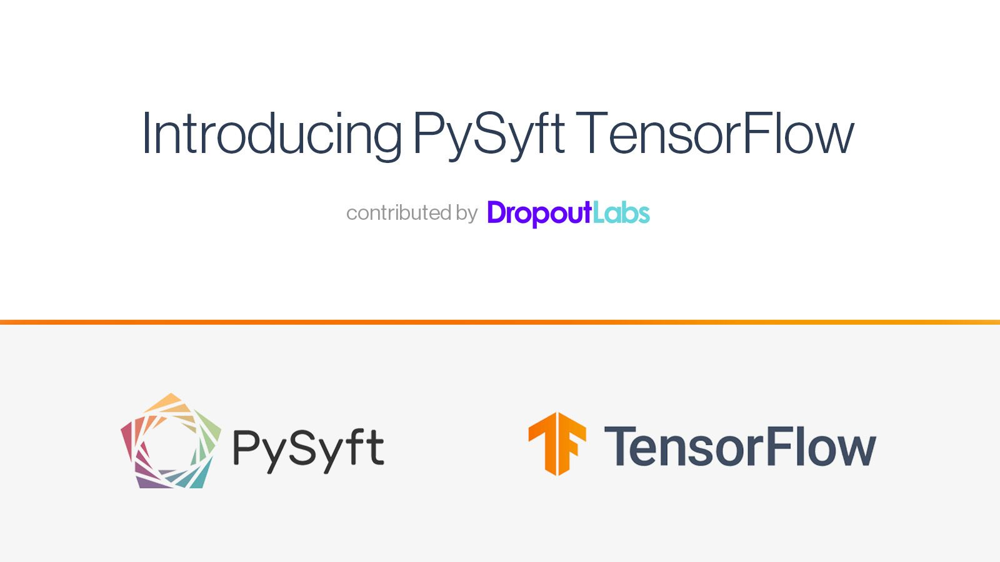

<!-- TODO(a11y): 2 localized body image(s) have empty alt text -->


**_Update as of November 18, 2021: The version of PySyft mentioned in this post has been deprecated. Any implementations using this older version of PySyft are unlikely to work. Stay tuned for the release of PySyft 0.6.0, a data centric library for use in production targeted for release in early December._**

_**Summary**: We’ve added support for TensorFlow in PySyft. The integration includes multi-worker remote execution on Tensors, Variables, and Keras Models. Full support for the TensorFlow API and integrations with TF Encrypted, TF Privacy, and TF Federated are on the roadmap. You can try our tutorial at [TensorFlow World](https://conferences.oreilly.com/tensorflow/tf-ca/public/schedule/detail/78557) or follow development on [GitHub](https://github.com/OpenMined/PySyft-TensorFlow)._

_This post has been cross-posted on the [Dropout Labs blog](https://medium.com/dropoutlabs/introducing-pysyft-tensorflow-cc361ac75137). If you want more posts like this, I’ll tweet them out when they’re complete at [@jvmancuso](https://twitter.com/jvmancuso), [@dropoutlabsai](https://twitter.com/dropoutlabsai), and [@OpenMinedOrg](https://twitter.com/OpenMinedOrg). Feel free to follow if you’d be interested in reading more, and thanks for all the feedback!_

<figure class="">



</figure>

As a community, OpenMined builds tools for [privacy-preserving machine learning (PPML)](https://medium.com/dropoutlabs/privacy-preserving-machine-learning-2018-a-year-in-review-b6345a95ae0f). Through this, the community can offer developers the opportunity to answer questions about data that they can’t see or own. This calls for a dramatic shift in how we apply algorithms to mine intelligence from that data, but only if developers are willing to use these tools. By baking privacy into the tools that data scientists and machine learning engineers know and love today, we can make data privacy a default instead of a luxury.

The initial [PySyft paper](https://arxiv.org/abs/1811.04017) from NeurIPS 2018 presents a generic platform for privacy-preserving machine learning (PPML) that leverages the community’s considerable investment into existing machine learning frameworks. Initially, this work focused on building privacy primitives into PyTorch. However, as a primary goal of the community is to make privacy-preserving machine learning accessible for all machine learning practitioners, it is core to our vision to extend all popular data science frameworks with tools for privacy.

At [Dropout Labs](https://www.dropoutlabs.com), we’ve been working hard to bring PPML tools into the TensorFlow community, with the ultimate goal of [bringing these tools into production in enterprise settings](https://privacy.ai). We’ve spent a lot of time talking to customers and investigating the use cases that interest companies most. We’ve found remote execution to be a particularly compelling use case for many companies — this involves remotely training a model on data that has restricted access. Since PySyft was built with secure remote execution at its core, it was clear that building on it would help us solve these kinds of problems for our customers.

As OpenMined and PySyft continue to grow, we are participating in a similar movement forming in the TensorFlow community, marked by the release of several privacy-focused, open-source libraries:

-   [TF Encrypted](https://tf-encrypted.io/): A framework for machine learning on encrypted data
-   [TF Privacy](https://github.com/tensorflow/privacy): Learning with differential privacy for training data
-   [TF Trusted](https://github.com/dropoutlabs/tf-trusted): Running TensorFlow models in secure enclaves
-   [TF Federated](https://www.tensorflow.org/federated): Machine learning and other computations on decentralized data

Until now, the PySyft and TensorFlow communities have developed side-by-side, aware of each other and inspiring each other to do better, but never truly working together.

Sitting within both OpenMined and the burgeoning TensorFlow PPML community, we felt we were best positioned to build a bridge. That began to take shape when we exposed [TF Encrypted’s Keras interface](https://github.com/OpenMined/PySyft/blob/044038c2ccff817bfb2891bd376f678105b6829f/examples/tutorials/Part%2013b%20-%20Secure%20Classification%20with%20Syft%20Keras%20and%20TFE%20-%20Secure%20Model%20Serving.ipynb) to PySyft users in the [Secure & Private AI course](https://www.udacity.com/course/secure-and-private-ai--ud185), and today we’re excited to bring these communities even closer together with the release of [PySyft TensorFlow](https://github.com/OpenMined/PySyft-TensorFlow).

Today’s release includes the structure on which we’ll build full TensorFlow support, focusing on remote execution of both low-level tensor operations and higher-level Keras models. Our main priority will be bringing full support for the TensorFlow API to PySyft, and we’re already very close! Once this step is complete, we’d love to see better integration with TF Encrypted, as well as future integrations with TF Privacy and TF Federated. Check out the code examples below, star the repo on GitHub if you haven’t yet, and run a demo with a new model or dataset.

## PySyft Basics

The basics of PySyft in TensorFlow are nearly identical to [what users are already familiar with](https://github.com/OpenMined/PySyft/tree/51b9d1b9f2d645a2cd62211e885477bd50d3b571/examples/tutorials) — in fact, the only changes are dictated by the switch from PyTorch to TensorFlow. For example, we’ll use a `syft.TensorFlowHook` the same way we’d use a `syft.TorchHook`:

```python
import tensorflow as tf
import syft

hook = syft.TensorFlowHook(tf)
```

Sending a tensor is as simple as creating it (here as a constant) and sending it to the right worker:

```python
alice = syft.VirtualWorker(hook, “alice”)

x = tf.constant([1., 2., 3., 4.])
x_ptr = x.send(alice)

print(x_ptr)
# ==> (Wrapper)>[PointerTensor | me:random_id1 -> alice:random_id2]
```

We can do the usual arithmetic and manipulation operations directly on these tensors:

```python
y_ptr = x_ptr + x_ptr
y = tf.reshape(y_ptr, shape=[2, 2])
id = tf.constant([[1., 0.], [0., 1.]]).send(alice)
z = tf.matmul(y, id).get()

print(z)  
# ==> tf.Tensor([[2. 4.]
#                [6. 8.]], shape=(2, 2), dtype=float32)
```

In fact, the only new aspects of PySyft with TensorFlow are the new tools that TensorFlow brings, like [tf.Variable](https://www.tensorflow.org/api_docs/python/tf/Variable):

```python
x = tf.expand_dims(id[0], 0)

# Initialize the weight
w_init = tf.initializers.glorot_normal()
w = tf.Variable(w_init(shape=(2, 1), dtype=tf.float32)).send(alice)
z = tf.matmul(x, w)

# Manual differentiation & update
dzdx = tf.transpose(x)
w.assign_sub(dzdx)

print("Updated: ", w.get())
```

Support for [tf.Module](https://www.tensorflow.org/api_docs/python/tf/Module) and [tf.GradientTape](https://www.tensorflow.org/api_docs/python/tf/GradientTape) are on the roadmap — if you want them for your use case, please reach out so we can prioritize accordingly!

## Training a model with Keras

<figure class="">

<video src="/blog/introducing-pysyft-tensorflow/pysyft-tensorflow-gif-v2.mp4" autoplay loop muted playsinline></video>

<figcaption>Remote training on sensitive data.</figcaption></figure>

Moving beyond the basics, we’ve also provided support for all Keras models out of the box. Here, we train a model on a remote version of the classic MNIST dataset.

First, we assume that the worker, `alice`, owns the MNIST dataset. In the case of VirtualWorker, we’ll simulate this by sending the data over explicitly.

```python
mnist = tf.keras.datasets.mnist
(x_train, y_train), (x_test, y_test) = mnist.load_data()
x_train, x_test = x_train / 255.0, x_test / 255.0

# Converting the data from numpy to tf.Tensor in order to have PySyft functionalities.
x_train, y_train = tf.convert_to_tensor(x_train), tf.convert_to_tensor(y_train)
x_test, y_test = tf.convert_to_tensor(x_test), tf.convert_to_tensor(y_test)

# Send data to Alice (for demonstration purposes)
x_train_ptr = x_train.send(alice)
y_train_ptr = y_train.send(alice)
```

The next step is to define a model locally, and compile it for training:

```python
model = tf.keras.models.Sequential([
  tf.keras.layers.Flatten(input_shape=(28, 28)),
  tf.keras.layers.Dense(128, activation='relu'),
  tf.keras.layers.Dropout(0.2),
  tf.keras.layers.Dense(10, activation='softmax')
])

# Compile with optimizer, loss and metrics
model.compile(optimizer='adam',
              loss='sparse_categorical_crossentropy',
              metrics=['accuracy'])
```

Sending a model is the same process as sending a tensor:

```python
model_ptr = model.send(alice)
print(model_ptr)
# ==> (Wrapper)>[ObjectPointer | me:random_id1 -> alice:random_id2]
```

And finally, you can train the model remotely by passing the dataset pointers to the Keras \`fit\` method:

```python
model_ptr.fit(x_train_ptr, y_train_ptr, epochs=2)
# ==> Train on 60000 samples
# Epoch 1/2
# 60000/60000 [==============================] - 2s 36us/sample - loss: 0.3008 - accuracy: 0.9129
# Epoch 2/2
# 60000/60000 [==============================] - 2s 32us/sample - loss: 0.1449 - accuracy: 0.9569
```

We encourage you to keep an eye on this [step-by-step tutorial series](https://github.com/OpenMined/PySyft-TensorFlow/tree/master/examples), which demonstrates additional features and will be continually updated in the future.

## Now it’s your turn

If you’re looking forward to building with PySyft for TensorFlow, let us know how we can help. We are actively encouraging requests and contributions from the community — opening issues, creating new demos, and submitting PRs with bug fixes and new features. You can also [apply to be a regular contributor on the TensorFlow Team](https://forms.gle/adhqWRo3ujbepSac6). It will take a village to build a fully privacy-preserving TensorFlow in PySyft!
