<!-- TODO(a11y): 5 localized body image(s) have empty alt text -->

A summary of the talk at the OpenMined Privacy Conference 2020

### Key Note Speakers

-   Mariya Georgieva :- Director of Security Innovation at Inpher.
-   Nicolas Gama :- Chief Scientist at Inpher

### Video Link

[https://www.youtube.com/watch?v=nn2fFpO4p9Q](http://)

## What is TFHE ?

### TFHE: Fast Fully Homomorphic Encryption over the Torus

TFHE is an open-source library for fully homomorphic encryption, distributed under the terms of the Apache 2.0 license.

TFHE is a C/C++ library which implements a very fast gate-by-gate bootstrapping, based on \[CGGI16\] and \[CGGI17\]. The library allows to evaluate an arbitrary boolean circuit composed of binary gates, over encrypted data, without revealing any information on the data.

### Use Cases

1.  Medicine – Find a Cure against COVID or Cancer
2.  Machine Learning on Genomic Data
3.  Physics/Astronautics – Predict Trajectories

In some cases, it may not be possible to run computations on plain text, as the text may not be available in a single location. For general machine learning, models must be trained. Combining datasets can result in more accurate models

The primary goal of secret computing is to run an arbitrary function over secret or private data in a public environment. This is what we call privacy-preserving computation.

### Main Privacy Preserving Techniques

-   Anonymization (Weakest Technique)
-   Differential Privacy
-   Federated Learning
-   Fully Homomorphic Encryption (FHE)
-   Multi Party Computation (MPC)
-   Secure Enclave (Hardware)

### Homomorphic Encryption

#### What is it?

A cryptosystem is homomorphic if and only if its decryption is a morphism

_Decrypt(ab)=Decrypt(a)Decrypt(b)_

where \* is sum, product, NAND, etc

#### What are the goals ?

-   Publicly operate on ciphertexts without decryption
-   Be end-to-end semantically secure
-   Secure against honest but curious adversaries

### HES Community

-   An Open Consortium of Industry, Government and Academia to standardize Homomorphic encryption
-   Regular Meetings (1-2 Per Years)
-   Four White Papers on
    -   Security
    -   Applications
    -   Standards
    -   Schemes (BFV/BGV/CKKS/FHEW/TFHE)

### Open Source Libraries

1.  [TFHE Open Source Library](https://tfhe.github.io/tfhe/) – Faster Bootstrapping.
    
2.  [SEAL Open-Source Library](https://github.com/Microsoft/SEAL) – Library from Microsoft which supports the BFV and CKKS schemes.
    
3.  [HElib Open-Source Library](https://github.com/homenc/HElib) – Library from IBM which supports the BGV and CKKS schemes.  
    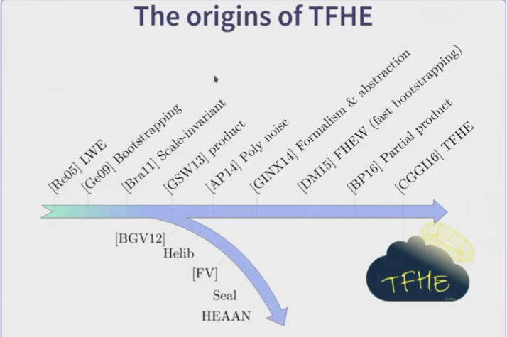
    

### [The TFHE-Chimera Library](https://blog.openmined.org/introduction-to-thfe-and-its-applications/tfhe.github.io)

Features :

1.  One very “simple” FHE Boolean API
2.  “Advanced” API featuring various computation models:  
    \* SIMD Additions, Rotations  
    \* Deterministic (Weighted) Automata  
    \* Chain of Lookup Tables

### The Gate Bootstrapping API

Public API v1.0

1.  Keygen secret and cloud keysets
2.  Encrypt, Decrypt with secret keyset
3.  Boots, Gate: CST, AND, OR, XOR, NOT, Mux
4.  Serialization : Load, Save

### Yao’s Millionare Problem (1982)

<figure class="">

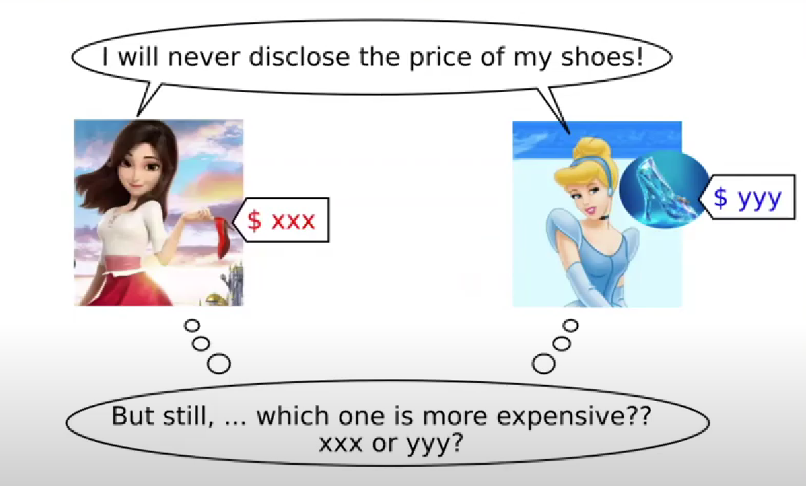

<figcaption>The following problem can be solved using TFHE</figcaption></figure>

<figure class="">

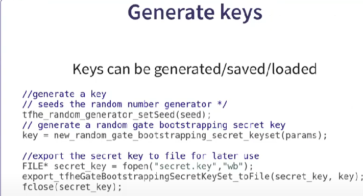

<figcaption>Parameter generation for 128-bit security</figcaption></figure>

<figure class="">

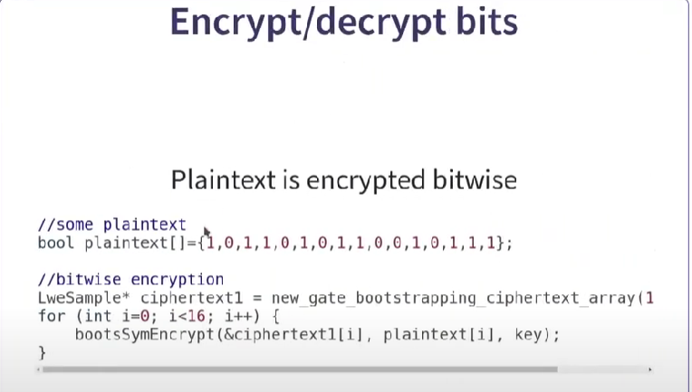

<figcaption>Plaintext is encrypted bitwise</figcaption></figure>

## The Comparison Circuit

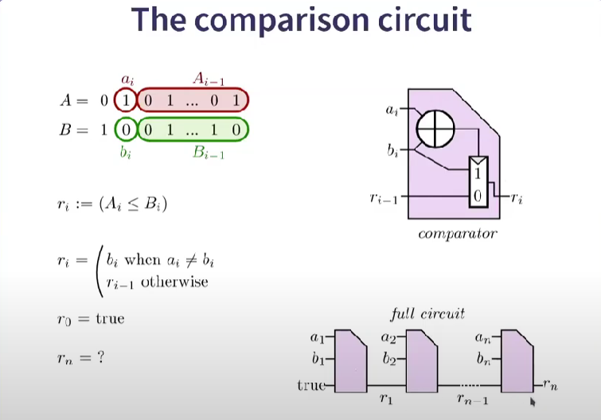

## Homomorphic circuit – full circuit

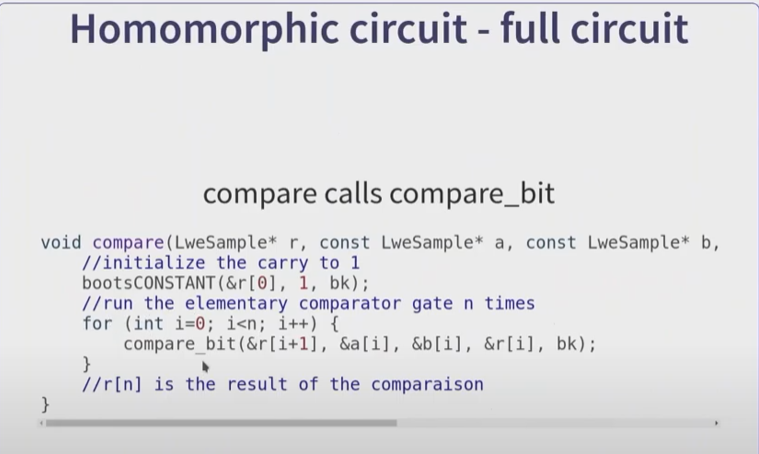

## Gate Bootstrapping: Summary

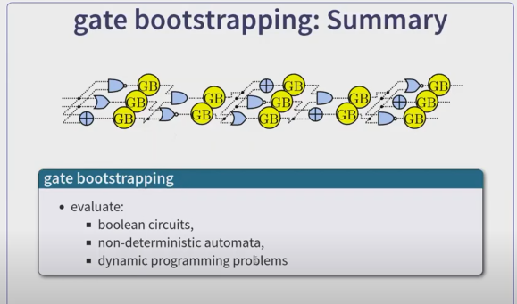

### TFHE Supports other computational models

Some of the computational models supported are

1.  SIMD Additions + Secret Shifts – Native Operations
2.  Packing, Unpacking, linear maps – Public and private functional keyswitches with small keys
3.  Weighted Automata – Good for tropical algebra (max,+) and arithmatic circuits
4.  LUT with Vertical Packing – Rapidly evaluates complex circuits

<figure class="">

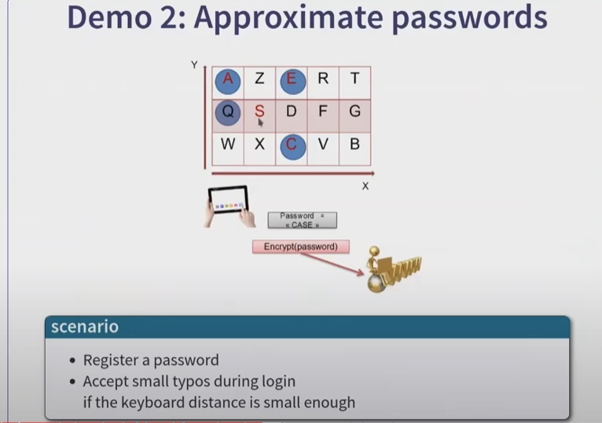

</figure>

<figure class="">

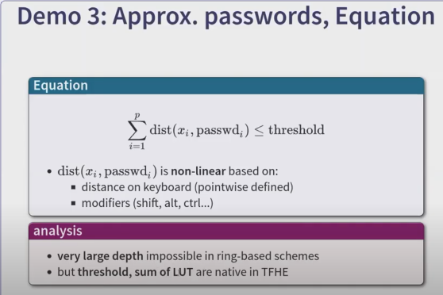

</figure>

## Application of THFE

### Medicine/Genomic

1.  Predictive Healthcare
2.  Finding the right dosage for a cure
3.  Secure Genotype Imputation
4.  Understanding Complex Diseases : GWAS

### Analyst

#### Goal : Test the associates between genotypes and phenotypes

-   In order to identify generic variants associated with a trait
-   Powerful approach for understanding complex diseases (Diabetes, Heart Abnormalities, Parkinson & Crohn Disease, COVID-19)

#### Genomic Service Provider

-   Server stores an encrypted database from study participants
-   Train models on the encrypted data  
    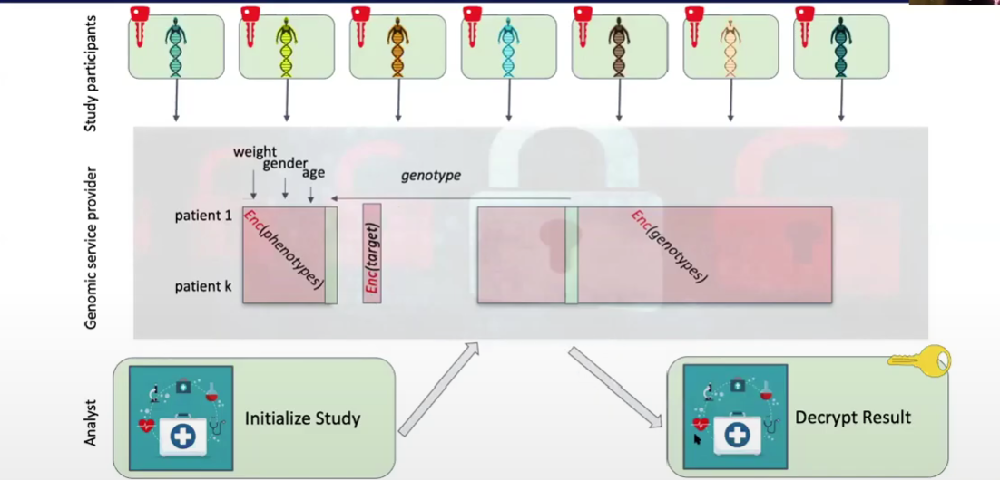

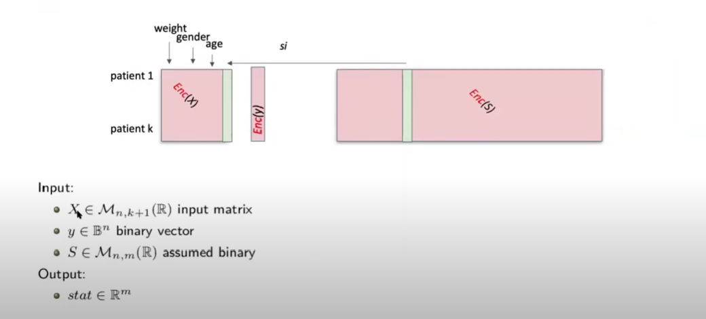

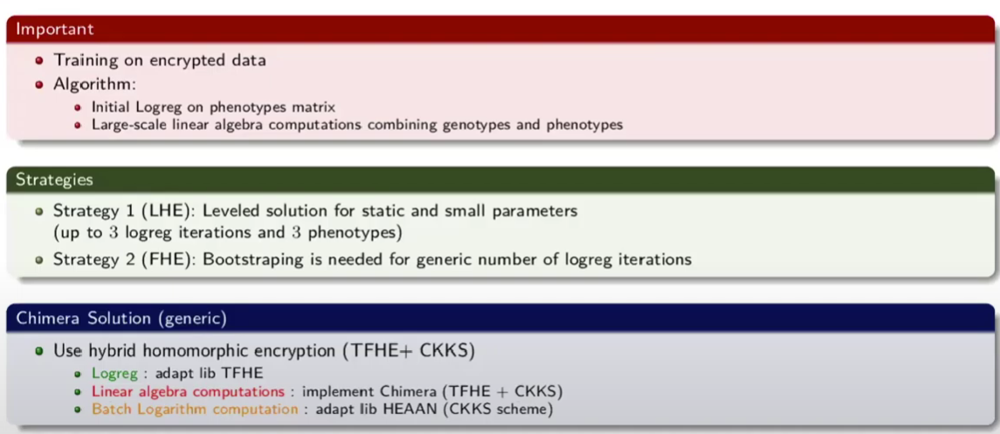

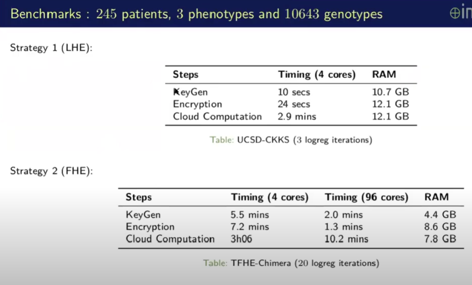

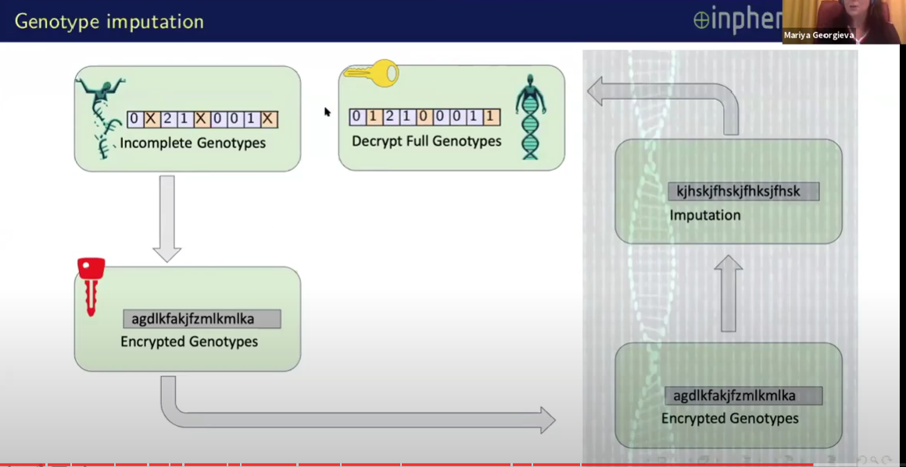

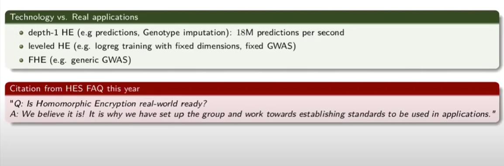
