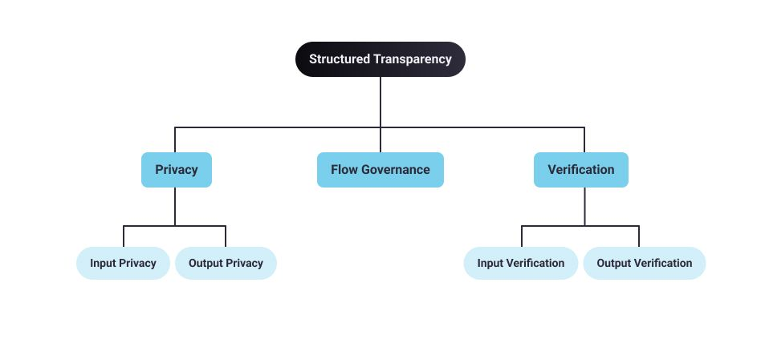

<!-- TODO(a11y): 1 localized body image(s) have empty alt text -->

[**Structured Transparency**](https://arxiv.org/pdf/2012.08347.pdf) \[1\] is a framework for creating _ideal_ information flows that guarantees that certain data only flows to the right destination while ensuring that data is simultaneously kept safe, private and verifiable. This is based on the concept of [**contextual integrity**](https://www.andrew.cmu.edu/user/danupam/bdmn-oakland06.pdf) \[2\] developed by Professor Helen Nissenbaum at Cornell Tech.

The basic idea is that privacy isn’t about never sharing any personal data with anyone. Rather, **privacy is** **dependent on people’s privacy expectations, legal and societal norms and** _**context**_**.** For example, sharing medical data with a doctor to obtain a diagnosis or treatment is OK; but sharing that same data with an insurance company or our employer is not.

Structured Transparency provides a model for how to create a balance between privacy and transparency in any given situation.

<figure class="">

<figcaption>Five Principles of Structured transparency</figcaption></figure>

## **Five Principles of Structured Transparency**

Structured Transparency-based systems adhere to the following five principles:

### **Input Privacy**

Input Privacy allows input information to be processed without an intermediary having access to it. This is similar to mail service guarantees that assure us that envelopes protect their content from access by a postman or the mail service. Input privacy _facilitates the flow of information from A to B_ _without leaking collateral data_.

### **Output Privacy**

Output privacy prevents the output of the information flow from being reverse engineered to reveal additional information about the input or sender. Output privacy is about _preventing the recipient from inferring the specific inputs_.

In the sealed letter example, output privacy guarantees that the letter recipient could not deduce sensitive information that the author did not want to include in the message.

### **Input Verification**

Input verification allows the information recipient to verify that information they receive from an information flow is sourced from entities they trust, and allows information sharers to send information  in such a way that the output can be verifiably associated with them.

This is equivalent to signing a legal document, that is, in theory making a verifiable mark that only you can make. In a digital context, this means that the information recipient can verify specific attributes of an input to an information flow, such as that it came from a trusted source or occurred within a specific date range.

### Output Verification

Output verification allows you to verify the attributes of any information processing (computation) within an information flow. This is similar to auditing by an accountant to ensure that a tax return (the output) was based on legally compliant accounts and calculations (the inputs).

### **Flow Governance**

Flow governance is satisfied if each party/data owner with concerns over how information should be used has guarantees that the information flow will preserve its intended use.

In the legal world, trusts, escrow and executors are widely-used legal mechanisms to ensure flow governance. In the physical world, safety-deposit boxes for holding secure documents accomplish similar goals.

## **Tools For Achieving Technical Structured Transparency**  

We need to find ways to maximize transparency and beneficial data utilisation while also maximizing privacy, accountability and control. Various technologies, collectively referred to as **Privacy Enhancing Technologies** or **PETs** are techniques for facilitating any arbitrary computation while keeping the computation inputs secret from all parties involved.

These techniques come primarily from the field of cryptography — public-key cryptography, end-to-end encryption, secure multi-party computation, differential privacy, homomorphic encryption, functional encryption, garbled-circuits, oblivious RAM, federated learning and on-device analysis.

PETs enable a new kind of data analysis/computation where certain data-dependent questions could be answered _using data we cannot see_. These technical tools are still being developed and fine tuned by researchers and technology companies around the world.

There are still a few wrinkles – PETs require complex computation and to improve trust in the computation we need model transparency and explainability. We also need clearer regulatory guidance on how organisations can use PETs to comply with global privacy laws. Humans will inevitably still be required in the loop to ensure legal compliance and validate that these technologies perform well and produce results that are accurate, fair and unbiased.

Please follow this series for further summary of lessons from the course \[3\].

## References:

\[1\] [https://arxiv.org/pdf/2012.08347.pdf](https://arxiv.org/pdf/2012.08347.pdf)

\[2\] [https://www.andrew.cmu.edu/user/danupam/bdmn-oakland06.pdf](https://www.andrew.cmu.edu/user/danupam/bdmn-oakland06.pdf)

\[3\] [https://courses.openmined.org/courses/our-privacy-opportunity](https://courses.openmined.org/courses/our-privacy-opportunity)

## Acknowledgements:

Thanks to Kyoko from Design team for the beautiful graphics
