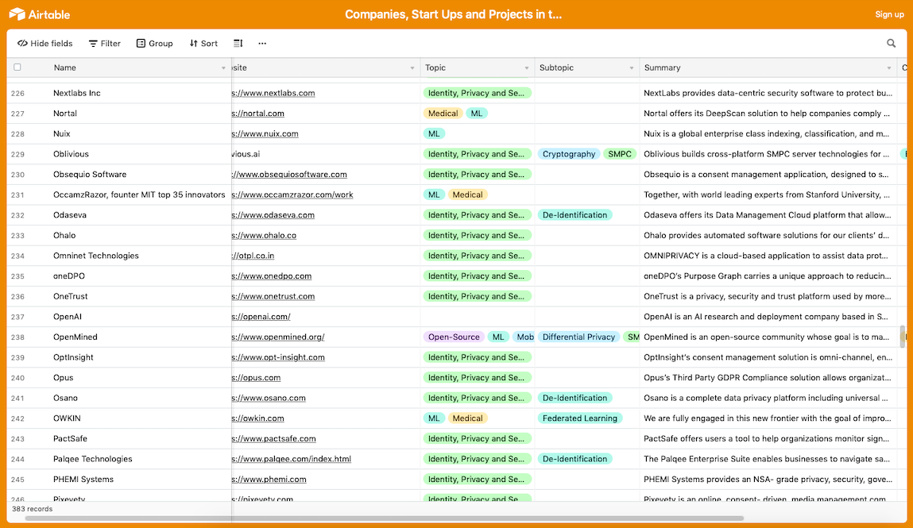
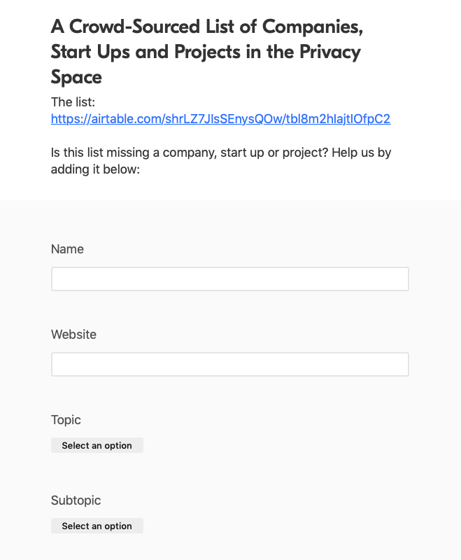

<!-- TODO(a11y): 2 localized body image(s) have empty alt text -->

The data protection market is estimated to reach $119 billion by 2022 — this projection highlights the pivotal role the field has in society. We constantly rely on a secure grid in which data can be safely stored, accessed, and shared across the broad services we utilise, from healthcare and research to finance, across private and public sectors.

Not surprisingly, a lot of people have asked us ‘what are all the companies in the privacy and security space?’ — so we curated a list! We found almost 400 companies in the privacy sector that can now be accessed here: [**_List of Companies in the Privacy Space_**](https://airtable.com/shrLZ7JIsSEnysQOw/tbl8m2hIajtIOfpC2)

Most of the companies specialise in security, identity and privacy solutions. Many focus on GDPR compliance, de-anonymization or secure data sharing. This list covers the broad data protection market, encompassing its many facets, thus the solutions and services provided vary widely and so do the techniques employed (cryptography, machine learning,  federated learning, homomorphic encryption, differential privacy, de-identification, etc) depending on the end purpose.

<figure class="">

</figure>

To ensure we do not miss any company/startup/project in this field and given we are an open and collaborative community, you can add them to this list by filling in this form [**HERE**](https://airtable.com/shruG4sot54ZWLojj)**.**

<figure class="">

</figure>

Keep an eye on this space, since like the data protection market’s forecast, this list will continue growing!
