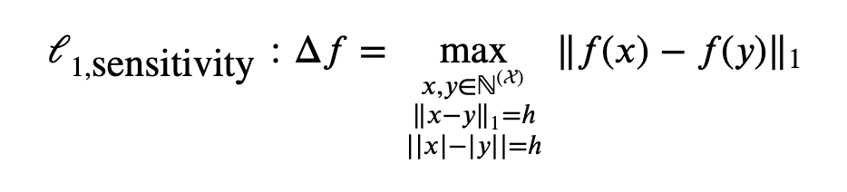
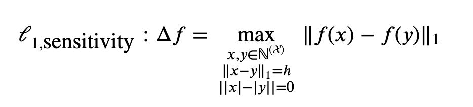
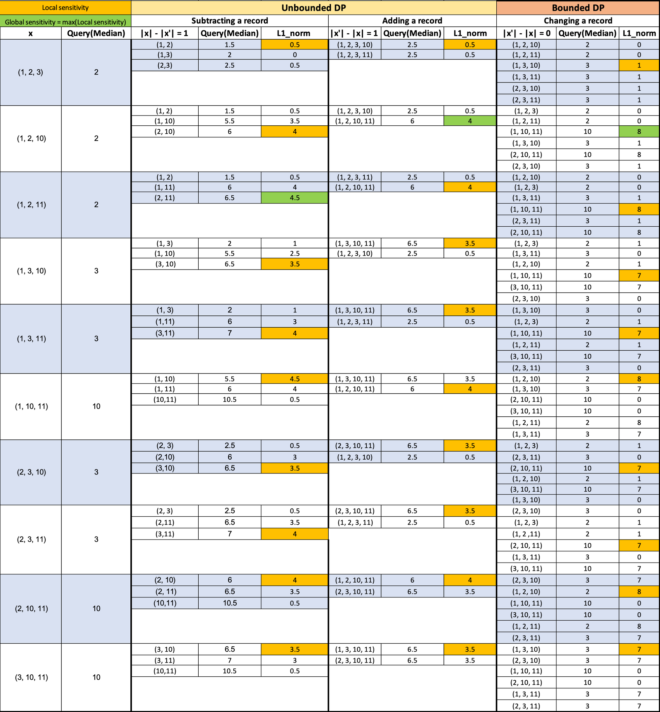
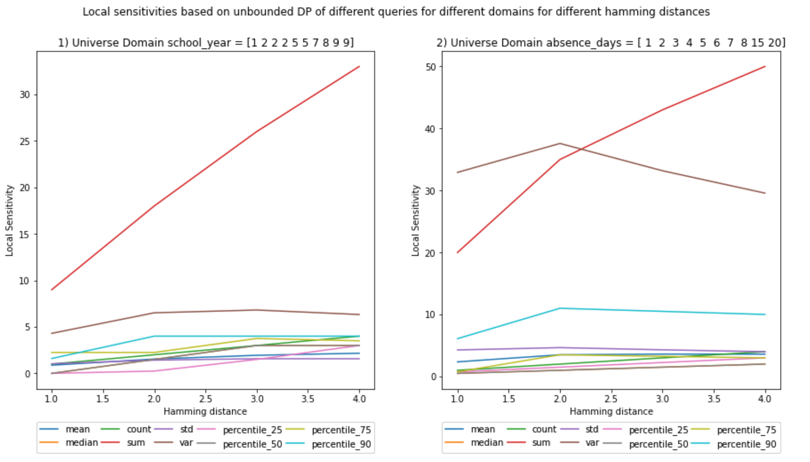
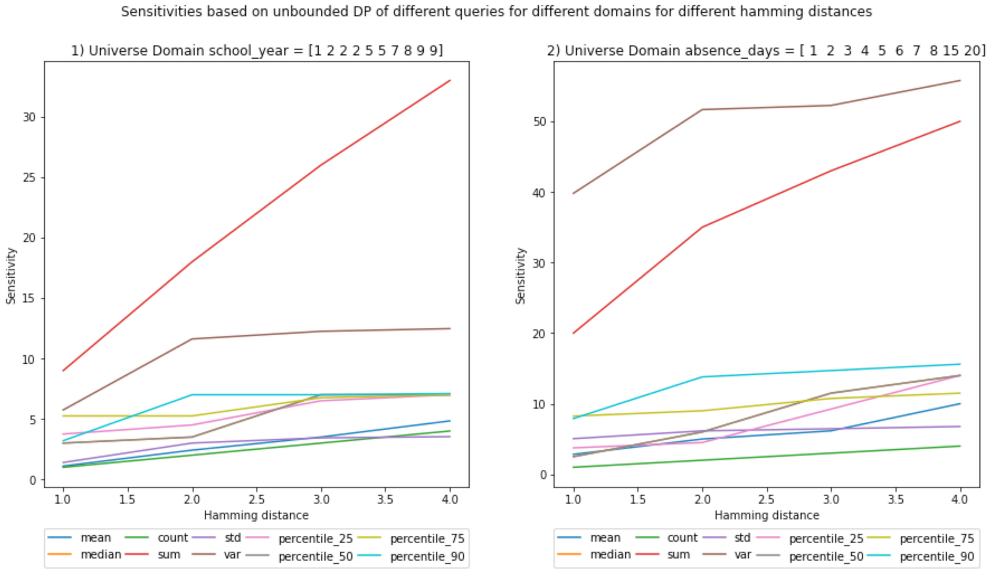
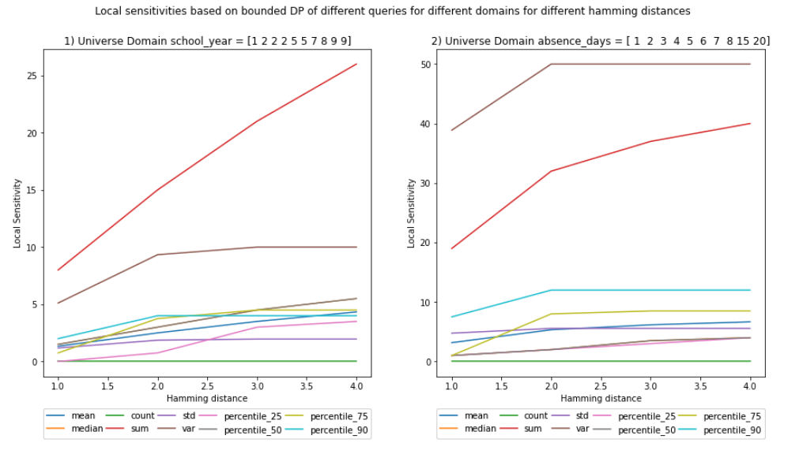
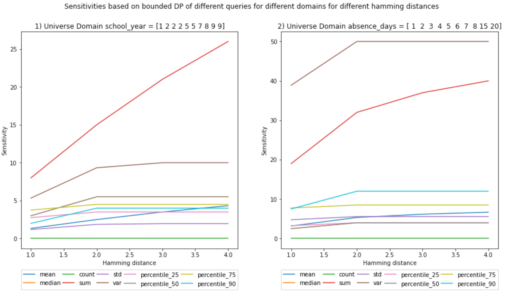

<!-- TODO(a11y): 1 localized body image(s) have empty alt text -->


<!-- TODO(content): shortcode(s) present (verify) -->

## Goal

The goal of this [notebook](https://github.com/gonzalo-munillag/Blog/blob/main/My_implementations/Local_sensitivity/Local_Sensitivity.ipynb) is to implement the calculation of local sensitivity from scratch.  
I benchmarked the results of these experiments against the results of the global sensitivity from my previous [blog post](https://github.com/gonzalo-munillag/Blog/tree/main/My_implementations/Global_sensitivity).

## Background

Local sensitivity differs from global sensitivity in that it considers only the dataset to be released and not all the possible release datasets.  
This means that one calculates the neighbors of the released dataset and not of all possible datasets.  
Furthermore, it is only within these neighbors and their corresponding release dataset where one finds the maximum L1 norm.  
Global sensitivity is, therefore, an upper bound of local sensitivity.

**Note: Unbounded sensitivity can be achieved in 2 ways, either by adding or subtracting records. In this notebook, I computed both at the same time and chose the one that yielded the highest sensitivity. However, I would say that in a real scenario, one could take either and calculate the sensitivity, as both equally protect the privacy of the individuals in the records. However, it is true that for the same privacy guarantees, one might use less noise than the other. This is an object for discussion.**

### Contributions of the notebook

1.  I programmed two functions to calculate the local sensitivity of a dataset empirically.
2.  I compared local and global sensitivity results.
3.  I present a visualization of sensitivities for a median query, to show how to calculate sensitivities locally and how bounded and unbounded sensitivity differ visually

### Tricky questions for clarification

-   If local sensitivity would imply less noise due to its smaller value, then why do we not always use local sensitivity?  
    If for each dataset you would calculate its particular local sensitivity, an adversary could also consider this when plotting noise distributions of the different possible released dataset combinations. These distributions would have a lower std (local sensitivity is lower than global sensitivity, and, therefore, less noise), and thus, once the adversary gets a query DP result, it would be easier for him/her to discard possible release datasets (A visual representation of this process carried out by an attacker is in the [paper](https://git.gnunet.org/bibliography.git/plain/docs/Choosing-%CE%B5-2011Lee.pdf) I implemented 2 blog posts ago, depicted in Figs. 1 and 3). That is why some researchers invented smooth bounds for local sensitivities, but that is out of the scope of this blog post.

### Comments

**TIP**: The best way to understand this notebook better is to open my previous [notebook](https://github.com/gonzalo-munillag/Blog/tree/main/My_implementations/Global_sensitivity), and go through the visualizations of scenario (a), cells 25 and 33 to compare the results.

### Results

You can see the comparisons of the plots between local and global sensitivities and a visual representation of how sensitivity is calculated. (**Ignore the decimals on the x-axis, Hamming distances are integers**)

For the visual representation, we have chosen:

-   Universe of possible values: X = {1, 2, 3, 10, 11}
-   Release dataset size (cardinality) = 3
-   Hamming distance = 1
-   x are all the possible value combinations from X
-   x’ are all the possible neighbors for each x
-   Neighbor’s cardinality difference is set to the Hamming distance of 1, | |x| – |x’| | = 1
-   The L1 norm is calculated with the median of the possible release datasets (on the 2nd column) and with each of the medians of each neighboring dataset.
-   I select the first maximum for each group of L1 norms (The first cell in the column that has the highest value of the column).

Notice that I calculated the local sensitivities on the horizontal axis; there is one per possible release dataset (first column). The global sensitivity is calculated in the vertical axis, selecting the maximum value out of all the L1 norms, i.e., selecting the maximum out of all local sensitivities.

The general form of L1 unbounded sensitivity:



General form of L1 bounded sensitivity:





**Here come the figures!**

**(Ignore the decimals on the x-axis, hamming distances are integers)**

#### UNBOUNDED – Local Sensitivity



It is interesting to see that the sensitivity for variance declines and at least for the sum the local sensitivity seems to be equal to the global sensitivity.  
The rest have lower values. This means that this particular dataset is the one with the maximum sensitivity for sum.

##### Vs.

#### UNBOUNDED – Global Sensitivity



#### BOUNDED – Local Sensitivity



##### Vs.

#### BOUNDED – Global Sensitivity



At a first glance, the bounded local and global sensitivities seem equal, but if you pay close attention, for some queries they are not.

### Notebook

I use the same datasets as in the previous [blog post](https://blog.openmined.org/global-sensitivity/).

Here is the code for calculating the local sensitivity for unbounded DP:

```python
def unbounded_empirical_local_L1_sensitivity(universe, universe_subset, columns, query_type, hamming_distance, percentile=50):
    """
    INPUT:
        universe - (df ot dict) contains all possible values of the dataset
        universe_subset - (df or dict) contains the subset chosen for the release dataset
        columns - (array) contains the names of the columns we would like to obtain the sensitivity from
        query_type - (str) contain the category declaring the type of query to be later on executed
        hamming_distance - (int) hamming distance between neighboring datasets
        percentile - (int) percentile value for the percentile query
        
    OUTPUT:
        unbounded_global_sensitivity - (float) the unbounded global sensitivity of the input universe
        
    Description:
    It claculates the global sensitivity of an array based on the knowledge of the entire universe of 
    the dataset and query_type.
    """
    # Check if the values for the hamming distance and universe sizes comply with the basic constraints
    # verify_sensitivity_inputs(universe.shape[0], universe_subset.shape[0], hamming_distance)
    verify_sensitivity_inputs(universe.shape[0], universe_subset.shape[0], hamming_distance)

    # We initialie the type of query for which we would like calculate the sensitivity
    query = Query_class(query_type)
    
    # We will store the sensitivity of each column of the dataset containing universe in a dictionary
    unbounded_global_sensitivity_per_colum = {}
    
    for column in columns:
                
        # 1) RELEASE DATASET /// it could be a dataframe or a tupple
        try:
            release_dataset = universe_subset[column]
        except:
            release_dataset = universe_subset

        # 2) |NEIGHBORING DATASET| < |RELEASE DATASET| //// cardinalities           
        neighbor_with_less_records_datasets = itertools.combinations(release_dataset, 
            universe_subset.shape[0] - hamming_distance)
        neighbor_with_less_records_datasets = list(neighbor_with_less_records_datasets)
               
        # 3) |NEIGHBORING DATASET| > |RELEASE DATASET| //// cardinalities           
        symmetric_difference = list((Counter(universe[column]) - Counter(release_dataset)).elements())
        neighbor_possible_value_combinations = itertools.combinations(symmetric_difference, hamming_distance)
        neighbor_possible_value_combinations = list(neighbor_possible_value_combinations)

        neighbor_with_more_records_datasets = []
        for neighbor_possible_value_combination in neighbor_possible_value_combinations:

            # We create neighboring datasets by concatenating the neighbor_possible_value_combination with the release dataset
            neighbor_with_more_records_dataset = np.append(release_dataset, neighbor_possible_value_combination)
            neighbor_with_more_records_datasets.append(neighbor_with_more_records_dataset)          
        
        # 4) For each possible release datase, there is a set of neighboring datasets 
        # We will iterate through each possible release dataset and calculate the L1 norm with 
        # each of its repspective neighboring datasets
        L1_norms = []

        release_dataset_query_value = query.run_query(release_dataset, percentile)

        L1_norm =  L1_norm_max(release_dataset_query_value, neighbor_with_less_records_datasets, query, percentile)
        L1_norms.append(L1_norm)
        L1_norm =  L1_norm_max(release_dataset_query_value, neighbor_with_more_records_datasets, query, percentile)
        L1_norms.append(L1_norm)
        
        # We pick the maximum out of all the maximum L1_norms calculated from each possible release dataset
        unbounded_global_sensitivity_per_colum[column] = max(L1_norms)
        
    return unbounded_global_sensitivity_per_colum
```

And, here is the code to calculate the local sensitivity for bounded DP:

```python
def bounded_empirical_local_L1_sensitivity(universe, universe_subset, columns, query_type, hamming_distance, percentile=50):
    """
    INPUT:
        universe - (df) contains all possible values of the dataset
        universe_subset - (df or dict) contains the subset chosen for the release dataset
        columns - (array) contains the names of the columns we would like to obtain the sensitivity from
        query_type - (str) contain the category declaring the type of query to be later on executed
        hamming_distance - (int) hamming distance between neighboring datasets
        percentile - (int) percentile value for the percentile query

    OUTPUT:
        bounded_global_sensitivity - (float) the bounded global sensitivity of the input universe
        
    Description:
    It claculates the global sensitivity of an array based on the knowledge of the entire universe of 
    the dataset and query_type.
    """
    
    # Check if the values for the hamming distance and universe sizes comply with the basic constraints
    verify_sensitivity_inputs(universe.shape[0], universe_subset.shape[0], hamming_distance)
    
    # We initialie the type of query for which we would like calculate the sensitivity
    query = Query_class(query_type)
    
    # We will store the sensitivity of each column of the dataset containing universe in a dictionary
    bounded_global_sensitivity_per_column = {}
    
    for column in columns:
        
        # We calculate all the possible release datasets
        # First we obtain the combinations within the release dataset. The size of this combinations is not the original size
        # but the original size minus the hamming_distance /// it could be a dataframe or a tupple
        try:
            
            release_i_datasets = itertools.combinations(universe_subset[column], universe_subset.shape[0] - hamming_distance)
        
        except:
            
            release_i_datasets = itertools.combinations(universe_subset, universe_subset.shape[0] - hamming_distance)

        release_i_datasets = list(release_i_datasets)
        
        # it will contain sets of neighboring datasets. The L1 norm will be calculated between these sets. The maximum will be chosen
        # The datasets from different groups do not necesarilly need to be neighbors, thus we separate them in groups
        neighbor_dataset_groups = []
        for release_i_dataset in release_i_datasets:

            # second we calculate the combinations of the items in the universe that are not in the release dataset
            # the size of a combination is equal to the hamming distance. This will not discard duplicates
            symmetric_difference = list((Counter(universe[column]) - Counter(release_i_dataset)).elements())
            release_ii_datasets = itertools.combinations(symmetric_difference, hamming_distance)
            release_ii_datasets = list(release_ii_datasets)
            
            # We create neighboring datasets by concatenating i with ii
            neighbor_datasets = []
            for release_ii_dataset in release_ii_datasets:

                neighbor = list(release_i_dataset + release_ii_dataset)
                neighbor_datasets.append(neighbor)   
            
            neighbor_dataset_groups.append(neighbor_datasets)

        # We calculate the L1_norm for the different combinations with the aim to find the max
        # We can loop in this manner because we are obtaining the absolute values
        L1_norms = []
        for m in range(0, len(neighbor_dataset_groups)):
        
            for i in range(0,  len(neighbor_dataset_groups[m])-1):

                for j in range(i+1, len(neighbor_dataset_groups[m])):

                    L1_norm = np.abs(query.run_query(neighbor_dataset_groups[m][i], percentile) - query.run_query(neighbor_dataset_groups[m][j], percentile))
                    L1_norms.append(L1_norm)

            bounded_global_sensitivity_per_column[column] = max(L1_norms)

    return bounded_global_sensitivity_per_column
```

And here we do some plotting:

```python
plt.figure(figsize=(15, 7))
 
query_types = ['mean', 'median', 'count', 'sum', 'std', 'var', 'percentile_25', 'percentile_50', 'percentile_75', 'percentile_90']

x_values = []
for key in unbounded_sensitivities.keys():
    
    x_values.append(key)
    
for inedx_column, column in enumerate(columns):
    
    # Start the plot
    plot_index = int(str(1) + str(len(columns)) + str(inedx_column+1))
    plt.subplot(plot_index)
    
    query_type_legend_handles = []
    for query_type in query_types:
        
        y_values = []
        for hamming_distance in unbounded_sensitivities.keys():
                           
            y_values.append(unbounded_sensitivities[hamming_distance][query_type][column])   
            
        # plot the sensitivities
        legend_handle, = plt.plot(x_values, y_values, label=query_type)
        query_type_legend_handles.append(legend_handle)
        
    # Legends
    legend = plt.legend(handles=query_type_legend_handles, bbox_to_anchor=(0., -0.2, 1., .102), 
                        ncol=5, mode="expand", borderaxespad=0.)
    legend_plot = plt.gca().add_artist(legend)
    
    # axis labels and titles
    plt.xlabel('Hamming distance')
    plt.ylabel('Local Sensitivity')
    plt.title('{}) Universe Domain {} = {}'.format(inedx_column+1, column, D_large_universe[column].values))

plt.suptitle('Local sensitivities based on unbounded DP of different queries for different domains for different hamming distances')
plt.show()
;
```

<figure class="">


</figure>

It is interesting to see that the sensitivity for variance declines and at least for the sum the local sensitivity seems to be equal to the global sensitivity. The rest have lower values. This means that this particular dataset is the one with the maximum sensitivity for sum.

This post has covered the most salient contributions of the notebook, however, there is more to see! Check the [notebook](https://github.com/gonzalo-munillag/Blog/blob/main/My_implementations/Local_sensitivity/Local_Sensitivity.ipynb) to have a better understanding of the intricacies of local sensitivity vs. global.

**THE END**
