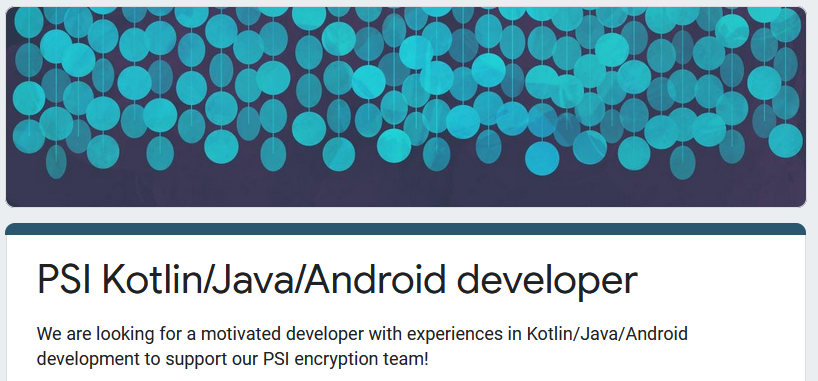

<!-- TODO(a11y): 1 localized body image(s) have empty alt text -->

### Our efforts in PSI

We recently published an article shining light on private set intersection (PSI) and  its use in the COVID-19 crisis. We are currently developing an open source library for PSI. You can find an overview for the PSI approaches we follow with our libraries in the same article [here](https://blog.openmined.org/private-set-intersection/).

### What we bring to the table

You can expect a highly motivated team with experience in software engineering and cryptography, focused on delivering our PSI protocol into COVID-19 contact tracing apps out there. It is fun and fulfilling work at the forefront of having an impact on the current crisis by leveraging cutting edge cryptography technology.

The core library we will focus on for the future is our PSI cardinality approach, currently written in C++, which we want to wrap for other languages like Python and Javascript, for which we have expertise on the team, but also for Kotlin/Java/Android, where we are looking for support. You can find our library [here](https://github.com/OpenMined/PSI).

One of our app partners, the ITO team ([https://www.ito-app.org/](https://www.ito-app.org/)), part of the TCN coalition like OpenMined and apheris AI ([https://tcn-coalition.org/](https://tcn-coalition.org/)), want to adopt our PSI library, and so we need support to write a Kotlin/Java/Android wrapper for our library.

### What you bring to the table

You have experience in Kotlin/Java/Android!? Ideally you could bridge the gap between C++ and Kotlin/Java/Android.

After this effort, there are multiple other avenues around Kotlin/Java/Android integrations in the OpenMined universe we can point you at!

### Inclined to join?

If are motivated to learn and contribute, please leave your info in the following form and we will reach out to you.

[CLICK HERE](https://forms.gle/KZZ4YiTut6uT6JGR9) to fill out our google form!

<figure class="">

</figure>

Hope to have you in the team soon!
