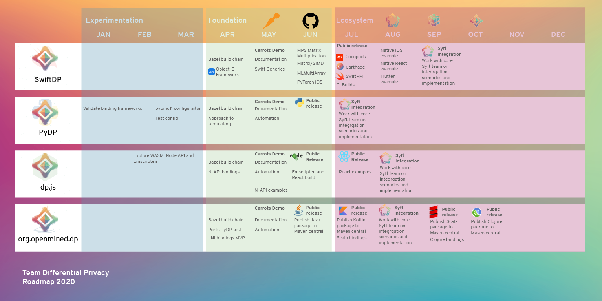

<!-- TODO(a11y): 1 localized body image(s) have empty alt text -->

Team DP has been tasked with delivering differential privacy as a simple to use package for app developers, data engineers and machine learning gurus. The demand for easy access to this privacy preservation technique is pretty clear:

-   Research projects run by academic institutions want access to as much private data from as many source as possible to increase the authenticity and accuracy of their evidence-based work.
-   Private instutions are always looking for new and innovative ways to serve their customers. Understanding their behaviour using modern techniques like machine learning, RPA and real-time analytics is only really effective if access to private data is available.
-   The pandemic that we are all facing together has become the catalyst to accelerate these efforts!  The global community is hungry to share and consume data to track transmission patterns to improve the effectiveness of our response to this modern catastrophe.

Sensitive and personal data is a real blocker for all these efforts. Traditional anonymisation techniques experience significant trade-off in utility for their protections. These older techniques also are prone to re-identification by combining with other data sets!

This is where Team DP comes in – we _will lower the barrier of entry by creating intuitive and powerful tools that work with industry standard frameworks. We will champion the adoption of these tools through creation and compilation of easy to follow resources and documentation._

### Our Projects

We have four teams who have all started in the last three months! If you want to help out then apply [here](https://docs.google.com/forms/d/1XXlPDBkV2xOZmMZMSyw-_KAAjs93CLWmp4Gb0Ql-s_g).

-   [PyDP: Python wrapper for Google’s Differential Privacy project](https://github.com/OpenMined/PyDP)
-   [dp.js: Javascript wrapper for Google’s Differential Privacy project](https://github.com/OpenMined/dp.js)
-   [org.openmined.dp: Google’s DP project in Java family of languages (Java, Scala, Kotlin)](https://github.com/OpenMined/org.openmined.dp)
-   [SwiftDP: Swift wrapper for Google’s Differential Privacy Project](https://github.com/OpenMined/SwiftDP)

### Our Roadmap for 2020

Below is our first roadmap. We are focusing on wrapping [Google’s C++ Differential Privacy library](https://github.com/google/differential-privacy) in as many shapes and sizes as are practical! We are aiming to support major package managers, frameworks and languages. We are also looking forward to stitching our efforts into the exisitng OpenMined ecosystem.

Over the coming weeks I’ll be highlighting each project, talking about the design decisions we’ve made and introducing you to our team leads and their vision!

<figure class="">

<figcaption>Team DP – Roadmap for 2020</figcaption></figure>

### Themes

We’ve chosen to align our roadmap to a set of themes that represent our growing maturity and understanding of the problem space. Open source projects don’t have the luxury of years of business approvals, planning and strategy but we are staffed by some of the smartest minds around! We are better at learning quickly and applying those lessons even quicker.

-   **Experimentation** – We spent the first few months of the year looking at different ways we could tackle the problem of exposing all the benefits of a first class C++ library whilst getting the most out of these modern platforms. There were certainly a few “architectural spikes” that did not go anywhere fast, but we also found value in unexpected places! (Looking at you [pybind11](https://pybind11.readthedocs.io/en/stable/)!)
-   **Foundation –** This is where we are today. We are busy assembling the building blocks needed to for all the packages we plan to deliver. A big deal here is replicating the “Carrots” demo that the Google DP library includes for each platform. Future blog posts will detail all the challenges we faced and the sometimes techniques to overcome them!
-   **Ecosystem –** Once we have our base builds it is time to pivot to the ecosystem. We need to connect our packages to OpenMined projects like [PyGrid](https://github.com/OpenMined/PyGrid/) and [PySyft](https://github.com/OpenMined/PySyft). We also need to ensure that our work is available through NPM, Yarn, Conda, Cocobeans, Carthage, Maven, Docker and other commonly used package managers. This theme is all about making sure what we do can actually be used in a practical way by the rest of the world.

### Thanks and talk soon!

Thanks for checking out this first installment of what will be a bit of a war journal of the efforts of Team DP. Please join us on [Slack](https://join.slack.com/t/openmined/shared_invite/zt-dvd2kmnk-TMcwvScAxd0Uh25imZc3QA) now!

Also feel free to connect with me (Ben Szymkow) directly at my [twitter](https://twitter.com/BenjaminSzymkow) or [LinkedIn](https://www.linkedin.com/in/benjaminszymkow/) profiles!
