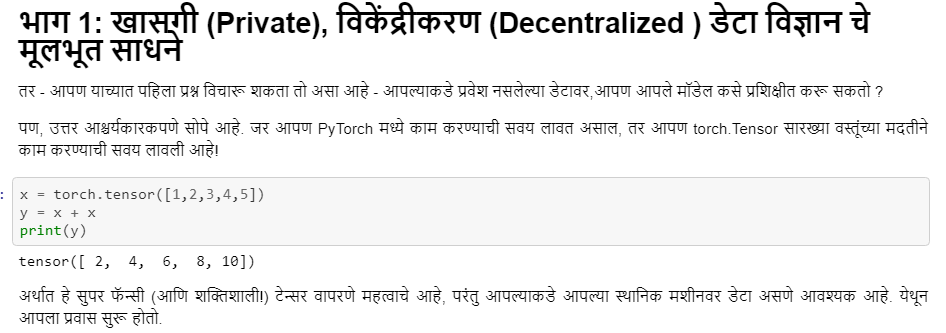

<!-- TODO(a11y): 1 localized body image(s) have empty alt text -->

<figure class="">

</figure>

नमस्कार everyone! Our efforts towards wider community outreach have reached another endpoint as the marathi translations for PySyft tutorials are up under the [PySyft](https://github.com/OpenMined/PySyft) repo! As our community continues to grow, we would like to thank each and every one of you for your contributions. Do watch out this space for interesting blog posts coming up! We would love to hear from you or get your feedback, and if you wish to contribute towards translations or write for us, please fill out this form [here](https://docs.google.com/forms/d/e/1FAIpQLSdWSdhmXjLypvenrajYlaFDzipNZFhK9K-MtvXw8MeXqj6a5g/viewform)!  
Marathi translations contributed by [Krunal Kshirsagar](https://twitter.com/krunal_wrote). You can also find the original list of English tutorials [here](https://github.com/OpenMined/PySyft/tree/master/examples/tutorials).

### **Here is the full list of all tutorials in Marathi**

-   [Part 01 – The Basic Tools of Private Deep Learning](https://github.com/OpenMined/PySyft/blob/master/examples/tutorials/translations/marathi/Part%2001%20-%20The%20Basic%20Tools%20of%20Private%20Deep%20Learning.ipynb)
-   [Part 02 – Intro to Federated Learning](https://github.com/OpenMined/PySyft/blob/master/examples/tutorials/translations/marathi/Part%2002%20-%20Intro%20to%20Federated%20Learning.ipynb)
-   [Part 03 – Advanced Remote Execution Tools](https://github.com/OpenMined/PySyft/blob/master/examples/tutorials/translations/marathi/Part%2003%20-%20Advanced%20Remote%20Execution%20Tools.ipynb)
-   [Part 04 – Federated Learning via Trusted Aggregator](https://github.com/OpenMined/PySyft/blob/master/examples/tutorials/translations/marathi/Part%2004%20-%20Federated%20Learning%20via%20Trusted%20Aggregator.ipynb)
-   [Part 05 – Welcome to the Sandbox](https://github.com/OpenMined/PySyft/blob/master/examples/tutorials/translations/marathi/Part%2005%20-%20Welcome%20to%20the%20Sandbox.ipynb)
-   [Part 06 – Federated Learning on MNIST using a CNN](https://github.com/OpenMined/PySyft/blob/master/examples/tutorials/translations/marathi/Part%2006%20-%20Federated%20Learning%20on%20MNIST%20using%20a%20CNN.ipynb)
-   [Part 07 – Federated Learning with Federated Dataset](https://github.com/OpenMined/PySyft/blob/master/examples/tutorials/translations/marathi/Part%2007%20-%20Federated%20Learning%20with%20Federated%20Dataset.ipynb)
-   [Part 08 – Introduction to Plans](https://github.com/OpenMined/PySyft/blob/master/examples/tutorials/translations/marathi/Part%2008%20-%20Introduction%20to%20Plans.ipynb)
-   [Part 08 bis – Introduction to Protocols](https://github.com/OpenMined/PySyft/blob/master/examples/tutorials/translations/marathi/Part%2008%20bis%20-%20Introduction%20to%20Protocols.ipynb)
-   [Part 09 – Intro to Encrypted Programs](https://github.com/OpenMined/PySyft/blob/master/examples/tutorials/translations/marathi/Part%2009%20-%20Intro%20to%20Encrypted%20Programs.ipynb)
-   [Part 10 – Federated Learning with Secure Aggregation](https://github.com/OpenMined/PySyft/blob/master/examples/tutorials/translations/marathi/Part%2010%20-%20Federated%20Learning%20with%20Secure%20Aggregation.ipynb)
-   [Part 11 – Secure Deep Learning Classification](https://github.com/OpenMined/PySyft/blob/master/examples/tutorials/translations/marathi/Part%2011%20-%20Secure%20Deep%20Learning%20Classification.ipynb)
-   [Part 12 – Train an Encrypted Neural Network on Encrypted Data](https://github.com/OpenMined/PySyft/blob/master/examples/tutorials/translations/marathi/Part%2012%20-%20Train%20an%20Encrypted%20Neural%20Network%20on%20Encrypted%20Data.ipynb)
-   [Part 12 bis – Encrypted Training on MNIST](https://github.com/OpenMined/PySyft/blob/master/examples/tutorials/translations/marathi/Part%2012%20bis%20-%20Encrypted%20Training%20on%20MNIST.ipynb)
-   [Part 13a – Secure Classification with Syft Keras and TFE – Public Training](https://github.com/OpenMined/PySyft/blob/master/examples/tutorials/translations/marathi/Part%2013a%20-%20Secure%20Classification%20with%20Syft%20Keras%20and%20TFE%20-%20Public%20Training.ipynb)
-   [Part 13b – Secure Classification with Syft Keras and TFE – Secure Model Serving](https://github.com/OpenMined/PySyft/blob/master/examples/tutorials/translations/marathi/Part%2013b%20-%20Secure%20Classification%20with%20Syft%20Keras%20and%20TFE%20-%20Secure%20Model%20Serving.ipynb)
-   [Part 13c – Secure Classification with Syft Keras and TFE – Private Prediction Client](https://github.com/OpenMined/PySyft/blob/master/examples/tutorials/translations/marathi/Part%2013c%20-%20Secure%20Classification%20with%20Syft%20Keras%20and%20TFE%20-%20Private%20Prediction%20Client.ipynb)

---

सगळ्यांना नमस्कार ! PySyft  ट्यूटोरियल्सचे मराठी भाषांतर [PySyft](https://github.com/OpenMined/PySyft) रेपो अंतर्गत सुरू असल्याने व्यापक समुदायापर्यंत पोहोचण्याचा आमच्या प्रयत्नाने आणखी एक शेवटचा टप्पा गाठला आहे. आपला समुदाय जसजसा वाढत आहे तसतसे आम्ही आपल्या योगदानाबद्दल प्रत्येकाचे आभार मानू इच्छितो. येत्या मनोरंजक ब्लॉग पोस्ट्ससाठी हे स्थान पहा! आम्हाला तुमच्याकडून ऐकायला आवडेल किंवा आपला प्रतिसाद मिळायला आवडेल आणि तुम्हाला भाषांतरासाठी हातभार लावायचा असेल किंवा आमच्यासाठी लिहायचं असेल तर कृपया हा [फॉर्म](https://docs.google.com/forms/d/e/1FAIpQLSdWSdhmXjLypvenrajYlaFDzipNZFhK9K-MtvXw8MeXqj6a5g/viewform) भरा!  
[कृणाल क्षीरसागर](https://twitter.com/krunal_wrote) यांचे मराठी भाषांतर. इंग्रजी ट्यूटोरियलची मूळ यादी तुमच्यासाठी [येथे](https://github.com/OpenMined/PySyft/tree/master/examples/tutorials) उपलब्ध आहे.

### मराठीतील सर्व ट्यूटोरियल्सची पूर्ण यादी येथे आहे

-   [Part 01 – The Basic Tools of Private Deep Learning](https://github.com/OpenMined/PySyft/blob/master/examples/tutorials/translations/marathi/Part%2001%20-%20The%20Basic%20Tools%20of%20Private%20Deep%20Learning.ipynb)
-   [Part 02 – Intro to Federated Learning](https://github.com/OpenMined/PySyft/blob/master/examples/tutorials/translations/marathi/Part%2002%20-%20Intro%20to%20Federated%20Learning.ipynb)
-   [Part 03 – Advanced Remote Execution Tools](https://github.com/OpenMined/PySyft/blob/master/examples/tutorials/translations/marathi/Part%2003%20-%20Advanced%20Remote%20Execution%20Tools.ipynb)
-   [Part 04 – Federated Learning via Trusted Aggregator](https://github.com/OpenMined/PySyft/blob/master/examples/tutorials/translations/marathi/Part%2004%20-%20Federated%20Learning%20via%20Trusted%20Aggregator.ipynb)
-   [Part 05 – Welcome to the Sandbox](https://github.com/OpenMined/PySyft/blob/master/examples/tutorials/translations/marathi/Part%2005%20-%20Welcome%20to%20the%20Sandbox.ipynb)
-   [Part 06 – Federated Learning on MNIST using a CNN](https://github.com/OpenMined/PySyft/blob/master/examples/tutorials/translations/marathi/Part%2006%20-%20Federated%20Learning%20on%20MNIST%20using%20a%20CNN.ipynb)
-   [Part 07 – Federated Learning with Federated Dataset](https://github.com/OpenMined/PySyft/blob/master/examples/tutorials/translations/marathi/Part%2007%20-%20Federated%20Learning%20with%20Federated%20Dataset.ipynb)
-   [Part 08 – Introduction to Plans](https://github.com/OpenMined/PySyft/blob/master/examples/tutorials/translations/marathi/Part%2008%20-%20Introduction%20to%20Plans.ipynb)
-   [Part 08 bis – Introduction to Protocols](https://github.com/OpenMined/PySyft/blob/master/examples/tutorials/translations/marathi/Part%2008%20bis%20-%20Introduction%20to%20Protocols.ipynb)
-   [Part 09 – Intro to Encrypted Programs](https://github.com/OpenMined/PySyft/blob/master/examples/tutorials/translations/marathi/Part%2009%20-%20Intro%20to%20Encrypted%20Programs.ipynb)
-   [Part 10 – Federated Learning with Secure Aggregation](https://github.com/OpenMined/PySyft/blob/master/examples/tutorials/translations/marathi/Part%2010%20-%20Federated%20Learning%20with%20Secure%20Aggregation.ipynb)
-   [Part 11 – Secure Deep Learning Classification](https://github.com/OpenMined/PySyft/blob/master/examples/tutorials/translations/marathi/Part%2011%20-%20Secure%20Deep%20Learning%20Classification.ipynb)
-   [Part 12 – Train an Encrypted Neural Network on Encrypted Data](https://github.com/OpenMined/PySyft/blob/master/examples/tutorials/translations/marathi/Part%2012%20-%20Train%20an%20Encrypted%20Neural%20Network%20on%20Encrypted%20Data.ipynb)
-   [Part 12 bis – Encrypted Training on MNIST](https://github.com/OpenMined/PySyft/blob/master/examples/tutorials/translations/marathi/Part%2012%20bis%20-%20Encrypted%20Training%20on%20MNIST.ipynb)
-   [Part 13a – Secure Classification with Syft Keras and TFE – Public Training](https://github.com/OpenMined/PySyft/blob/master/examples/tutorials/translations/marathi/Part%2013a%20-%20Secure%20Classification%20with%20Syft%20Keras%20and%20TFE%20-%20Public%20Training.ipynb)
-   [Part 13b – Secure Classification with Syft Keras and TFE – Secure Model Serving](https://github.com/OpenMined/PySyft/blob/master/examples/tutorials/translations/marathi/Part%2013b%20-%20Secure%20Classification%20with%20Syft%20Keras%20and%20TFE%20-%20Secure%20Model%20Serving.ipynb)
-   [Part 13c – Secure Classification with Syft Keras and TFE – Private Prediction Client](https://github.com/OpenMined/PySyft/blob/master/examples/tutorials/translations/marathi/Part%2013c%20-%20Secure%20Classification%20with%20Syft%20Keras%20and%20TFE%20-%20Private%20Prediction%20Client.ipynb)
