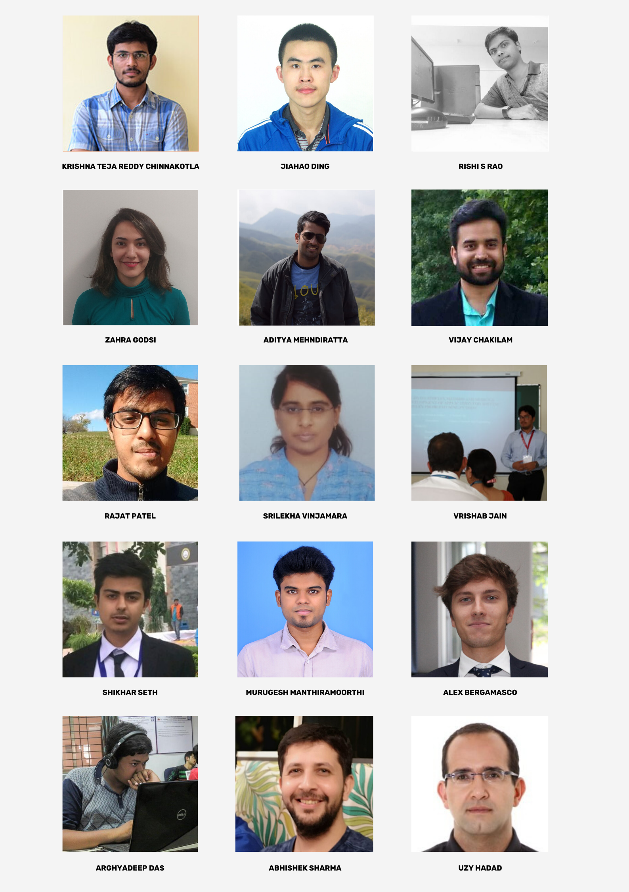

<!-- TODO(a11y): 1 localized body image(s) have empty alt text -->

When we announced our first Bootcamp focused on Privacy-Preserving Machine Learning (PPML), we didn’t expect the overwhelming interest we received for it. Choosing 15 applicants out of the almost 100 outstanding applications that we received was a difficult task.

Today we are excited to introduce the 15 PPML enthusiasts that will form the cohort of this first Bootcamp.

<figure class="">

<figcaption>Beta Bootcamp Cohort</figcaption></figure>

Starting on Friday, July 24th, they will learn about the basics of PPML, practice with the OpenMined PPML library PySyft and have the option to work on a demo project towards the end of the Bootcamp.

This Beta Bootcamp is a stepping stone for the OpenMined Learning Team as it will be the first of many Bootcamps and structured learning initiatives.

In the meantime, if you wish to learn PPML on your own, consider taking the [**Udacity course**](https://www.udacity.com/course/secure-and-private-ai--ud185) and going through the [**PySyft tutorials**](https://github.com/OpenMined/PySyft/tree/master/examples/tutorials). Additionally, keep up with the activities of the Learning Team and get your technical questions answered by joining the **#edu\_learners** channel in the [**OpenMined Slack workspace**](https://slack.openmined.org).

Congratulations to the 15 Beta Bootcampers, and see you all in the channel!

**P.S.** If you wish to join the Learning Team and help organize future bootcamps, fill out [**this form**](https://airtable.com/shr7NUIxqPER4Q1gG).
