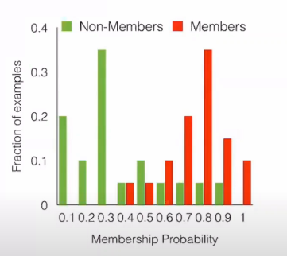
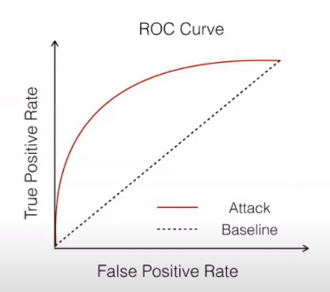

<!-- TODO(a11y): 2 localized body image(s) have empty alt text -->

Data privacy is an important factor to consider while using products and services that involve Artificial Intelligence (AI). As per Article 35 of GDPR, it is mandatory to perform a Data Protection Impact Assessment if a data processing contains innovative technologies such as Machine Learning. It can be performed in the following ways:

-   Assess potential threats to data
-   Identify and analyse possible risk mitigation measures
-   Systematic description of data collection, storage and processing
-   Likelihood and impact of the threats on individuals
-   Assess necessity and proportionality

While creating an ML model in the inference phase, the training data isn’t relied on to make any predictions.

## Privacy risk of ML models

Training data is not relied on while creating an ML model in the inference phase. This can make one think that the data is safe. However, ML models pose a subtle threat to the data by indirectly revealing it through the models predictions and parameters. This has been confirmed by past work\*. In a Membership Inference Attack, the attacker infers if a particular record was present in the training set. One such instance was tested on ML as a service platform offered by both Google and Amazon, and they achieved a significantly high accuracy. Information leakage from models due to such attacks can be problematic if performed on sensitive data.

## Why do these attacks work?

ML models tend to behave differently on members (records that are present in the training set) and non-members (records that aren’t present in the training set). An attacker with some background knowledge can learn to distinguish this behavior and infer if a particular record was present in the training set.

## ML Privacy Meter

ML Privacy Meter generates risk reports for the training data from the ML models. Using risk scores generated by the ML privacy meter, we can identify the records which are highly susceptible to being revealed by the model. ML Privacy Meter can readily estimate the privacy risk to training data.

## How does ML Privacy Meter work?

ML Privacy Meter works by implementing Membership Inference Attacks against ML models. It uses the latest attack techniques based upon recent papers, by simulating attackers with various capabilities and different levels of background knowledge about the training data. Risk scores from each simulated attack is calculated. These scores represent the particular attacker’s belief that the record was present in the training set.

## Generate risk estimates

Ease of performing membership inference attack is directly proportional to the separation between distribution of risk estimate scores for members and non-members.

<figure class="">

</figure>

Success of the attacker can be represented by an ROC curve representing true positive (identifying the records that are present in the training set as members) vs false positive rates (identifying records that are not present in the training set as members). A trivial strategy such as a random guess achieves equal rates of true and false positives. ML Privacy Meter automatically plots the ROC curve that is achieved by simulated attackers. Area under ROC Curve is directly proportional to the risk to training data. The measure of this area also acts as a measure of information leakage from the model.

<figure class="">

</figure>

## Using ML Privacy Meter for DPIA

DPIA must be performed in order to:

-   Analyze privacy risk to training data
-   Identify potential causes of leakage
-   Select appropriate risk minimization measures

ML Privacy Meter can be used to perform DPIA, which lets us identify records under high risk, as well as compare risk across different classes in the training set. It also enables comparison of risk in revealing the entire model as compared to providing only a query access to the model. This information can be used by practitioners to identify the sources of information leakage and thus choose possible mitigation measures.

Some examples of mitigation measures are as follows:

-   Fine tune regularization techniques in case of overfitting of training data
-   Add appropriate data and retrain the model in case of insufficient data from certain classes
-   Choose to learn with a proper privacy protection like Differential Privacy

A learning algorithm is said to satisfy [Differential Privacy](https://blog.openmined.org/tag/differential-privacy/) if the models that are obtained by training on a data set that differs by only one record are indistinguishable to an external attacker. The level of distinguishability is controlled by a privacy parameter epsilon (ɛ). Open source tools such as [OpenDP](https://opendp.org/) and [TensorFlow](https://www.tensorflow.org/) allow for training models with Differential Privacy guarantees.

Smaller values of ɛ – better privacy but less accuracy

Ɛ is a worst case upper bound on the privacy risk but might not be appropriate for the particular data set being used. ML Privacy Meter helps select a decent value of ɛ by measuring the practical risk at different values of epsilon. After taking into account the risk tolerance level and utility expectation level, practitioners can choose the appropriate value of ɛ. Using this method ensures deployment of models with much better accuracy. ML Privacy Meter thus boosts the use of privacy enhancing techniques by providing more utility.

## Summary

-   DPIA should be performed to maintain data privacy
-   ML models are susceptible to Membership Inference Attack
-   ML Privacy Meter estimates privacy risk to training data using risk reports from implementing Membership Inference Attack on ML models
-   Ease of performing membership inference attack is directly proportional to the separation between distribution of risk estimate scores for members and non-members
-   ML Privacy Meter can be used to perform DPIA which helps practitioners identify the sources of information leakage and thus choose possible mitigation measures
-   ML Privacy Meter boosts the use of privacy enhancing techniques

\* [Membership Inference Attacks against Machine Learning Models](https://arxiv.org/abs/1610.05820)
