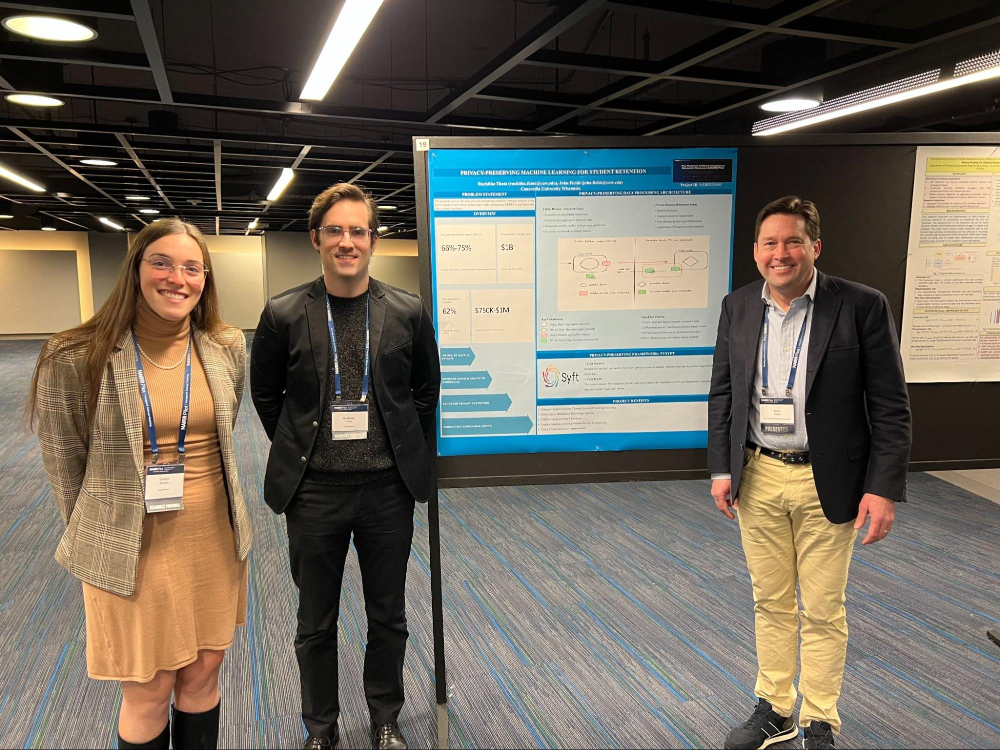

_NAIRR Pilot project_ [`#240195`](https://nairrpilot.org/projects/awarded?_requestNumber=NAIRR240195) _wraps up with peer-reviewed publication and a roadmap for cross-institutional collaboration_

When [John Fields](https://johnfields.tech/) first reached out to OpenMined in early 2024, he had a clear vision but a challenging path ahead. As a PhD student at Marquette University and an Assistant Professor at Concordia University Wisconsin, he wanted to build better models for predicting student retention, but student records are protected by the Family Educational Rights and Privacy Act (FERPA) and institutional privacy policies that prevent data sharing across universities, even for research purposes.

The obvious approach would be to pool data across institutions to train more generalizable models, but this would run directly into these legal and governance barriers. Through the NAIRR Pilot, John worked with OpenMined to demonstrate that [PySyft](https://openmined.org/pysyft/) could enable meaningful cross-institutional machine learning (ML) collaboration while keeping student data under each institution’s complete control.

One year after the official NAIRR grant kicked off, here’s what we accomplished together, the real journey of getting there, and where this work is headed next.

## The Journey

### Early 2024: From Tutorials to a Running Server

**March 2024:** We had our first call with John. He’d already been in the OpenMined Slack for some time, working through PySyft tutorial code on GitHub for his PhD thesis. He wanted to understand how to move from running simulations on his local machine to deploying on a dedicated server. That same month, John met with the Assistant Director of IT in Marquette’s Computer Science department, and they agreed to allocate space on one of their servers so he could host PySyft and test it with another PhD student.

**April 2024:** John worked with our team and a server admin at Marquette to configure the server and load sample data via the PySyft API into the MongoDB database. By the end of the month, he had the tutorial running on Marquette’s infrastructure and demoed his results to his PhD advisor and other PhD students. This was the first proof-of-concept that researchers could deploy PySyft on university infrastructure with documentation and light-touch support. He began expanding testing to two additional PhD students, assigning them to the “[_data scientist_](https://docs.openmined.org/en/latest/?_gl=1*1arltte*_ga*MTExNTc4NTkwNi4xNzI2MTQyOTA2*_ga_X111NXDSGH*czE3NzI0OTI3NzAkbzM3NiRnMSR0MTc3MjQ5Mjc3MiRqNTgkbDAkaDA.)” role.

**May 2024:** After this initial proof-of-concept testing, John submitted his proposal to the NSF and secured a server at Concordia for high-side deployment.

### Fall 2024: NAIRR Grant & Official Kickoff

**October 2024:** We received the official request to support John through the NAIRR Pilot and had it approved. That same month, John presented at Georgetown University’s “_Accelerating the Equitable Use of Education Data Forum_” on a panel titled “_Public Goods to Support Use of Education Data_,” sharing how PySyft could enable privacy-preserving collaboration on student data.

**November 2024:** Concordia approved the server infrastructure and technical support needed for the pilot study, and John submitted the project request to the IRB.

### Winter 2024-2025: Infrastructure & Approvals

**January 2025:** John received IRB approval from Concordia to work with actual student data, and the air-gapped PySyft infrastructure was fully deployed. With the servers ready and a graduate assistant, Ruchitha Thota, onboarded, the team was ready to begin loading data and testing.

**February 2025:** John and Ruchitha presented a poster at the NAIRR Pilot Inaugural Annual Meeting.

<figure class="wp-block-image size-large is-style-default">

</figure>

### Spring 2025: First External Researcher Success

**April 15, 2025:** The team ran Ruchitha’s classification code for retention against the private Concordia student data. **_This was the milestone the entire project had been building toward:_** the first time an external researcher successfully ran queries on private educational data through a privacy-preserving pipeline. They tested PySyft end-to-end, then defined the process flow for sharing results and approving requests. These decisions shaped the code review pipeline described below.

### Summer 2025: Publication and Presentation

**June 2025:** John presented the methodology and results alongside OpenMined’s Executive Director, Andrew Trask, at Georgetown University’s Massive Data Institute [2025 Summer Institute on Privacy Enhancing Technologies for Education Data](https://mdi.georgetown.edu/privacy-enhancing-technologies/2025-summer-institute/).

## What We Built

The core technical contribution is a workflow that lets external researchers develop and validate ML models on sensitive data they never see:

**Semi-Air-Gapped Architecture:** The system uses two servers.

-   **Low Side Server:** Hosted on Microsoft Azure with synthetic mock data matching the structure of real student records. External researchers develop and test models here.
-   **High Side Server:** A dedicated Dell Precision T7610 at Concordia, physically disconnected from the university network, accessible only through hardwired SSH. Contains actual de-identified student data.

**Data-Type-Aware Templates:** Rather than generating synthetic data that replicates the statistical distributions of real records, which could itself be a privacy risk, John’s team built templates that preserve the structure and constraints of real data (i.e., correct column types, valid ranges, and referential integrity) without mirroring the underlying patterns. This gave researchers a realistic development environment while maintaining a hard boundary around the properties of the real data.

**Code Review Pipeline:** Before any code executes against private data, the data owner reviews it for technical validity and potential privacy risks. This human-in-the-loop step proved essential. In one case, a researcher’s submitted code included outputs that could potentially enable inference attacks on individual student records. The data owner caught this during review and worked with the researcher to add differential privacy protections before the code was approved for execution.

## Results

Concordia University Wisconsin served as the data owner, hosting de-identified student records from their 2021 cohort on the high-side server. Researchers from three universities—John at Concordia, plus external collaborators at Marquette and Georgetown—each developed their own classification models using mock data on the low-side server, then submitted their code for execution on Concordia’s private data.

All three researchers achieved comparable performance metrics, confirming that the privacy-preserving workflow did not compromise model quality relative to working directly with the data.

By eliminating the need for direct data sharing, the framework validated in this pilot—with one data owner and multiple external researchers—lays the groundwork for future studies in which multiple universities each contribute their own private datasets, enabling true cross-institutional model validation.

## Lessons Learned

**Infrastructure setup takes time, but it’s getting faster.** John’s first PySyft deployment took over two months with significant technical support. By the time he ran a deployment exercise at a later hackathon, the same process took two hours. This reflects both improvements in our documentation and John’s growing expertise, and it’s a trajectory we expect future researchers to follow even faster as tooling continues to improve.

**The data owner role is critical, and it is not just technical.** Someone needs to review the submitted code for both technical validity and privacy implications. The inference attack described above was the system working as designed. Privacy-preserving ML doesn’t mean privacy is automatic. It means the infrastructure exists to enforce it through human judgment at the right checkpoints.

**Support matters.** We supported John in setting up, maintaining, and customizing his air-gapped deployment on university infrastructure, helped onboard Ruchitha as a new team member, and provided guidance on privacy matters throughout. This wasn’t a “deploy and walk away” experience. It was an active collaboration, and future projects should plan for that.

## What’s Next

This project validated that privacy-preserving cross-institutional collaboration is achievable today. Our priorities going forward:

1.  **Simplify deployment.** Tools like [SyftBox](https://openmined.org/syftbox/) aim compress the setup timeline even further. Our goal is to make privacy-preserving infrastructure something a research team can stand up in a day, not a semester.
2.  **Expand to more institutions.** The single-data-owner, multiple-researcher model proved out here. The next step is multi-data-owner federations, where several universities each contribute private datasets to a shared analysis. We’re particularly interested in connecting with institutions that lack the data volume to build robust retention models independently and are interested in the benefits of collaborative approaches.
3.  **Publish and open-source.** Code and documentation will be released on GitHub upon publication of the peer-reviewed paper. Preprint is available [here](https://www.researchgate.net/publication/401264718_A_Privacy-Preserving_Framework_for_Cross-Institutional_Collaboration_on_Student_Retention_Prediction_Using_Remote_Data_Science).

## Get Involved

If you’re a university researcher working with FERPA-protected student data or any sensitive educational records, and want to collaborate across institutional boundaries without compromising privacy, we want to hear from you!

Through our NAIRR partnership, OpenMined offers:

-   **Software** for distributed, privacy-preserving data science
-   **Compute credits** for research consortia
-   **Training sessions** on implementing privacy-preserving ML workflows

**Learn more:** Visit [openmined.org/programs/nairr](https://openmined.org/programs/nairr) or reach out on our [community Slack](https://slack.openmined.org).

---

_We thank John Fields for his leadership and persistence on this project, and the research teams at Marquette University, Concordia University Wisconsin, and Georgetown University for their collaboration._
