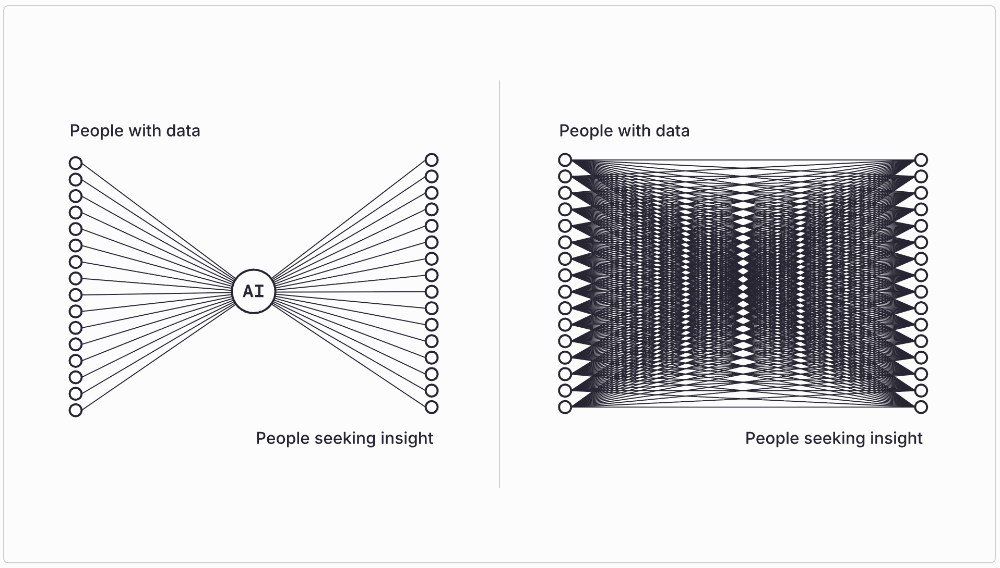
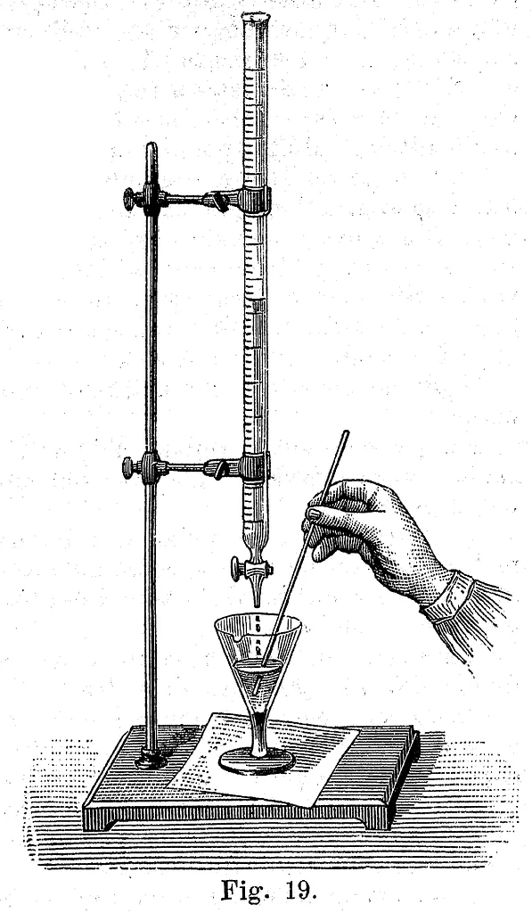

<!-- TODO(a11y): 2 localized body image(s) have empty alt text -->

**How will AI systems obtain and share information in the future?**

A lot hangs on this. I see three distinct architectures, each with its own logic and consequences. The choice between them will determine not just how AI systems function, but what kind of information economy will be possible.

The position I want to defend is that the future of AI first, cannot resemble a single intelligence that has absorbed all or most of the world’s available information. Nor can it resemble the unprincipled muddle we currently inhabit, where systems advance by plowing through legal gray areas—essentially “vacuuming up” whatever information anyone “leaves around”. Instead, if AI is to thrive and coexist happily with human beings and institutions, it must act as an orderly client to a vast network of private repositories. These private repositories would release insights to model-builders and/or agents under conditions their stewards define. This is not exactly “open sourced” or “closed sourced”, but what we might call “network sourced” AI.

<figure class="wp-block-image size-large">

</figure>

## The Trajectory Toward Total Ingestion

The first possible future might be called the leveled world. The forests are plowed under, bright fluorescent lights are shined under every rock, and everything is absorbed into one or two or three frontier foundation models.

This is the implicit trajectory of the present paradigm, even if it’s rarely stated so baldly. Since AI systems gain capabilities as they ingest more data, the logical endpoint is comprehensive absorption: every document, every dataset, every creative work, and eventually every private communication—not to mention medical data and more—folded into the weights of all-encompassing models which serve, basically, as mirrors of the known universe. This trajectory suffers from (at least) two terrible difficulties, one concerning privacy and one concerning economics.

On privacy, the problem is not that this architecture fails to value privacy but that it cannot coherently value privacy at all. If the fundamental goal is comprehensive ingestion, then every effort to protect personal or institutional data becomes merely an inefficiency to be eliminated, rather than a value to be balanced. Today’s intimate secrets go into tomorrow’s model. And the model keeps pushing for tomorrow to come sooner…

We cannot afford to ignore that this is where the incentives point. As the models become more powerful and more important and more fundamental to the economy, they will overwhelm the boundaries of privacy, speeding past barriers we would have thought quite sacred just a few years ago, taking us into unpleasant new territory.

The economic difficulty is related and just as destabilizing. Information has value precisely because it’s scarce, contextual, and differentially held: some people know things others don’t. It is that asymmetry that creates the possibility of exchange. A world where all information has been ingested by a few models is a world in which people do not interact informationally with one another. Why ask another human being a question about themselves when the model has read their private journals? Why hire a company when the model contains that company’s private database? This points to a collapse of discourse and exchange.

Consider what happens to the knowledge supply chain. Why would researchers research if their findings will be appropriated by the models? Why would journalists investigate if their findings will be captured by the models? Why would commercially-motivated institutions produce any knowledge, if the fruits of their investment could be kept proprietary?

This comprehensive leakage of knowledge isn’t merely unfair; it’s economically unsustainable. The information “supply chain” would collapse. The golden geese being dead, even the models would stop laying golden eggs. Some argue that AI will generate enough new knowledge to compensate, but from where? What would that knowledge concern? They can recombine and extrapolate, but the genuine novelty—the new observations, creative leaps, and new social facts that constitute “what matters”—comes from humans interacting, transacting, discoursing, with the world and one another. An architecture that starves those processes undermines its own foundations. Models would become the mirror of a desert.

## The Present Condition: A Dialectic Without Doctrine

The second possible future is not a future at all but the situation we currently inhabit: irregular warfare along the boundary between private and public information. A disordered muddle.

Some information remains private essentially by accident: mouldering in closed drawers or private folders just because nobody has seen fit to connect it to the broader world. There isn’t always a _reason_ information is private. Sometimes it is just a kind of “lag” in the process of information sharing, with no theory of why it should be defended or respected.

Meanwhile, plenty of information that _really ought to be private_ (or at least controlled) leaks into models for bad reasons. Copyright material is dumped en masse into frontier models, giving the model owners a private benefit that neither copyright owners nor the framers of copyright law anticipated or wanted. Frequently, the models memorize long texts verbatim, so that they actually contain compressed copy, even though the “guardrails” try to prevent them from reproducing it in outputs. Private data left across the internet or in places that once seemed unproblematic can now be interpolated with other information by the models, compromising privacy and placing people at the mercy of leaky safeguards. In short, everyone who put information out there in the world – either into the legal “public domain” or under IP – now, on some level, might regret it. This prompts adversarial legal, political, and private reactions.

Without a declared framework, we get an escalating cycle: data holders lock down defensively with paywalls and legal threats. Model builders look for new ways to crash the gates. Regulators intervene sporadically and too slowly. No one is in charge. No one can plan for the future.

Muddling through is nothing new, but it’s not stable. More likely, it’s an interregnum between paradigms. Many of us are worried that the next paradigm is “total ingestion”. But what would a better one look like?

## The Architecture of Network-Sourced Intelligence

The third possibility—“network sourced” intelligence—represents a coherent theory of the relationship between private and public information, and an architecture that makes that theory operational.

<figure class="wp-block-image size-full is-resized">

</figure>

A critical metaphor is “titration”. A titrator is basically a “dropper” that lets a chemist put a very tightly controlled amount of one liquid into another liquid. We haven’t thought about information this way in the past. We’ve just thought in binaries: either you send data, or you do not send data. In fact, we need to control data in new, precise ways. We need to be able to share not the news article, but the evidence it uncovered; not the song, but the general feeling of the lyrics; not the database of medical scans, but secondary inferences available from their analysis.

In network sourced AI, private repositories titrate insights outward through a protocol layer that enforces attribution, consent, and control. The network itself, not any single model, becomes the locus of intelligence. Data stewards—individuals or institutions—set flexible rules (e.g., articulated to agents) which shape what flows out, what downstream uses are permissible, and how that’s verified and enforced. This represents a different conception of what AI is and does. AI systems become not greedy black holes consuming their own ecosystems, but orchestrators connecting knowledge holders with knowledge seekers.

It also preserves economic value by maintaining information asymmetry in a structured way. Network-sourced AI can quantify the role that different “titrated” data and insights play in downstream capabilities and results. Relatedly, insights can be trusted because their provenance remains discernible. Creators of information goods like journalists, artists, and researchers are no longer faced with a binary about whether to give away the entire, hard-to-value fruits of their labor, or get nothing. Instead, they can make a pitch to other actors: “A small dose of my proprietary information might help you better accomplish X. Try it and find out.”

Speaking more generally, network-sourced intelligence enables AI to function as a communication implement rather than a central intelligence. We want AI to connect us, not replace us.

## The Infrastructure For This Vision

Network-sourced AI is an infrastructure project, already underway. It involves several components.

The first is a protocol layer for controlled insight release. This already exists. [Syft](https://syft-protocol.openmined.org/), combined with frameworks like [Attribution Based Control](https://openmined.org/attribution-based-control/), lets data owners specify use conditions, set up payment rails, and maintain a chain of attribution while making data available for inference. This is a technical substrate for “titrated” insights. Secure enclaves, differential privacy mechanisms, compute-to-data architectures, and more will expand the possibilities of network-sourced AI, making precise negotiations of privacy between agents possible.

The second thing needed, eventually, is governance structures: standards bodies, collectives, rating systems that establish trust and facilitate coordination. The first generation of network-sourced AI will run through technical guarantees. But eventually, we’ll need to tame the wild west and tamp down arms races, settling into a standards-and-norms-based system of information sharing. Network-sourced AI, for the reasons we’ve articulated above, is the most attractive paradigm upon which those standards and norms can be built, so time is of the essence.

Third, we need a new taxonomy of what titrated insights actually are. What kinds of things can flow out of a private repository while preserving integrity, rights, and value? What’s the relationship between a verified finding and the data that produced it? How can creative works be decomposed into separate dimensions? What does it mean for a digital twin to behave as if it knows things while guaranteeing those things can’t be reconstructed? These matters require careful thought, and avoiding chaos depends on reaching clear shared conceptions.

The alternative to all this is accepting one of the failed architectures: the leveled world, or muddle.

We think network-sourced AI is the only architecture the world is going to settle upon, sooner or later, once the unattractiveness of the other two options becomes apparent. The question is how much time we’ll waste, and how much damage will be done before we get there. Let’s move swiftly and build this future.
