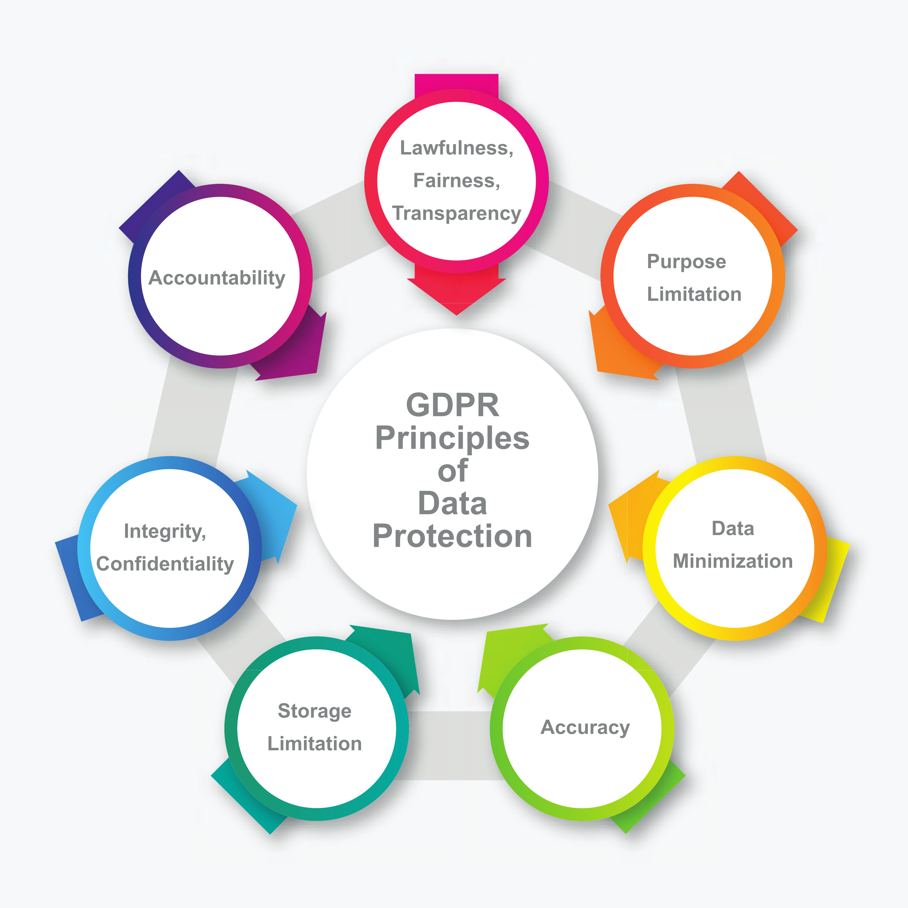

<!-- TODO(a11y): 1 localized body image(s) have empty alt text -->

_Part 3: What is the impact of GDPR on the generation and sharing of synthetic datasets?_

The European General Data Protection Regulation (GDPR) was introduced in the year 2016 to protect the personal information of EU subjects. It changed how the said personal information was to be defined since data elements like opinions, photographs, audio-visual recordings of individuals, location data, and so on became part of Personally Identifiable Information(PII). Additionally, irrespective of their location, if an organization were to collect, store or process the data of EU residents, then it had to comply with the GDPR.

The GDPR re-defined data protection as follows:

<figure class="">

<figcaption>The seven protection and accountability principles specified by GDPR for processing of personal data. Source: The author. Icons by <a href="https://www.freepik.com/vectors/circular-diagram">freepik.com</a></figcaption></figure>

The seven protection and accountability GDPR principles that regulate processing of personal data are

-   **Lawfulness, fairness, transparency:** The processing must be lawful, fair and transparent to the data subject
-   **Purpose limitation:** The data subject must be clearly communicated the legitimate purpose of processing, at the time of data collection
-   **Data minimization:** Only the data that is absolutely necessary for the said legitimate purpose must be collected and processed
-   **Accuracy:** The personal data must be kept accurate and up-to-date
-   **Storage limitation:** The personally identifying information must be stored only for the duration while it is necessary for the specified purpose
-   **Integrity, confidentiality:** Appropriate security measures must be taken to ensure integrity and confidentiality of the personal data.
-   **Accountability:** The entity who decides the purpose and means of the data processing must realize GDPR compliance through above six principles

While the above image was focused on the real records that belong to individuals, the intent of this blog is to determine where the GDPR stands for data synthesized from the said records. We would now consider three scenarios and see how the regulation stipulates the expected privacy provisions.

---

## Does GDPR restrict or regulate the use of real datasets for synthesis?

The short answer is: **Yes**.

Here are the additional GDPR-related considerations for use of real data for synthesis:

-   As long as the real data at hand qualifies as personal data, GDPR imposition will apply to its synthesis since it is part of the data processing.
-   If your organization wishes to synthesize data belonging to real individuals, it would require a legal basis to do so.
-   Generally, a legal basis means that your organization has the consent of the individuals to further process their information. But here are the two major hurdles when it comes to individual consent: Firstly, its collection is costly and impractical, and secondly, an aware individual may cause consent bias^ in the seed data.
-   Your organization would therefore be required to balance the scales between their interests in synthesized data and the privacy rights of the data subjects
-   The interests of the organization can be catered to by ensuring that real data is protected against unauthorized access and disclosures. This is an obligation set by the GDPR
-   The privacy interests of individuals are catered to by the synthesis since its use in research and analytics minimizes disclosure risks
-   Consequently, **the synthesis of a real dataset is a win-win solution** since the legitimate interests of the organization are in agreement with those of the data subjects
-   As long as the real data is kept secure and processing activities are recorded including the synthesis, your organization is within the regulations

---

## Does GDPR restrict or regulate the sharing of real datasets with a third-party for synthesis?

The GDPR labels stakeholders who process personal data as data controllers and data processors. While a data controller is an entity that decides on the purpose and means of the data processing, a data processor executes the processing for the controller. In the context of this question, the controller is the owner of the personal data and a third-party service provider is a processor responsible for data synthesis.

-   The GDPR allows for the controller to share personal data with a processor for data synthesis.
-   However, the sharing is regulated by certain restrictions
    -   The controller must select a processor that would process the personal data in compliance with GDPR regulations
    -   The processor can process the data only in accordance with the instructions laid down by the controller
    -   The processor must
        -   ensure data confidentiality and security procedures
        -   delete or return the personal data on completion of the contractual services
        -   if required, provide to the controller the information about compliance measures and inspections

**TLDR**: As long as data processors follow the contractual obligations, GDPR regulations would allow a third party to synthesize real datasets.

---

## Does GDPR restrict or regulate synthesized datasets?

The question can be better answered if we ask, **does the synthesized dataset qualify as personal data?**

-   If a dataset is synthesized in such a manner that it does not correspond to an individual, i.e., it lacks implicit or explicit identifiers to a person’s cultural, social, or physical identity, then it does not meet the GDPR definition of ‘personal data’.
-   Such a fully synthetic dataset that does not qualify as personal data can be used and publicly shared without restrictions.

---

## Summary

The organizations that collect, store, or process personal data must ensure compliance and protection against disclosures. The synthesis of such data also qualifies as processing and therefore, warrants adherence to GDPR restrictions. Whereas, synthesized data that cannot be used to identify a person does not qualify as personal data in the purview of the GDPR and can be freely used and shared for further processing.

---

## References

^ [Consent bias in research: how to avoid it](https://www.ncbi.nlm.nih.gov/pmc/articles/PMC1955004/#:~:text=Consent%20bias%2C%20also%20known%20as,participants%20were%20selected%20or%20assigned.)

[Practical synthetic data generation](https://www.oreilly.com/library/view/practical-synthetic-data/9781492072737/)
