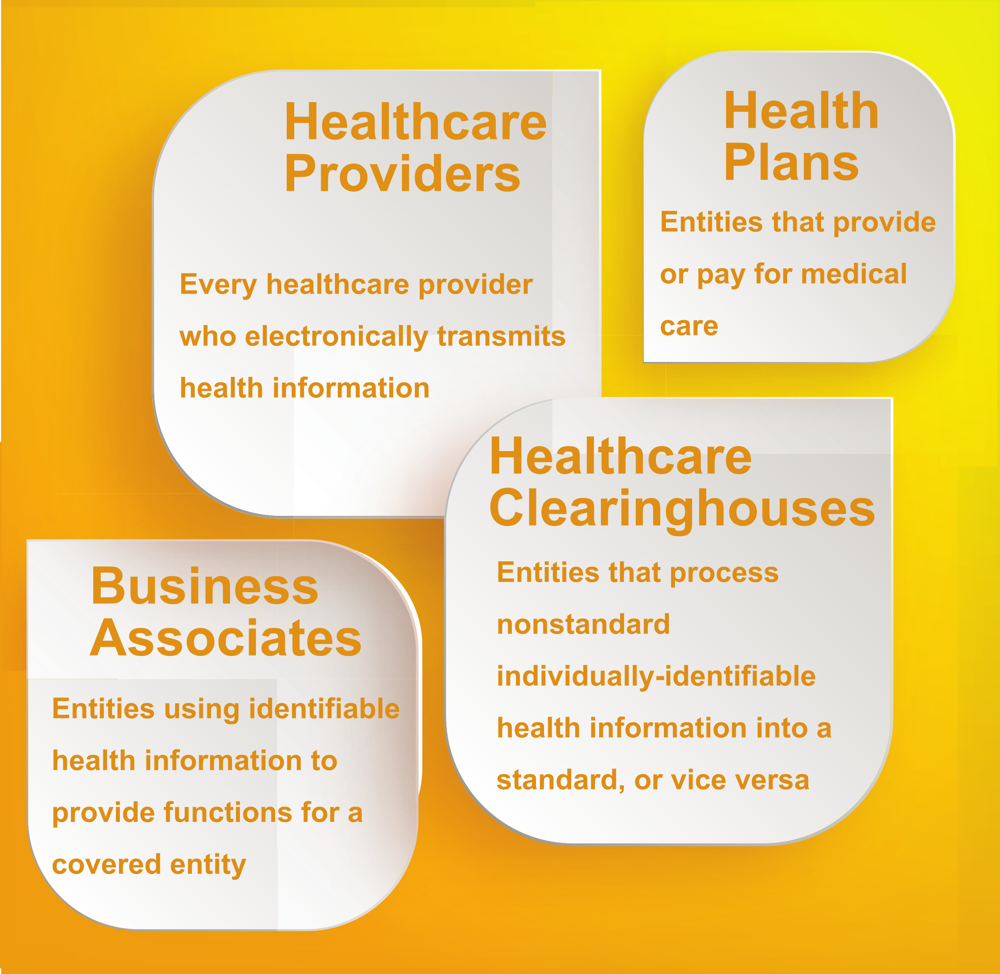

<!-- TODO(a11y): 1 localized body image(s) have empty alt text -->

_Part 4: What is the impact of HIPAA on the generation and sharing of synthetic datasets?_

The Health Insurance Portability and Accountability Act of 1996 (HIPAA) is a federal law that protects sensitive patient information. Also called Protected Health Information (PHI), patient data to be protected includes demographic information that holds the potential of identifying the individual. The characteristics of PHI may include

-   Information created or collected by a healthcare provider, employer, or a healthcare clearinghouse.
-   Information related to an individual’s mental or physical health in the past, present, and future.
-   Information related to an individual’s use of healthcare services.
-   Information related to an individual’s past, present, or future payments for the availed healthcare services.

HIPAA guards PHI against any disclosures without the patient’s consent or knowledge. While a **HIPAA Privacy Rule** implements the requirements of the law, **HIPAA Security Rule** protects a subset of information covered by the Privacy Rule.

The following individuals or organizations must follow the Privacy Rule

<figure class="">

<figcaption>The four entities who are subject to HIPAA Privacy Rule. Source: The author</figcaption></figure>

The entities shown in the above image must

-   Ensure compliance with the confidentiality, integrity, and availability (CIA) triad for all electronic PHI
-   Detect and safeguard against any threats to the security of PHI
-   Protect against potential disclosures from PHI
-   Ensure and certify compliance by their workforce

---

Now that we have introduced you to HIPAA, let us see where its regulations stand for data synthesized from PHI. We consider three scenarios to see how HIPAA stipulates the expected privacy provisions.

## Does HIPAA restrict or regulate the use of real datasets for synthesis?

Short answer: **HIPAA allows the synthesis of PHI**.

According to the HIPAA Privacy Rule, PHI can be used for certain instances without acquiring patient consent beforehand. Such permitted cases may include the creation of **de-identified** **information**. Either of the four entities mentioned in the above image may use PHI to create information not traceable to the individual and share it with business associates.

It should be remembered that de-identification involves methods like suppression, perturbation, and transformation of direct and indirect identifiers. This results in an altered version of the original patient data. Synthesis, on the other hand, is the creation of new data that borrows the statistical properties of its seed. It does not bear any direct correlation to the real values of the attributes.

If the HIPAA Privacy Rule is analyzed concerning the synthesis of PHI, then we can interpret the following statements:

-   _“to create information that is not individually identifiable health information,”_ While de-identification of PHI may possess disclosure potential, synthetic data cater to this requirement.
-   _“including, but not limited to creating de-identified health information or a limited data set”_ This statement opens avenues to methods other than the de-identification of PHI.

Therefore, HIPAA Privacy Rule is satisfied by the generation of synthetic data and offers a sensible alternative.

## Does HIPAA restrict or regulate the sharing of real datasets with a third party for synthesis?

The four entities that are covered by the HIPAA Privacy Rule can share PHI for synthesis with a service provider. In this context, the service provider is called a **business associate** of the entity. The engagement with a business associate must be set as a contract that would govern:

-   The specific services for which the PHI has been shared with the associate.
-   The details of the permitted use of PHI for synthesis and other required uses.
-   Assurance by the associate that they will follow HIPAA Privacy and Security Rules.

Thereby, a business associate who has received PHI for synthesis would need to specify the intent and the compliance assurance to generate and evaluate synthetic datasets.

## Does HIPAA restrict or regulate synthesized datasets?

By its definition, HIPAA regulates protected health information or individually identifiable information. Such information is concerned with individuals and the potential for disclosure of their identity. However, synthetic data is not real information of any individual. If the data has been synthesized safely then it would not cause the identification of an individual from the real dataset.

Therefore, **synthetic data is not subject to regulations of HIPAA rules**. It can be freely used for secondary purposes or shared further without any contractual obligations.

---

## Summary

Following are the takeaways from the above discussion:

-   The four types of entities that must follow HIPAA Rules are healthcare providers, business associates, healthcare clearinghouses, and health plan providers. These entities must follow HIPAA regulations to protect sensitive individual information.
-   When it comes to the synthesis of protected health information (PHI), HIPAA favors it since disclosure potential is very low from synthesized datasets.
-   Any business associates who are trusted with the synthesis of PHI are bound by contracts to specify the intent for synthesis, HIPAA-compliance assurance, and protection of the PHI.
-   Synthetic data falls outside the scope of HIPAA for secondary purposes and sharing since it is not individually-identifiable information.

---

## References

-   [Health Insurance Portability and Accountability Act of 1996 (HIPAA)](https://www.cdc.gov/phlp/publications/topic/hipaa.html)
-   [Practical synthetic data generation](https://www.oreilly.com/library/view/practical-synthetic-data/9781492072737/)
