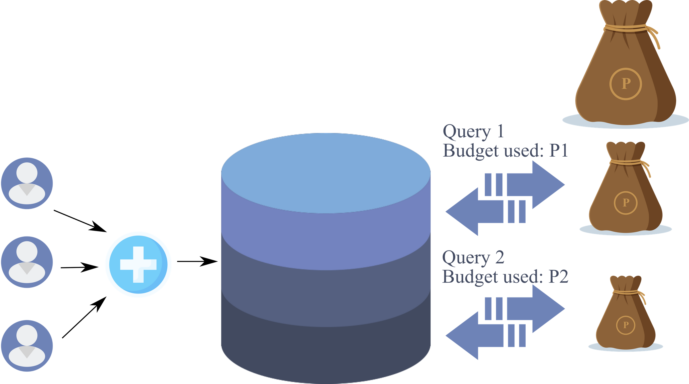
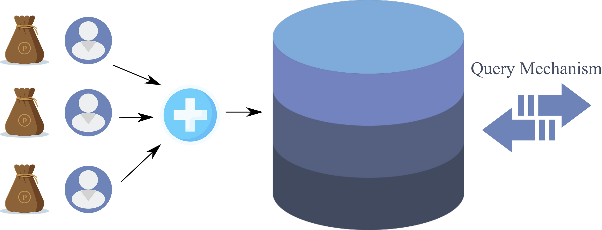

<!-- TODO(a11y): 2 localized body image(s) have empty alt text -->

_A gentle introduction to privacy budgets and accounting_

The word budget is defined as _“an estimate of income and expenditure for a set period of time.”_ Thereby the term privacy budget implies the amount of privacy guarantees that can be maintained or lost over a certain duration of time.

But before we delve into how purse strings are handled over the privacy of individual data, let us first understand how the said data reaches its audience. The audience could be data analysts, custodians, or an adversary _\*gasp\*_.

---

## Privacy definitions for data release

### Syntactic privacy definitions

The data released under the syntactic privacy scheme is generally in the form of a table. The various attributes of individuals belonging to such a table can be categorized based on their disclosure potential as

-   **Identifiers**: Attributes that uniquely identify an individual such as, their SSN or employee Id
-   **Quasi-identifiers** aka **QI**: Attributes that can be used to reveal an entry in the table, if combined with external information. Think of date of birth, gender, or zip code, and how someone aware of any of this information can zero in on your presence in the record.
-   **Confidential** aka **sensitive** **attributes**: The information that needs protection. For example, a person’s salary, the status of a diagnostic test, or an affliction.
-   **Non-confidential attributes**: Attributes that were not considered confidential by the individual such as eye color.

The syntactic privacy protection approach is based on the assumption that quasi-identifiers are the only attributes that can be exploited to obtain sensitive information or to link it to an individual’s identity. Or simply stated, the suppression of QI can de-identify a person in the released microdata table. The approach can again be divided into methods that aim to protect against identity disclosure or attribute disclosure. Some popular methods include k-anonymization, l-diversity, t-diversity, and so on.

### Semantic privacy definitions

The data released under the semantic privacy scheme is protected through properties that must be satisfied by the release mechanism. It aims to protect subjects whether they were part of the released record or not. Semantic techniques can be applied to two scenarios

-   ******Non-interactive scenarios**:**** A privacy-preserving dataset that is representative of the original dataset is released.
-   ******Interactive scenarios**:**** The release of results on querying a private dataset. The protection mechanism aims to minimize the disclosure risk possible from a combination of query results with external knowledge.

One of the most popular methods is differential privacy that perturbs the query results through the addition of calibrated noise.

---

## Privacy accounting

**Syntactic techniques** are prone to **background knowledge attacks** and the fact that there may exist **noticeable homogeneity among the entries**. The presence of an individual’s actions may comprise multiple entries in a database, or people belonging to the same family or organizational unit may share multiple QI. **Semantic techniques**, in contrast, are weakened by the fact that a **combination of query results can increase the disclosure potential**. Each subsequent query result can give out more information and consequently lessen the privacy guarantee.

Surely, there is the provision of noise addition that can restrict privacy loss in case of repeated queries. But such perturbation should also not affect the accuracy of the results drastically. We can say that each query is an expenditure of the guaranteed privacy and the system should therefore set a limit to this expense. The term **privacy accounting** covers the expenditure or losses of the assured privacy in case representative datasets or query results are being released by the system. It, therefore, makes sense to assign a **privacy budget** to the system to ensure that the privacy and utility do not degrade over the course of its operation.

---

## Global and local privacy budgets

The **global privacy budget** is the type of accounting scheme that you were just introduced to. As the given image shows, a database is a record of multiple entries that belong to individuals. To provide privacy guarantees, a global budget P is decided and query mechanisms are exposed for parties to access the records. Each query uses a part of the global privacy budget P.

<figure class="">

<figcaption>A schematic of global privacy budget and its expenditure. Image source: The author. Icons by <a href="http://www.flaticon.com">Flaticon</a></figcaption></figure>

While the scheme is intuitive and easy to implement, it can fail to keep up with the demands of an interactive system. Assume that the database holds the record of a town’s population and can be queried by analysts for research. The first query retrieved all of the people who had blood group AB- and used privacy budget P1. Now another analyst wanted to retrieve all of the residents who smoked. The remaining privacy budget is now P-P1. The database size is large yet the number of people with the rare blood group will be very small as compared to the number of smokers. If the accounting algorithm had used a large value of P1, then a big chunk of P had been spent for a study that did not touch the major part of the database. This is not a pleasant privacy accounting scenario.

The provision of a global privacy budget seems sensible when the system offers a batch system where all possible queries have been decided up-front. But such a system should not be considered if the database is dynamic. A global privacy budget may not have been decided to accommodate new, unknown data.

The **local privacy budget** allocation is the accounting style that permits each individual a personal privacy budget. There are many variants to this scheme where the budget could be split across all of the attributes of an individual, or just used on some randomly selected attributes. Let us see the simple representation of the local privacy budget scheme.

<figure class="">

<figcaption>A schematic of the local privacy budget and its expenditure. Image source: The author. Icons by <a href="http://www.flaticon.com">Flaticon</a></figcaption></figure>

This accounting system is also prone to some limitations. Firstly, the individual budgets become

highly sensitive and need more complex algorithms. More specifically, if a query involves records that would break the budget of an individual then they are silently dropped from the data set upon which the query is calculated. If the same queries as above were requested from this database, all of the smokers who had used up their privacy budget will be excluded from any subsequent result. Therefore more complexity makes way into the system so that the individuals do not get excluded due to small changes that affect the system’s privacy guarantees.

---

To get a better understanding of how bounds on noise to be added to query results can be applied, we suggest that you read [this paper review](https://blog.openmined.org/choosing-epsilon/).

**Sources:**

-   [Data Privacy: Definitions and Techniques](https://www.worldscientific.com/doi/abs/10.1142/S0218488512400247)
-   [Differential Privacy: Now it’s Getting Personal](https://dl.acm.org/doi/abs/10.1145/2775051.2677005)
-   [The Algorithmic Foundations of Differential Privacy](https://www.cis.upenn.edu/~aaroth/Papers/privacybook.pdf)
-   [Global Sensitivity From Scratch](https://blog.openmined.org/global-sensitivity/)
-   [Local sensitivity for differential privacy from scratch](https://blog.openmined.org/local-sensitivity/)
