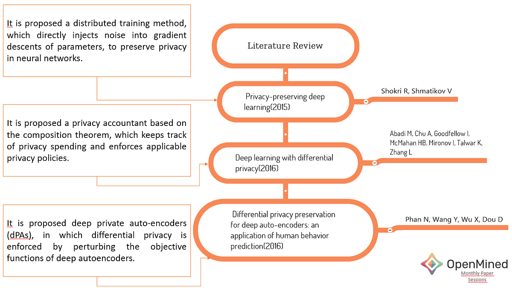
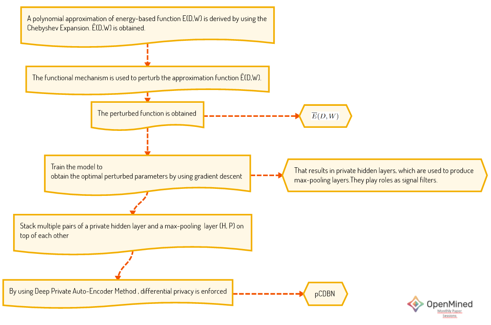

<!-- TODO(a11y): 2 localized body image(s) have empty alt text -->

<!-- TODO(content): NO ppma_author — assigned openmined placeholder -->

_The Reviewed Paper:_ [_Preserving Differential Privacy in Convolutional Deep Belief Networks_](https://arxiv.org/pdf/1706.08839v2.pdf)

[_(_?_Authors: Nhat Hai Phan, Xintao Wu, Dejing Dou)_](https://arxiv.org/pdf/1706.08839v2.pdf)

As you may have noticed, we have been hosting OpenMined’s Paper Session Events by August. The paper we have covered in August focuses on differential privacy for Convolutional Deep Belief Network (CDBN).

In this paper, the main idea from Phan et al. is to enforce [Ɛ](https://www.wikiwand.com/en/Latin_epsilon)\-differential by using the **functional mechanism** to perturb the energy-based objective functions of traditional CDBNs, instead of their results. They employ the functional mechanism to perturb the objective function by **injecting Laplace noise** into its polynomial coefficients.

The key contribution of the paper is that the proposal of using **Chebyshev** **expansion** to derive the **approximate polynomial representation** of objective functions. The authors show that they can further derive the sensitivity and error bounds of the approximate polynomial representation, which means preserving differential privacy in CDBNs is feasible.

Phan et al. emphasize some studies in the literature. The literature review begins with the progress of deep learning in the healthcare and expresses the need for privacy with regards to deep learning due to the fact that healthcare data is private and sensitive. In the study, **Ɛ-differential privacy** approach is used to protect privacy.

Looking at the literature, several major studies stand out (please see Fig.1):

[?](https://emojipedia.org/pushpin/)Shokri et. al. implemented DP by adding noise into gradient descents of parameters. Even if this method is attractive for deep learning applications on mobile devices, it consumes a large amount of privacy budget to provide model accuracy. It is because of a large number of training epochs and a large number of parameters\[1\].

[?](https://emojipedia.org/pushpin/)To improve this challenge, Abadi et. al proposed a privacy accountant based on the composition theorem. But the challenge on the dependency of training epoch number remains unresolved\[2\].

[?](https://emojipedia.org/pushpin/)Phan et. al proposed an approach independent of training epoch number called deep private auto-encoders (dPAs). They enforced differential privacy by perturbing the objective functions of deep autoencoders\[3\].

<figure class="">

<figcaption><strong class="markup--strong markup--figure-strong">Fig.1 Literature Review</strong></figcaption></figure>

According to the authors, the following two points urgently require further research under development of a privacy-preserving framework:

-   Independency of the number of training epochs in consuming privacy budget;
-   Applicability in typical energy-based deep neural networks

### Freshen up What We Know

In the paper, the authors aim to develop a private convolutional deep belief network (pCDBN) based on a CDBN\[4\]. CDBN is an energy-based model which is a hierarchical generative model scaling to full-sized images\[5\]\[6\]\[7\]. So the paper requires revisiting some important concepts, including:

-   [Differential Privacy](https://www.cis.upenn.edu/~aaroth/Papers/privacybook.pdf)
-   [Chebyshev Polynomial](http://www.nnw.cz/doi/2012/NNW.2012.22.023.pdf)
-   [Restricted Boltzmann Machines](https://www.wikiwand.com/en/Restricted_Boltzmann_machine)
-   [Convolutional Deep Belief Network](https://blog.openmined.org/ghost/#/editor/post/5f90378922887907e089b6d2)
-   [Deep Private Auto-Encoder Method](http://ix.cs.uoregon.edu/~dou/research/papers/aaai16_dlp.pdf)
-   [Gibbs sampling](https://www.wikiwand.com/en/Gibbs_sampling#:~:text=In%20statistics%2C%20Gibbs%20sampling%20or,when%20direct%20sampling%20is%20difficult.)
-   [Functional Mechanism](https://399249c4-a-62cb3a1a-s-sites.googlegroups.com/site/zhangzhenjie/vldb12-fm.pdf?attachauth=ANoY7cqA11U_V-8TG-BNXeKqGP4YDf9Y9HR8kr2e-5vp396PqekoUyLQoR0CyKgw5Q3ccraymq_ToWoeDrQ8HGdJa2gD_BFMzS--WgwGPYNvbcQdVJZXQ7yoqDXi0kXhmH3Hzg7lH8_d3VajG6xALuFJNu5nj3boxe-FvIcIdpX28H2ctoZNFsIufJgkHJXx6xT8XaI3EDCej3gLaXnUZn4cHpgzQo9yWg%3D%3D&attredirects=0)

### [✨](https://emojipedia.org/sparkles/)What is the challenge? / [?](https://emojipedia.org/thinking-face/)How do they deal with it?

We need to approximate the functions to simplify things. Estimating the lower and upper bounds of the approximation error incurred by applying a particular polynomial in deep neural networks is very challenging. The approximation error bounds must also be independent of the number of data instances to guarantee the ability to be applied in large datasets without consuming much privacy budget. **Chebyshev polynomial** stands out to solve this problem.

### [?](https://emojipedia.org/rocket/)Let’s dive into the approach

**_Private Convolutional Deep Belief Network_**

In this section, the approach will be wrapped up. Fig.2 depicts the algorithm of the approached algorithm of pCDBN. This approach does not enforce privacy in max-pooling layers because they use the pooling layers only in the signal filter role.

<figure class="">

<figcaption><strong class="markup--strong markup--figure-strong">Fig.2 Algorithm of pCDBN&nbsp;[6]</strong></figcaption></figure>

#### [?](https://emojipedia.org/collision/)I strongly recommend you to visit section 2 in the paper. So, most of the mathematical equivalents will make more sense.

#### ?[Please click for the slides](https://drive.google.com/file/d/1nDAuf1LfavCyexX-8fIr9W2dlH_YZEJb/view?usp=sharing)

[?‍?](https://emojipedia.org/woman-technologist/) I am creating a notebook for this blog post. Please feel free to [join me](https://github.com/ZumrutMuftuoglu/pCDBN)  in the learning process (under construction?)

### Acknowledgements

?_Thank you very much to [Helena Barmer](https://blog.openmined.org/author/helenabarmer/) for being the best teammate ever._

?__Thank you very much to [Emma Bluemke](https://blog.openmined.org/author/emma/) and [Nahua Kang](https://blog.openmined.org/author/nahua/) for their editorial review.__

### References

\[1\] Shokri R, Shmatikov V (2015) Privacy-preserving deep learning. In: CCS’15, pp 1310–1321

\[2\]Abadi M, Chu A, Goodfellow I, McMahan HB, Mironov I, Talwar K, Zhang L (2016) Deep learning with differential privacy. arXiv:160700133

\[3\] Phan N, Wang Y, Wu X, Dou D (2016) Differential privacy preservation for deep auto-encoders: an application of human behavior prediction. In: AAAI’16, pp 1309–1316

\[4\][Lee H, Grosse R, Ranganath R, Ng AY (2009) Convolutional deep belief networks for scalable unsupervised learning of hierarchical representations. In: ICML’09, pp 609–616](http://robotics.stanford.edu/~ang/papers/icml09-ConvolutionalDeepBeliefNetworks.pdf)

\[5\]Energy-Based Models. Available: [https://cs.nyu.edu/~yann/research/ebm/](https://cs.nyu.edu/~yann/research/ebm/)

\[6\]Preserving Differential Privacy in Convolutional Deep Belief Networks, Available:[https://arxiv.org/pdf/1706.08839v2.pdf](https://arxiv.org/pdf/1706.08839v2.pdf)

\[7\]A Tutorial on Energy-Based Learning, Available:[http://yann.lecun.com/exdb/publis/pdf/lecun-06.pdf](http://yann.lecun.com/exdb/publis/pdf/lecun-06.pdf)

\[8\] Zhu, T., Li, G., Zhou, W., Yu, P.S., Differential Privacy and Applications,Springer,2017.
