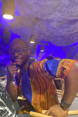

<!-- TODO(a11y): 1 localized body image(s) have empty alt text -->

<figure class="">

</figure>

## Interview with Stephen Gabriel

Github: [@bitsofsteve](https://github.com/bitsofsteve)

**Where are you based?**

> I am currently based in Abuja, Nigeria **??**

**What do you do (i.e. studying, working, etc.)?**

> I am part of the Core Engineering Team at OpenMined.

**What are your specialties (i.e. Python development, Javascript development, community organization, etc.)?**

> I focus mostly on the infrastructure , developer experience and reliability aspect   of   engineering   at  OpenMined.   You’d   find   me   poking   at   CI, worrying about observability, nerding out on containers, spinning up VM’s, patching that cli tool, the whole meal! ?

**How and when did you originally come across OpenMined?**

> A lovely story to tell!

> I came across OpenMined in 2019, during my final year in Medical School. I  was  building a personal POC project which was using Deep Learning to analyse Breast Cancer images, I called CyberOncologyogy then, haha. I was having troubles acquiring data for this, but fortunately I met Andrew (virtually) whilst taking a Deep Learning Nanodegree course,  he was a tutor for that programme. Andrew’s brilliance was enthralling; I learned about him, the book he wrote, Grokking Deep Learning, which of course I bought it! ?  and I found about OpenMined while following him on Twitter.

> OpenMined advertised for folks to join the community, and it got my attention. What particularly heightened my interest was learning about OpenMined’s focus in HealthCare, I knew then that I had to get on the OpenMined ship! OpenMined connected the dots for me; they are addressing a problem I encountered while building Cyberoncology, and looks like they’re having fun while doing it!

**What was the first thing you started working on within OpenMined?**

> My focus in OpenMined when I joined was Continuous integration Infrastructure. I worked mostly with CI and did some work in the benchmarking suite, but mainly CI. Long live the CI!!!!

> It was a scary start, haha, but I got the support I needed.

**And what are you working on now?**

> Fortunately my work borders on the area of software engineering I love, Developer Experience Engineering, Tooling, DevOps, Reliability, and Security. I’m on the journey to becoming a Stacknostic Engineer like my Grandmaster Mad-hava Jay, so  I’m working across the stack as much as possible; one of the beautiful things about OpenMined!

**What would you say to someone who wants to start contributing?**

> Keep an Open Mind at OpenMined. See what what I did there? ?

> There’s a ton of things you can contribute to, from documentation, to the hardcore Mathematical genius stuff! There’s a place for everyone with the right motivation. Also, OpenMined’s community is very supportive, so do not be afraid to ask for help, there’s always someone willing to help! Come contribute!

**Please recommend one interesting book, podcast or resource to the OpenMined community.**

> I would recommend Yuval Noah Harari’s Homo Deus. I enjoy how the book takes you through the journey of humanity, and what tomorrow might look like. My favourite chapter is “Data Religion”, should make a great title for a movie!
