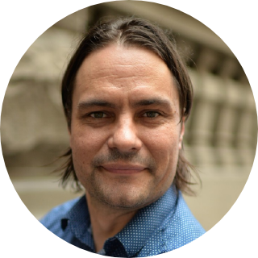

<!-- TODO(a11y): 1 localized body image(s) have empty alt text -->

<figure class="">

</figure>

## ****Interview with** Benjamin Szymkow**

GitHub: [@simcof](https://github.com/simcof)  |   Slack: [@BenS](https://app.slack.com/client/T6963A864/C69RB18LA/user_profile/UH8KV0KU0)  |   Twitter: [@BenjaminSzymkow](https://twitter.com/BenjaminSzymkow)

****Where are you based?****

> “Melbourne, Australia.”

****What do you do?****

> “CTO at digital advisory firm [Cognitivo](http://www.cognitivo.com.au).”

****What are your specialties?****

> “I’ve been lucky enough to be involved in projects using all sorts of languages (C++, React, Python, C#, Java, Kotlin etc.), data frameworks (Spark, Mongo, Azure CosmosDB, various geospatial) and some cool innovative stuff like conversational agents, natural language processing and edge device computing.”

****How and when did you originally come across OpenMined?****

> “About a year ago at [Cognitivo](http://www.cognitivo.com.au) we were looking for ways to enable companies and research projects to share their data whilst controlling the risk of re-identification of their customers and patients. OpenMined seemed to be one of the few places in the world taking this really seriously.”

****What was the first thing you started working on within OpenMined?****

> “Hosting local meetup groups for Sydney and Melbourne. The current situation makes them a little trickier, but maybe virtual meetups in the future!”

****And what are you working on now?****

> “Currently coordinating the effort to bake differential privacy into all the major app development platforms. Enabling app developers access to simple open source options amidst the current COVID-19 climate will hopefully remove a lot of roadblocks to innovation.”

****What would you say to someone who wants to start contributing?****

> “Read this [post](https://blog.openmined.org/providing-opensource-privacy-for-covid19/) and then jump onto the OpenMined slack. There is so much to do right now, so perfect time to jump in! My advice is to figure out how you want to contribute, join the right channel on slack and away you go!”

**Please recommend one interesting book, podcast or resource to the OpenMined community.**

> “The community is always being asked to make things work in ways they were not originally intended, the [Changelog podcast](https://changelog.com/podcast) is a really practical look at the impractical.”
