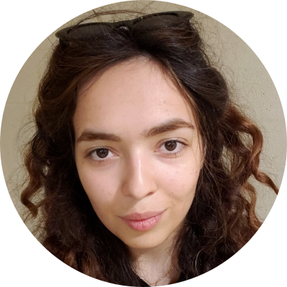

<!-- TODO(a11y): 1 localized body image(s) have empty alt text -->

<figure class="">

</figure>

## ************Interview with************ Fatemeh ****Mireshghallah****

Github: [@mireshghallah](https://github.com/mireshghallah)  |  Twitter: [@limufar](https://twitter.com/limufar)

********Where are you based?********

> “San Diego, CA, USA”

********What do you do?********

> “I’m a 3rd year CS Phd student at UC San Diego”

********What are your specialties?********

> “Research,  PyTorch Development, Event Organization”

********How and when did you originally come across OpenMined?********

> “I think it was December of 2019, or January 2020, I came across it when I was watching a Lecture by Andrew! I really liked the initiative right away! Then a while after I saw Andrew tweet a an application form for research scientists, I filled one right away and was luckily selected ^\_^”

********What was the first thing you started working on within OpenMined?********

> “When we launched the research team, each research lead had proposed a project to work on. The project I proposed was on the intersection  of differential privacy and fairness.  I worked with an amazing research engineer, Tom Farrand, and Sahib Singh and Andrew, and we got a publication out of it! I was also working on another project with one of OM’s great researchers, Georgios Kaissis and with the help of the great Teddy Koker and Tom Titcombe. We have also submitted a paper on that.”

********And what are you working on now?********

> “Right now, I have the pleasure of working with another one of OM’s great research engineers, Abinav Ravi where we are working on differentially private language models.”

********What would you say to someone who wants to start contributing?********

> “OpenMined is an amazing welcoming community, and joining it was one of the highlights of 2020 for me! I made lots of new friends and had lots of fun in the meetings. I urge people to start helping however they can, and whenever they are feeling lost or confused, just reach out to more senior members and ask for help!”

****Please recommend one interesting book, podcast or resource to the OpenMined community.****

> “I love the book “freakonomics” it offers a fresh look into problems that might seem mundane or simple from the outside.”
