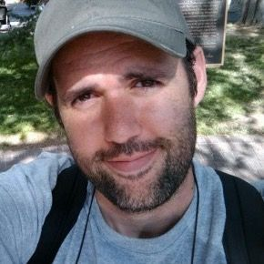

<!-- TODO(a11y): 1 localized body image(s) have empty alt text -->

<figure class="">

</figure>

## Interview with Phil Culliton

Github: [@pculliton](https://github.com/pculliton)

**Where are you based?**

> I’m in Buffalo, NY. That’s about six hours west of the New York City. 🙂

**What do you do (i.e. studying, working, etc.)?**

> I’m a dad, first and foremost! I’ve got three amazing kids who are all smarter, funnier, and better at video games than I am.

> When I’m at work, I’m a senior data scientist and developer relations lead at Google, as part of the Kaggle team. If you’ve taken part in a Kaggle competition in the last four years, there’s a decent chance I built it!

**What are your specialties (i.e. Python development, Javascript development, community organization, etc.)?**

> My background is in ML research and engineering in industry, but I really love making things go fast. I have a pretty long history of doing performance optimization work – I’ve spent years of my career making game engines faster, making machine learning work on large data sets and across hundreds of machines (I did a lot of this back when the internet was young – the 90s and 2000s were a _time_ for machine learning), and finding the most efficient ways to represent data. I really love looking at problems and processes and creating performant solutions.

> Nowadays I spend a bit less time with code (although I still consult on game engine optimization and open source ML research) and more time helping teams and products find efficient ways to get things done. I’ve had a pretty lucky run so far – my teams at Google are amazing, and OpenMined is filled with fantastic people.

**How and when did you originally come across OpenMined?**

> One day Andrew Trask tweeted about needing a product manager. I’d worn a PM hat at my game job, so I figured… maybe I could help? I was really interested in OM’s mission and I’d spent some time working with homomorphic encryption, so I had an interest in the area. I DM’d Andrew and immediately fell in love with his incredible drive and personality, and shortly thereafter, with his team.

**What was the first thing you started working on within OpenMined?**

> I started as the product manager for the data owner side of the product. Primarily I attempt to be an archetypal data owner – to think about what their needs and interests are, and make sure those needs are represented in the product decisions that we make.

**And what are you working on now?**

> I’m still a PM for the data owner side of things! I’ve had the good luck to also work on our courses, and to be able to offer some advice to some of the other leaders on the team. Mostly I just try to keep up with everyone – there are some unbelievably great people here. I constantly find myself wishing I had even \*more\* time to spend with them.

**What would you say to someone who wants to start contributing?**

> I would say join the Slack community, start contributing to the Github repo, and don’t be afraid to ask questions. Our team here is truly excellent – I’ve been doing this sort of thing for a long time, and I’ve rarely met a more motivated, expert, and kind group of people.

**Please   recommend   one   interesting   book,   podcast   or   resource   to   the OpenMined community.**

> I would very much recommend Peter Brannen’s “The Ends of the World”, a book about the science of extinctions, climate, and the amazing forms our Earth has taken prior to humans showing up. I loved every page of it and found it exciting and inspiring.
