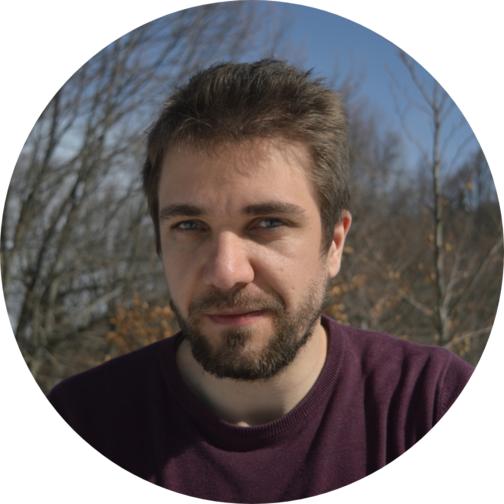

<!-- TODO(a11y): 1 localized body image(s) have empty alt text -->

<figure class="">

</figure>

## ************Interview with************ George Muraru

LinkedIN: [@georgemuraru](https://www.linkedin.com/in/george-cristian-muraru-5978409a/)  |  Github: [@gmuraru](https://github.com/gmuraru)  |  Twitter: [@georgemuraru](https://twitter.com/GeorgeMuraru)

********Where are you based?********

> “I moved from Bucharest to London 4 months ago.”

********What do you do?********

> “This year, I joined Bloomberg’s Engineering department as a Software Engineer.
> 
> For more background info – last year I finished my Master’s Degree in Artificial Intelligence at Politehnica University of Bucharest. At one point during this period, I joined OpenMined as part of the Cryptography team (there was only one team at that moment, both HE and MPC were working together) and from then on, I am part of this awesome community.
> 
> I am part of the SyMPC (our Multi Party Computation companion library for Syft) and the SyftCore teams.”

********What are your specialties?********

> “During my undergraduate and Master’s Degree, I tried to keep a focus on both operating systems and machine learning concepts. Even if those domains seem divergent, I consider that being able to deploy a ML-based software and have good performance, it requires a good understanding of the underlying resources of the system you are running on and how they interact with one another.

Regarding programming languages, the last 2-3 years were filled with Python and C++.”

********How and when did you originally come across OpenMined?********

> “A good friend, Tudor Cebere, told me about OpenMined and I started to take a closer look at the codebase and joined the Slack channel.
> 
> I looked for some “Good first issues” and started writing some code for the project (the team was still working on the 0.2.x version).”

********What was the first thing you started working on within OpenMined?********

> “From what I remember I started working on issues mainly opened by members of the Crypto team.
> 
> The first issue (I had to look this up) was to add the possibility to register a _Worker_ (an entity which we used in the previous Syft version) using context managers. Working on this, I got the chance to explore the codebase, but also learn new things about the programming language.”

********And what are you working on now?********

> “For the moment, I am working on SyMPC, a new library we started near the end of the last year, for Secure Multi-Party Computation. Besides this, I am offering my input and sometimes coding around the Syft Core repository.”

********What would you say to someone who wants to start contributing?********

> “I consider that the best thing to do is to pick up an issue and begin writing some code. Even if you don’t have a good grasp of the codebase it is good to have a starting point.
> 
> Firstly, depending on what you want to do or learn, you should target issues and repositories that are in your area of interest.
> 
> After that, you should have an idea about what files you should look over for solving that specific issue – this would make you have a starting point for code reconnaissance and you would develop, little by little, an understanding of how one module interacts with the others, and down the road on how the overall system behaves in different scenarios.
> 
> Another tip would be to ask questions on the Slack channel. If you feel like you are lost and do not know where to begin, it is a good thing to start asking people that contributed to that repository.”

****Please recommend one interesting book, podcast or resource to the OpenMined community.****

> “Clean Architecture: A Craftsman’s Guide to Software Structure and Design”
