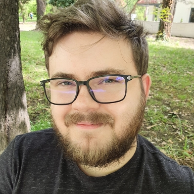

<!-- TODO(a11y): 1 localized body image(s) have empty alt text -->

<figure class="">

</figure>

### Interview with Teo Milea

Github: [@teo-milea](https://github.com/teo-milea)

**Where are you based?**

> Bucharest, Romania

**What do you do (i.e. studying, working, etc.)?**

> I am finishing my MSc, and working on Syft. I am pretty lucky that I could align my dissertation with my work here.

**What are your specialties (i.e. Python development, Javascript development, community organization, etc.)?**

> Currently, I am doing Python development for PySyft though I did mostly machine learning engineering in the past.  I would love in the future to dedicate some time to research in either crypto or SMPC.

**How and when did you originally come across OpenMined?**

> My friend Tudor told me about this great community and the exciting work he was doing here. Last year I started using PySyft more for uni projects and began getting more familiar with the framework.

**What was the first thing you started working on within OpenMined?**

> My first PR was a small one, I believed I fixed some tests or something like that, it was over a year ago. Over time a lot of the codebase got changed, I don’t even think the code from my first PR is even around. I guess this goes to show how dynamic and dedicated is our team. Since I first joined, I helped wherever I could, mostly on tasks from Core and benchmarking.

**And what are you working on now?**

> Currently, I am working on integrating Deep Learning frameworks into PySyft. It’s a new collaboration and we will have a big announcement real soon, so stay tuned! For anyone interested, it will also be an opportunity to contribute and meet the team. For me, this project began to feel very personal as it was my focus for almost a year, so I can’t wait to get more people on board and get some new energy and fresh ideas into the project!!

**What would you say to someone who wants to start contributing?**

> When I started I had many problems and a lot of questions, but I was too afraid to ask people because I thought I might bother them. So I worked alone and tried breaking things and putting them back together until it all made sense in my head. Now I understand that this is required only to a certain point, and you should ask for help before getting on the edge of despair ?.

> So my advice to you is to not be afraid to bother people. Start working on something and when you hit an unbreakable wall ask for help. Plus this will get you to meet the people from the community, which is honestly the best part of working for OpenMined.

> Sure, it’s an open-source project that is trying to change the world (and seems to have some good chances) but this will only be possible because of the generosity and kindness of everyone on the team. So don’t you dare miss that part while you are around. Talk to people, bother them, ask for help, and only great things will come from it. And if you are interested in some “formal” channels to do that, check out our Padawan Program which will allow you do to precisely that!!

**Please   recommend   one   interesting   book,   podcast   or   resource   to   the OpenMined community.**

> Apart   from   technology,   I   am   pretty   interested   in   politics   and   economics,   and   through conversations with other members of the community, I feel like my values of kindness and care for the world at large are shared by everyone.

> This is why I would like to challenge our community with two books “Talking to my daughter about the economy” and “Less is More: How Degrowth Will Save the World”. These two books talk about the relationship between our economics and our society, with the first one talking about aspects in general while the second one focusing on the environment and our consumer-focused society. From what I saw, most people also have other interests apart from technology, so most likely they will find these two books an interesting read.
