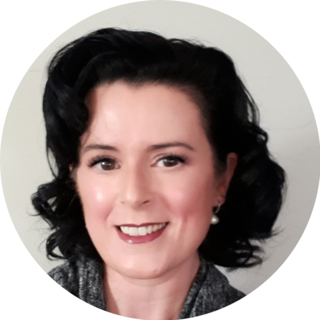

<!-- TODO(a11y): 1 localized body image(s) have empty alt text -->

<!-- TODO(content): NO ppma_author — assigned openmined placeholder -->

<figure class="">

</figure>

## ************Interview with************ Laura Ayre

LinkedIN: [ayrelaura](https://www.linkedin.com/in/ayrelaura/)  |  Github: [@metrix1010](https://github.com/Metrix1010)  |  Twitter: [@ayrelaura](https://twitter.com/ayrelaura)

********Where are you based?********

> “Alberta Canada”

********What do you do?********

> “I contribute to the Steering Committee, Partnerships, Mentorship and Writing teams. I really enjoy bridging the gap between academia and business and cultivating opportunities for innovation to flourish. I have met so many wonderful people through OpenMined and I am looking forward to further collaboration.”

********What are your specialties?********

> “I love finding new ways to solve tricky problems and I am a great listener. My work experience has often involved leading with influence, building rapport, and using whatever tool is most effective for the job. I derive satisfaction from following projects through to completion, driving strategic alignment, and supporting others in their success. Alongside privacy preservation techniques, I am also learning about AI Ethics, MLOps, cloud computing and blockchain.”

********How and when did you originally come across OpenMined?********

> “I joined the slack channel during the Udacity Secure and Private AI course. I was curious about open source software and was inspired by Andrew Trask’s talk at [PyTorch DevCon 19](https://www.youtube.com/watch?v=NJBBE_SN90A) and the potential of using privacy preserving AI to address some of the most critical issues facing humanity.”

********What was the first thing you started working on within OpenMined?********

> “I volunteered as a mentor and editor, and then as a technical assistant for the Beta Bootcamp. I then became the team lead for the Technical Mentorship team.”

********And what are you working on now?********

> “I am currently focused on OpenMined’s Partnerships program and some evolving operational activities. I am also assisting with some changes to the mentorship program and writing blog posts.”

********What would you say to someone who wants to start contributing?********

> “This is a very welcoming and supportive community who want to see you succeed. Start contributing with the skills you have now and then branch out to where you want to grow. Be sure to sign up for the  [OpenMined Private AI Series](https://courses.openmined.org/) starting January 2, 2021. Don’t forget to check out all the great talks from [PriCon2020](https://www.youtube.com/watch?v=oM_cgRkN6MQ&list=PLUNOsx6Az_ZGKQd_p4StdZRFQkCBwnaY6). Also, I would encourage anyone who is interested to [join us on slack](http://openmined.slack.com) :)”

****Please recommend one interesting book, podcast or resource to the OpenMined community.****

> “[The Radical AI podcast](https://www.radicalai.org/blog/18-pieces-of-advice-from-our-first-18-interviews)“
