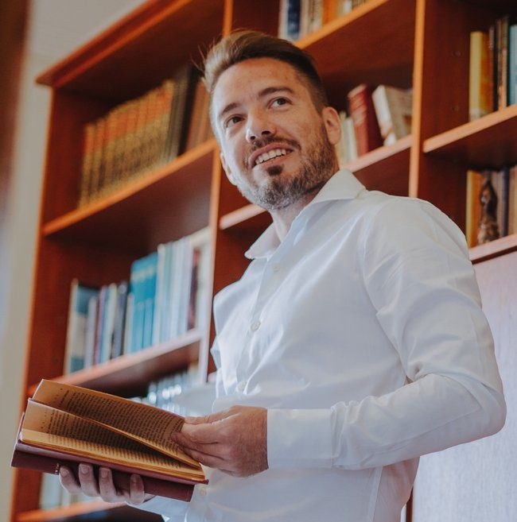

<!-- TODO(a11y): 1 localized body image(s) have empty alt text -->

<figure class="">

</figure>

## Interview with Julian Cardonnet

Github: [@jcardonnet](https://github.com/jcardonnet)

**Where are you based?**

> Tandil, Argentina

**What do you do (i.e. studying, working, etc.)?**

> Besides being a part-time contributor to the PySyft development team, I  
> work as a software engineer doing all kinds of hands-on machine learning  and data engineering consulting for companies. Sometimes I develop proof-of-concept prototypes for assessing the viability of new ideas. Other times I parachute in to help them quickly solve code or architecture issues affecting the performance or reliability of production systems.

**  
What   are   your   specialties   (i.e.   Python   development,   Javascript development, community organization, etc.)?**

> My focus is on backend, designing and implementing machine learning (mostly NLP) and data engineering systems using tools from the Python  
> ecosystem.

**How and when did you originally come across OpenMined?**

> My first contact with OpenMined was through the “Secure and Private AI” course taught by Andrew (Trask) at Udacity many moons ago. It was fascinating to learn about federated learning, differential privacy, and machine learning over encrypted data because of the huge potential those technologies have for improving privacy and security in the digital world, which has always been especially important to me.

**What was the first thing you started working on within OpenMined?**

> The first thing I worked on was the software firewall (with the help of mentor extraordinaire Ishan) which provides an additional layer of protection against threats such as DDoS attacks.

**And what are you working on now?**

> I recently started collaborating on an initiative to overhaul the scalability of PySyft across multiple computing nodes, making it easier to process very large amounts of data.

> Also, I’ve been giving a hand to the partners’ program team, mostly helping Uruguay’s National Statistics Office (INE) with a pilot implementation of PySyft to allow external researchers to access non-public data more easily while ensuring all their privacy regulations and policies are enforced.

**What would you say to someone who wants to start contributing?**

> For anyone interested in contributing to the project I would recommend they apply to join the Padawan program. I think it’s the best way to quickly get up to speed with the ins and outs of the project and (most importantly)  
> meet the fantastic community. After completing the program they’d be in a great position to participate in discussions about the development of new features, open issues, and contribute to the codebase.

**Please recommend one interesting book, podcast or resource to the  
OpenMined community.**

> There are so many great alternatives to pick from, but the one that always pops into my mind when someone asks me for a recommendation is “Masters of Doom” by David Kushner. It tells the story of how two young  
> game programmers (John Carmack and John Romero) revolutionized not just the gaming and software industry but pop culture itself.

> One podcast that I consistently enjoyed over the years is [“The Huberman  
> Lab”](https://www.youtube.com/@hubermanlab), hosted by Dr. Andrew Huberman, a neuroscientist and professor at  
> Stanford. He interviews experts to explore the latest research on a wide  
> range of topics related to neuroscience, human behavior, performance  
> optimization, health, and well-being.
