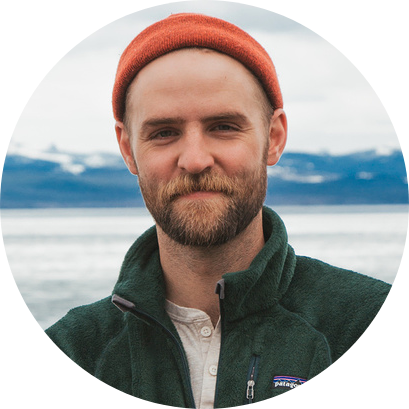

<!-- TODO(a11y): 1 localized body image(s) have empty alt text -->

<figure class="">

</figure>

## ****Interview with** Bennett Farkas**

GitHub: [@BennettFarkas](https://github.com/bennettfarkas)  |  Slack: [@BennettFarkas](https://app.slack.com/client/T6963A864/C69RB18LA/user_profile/U6AUHSDA5)  |  Twitter: [@BennettFarkas](https://twitter.com/bennettfarkas?lang=en)

---

****Where are you based?****

> “Nashville, Tennessee.”

****What do you do?****

> “I am the VP of Creative at [Golden Spiral Marketing](https://goldenspiralmarketing.com/) — A full-service brand and marketing company focused on solving problems for B2B tech companies.”

****What are your specialties?****

> “Branding, Graphic Design, UI, UX, Process Development, Management, Bikes, Beers, & Ultimate Frisbee.”

****How and when did you originally come across OpenMined?****

> “In 2009 I met particularly a peculiar person on a frisbee field in Franklin TN. He looked at me in the face upon seeing me for the first time and said “you look like Justin Timberlake” and proceeded to call me “Justin” for the rest of the day. I didn’t take to it too nicely at the time, but three years of college and eight professional years later Andrew and I are still friends trying to make cool stuff (its pretty difficult to throw a frisbee between Nashville and London). All that said, I came across OpenMined when Andrew mentioned what he was working on several years back.”

****What was the first thing you started working on within OpenMined?****

> “The OpenMined Logo.”

****And what are you working on now?****

> “The User Experience and Design for the new website.”

****What would you say to someone who wants to start contributing?****

> “Ask all the questions, find your local community, and make cool stuff!”

**Please recommend one interesting book, podcast or resource to the OpenMined community.**

> “[https://www.underconsideration.com/brandnew/](https://www.underconsideration.com/brandnew/) — This is an amazing blog for keeping up with what is going on in the branding world.”
