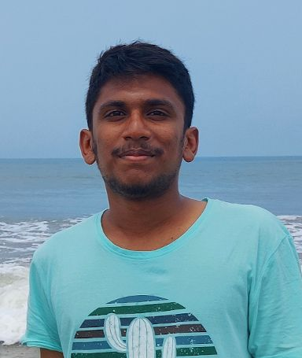

<!-- TODO(a11y): 1 localized body image(s) have empty alt text -->

<figure class="">

</figure>

## Interview with Rasswanth S.

Github: [@](https://github.com/rasswanth-s)rasswanth-s

**Where are you based?**

> _Tamil Nadu, India_

**What do you do (i.e., studying, working, etc.)?**

> _I am part of the SMPC (Secure Multi-party Computation) and Core Engineering Team at OpenMined._

**What are your specialties (i.e., Python development, JavaScript development, community organization, etc.)?**

> _I work primarily on theoretical and practical aspects of Cryptography, currently focusing on SMPC and its application to PET’s (Privacy Enhancing Technologies)._

**How and when did you originally come across OpenMined?**

> _I encountered OpenMined through PriCon2020. It was an enriching experience where I got to know a lot about Pet’s. I was then became interested in joining the Crypto Team at OpenMined._

> _After about a year, I was selected for the Google Summer of Code (GSoc) under OpenMined, which broadened my knowledge about OpenMined._

**What was the first thing you started working on within OpenMined?**

> _Initially I started working on integrating the Falcon protocol in SyMPC. It was my first time contributing to Open Source._

> _This project, particularly, was a great learning curve for me, as I learned how to write good code, as well as doing code reviews and documentation._

**And what are you working on now?**

> _Currently I am working on scaling the PySyft Architecture for Encrypted Computation. We recently had a release of PySyft 0.6.0 on the PyTorch Developer Day 2021._

**What would you say to someone who wants to start contributing?**

> _OpenMined has a lot of interesting work going on, try exploring the projects that spark your interest. A good starting point would be solving beginner issues on the codebase, and eventually you could do code reviews and add documentation.  
> I would highly recommend taking our new course Introduction to Remote Data Science for people starting in the codebase and wanting to learn PET’s._

**Please recommend one interesting book, podcast or resource to the OpenMined community.**

> _“Foundations of Cryptography Vol 1&2″ by Oded Goldreich._
