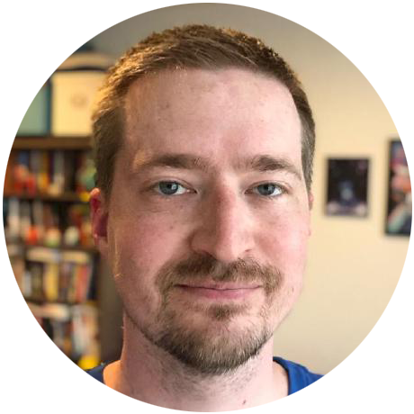

<!-- TODO(a11y): 1 localized body image(s) have empty alt text -->

<figure class="">

</figure>

## Interview with Karl Higley

**GitHub:** [@KarlHigley](https://github.com/karlhigley/)  |  **Slack:** [@Karl Higley](https://app.slack.com/client/T6963A864/DTD97PSFJ/user_profile/UPPTF2QUD)  |  **Twitter:** [@KarlHigley](https://twitter.com/karlhigley)

---

**Where are you based?**

> “I live in a small apartment in Brooklyn with my partner and our dog. Two of the three of us are software developers. When I tag along to conferences (like PyCon), people often assume I’m the expert, but that is rarely the case.”

**What do you do?**

> “Working on OpenMined projects is my main focus right now, thanks to the OpenMined-PyTorch grants. Before this, I worked on recommender systems for personalization at Spotify, contributing to features like the Discover Weekly playlist and the Home screen recommendations.”

**What are your specialties?**

> “I’m constitutionally a generalist, and have worked on a pretty wide variety of things: web development, backend services, data pipelines, ML models, high-power electrical systems. I tend to work on whatever the rest of my team doesn’t have expertise in, so I guess my specialty is picking up things I know nothing about and figuring them out.

> There are a few areas I know a fair amount about from previous deep dives: approximate nearest neighbor search algorithms, distributed data processing at scale, contextual recommender models and features, iOS reverse engineering.”

**How and when did you originally come across OpenMined?**

> “I had been thinking a lot about asynchronous and mobile federated learning after doing some work with [Canopy](https://canopy.cr/), a privacy-preserving recommendations startup founded by some of my former Spotify coworkers. I set up a bunch of Tweetdeck columns to track privacy-preserving machine learning topics (like federated learning, differential privacy, homomorphic encryption, etc) and I saw an OpenMined blog post about asynchronous FL. The blog post started a conversation, which got me onto the OpenMined Slack and looking for places to contribute. That was in late October, so just a few months ago.”

**What was the first thing you started working on within OpenMined?**

> “I have a small mobile lab at my desk with some older phones to experiment on, so I was hoping to train a private movie recommender model with them. I started out trying to add some math operations to the Android worker, in order to move it toward training models.”

**And what are you working on now?**

> “As I started working on Android, I realized that the Syft protocol serialization could use some love, so I set Android aside and started working on integrating Protobuf to make the protocol easier for mobile to consume. As I got farther into that, I realized the remote execution abstractions in PySyft could also use some love, so I set serialization aside and started working on those. Someday, I still hope to train a model using the phones on my desk, but now I’m working on the core of PySyft and have somehow ended up being its release manager.”

**What would you say to someone who wants to start contributing?**

> “I found it helpful to start out with a concrete goal in mind (like “train a model on these phones”), because that narrowed down where to start. I set out in the direction of mobile training and started working on the first thing that didn’t do what I needed for that yet.

> If you find a corner of the Syft ecosystem that isn’t getting enough attention, learn what the current issues are from Github and Slack, and start trying to make some small changes, you may rapidly find yourself more deeply involved than you anticipated. :)”
