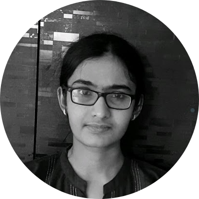

<!-- TODO(a11y): 1 localized body image(s) have empty alt text -->

<!-- TODO(content): NO ppma_author — assigned openmined placeholder -->

<figure class="">

</figure>

## ************Interview with************ Bala Priya

Github: [@balapriyac](https://github.com/balapriyac)

********Where are you based?********

> “I’m currently based in India.”

********What do you do?********

> “I’m a graduate student specializing in Signal Processing and Wireless Communications. I’ve done courses on Information Theory, Convex Optimization, Submodular Functions and Machine Learning. As part of my research, I work on problems in the realm of Applied Probability, such as Distribution Learning and Distribution Membership Testing.”

********What are your specialties?********

> “I enjoy reading, writing and coding. I mostly use Python and Julia for programming. I’m fairly proficient in the math tools — Linear Algebra, Probability Theory and Convex Optimization.
> 
> I was introduced to Deep Learning in the challenge phase of the Udacity Bertelsmann Tech Scholarship in the AI track, back in 2019 and PyTorch has been my favorite framework since then.”

********How and when did you originally come across OpenMined?********

> “I happened to come across the post about OpenMined’s Privacy Conference on LinkedIn. I joined OM Slack shortly after PriCon 2020. I then went ahead and started doing the Secure and Private AI Course from Udacity’s course library.”

********What was the first thing you started working on within OpenMined?********

> “After joining the OpenMined Slack workspace, initially, I found it a bit overwhelming to keep up with the discussion threads across the different channels. I focused on completing the Secure and Private AI course, and gradually started appreciating the discussions.
> 
> In the meantime, I had also applied to the writing team as I had been volunteering and serving as an editor in a few blogging communities. I believe writing is a great way to enhance the learning process and reinforce understanding.”

********And what are you working on now?********

> “I currently lead the writing team, while serving as a contributing writer and an editor. I’m also on the community navigators team. (formerly the OpenMined Mentorship Team) OpenMined is definitely a great place to be. As I would put it, _“Divided by time zones; United by purpose!”_. I’m excited for the journey that lies ahead!”

********What would you say to someone who wants to start contributing?********

> “The community support at OpenMined is amazing and the best I’ve seen thus far. Once you’ve joined the OM Slack, it’s easy to find the right mentors to help you get started with contributing to the OM codebase and joining the dev teams . If you’d like to further explore privacy-preserving AI, then the ongoing [Private AI Series](https://courses.openmined.org/) is an excellent place to get started.”

****Please recommend one interesting book, podcast or resource to the OpenMined community.****

> “Podcast: [Weekly Events of DataTalks.Club](https://datatalks.club/podcast.html)“
