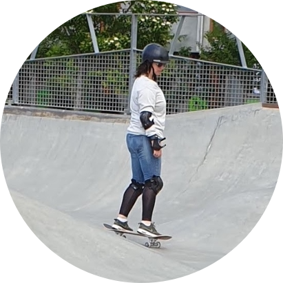

<!-- TODO(a11y): 1 localized body image(s) have empty alt text -->

<!-- TODO(content): NO ppma_author — assigned openmined placeholder -->

<figure class="">

</figure>

## ************Interview with************ Helena Barmer

LinkedIN: [@helenabarmer](https://www.linkedin.com/in/helenabarmer/)  |  Github: [@helenabarmer](https://github.com/helenabarmer)  |  Twitter: [@psNoBugs](https://twitter.com/psNoBugs)

********Where are you based?********

> “Mostly at skateparks (and in Sweden)”

********What do you do?********

> “I graduated in December 2020 and started my first job in tech January 2021. At the moment I am working at a start-up within their data science department.”

********What are your specialties?********

> “I studied object oriented programming and AI in school, which covered everything from Javascript and web development to data science and Python. At the moment I am mostly working Python based (at my job).
> 
> I have also done a lot of volunteering in online tech communities, and  most of all creating online events in many different forms. I love the way an online event can bring people together from all over the world, and how by just a click of a link can be connected to the other side of the world.”

********How and when did you originally come across OpenMined?********

> “I was part of Udacity’s scholarship challenge Secure and Private AI. The best thing is we are still a great bunch from that challenge now collaborating and having fun together.”

********What was the first thing you started working on within OpenMined?********

> “Sourav who is the team leader for the mentorship team guided me to OpenMined as I was looking into doing more online events. From there I arranged an online meetup in the #community\_women-of-om channel, and then we decided to start a study group so this is the first thing I worked on in the community.”

********And what are you working on now?********

> “I am part of the RecSys Team at OpenMined led by the awesome Maddie Shang. I am also leading the Online Events Team where I create online events for different parts of the community, both internal and public events.”

********What would you say to someone who wants to start contributing?********

> “Contributing and being part of a global team is amazing! I have never been a part of a more supportive community than OpenMined. Feel confident that when you do join in and start contributing you will have the support of the community, throughout challenges, your ups and downs and everything in between. For me it has been an amazing journey to start engaging in the community and get to know people as well. I would say, just do it! If you don’t know how to start, just ask in Slack and there will be someone there to guide you further.”

****Please recommend one interesting book, podcast or resource to the OpenMined community.****

> “Weapons of Math Destruction by Cathy O’Neil is a book that completely changed my way of thinking and it was such a great eye opener!”
