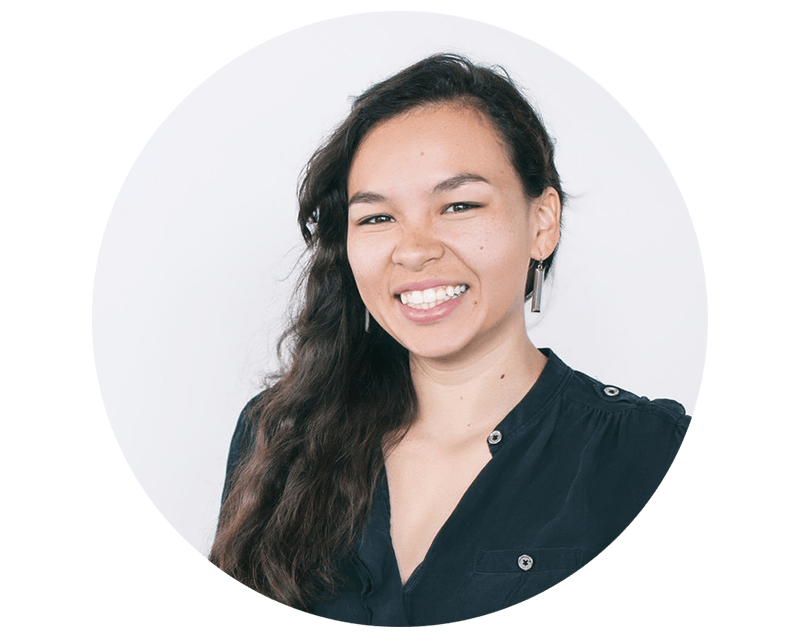

<!-- TODO(a11y): 1 localized body image(s) have empty alt text -->

<figure class="">

</figure>

## ************Interview with********** Kyoko Eng**

LinkedIN: [@Kyoko-Eng](https://www.linkedin.com/in/kyoko-eng-67a9278b/)  |   Slack: [@Kyoko Eng](https://app.slack.com/client/T6963A864/C69RB18LA/user_profile/U0133PZBQEN) |   Twitter: [@Kyokoeng](https://twitter.com/KyokoEng)

********Where are you based?********

> “Nashville, TN USA”

********What do you do?********

> “I’m an Interaction Designer with a background in B2B Tech marketing. I enjoy creating solutions founded on research and executed with vision & empathy.”

********What are your specialties?********

> “My specialties lie within web design and creating friendly & functional systems. Whether an icon system or full UI kit I try to make solutions that are easy to adopt by the team and that resonate with the intended audience.”

********How and when did you originally come across OpenMined?********

> “I originally came across OpenMined when my friend was working with them about 3 years ago. At the time I had family circumstances that kept my plate full but the mission had definitely made an impression. A lot of my clients at the time were in health tech and cybersecurity; small businesses that had gained momentum as they tried to take on some of the biggest issues our world is facing. It’s not easy in those spaces, it’s a tightrope walk of deploying solutions that can easily save as much as they can destroy lives. To see an intersection, a way to have the ever rare win-win situation of insight with privacy, well I can’t help but be amazed.”

********What was the first thing you started working on within OpenMined?********

> “My beginning projects are around finding ways to help the community build, communicate, and learn more effortlessly. It’s all still very new but I’m currently collaborating with others to redesign our website experience to better serve the current members and others who are curious about OpenMined. Also working with others to develop a UI kit that our community can use to prototype their application ideas.”

********And what are you working on now?********

> “Haha well the two above are no small fries so they will take a bit. But as far as intermediate steps I’m working on compiling the feedback the members gave in our “Member Survey” and seeing how the suggestions and frustrations listed therein could help with the website redesign. A higher goal I have is to determine some user groups based on the survey and determine a better on boarding path for them via the website.”

********What would you say to someone who wants to start contributing?********

> “I felt nervous contributing in this sense since I’m not a data scientist; I’m not a developer nor a researcher. I am just someone who wants to help the world improve. What I would say is that if there is an initiative you care about and are too nervous to take the first step towards, take a step back and assess. What are your strengths? How do they map to the problem?  
> → There are a lot of different ways to help an initiative forward. If I can’t be the hero, I can be the sword. If I can’t be the sword, I can be the blacksmith. If you feel a bit overwhelmed like I did at first, try to start by tackling the problems you see in front of you.”

****Please recommend one interesting book, podcast or resource to the OpenMined community.****

> “I highly recommend [Digital Design Theory](https://www.amazon.com/dp/B01EMJ33LM/ref=dp-kindle-redirect?_encoding=UTF8&btkr=1) edited by Helen Armstrong. It’s a compilation of essays written by some of the founders of digital design spanning 1897 – present. Each read is short but just packed full of fascinating thoughts on how the digital could affect human lives on a day to day.”
