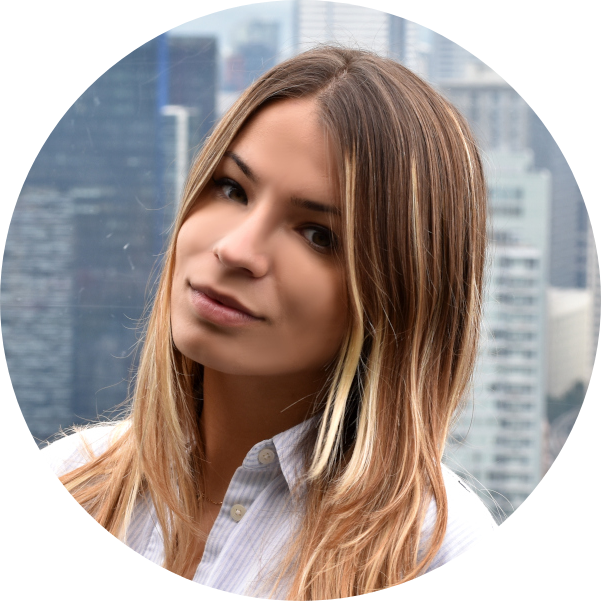

<!-- TODO(a11y): 1 localized body image(s) have empty alt text -->

<figure class="">

</figure>

## ************Interview with************ Irina Bejan

LinkedIN: [@irinabejan](https://www.linkedin.com/in/irinabejan/)  |  Github: [@irinaMbejan](https://github.com/IrinaMBejan)

********Where are you based?********

> “Lausanne, Switzerland”

********What do you do?********

> “I am currently doing my MSc in Data Science at EPFL and will soon start my fourth internship at Google.”

********What are your specialties?********

> “My expertise is on NLP (Natural Language Processing) and infrastructure for machine learning.”

********How and when did you originally come across OpenMined?********

> “A friend working on PySyft posted about the chance to join the writing team at OpenMined and I considered it a great learning opportunity – but after I joined, I discovered it is more than that, being one of the most vibrant communities I have been part of.”

********What was the first thing you started working on within OpenMined?********

> “I started my journey in the writing team by putting together a summarized article on getting started with SyferText for privacy preserving NLP and deploying the preprocessing part, along with the models to PyGrid, following a tutorial made by Alan Aboudib.”

********And what are you working on now?********

> “One of our milestones is to get the documentation in good shape, so that users can easily pick up OpenMined technologies and integrate into their products, as well as for new contributors to jump on board. My work now goes towards auditing the existing codebase and tutorials, together with a fresh team, and filling in the gaps.”

********What would you say to someone who wants to start contributing?********

> “A teammate told me recently that when it comes to contributing to the open-source projects “you’re doing great as long as you’re doing it”. There is nothing to be intimidated by – there are passionate people excited to help you get started and have impact through OpenMined.”

****Please recommend one interesting book, podcast or resource to the OpenMined community.****

> “I think what sometimes gets lost in the background when it comes to data privacy is the collective dimension of it. To quote the essay I recommend to you, “Privacy is power” by Carissa Veliz, **when you expose your privacy, you put us all at risk,** which I think is a nice reminder of why the work we do here at OpenMined matters so much.”
