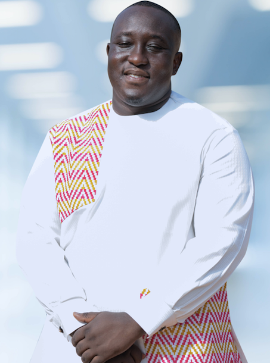

<!-- TODO(a11y): 1 localized body image(s) have empty alt text -->

<figure class="">

</figure>

### Interview with Osam Kyemenu-Sarsah

Github: [@factdroid](https://github.com/factdroid)

**Where are you based?**

> I currently live in Accra, Ghana.

**What do you do (i.e. studying, working, etc.)?**

> I work full-time at OpenMined.

**What are your specialties (i.e. Python development, Javascript  development, community organization, etc.)?**

> My areas of specialty are Project Management and Product Management. Before joining OpenMined, I spent almost a decade in roles as a Tech Founder and Product Manager: launching products in West Africa and Latin America.

**How and when did you originally come across OpenMined?**

> I initially came across Andrew Trask about 3yrs ago through this [video](https://www.youtube.com/watch?v=qJ1rdVEcl5g&lc=UgylFCmh9bvzcSXtv7Z4AaABAg) of his interview from 2017: I was really impressed by his thoughtful responses in that interview and that was enough for me to look up his work. I found the OpenMined project and joined the community. I joined in June of 2019 but wasn’t active till about a year later.

**What was the first thing you started working on within OpenMined?**

> I started out by volunteering as a Community Navigator. Back then, we were called the “Mentorship Team”. Our core duty was to onboard new contributors and to help them find the right fit among the various teams on the project.

**And what are you working on now?**

> Right now, I’m a Project Lead for the Medical Federated Learning Program. I’m working with an amazing team to help large numbers of medical researchers meet each other, establish research projects, and demonstrate to the world that they can achieve scientific breakthroughs by pooling their training data using privacy enhancing technologies (PETs) for key medical research tasks.

**What would you say to someone who wants to start contributing?**

> Yes!! Take that plunge. I get to work everyday with brilliant, generous people who are relentlessly pursuing the non-trivial goal of creating the infrastructure to help answer the most important questions within our society; while using data that remains private. Everyday presents an opportunity for growth and learning. You will also be contributing a solution to one of the most relevant problems of our time.

**Please recommend one interesting book, podcast or resource to the OpenMined community**

> I am currently reading [“Quantum Country”](https://blog.openmined.org/p/8cf2c77b-7a68-4425-a9a1-6ddbbf675221/\(https://quantum.country\))  a free book by Andy Matuschak and Michael Nielsen which promises to teach readers the basic principles of quantum computing and quantum mechanics while incorporating Spaced Repetition into the interface of the book ensuring future recollection of the content is easier. For work, I’m also reading [“Grokking Deep Learning”](https://www.manning.com/books/grokking-deep-learning) by Andrew Trask. While my role at OpenMined doesn’t require that I build things with AI/ML, I still find great value in understanding what is happening under the hood of the various ML Frameworks out there. I’m also re-reading “To Kill a Mockingbird” by Harper Lee. So right now, I’d recommend all three books.
