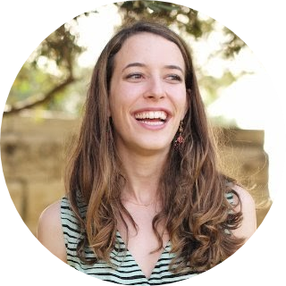

<!-- TODO(a11y): 1 localized body image(s) have empty alt text -->

<figure class="">

</figure>

## ************Interview with******** Ronnie Falcon****

LinkedIN: [@ronnie-falcon](https://www.linkedin.com/in/ronnie-falcon/)  |   Slack: [@Ronnie Falcon](https://app.slack.com/client/T6963A864/C69RB18LA/user_profile/U012TUX76TB) |   Twitter: [@falcon\_ronnie](https://twitter.com/falcon_ronnie)

********Where are you based?********

> “New York City”

********What do you do?********

> “I’m a Product Manager. I worked for Google Maps, YouTube and recently shifted gears and joined a small new startup in the News space called River.”

********What are your specialties?********

> “I spend most of my time researching technology trends, learning about user needs, building product strategies and roadmaps. My background is in Computer Science so I mainly focus on technical products that utilize Machine Learning and data science. Feel free to hit me up if you ever need product help with your recommendation system :)”

********How and when did you originally come across OpenMined?********

> “A few months ago I was looking for volunteer opportunities related to COVID that needed Product Management support. A friend introduced me to OpenMined and the rest is history. I was immediately blown away by the overall mission and by how greatly it can improve people’s lives.”

********What was the first thing you started working on within OpenMined?********

> “I helped define our long-term product goals, organize our core use cases and design our MVPs (Minimal Viable Products).”

********And what are you working on now?********

> “I continue on our long-term planning, but in the near future I will spend most of my time in the Governance space and the Opus project.”

********What would you say to someone who wants to start contributing?********

> “Besides an incredibly interesting engineering challenge, you’ll be contributing to some of the most important technologies that could help achieve data privacy and accountability. A world where people own and control the only copy of their data is a world where products and services are aligned with the best interest of the people.

> My advice is to dare to think big!”

****Please recommend one interesting book, podcast or resource to the OpenMined community.****

> ““21 Lessons for the 21st Century” by Yuval Noah Harari (especially chapter 4: “Those who own the data own the future”) and “Data and Goliath” by Bruce Schneier.”
