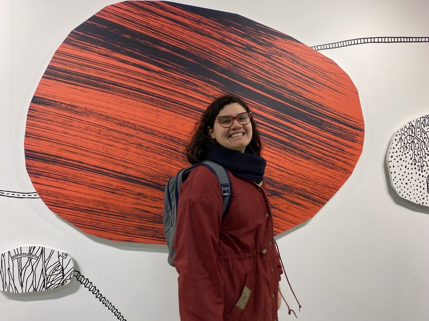

<!-- TODO(a11y): 1 localized body image(s) have empty alt text -->

<!-- TODO(content): shortcode(s) present (verify) -->

<figure class="">

</figure>

## Interview with Carmen Popa

Github: [@Poppy22](https://github.com/Poppy22)

**Where are you based?**

> It depends on what bank institution is asking – I was born in Romania, I am doing my master’s studies in Helsinki, Finland, but right now I live in London for a placement internship :D.

**What do you do (i.e. studying, working, etc.)?**

> I’m a software engineer intern at Bloomberg right now, but at core I am still a computer science student. I will graduate in early 2024 and I am exploring various options to pursue next. I’m very much inclined to start a full-time job where I am currently interning, and also to continue my OpenMined journey.

**What   are   your   specialties   (i.e.   Python   development,   Javascript development, community organization, etc.)?**

> I’m more of a backend person, I would say I am most comfortable with Python and Java. Frontend is usually my arch enemy, but leaving this aside, I actually like design, and I think I’m pretty good at making visuals and diagrams that are very accessible to the reader. Tech stack aside, I am also into operational roles, and whenever I can I try to organize a team training or a team activity, and in the past I was involved in two NGOs where I grew into the role of directing STEM educational programs for children and students.

**How and when did you originally come across OpenMined?**

> I found out about OpenMined through university colleagues back in Romania who were (and are still) volunteers within the organization. Then I decided to join thanks to a good friend who is currently very involved in OpenMined, and she also helped me start my journey here.

**What was the first thing you started working on within OpenMined?**

> Hm, among the first things I worked on were some diagrams that explain the Architecture of PySyft and various workflows one could deploy with PySyft optimizing for automation vs privacy risk, which turned out very useful for our ongoing partnerships, such as Christchurch Call to Action. Creating the diagrams per se wasn’t difficult, but it was challenging for me because I first had to understand the big picture, the key actors, and especially the trade-offs between each deployment type so that I can accurately depict their pros and cons.

**And what are you working on now?**

> I’m currently in the documentation and partnership team, and I focus on writing tutorials to onboard data scientists into working with Syft as part of our programs, with a focus on advancing algorithmic transparency. This is really fun for me, I get to write a bit of code, which also helps with testing the library, but also to explain in words how something works and why it works that, and even what the reader should be aware of or specially careful about to avoid hard-to-spot bugs or other issues.

**What would you say to someone who wants to start contributing?**

> Everyone is super friendly and help is needed at all levels! So don’t be shy, message someone and clearly state your interests, and they will be able to redirect you to someone else closely related to what you want to engage in (or to the nearest [Padawan program](https://blog.openmined.org/work-on-ais-most-exciting-frontier-no-phd-required/) 😉 ).

**Please recommend one interesting book, podcast or resource to the  
OpenMined community.**

> I don’t know how to follow the rules, so here’s a longer list:

> \[book\] “Haben”, by Haben Girma – the autobiographical story of a deaf-blind Harvard graduate disability lawyer

> \[book\] “Kim Ji-young, Born 1982”, by Cho Nam-Joo

> \[book\] “Nevel split the difference: negotiate like your life depends on it” – by Chris Voss

> Any book by Ruth Ozeki

> \[podcast\] Re: Dracula – the book Dracula by Bram Stoker is written in journal entries and letters, all dated, and the action takes place between mid-may until autumn. This podcast releases an episode with the content of the book on that particular day when it was written by the characters, so you get to listen to the book as the action takes place!

**[Other social media links:](https://blog.openmined.org/work-on-ais-most-exciting-frontier-no-phd-required/)**

[LinkedIn](https://www.linkedin.com/in/carmengpopa/)
